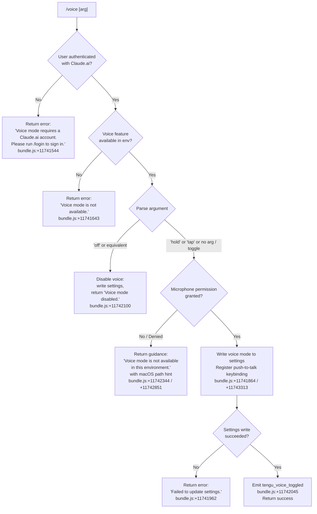

# `/voice`

> Analysis basis: CC v2.1.139 bundle.js (AST extraction + Claude interpretation)
> Minimum version: v2.1.139

---

## Overview

The `/voice` command toggles voice input mode for Claude Code CLI. It accepts an optional mode argument (`hold`, `tap`, or `off`) and enforces several prerequisites before activating: the user must be authenticated with a Claude.ai account, the execution environment must support voice, and microphone permissions must be granted. When conditions are met, the command persists the chosen mode via the settings subsystem and registers a push-to-talk keybinding (`Space` in the `Chat` context, mapped to the `voice:pushToTalk` action).

---

## Registration

| Field | Value |
|---|---|
| type | `local` |
| name | `voice` |
| description | `Toggle voice mode` |
| argumentHint | `[hold\|tap\|off]` |
| supportsNonInteractive | `false` |
| isHidden | `null` |
| module_id | `k0q` |
| load_inline | `true` |
| loc_byte | `11744049` |
| loc_byte_end | `11744291` |
| loc_line | `7679` |
| arbor_handler.name | `CI7` |
| arbor_handler.fqn | `claude-2.1.139::CI7` |
| arbor_handler.kind | `AsyncFunction` |
| arbor_handler.resolution_path | `module_id` |
| arbor_handler.n_hits | `1` |

Analysis basis: CC v2.1.139 bundle.js:+11744049

---

## Input Branching

The command has 5+ distinct branches depending on authentication state, environment capability, permission state, argument value, and settings-write success.



---

## Behavioral Spec

### Top-level Handler (`CI7`)

The handler is an `AsyncFunction` resolved via `module_id` → `k0q` by the Arbor symbol graph.

Analysis basis: CC v2.1.139 bundle.js:+11741503

```
async function voiceCommandHandler(args, appState):

    # Step 1: Authentication gate
    authStatus = checkOAuthOrFirstPartyAuth(appState)   # via poH / Sp_ at +11741503
    if not authStatus.hasClaudeAiAccount:
        return textMessage("Voice mode requires a Claude.ai account. ...")
        # bundle.js:+11741544

    # Step 2: Environment capability gate
    voiceAvailable = isVoiceCapableEnvironment(appState)  # via Pw at +11741514
    if not voiceAvailable:
        return textMessage("Voice mode is not available.")
        # bundle.js:+11741643

    # Step 3: Parse argument
    rawArg = args.trim()           # H.trim at +11741795
    mode   = parseVoiceMode(rawArg)  # RI7 at +11741728

    # Step 4: Handle 'off' / disable path
    if mode == "off":
        writeVoiceSettings(appState, {voiceMode: "off"})  # k_ at +11741864
        if settingsWriteFailed:
            return textMessage("Failed to update settings. ...")
            # bundle.js:+11741962
        emit("tengu_voice_toggled", {mode: "off"})    # +11742045
        return textMessage("Voice mode disabled.")    # +11742100

    # Step 5: Environment / permission gate for enable path
    envOk = checkVoiceEnvironment()   # bp_ at +11742190
    if not envOk:
        return textMessage("Voice mode is not available in this environment.")
        # bundle.js:+11742344

    micPermission = checkMicrophonePermission()   # CW6 at +11742269
    if micPermission == "denied":
        # On macOS, surface path hint
        hint = "System Settings → Privacy & Security → Microphone"  # +11742851
        return textMessage("Voice mode is not available in this environment. " + hint)

    # Step 6: Write settings and register keybinding
    writeVoiceSettings(appState, {voiceMode: mode})   # k_ at +11741864
    if settingsWriteFailed:
        return textMessage("Failed to update settings. ...")

    registerKeybinding({                  # uJ at +11743310
        action:  "voice:pushToTalk",      # +11743313
        context: "Chat",                  # +11743332
        key:     "Space"                  # +11743339
    })

    # Step 7: Telemetry + success
    emit("tengu_voice_toggled", {mode: mode})   # +11742045
    return successResult()
```

### Argument Parsing (`RI7`)

Analysis basis: CC v2.1.139 bundle.js:+11741373

```
function parseVoiceMode(rawArg):
    trimmed = rawArg.trim()          # H.trim at +11741373
    if trimmed == "hold":    return "hold"    # +11741420
    if trimmed == "tap":     return "tap"     # +11741432
    if trimmed == "off":     return "off"     # +11741443
    if trimmed == "":        return "toggle"  # no arg → toggle current state
    return "invalid"                          # +11741464
```

### Authentication Check (`poH` → `Sp_`)

Analysis basis: CC v2.1.139 bundle.js:+11732472

```
function checkAuth(appState):
    sessionInfo = getSessionInfo(appState)   # Sp_ at +11732472
    hasAccount  = Boolean(sessionInfo)       # Boolean at +11732410
    # Also calls kA (account-type resolver) at +11732398
    return { hasClaudeAiAccount: hasAccount }
```

Authentication requires a Claude.ai account (OAuth / first-party). API key–only sessions fail this gate: the literal `"firstParty"` is referenced at bundle.js:+2001565 and the error message cites the `/login` flow at +11741544.

### Settings Write (`k_`)

Analysis basis: CC v2.1.139 bundle.js:+11741864

```
async function writeVoiceSettings(appState, update):
    # Load current settings from disk
    settings = loadSettingsFromDisk()         # Ix / vx8 at +1186631
    # Merge update
    merged = mergeSettings(settings, update)
    # Atomic write via temp-file / fsync pattern
    atomicWriteSettings(merged)               # dSH at +1187071
    # Invalidate caches
    clearSettingsCache()                      # DD at +1187213
    # Notify event bus
    eventBus.emit("settingsChanged")          # jRH.emit at +1187387
```

If any step throws, the caller receives a caught error and surfaces:
`"Failed to update settings. Check your settings file for syntax errors."` (bundle.js:+11741962).

Settings paths involved:
- User settings: `~/.claude/settings.json` (bundle.js:+1177948, +1177958)
- Local settings: `settings.local.json` (bundle.js:+1178020)

### Keybinding Registration (`uJ` → `by9` → `R76`)

Analysis basis: CC v2.1.139 bundle.js:+11743310

```
function registerPushToTalkKeybinding():
    loadKeybindingsConfig()            # R76 at +3651837
    binding = {
        action:  "voice:pushToTalk",   # +11743313
        context: "Chat",               # +11743332
        key:     "Space"               # +11743339
    }
    applyBinding(binding)              # Oq_ / $q_ deduplicate / merge
    # Telemetry on custom keybinding load:
    emit("tengu_custom_keybindings_loaded")   # +3649996
```

The keybinding subsystem deduplicates entries (`Oq_` checks `q.has` / `q.add` at +3649359 / +3649384). If the `keybindings.json` file is malformed, errors include format guidance (bundle.js:+3652301, +3652478).

---

## State & Side Effects

| Item | Detail |
|---|---|
| Telemetry — `tengu_voice_toggled` | Fired on every successful mode transition (enable or disable). bundle.js:+11742045 |
| Telemetry — `tengu_custom_keybindings_loaded` | Fired when the push-to-talk keybinding is registered. bundle.js:+3649996 |
| Telemetry — `tengu_keybinding_fallback_used` | Fired if keybinding resolution falls back. bundle.js:+3657778 |
| Telemetry — `tengu_keybinding_customization_release` | Fired during keybinding lifecycle. bundle.js:+3649576 |
| Telemetry — `tengu_config_parse_error` | Fired if settings JSON is malformed. bundle.js:+3135421 |
| Settings mutation | Writes `voiceMode` key to user/local settings JSON via atomic temp-file+fsync pattern. |
| Keybinding registration | Adds `voice:pushToTalk` → `Space` in the `Chat` context when voice is enabled. |
| Cache invalidation | `clearSettingsCache()` (`DD`) clears two internal caches (`lE6`, `DT8`) after any settings write. bundle.js:+24901, +24913 |
| Event bus | Emits `settingsChanged` via `jRH.emit` after settings update. bundle.js:+1187387 |
| Sound | <!-- TODO: not found in depth-2 traversal; needs --depth 4 --> |
| appState changes | `voiceMode` field updated in application state to reflect new mode. |

---

## Version History

| Version | Change |
|---|---|
| v2.1.139 | Initial analysis |

---

## Common Mistakes

1. **Running `/voice` without a Claude.ai account.** API key–only authentication is insufficient. The command returns `"Voice mode requires a Claude.ai account. Please run /login to sign in."` (bundle.js:+11741544). Sign in with `/login` first.

2. **Running `/voice` in non-interactive or unsupported environments.** The `supportsNonInteractive` field is `false` (registration), so `/voice` will not execute in scripts or CI pipelines. In addition, environments without microphone hardware return `"Voice mode is not available."` (bundle.js:+11741643).

3. **Microphone permissions not granted on macOS.** Even if voice is otherwise available, missing microphone permission surfaces a guidance message pointing to `System Settings → Privacy & Security → Microphone` (bundle.js:+11742851). The mode is not saved until permissions are present.

4. **Corrupt or malformed `settings.json`.** If the settings file contains JSON syntax errors, the write fails and returns `"Failed to update settings. Check your settings file for syntax errors."` (bundle.js:+11741962). Inspect `~/.claude/settings.json` and `settings.local.json` for validity.

5. **Expecting the keybinding to be saved across machines.** The `Space` → `voice:pushToTalk` binding is registered in the local keybindings config; it is not synchronized automatically across different workstations.

---

## Appendix — Identifier Mapping

> For bundle debugging only. Identifiers change across versions.

| Identifier | Role |
|---|---|
| `CI7` | Main voice command async handler (Arbor-resolved entry point) |
| `poH` | Authentication status resolver (calls session info getter) |
| `Sp_` | Session/account type checker (Boolean-coerces account presence) |
| `Pw` | Environment capability probe for voice feature |
| `fL` | Low-level feature flag reader |
| `WR` | Authentication token / credential resolver |
| `dO` | First-party auth classifier |
| `w$` | API key / OAuth token resolution chain |
| `JL6` | String coercion / error formatter helper |
| `yW6` | Auth state transformer |
| `m_` | Settings loader entrypoint (triggers disk read) |
| `Ix` | Settings load orchestrator (perf-marks start/end) |
| `NS` | Settings namespace initializer |
| `P1` | Memory-usage recorder during settings load |
| `Kx` | `perf_hooks` require wrapper |
| `vx8` | Settings file reader and parser core |
| `G8` | Log file appender (mkdirSync + appendFileSync) |
| `iE6` | Settings cache lookup |
| `mT` | Settings flag/policy set manager |
| `DOA` | Settings object key enumerator |
| `wf` | Settings file path builder (`.claude/settings.json`) |
| `P7H` | User settings file reader |
| `ZS6` | SDK inline settings resolver |
| `nE6` | Settings load finalizer |
| `RI7` | Voice mode argument parser (`hold`/`tap`/`off`/`invalid`) |
| `H` | General utility (random, setTimeout, trim, toLowerCase, etc.) |
| `k_` | Settings write orchestrator (load → merge → atomic write → cache clear → emit) |
| `B6` | Base path / config directory resolver |
| `Ix8` | Secondary settings file reader (load-time variant) |
| `LG` | Git ignore / config ignore checker |
| `ZU` | File reader with BOM/encoding detection |
| `f3` | Filesystem stat + symlink checker |
| `N` | Shell environment resolver / OS info helper |
| `t86` | Config directory base path helper |
| `AC8` | BOM slice helper |
| `D8` | ENOENT / error-code normalizer |
| `w8` | Error code extractor |
| `Sb8` | Settings timestamp recorder (`Bh6.set` + `Date.now`) |
| `Zd` | Atomic file write helper (resolve → write → rename) |
| `A_` | Async file utility helper |
| `Kr` | Directory creation helper |
| `dSH` | Atomic settings write (temp file, fchmod, fsync, rename) |
| `q` | Filesystem module wrapper (lstatSync, renameSync, unlinkSync, etc.) |
| `O` | Stat result wrapper (isSymbolicLink, etc.) |
| `x8` | Object property accessor |
| `yH` | JSON serializer (JSON.stringify wrapper) |
| `DD` | Settings cache clearer (clears `lE6` and `DT8`) |
| `Sh6` | Settings file read/write with mkdir and appendFile |
| `C6` | Async store getter (AsyncLocalStorage) |
| `ry6` | Store context resolver |
| `jb8` | Extra settings loader |
| `Gb8` | Git check-ignore runner |
| `$_` | Git ignore result parser |
| `kZK` | `~/.config` path joiner |
| `LH` | Settings write pipeline (validate → rotate backup → write) |
| `q_` | Error string coercer |
| `SH` | String coercer |
| `S1` | Settings schema validator |
| `CGK` | Backup rotation queue manager |
| `ak` | `.claude` path joiner |
| `Q` | Generic promise / async result handler |
| `M` | MCP server state manager |
| `WIH` | MCP server registry updater |
| `Le` | MCP server list merger |
| `m1H` | MCP server entry builder |
| `Ke` | MCP SDK server collector |
| `QD6` | MCP server deduplicator / map builder |
| `aV` | MCP tool schema builder |
| `P3` | Tool parameter validator |
| `c2_` | MCP tool schema converter |
| `M_` | Fallback/default resolver |
| `NP6` | MCP connection filter |
| `Q_7` | MCP needs-auth cache reader |
| `vk_` | Needs-auth cache file reader |
| `vL8` | MCP server hash / fingerprint builder |
| `wn` | String normalization helper |
| `IL8` | MCP server ID hasher |
| `sJ` | SHA-256 hash builder |
| `A8` | MCP debug logger |
| `Kk_` | MCP server connector (stdio/SSE/ws) |
| `i87` | MCP stdio transport builder |
| `kU` | MCP transport initializer |
| `se` | MCP SSE/HTTP client session manager |
| `KiH` | MCP connection lifecycle tracker |
| `Y` | Background session / spare daemon manager |
| `DO8` | Needs-auth cache unlinker |
| `Fg` | MCP reconnect orchestrator |
| `Vx` | MCP transport factory |
| `D` | Supervisor daemon writer |
| `O7` | MCP error logger |
| `IH` | String coercer (error path) |
| `r87` | MCP reconnect retry helper |
| `n87` | SSH environment detector |
| `Lk_` | MCP complete-authentication tool handler |
| `qiH` | Pending OAuth request getter |
| `LiH` | Active OAuth connection getter |
| `oa1` | Needs-auth cache writer |
| `IO8` | Cache file path builder |
| `Ak_` | MCP tool result formatter |
| `QK` | Tool schema validator |
| `B2_` | MCP server include/exclude filter |
| `H8` | Config file reader / auth guard |
| `A` | Array / collection utility |
| `J` | Process registry (values + kill) |
| `v` | Background worker process wrapper |
| `h` | Transient message writer |
| `z` | Daemon write channel |
| `la1` | MCP tool call dispatcher |
| `N3H` | Async iterable mapper (tool streaming) |
| `kP6` | Port parser (parseInt wrapper) |
| `Nk_` | Port parser variant |
| `Niq` | MCP update applier |
| `vO8` | MCP update serializer |
| `WI` | MCP client cleanup dispatcher |
| `DiH` | MCP client state serializer |
| `$` | Config persistence manager (NXq → RD atomic write) |
| `NXq` | Config write orchestrator |
| `Eo` | Config schema encoder |
| `RD` | Config atomic file writer |
| `fW6` | Daemon status path builder |
| `Wa7` | MCP server reconnect-all orchestrator |
| `kL8` | MCP server suppression checker |
| `o8` | Subprocess timeout wrapper |
| `uJ` | Keybinding registration handler |
| `by9` | Keybinding config loader pipeline |
| `R76` | Keybinding file reader and validator |
| `zq_` | Keybinding schema normalizer |
| `Pu` | Keybinding entry point resolver |
| `uAH` | Keybinding file path builder |
| `U6` | JSON.parse wrapper |
| `xH` | Feature-flag error reporter (`tengu_feature_bad`) |
| `yr6` | Array-of-strings validator |
| `Nr6` | Keybinding block entry builder |
| `Cy9` | Feature-flag success reporter (`tengu_feature_ok`) |
| `$q_` | Keybinding duplicate detector |
| `Oq_` | Keybinding block merger / deduplicator |
| `kH` | Feature-flag OK reporter |
| `Rr6` | Keybinding action validator |
| `Jq_` | Action existence checker |
| `YxL` | Action registry lookup |
| `_0H` | Keybinding map transformer |
| `okH` | Locale / language code normalizer |
| `b6` | Config watcher (watchFile + unwatchFile lifecycle) |
| `U8_` | Config change debouncer |
| `cfH` | Config file reader with backup/parse logic |
| `cS` | Config string prefix stripper |
| `Z09` | Config directory scanner |
| `l8_` | Config backup path joiner |
| `w` | Background session lifecycle manager |
| `S` | Background worker process controller |
| `ul_` | Spare daemon enabler (macOS, `tengu_bg_spare_enable`) |
| `b` | Background task clearTimeout/write helper |
| `j6` | Session state transition helper |
| `Sl_` | Daemon socket connect helper |
| `ml_` | Background session roster manager |
| `u` | Disposable resource wrapper |
| `pVL` | Config file watcher wrapper |
| `Xc` | Config change callback debouncer |
| `C9` | File-watch subscription manager (`$Z8`) |
| `y8K` | Undefined property guard |