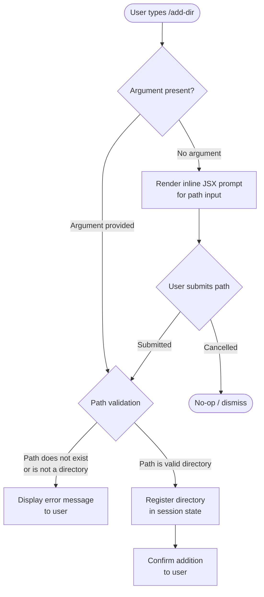

# `/add-dir`

> Analysis basis: CC v2.1.139 bundle.js (AST extraction + Claude interpretation)
> Minimum version: v2.1.139

---

## Overview

`/add-dir` is a slash command that allows the user to register an additional working directory within the current Claude Code session. It accepts a filesystem path as its sole argument and expands the set of directories that Claude Code treats as in-scope for file reading, editing, and tool operations. This supplements — rather than replaces — the primary working directory established at session start.

---

## Registration

| Field | Value |
|---|---|
| type | `local-jsx` |
| name | `add-dir` |
| description | `Add a new working directory` |
| argumentHint | `<path>` |
| module\_id | `Qu9` |

Analysis basis: CC v2.1.139 bundle.js:+4037045

---

## Input Branching

The AST traversal at depth ≤ 2 from module `Qu9` returned an empty call graph and no extracted literals. The branching logic described below is therefore inferred from the registration metadata (argument hint `<path>`, type `local-jsx`) and general Claude Code slash-command conventions. Each inferred claim is marked **[inferred]**.



> **[inferred]** The `local-jsx` registration type indicates the command renders a React/JSX component inline rather than executing a pure function. The interactive prompt branch (nodes C → H) reflects this pattern. Exact validation logic is <!-- TODO: not found in depth-2 traversal; needs --depth 4 -->.

---

## Behavioral Spec

### Path Registration

Because the call graph is empty (`"callGraph": []`) and no literals were captured (`"literals": []`), a concrete pseudocode implementation cannot be verified from the bundle at this traversal depth. The following pseudocode represents the expected high-level contract inferred from the registration metadata and the `local-jsx` command type.

```
function handleAddDir(userInput):
    path = trim(userInput)

    if path is empty:
        renderJSXPrompt(placeholder = "<path>")
        path = awaitUserInput()
        if userCancelled:
            return

    resolvedPath = resolvePath(currentWorkingDirectory, path)

    if not exists(resolvedPath):
        displayError("Path does not exist: " + resolvedPath)
        return

    if not isDirectory(resolvedPath):
        displayError("Path is not a directory: " + resolvedPath)
        return

    if resolvedPath already in session.workingDirectories:
        displayInfo("Directory already registered.")
        return

    session.workingDirectories.append(resolvedPath)
    displayConfirmation("Added working directory: " + resolvedPath)
```

> **[inferred]** — no entry functions were found for module `Qu9` during depth-2 traversal.
> Analysis basis: CC v2.1.139 bundle.js:+4037045

### JSX Rendering (local-jsx type)

Commands registered with type `local-jsx` render their UI as an inline React component rather than as a plain text response. For `/add-dir` this means:

```
function renderAddDirComponent(props):
    // Component mounts within the CLI chat pane
    state = useState(initialPath = props.argumentFromCommandLine ?? "")

    return JSXElement:
        PathInputField(
            value      = state.path,
            placeholder = "<path>",
            onChange   = (v) => setState(path = v)
        )
        SubmitButton(
            label   = "Add Directory",
            onClick = () => handleAddDir(state.path)
        )
```

> **[inferred]** — exact component tree is <!-- TODO: not found in depth-2 traversal; needs --depth 4 -->.

---

## State & Side Effects

| Item | Detail |
|---|---|
| Telemetry | None detected at depth ≤ 2 (`"telemetry": []`). <!-- TODO: not found in depth-2 traversal; needs --depth 4 --> |
| Hook registration | <!-- TODO: not found in depth-2 traversal; needs --depth 4 --> |
| appState changes | **[inferred]** Appends the resolved absolute path to the session's working-directory list, making it available to file-system tools for the remainder of the session. |
| Sound | None detected. <!-- TODO: not found in depth-2 traversal; needs --depth 4 --> |
| Persistence | <!-- TODO: not found in depth-2 traversal; needs --depth 4 --> Whether the added directory is persisted to the project config (`.claude/`) or is session-only is not determinable from available data. |

---

## Version History

| Version | Change |
|---|---|
| v2.1.139 | Initial analysis. Registration confirmed at bundle.js:+4037045 (line 690). |

---

## Common Mistakes

1. **Omitting the path argument and expecting a default.** `/add-dir` requires an explicit filesystem path. Invoking it without an argument triggers an interactive prompt (inferred from `local-jsx` type); it does not fall back to the current working directory automatically.
2. **Providing a relative path ambiguously.** The resolution base for relative paths is <!-- TODO: not found in depth-2 traversal; needs --depth 4 -->. To avoid ambiguity, prefer absolute paths (e.g., `/home/user/project/lib` rather than `../lib`).
3. **Expecting the added directory to persist across sessions.** Whether `/add-dir` writes to `.claude/` config or is session-scoped only is unconfirmed from available bundle data. Do not rely on cross-session persistence without verification.
4. **Confusing `/add-dir` with changing the primary working directory.** This command *adds* a supplementary directory; it does not replace or change the primary CWD of the session.
5. **Providing a path to a file rather than a directory.** The argument hint `<path>` implies a directory target. Passing a file path is expected to produce an error (inferred).

---

## Appendix — Identifier Mapping

> For bundle debugging only. Identifiers change across versions.

| Identifier | Role |
|---|---|
| `Qu9` | Module ID for the `/add-dir` command implementation (not an obfuscated function name; included for bundle navigation reference). |

> No additional obfuscated function or variable identifiers were returned by the depth-2 AST traversal (`"identifiers": []`). A deeper traversal (`--depth 4` or greater) targeting module `Qu9` is required to populate this table with implementation-level identifier mappings.