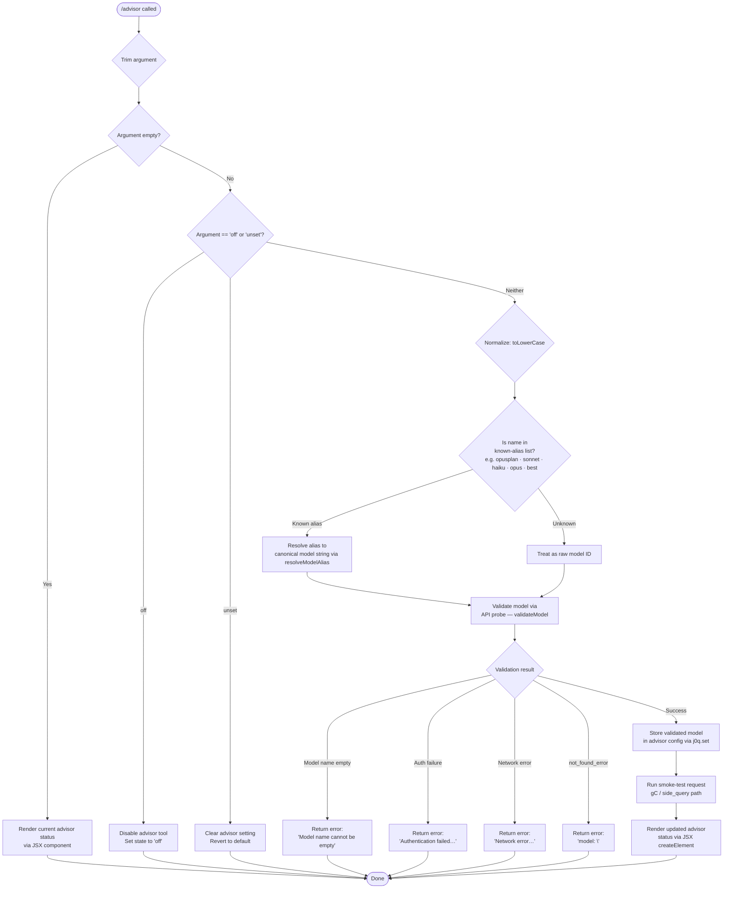

# `/advisor`

> Analysis basis: CC v2.1.141 bundle.js (AST extraction + Claude interpretation)
> Minimum version: v2.1.141

---

## Overview

The `/advisor` command configures the **Advisor Tool**, which allows Claude Code to consult a stronger or alternative model for guidance at key decision points during a task. Users can enable, disable, or select a specific model for the advisor, and may validate candidate model names against the Anthropic API before committing the configuration.

---

## Registration

| Field | Value |
|---|---|
| type | `local-jsx` |
| name | `advisor` |
| description | Configure the Advisor Tool to consult a stronger model for guidance at key moments during a task |
| loc_byte | 11505050 |
| loc_byte_end | 11505337 |
| loc_line | 7187 |
| argumentHint | `null` |
| isHidden | `null` |
| module_id | `T0q` |
| load_inline | `true` |
| arbor_handler.name | `ev7` |
| arbor_handler.fqn | `claude-2.1.141::ev7` |
| arbor_handler.kind | `AsyncFunction` |
| arbor_handler.resolution_path | `module_id` |
| arbor_handler.n_hits | 1 |

Analysis basis: CC v2.1.141 bundle.js:+11505050

---

## Input Branching

The command handles four or more distinct cases based on the argument provided (model string, `"off"`, `"unset"`, or an empty/no argument), plus an intermediate model-validation path — making a Mermaid flowchart the appropriate representation.



Analysis basis: CC v2.1.141 bundle.js:+11504508, +11504584, +11504595, +11497008, +11497707, +11497809, +11497928

---

## Behavioral Spec

### 1. Entry Point — `advisorCommandHandler` (`ev7`)

The handler is an `AsyncFunction` resolved via the `module_id` path (`T0q`). The synthetic BFS entry `__handler_advisor` is bookkeeping only; the real handler is `ev7`.

```
async function advisorCommandHandler(args, context):
    rawInput = args.trim()                          // +11504508
    element  = createElement(AdvisorStatusView)     // +11504544

    if rawInput is empty:
        return renderCurrentStatus(element)

    normalizedInput = rawInput.toLowerCase()

    if normalizedInput == "off":                    // +11504584
        setAdvisorState("off")
        return renderUpdatedStatus(element)

    if normalizedInput == "unset":                  // +11504595
        clearAdvisorSetting()
        return renderUpdatedStatus(element)

    // Non-empty, non-control argument → model selection path
    resolvedModel = resolveModelAlias(normalizedInput)  // zq
    validationResult = validateModel(resolvedModel)     // Qj8
    if validationResult.error:
        return renderError(validationResult.message)

    storeAdvisorModel(resolvedModel)                // j0q.set +11497460
    probeResult = runSideQuery(resolvedModel)       // gC +11504676
    return renderUpdatedStatus(element, resolvedModel)
```

Analysis basis: CC v2.1.141 bundle.js:+11504508

---

### 2. Model Alias Resolution — `resolveModelAlias` (`zq`)

Translates user-friendly short names into canonical model identifiers. Known aliases found in literals include `opusplan`, `sonnet`, `haiku`, `opus`, `best`, and a bracketed token `[1m]`. Non-alias strings pass through unchanged after a `.replace` normalisation step.

```
function resolveModelAlias(input):
    lower = input.toLowerCase()                 // +2147286
    if isKnownAlias(lower):                     // TAH +2147350
        canonical = lookupAlias(lower)          // oG  +2147304
        return canonical
    // Attempt provider-specific normalization
    normalized = input.replace(/* pattern */)   // +2147314
    if isProviderPrefixed(normalized):          // xV  +2147389
        return buildProviderModel(normalized)
    return input                                // pass-through
```

Analysis basis: CC v2.1.141 bundle.js:+2147275

---

### 3. Model Validation — `validateModel` (`Qj8`)

Sends a minimal probe request to the Anthropic API to verify the model identifier exists and is accessible. The error-message constants surfaced in literals drive the user-facing feedback.

```
async function validateModel(modelName):
    trimmed = modelName.trim()              // +11496971
    if trimmed is empty:
        return { error: true,
                 message: "Model name cannot be empty" }   // +11497008

    lower = trimmed.toLowerCase()          // +11497131
    if lower in disallowedModelSet:        // GAH.includes +11497150
        return { error: true, message: formatDisallowed(lower) }

    if modelCache.has(modelName):          // j0q.has +11497252
        return { error: false }            // cached positive

    // Issue a minimal 'Hi' / ephemeral probe                // +11497416, +11497441
    response = await callModelProbe(trimmed)   // gC +11497297

    if response.authError:
        return { error: true,
                 message: "Authentication failed…" }       // +11497707
    if response.networkError:
        return { error: true,
                 message: "Network error…" }               // +11497809
    if response.errorType == "not_found_error":            // +11497928
        return { error: true,
                 message: "model: " + trimmed }            // +11498010

    modelCache.set(modelName, result)      // j0q.set +11497460
    return { error: false }
```

Analysis basis: CC v2.1.141 bundle.js:+11496971

---

### 4. Side-Query / Probe Execution — `runSideQuery` (`gC`)

Executes a lightweight API call tagged as `side_query` (literal at +12273231). The probe runs through the standard API client pipeline (`vu`), which applies full header decoration (User-Agent, session IDs, OAuth token), retry logic, and the model-normalisation chain. On success the `tengu_api_success` telemetry event is fired.

```
async function runSideQuery(modelId):
    requestParams = buildSideQueryParams(modelId)   // +12273231
    // Applies: auth headers, User-Agent, session ID
    response = await apiClient.call(requestParams)  // vu
    if response.ok:
        emit("tengu_api_success")                   // +12274655
        return response
    handleProbeError(response)
```

Analysis basis: CC v2.1.141 bundle.js:+12273199

---

### 5. Model Alias Table (resolved from `Qv7`)

The handler `Qv7` (advisor model variant resolver) maps short hyphen-separated names to internal underscore-separated keys. Aliases confirmed in literals:

| Short name (input) | Internal key |
|---|---|
| `opus-4-7` | `opus_4_7` |
| `opus-4-6` | `opus_4_6` |
| `opus-4-5` | `opus_4_5` |
| `sonnet-4-6` | `sonnet_4_6` |
| `sonnet-4-5` | `sonnet_4_5` |

Analysis basis: CC v2.1.141 bundle.js:+11498277

---

### 6. MCP / Provider Model Building — `buildProviderModel` (`xV`, `DM`, `CU6`)

When the model string carries a provider prefix (e.g. `anthropicAws`, `bedrock`, `vertex`, `foundry`, `mantle`), these helpers construct the full provider-qualified model identifier and select the appropriate API endpoint.

```
function buildProviderModel(input):
    provider = detectProvider(input)       // pf → WA +2143856
    if provider in ["bedrock", "anthropicAws",
                    "vertex", "foundry",
                    "mantle", "firstParty",
                    "gateway"]:            // literals +2006501–2007190
        model = assembleProviderModel(provider, input)  // DM +2143868
        return model
    return input
```

Analysis basis: CC v2.1.141 bundle.js:+2143856

---

## State & Side Effects

| Item | Detail |
|---|---|
| Telemetry — `tengu_api_success` | Fired on a successful probe/side-query response (bundle.js:+12274655) |
| Telemetry — `tengu_prompt_cache_1h_config` | Fired when prompt-cache configuration applies to the side-query (bundle.js:+12235618) |
| Telemetry — `tengu_feature_ok` / `tengu_feature_bad` | Feature-flag gate events triggered inside the API client during the probe (bundle.js:+945566, +945624) |
| Telemetry — `tengu_bg_*` (multiple) | Background-session events fired if the probe routes through the daemon layer (bundle.js:+14465103 et seq.) |
| Model cache (`j0q`) | A `Map`-like store caching validated model names; entries added via `j0q.set` (+11497460), consulted via `j0q.has` (+11497252) |
| Advisor config store | The resolved and validated model ID (or `"off"` / cleared) is persisted to the application's advisor configuration |
| JSX rendering | `zJ.createElement` (+11504544) produces a React/Ink element for status display |
| No sound effects | No sound-related calls found in depth-2 traversal |
| No hook registration | No hook-registration side effects found in depth-2 traversal |

---

## Version History

| Version | Change |
|---|---|
| v2.1.141 | Initial analysis |

---

## Common Mistakes

1. **Passing an unquoted model name with spaces** — the argument is trimmed but not split; a multi-word string is treated as a single model identifier and will likely fail validation.
2. **Expecting `/advisor off` to also clear cached validation entries** — `"off"` only sets the advisor state flag; the model cache (`j0q`) is not flushed.
3. **Using `"unset"` and `"off"` interchangeably** — `"off"` explicitly disables the tool; `"unset"` reverts to the default (which may not be disabled), so the resulting behaviour can differ.
4. **Assuming all short aliases work** — only the aliases mapped in `Qv7` and the `zq` resolver are recognised; arbitrary abbreviations (e.g. `"opus4"`) will be forwarded as raw model IDs and may fail API validation.
5. **Running `/advisor` in an offline environment** — the validation path (`Qj8` → `gC`) issues a real network request; without connectivity it will return the "Network error" message and refuse to store the model.

---

## Appendix — Identifier Mapping

> For bundle debugging only. Identifiers change across versions.

| Identifier | Role |
|---|---|
| `ev7` | `advisorCommandHandler` — main async handler for `/advisor` (Arbor-resolved) |
| `zq` | `resolveModelAlias` — maps short alias names to canonical model strings |
| `Qj8` | `validateModel` — probes the API to verify a model ID is accessible |
| `gC` | `runSideQuery` — executes the lightweight `side_query` API probe |
| `vu` | `apiClient` — core Anthropic API client with auth/header decoration |
| `uB` | `buildModelDescriptor` — assembles structured model descriptor from string |
| `Qv7` | `advisorModelVariantResolver` — maps hyphen aliases to underscore keys |
| `gv7` | `advisorModelDispatch` — dispatches to `Qv7` after string coercion |
| `WO6` | `advisorStateToggle` — handles `toLowerCase` / `.includes` check for toggle states |
| `xV` | `buildProviderModel` — constructs provider-qualified model identifier |
| `DM` | `assembleProviderModel` — selects provider-specific model assembly path |
| `CU6` | `providerModelLookup` — finds provider record from known provider list |
| `G4L` | `providerModelBuilder` — builds full model object for a given provider |
| `ZdA` | `providerEntryMapper` — maps provider config entries |
| `pf` | `detectProviderFromString` — infers provider from model string prefix |
| `WA` | `resolveProviderRecord` — resolves canonical provider record |
| `nxH` | `modelStringNormalizer` — normalises a model string through `DM` |
| `bV` | `modelDescriptorBuilder` — combines `pf` + `DM` results |
| `vtA` | `modelDescriptorWrapper` — wraps `bV` result |
| `lxH` | `modelAllowlistChecker` — checks model against known-allowed list (`lfL`) |
| `ItA` | `modelIndexFinder` — finds model index using `lxH` |
| `nfL` | `modelFallbackResolver` — resolves fallback model via `zq` |
| `ifL` | `modelPrefixResolver` — resolves `claude-` prefix models via `VtA` |
| `VtA` | `modelPrefixChecker` — checks `.startsWith` prefix rules |
| `LF6` | `modelFeatureChecker` — checks model against feature-flag include list (`ofL`) |
| `ixH` | `modelIdentityBuilder` — builds model identity string via `RH` |
| `TAH` | `modelAliasTable` — contains/checks known alias list (`GAH`) |
| `oG` | `modelAliasLookup` — looks up alias via `VAH` |
| `VAH` | `aliasTableResolver` — resolves alias table entry via `RH` |
| `RH` | `stringCoercionHelper` — wraps `String(…)` |
| `SvH` | `mcpServerInitializer` — initialises MCP server connections |
| `Eeq` | `mcpUpdateApplier` — applies MCP server updates |
| `XA5` | `mcpClientRefreshAll` — refreshes all MCP clients |
| `bU6` | `providerEntryEnumerator` — enumerates provider config entries |
| `p_` | `providerConfigReader` — reads provider config via `ex` |
| `j0q` | `validatedModelCache` — Map caching model validation results |
| `kl6` | `asyncContextStoreReader` — reads from async local store (`lY9`) |
| `mq` | `stringWrapper` — wraps value in `String()` |
| `sVH` | `promptCacheConfigurator` — configures 1h prompt cache settings |
| `j6` | `featureFlagEvaluator` — evaluates feature flags |
| `KI8` | `featureFlagConfigLoader` — loads feature flag configuration |
| `LI8` | `featureFlagFilter` — filters feature flag results |
| `hE` | `cacheControlBuilder` — builds cache-control parameters via `z8_` |
| `z8_` | `cacheControlNormalizer` — normalises cache-control via `WA` |
| `Qi6` | `contextHeaderBuilder` — builds context/session headers |
| `gi6` | `sessionContextResolver` — resolves session context via `WA` |
| `KP` | `modelStringCleaner` — applies `.replace` to sanitize model string |
| `Xl6` | `sideQueryParamBuilder` — builds side-query parameters |
| `v1` | `modelFeatureGate` — gates model through feature checks |
| `iWH` | `sideQueryContextAssembler` — assembles context for side query |
| `Uy` | `contextProviderHelper` — resolves context provider via `WA` |
| `im7` | `messageRoleClassifier` — classifies message roles (user/text) |
| `WQ_` | `requestHasher` — creates SHA-256 hash of request |
| `v$H` | `requestPayloadBuilder` — builds full API request payload |
| `SH` | `jsonStringifier` — wraps `JSON.stringify` |
| `hu` | `requestIdGenerator` — generates random bytes-based request ID |
| `q5` | `requestMetadataBuilder` — attaches metadata (`mw`, `h6`) |
| `N` | `awaySummaryOrchestrator` — orchestrates away-summary generation |
| `_18` | `awaySummaryRunner` — runs away-summary turn |
| `es7` | `awaySummaryParamBuilder` — builds system/away_summary params |
| `Uf8` | `rateLimitStateReader` — reads rate-limit state (`CnH.getStore`) |
| `g` | `permissionClassifier` — classifies allow/classify/ask permissions |
| `LAq` | `requestIdAllocator` — allocates `randomUUID` request ID |
| `lTH` | `agentRouterBuilder` — routes to `CA4`/`kH` agent handlers |
| `CA4` | `builtinAgentRouter` — routes `agent:builtin:` prefixed requests |
| `kH` | `agentCallDispatcher` — dispatches agent calls with error logging |
| `Dg` | `customAgentRouter` — routes `agent:custom:` / `agent:` prefixed requests |
| `RA4` | `agentPrefixStripper` — strips agent prefix from identifier |
| `W` | `skillsEventEmitter` — debounced `skills` event emitter |
| `S` | `focusStateTracker` — tracks blurred/focused state with 1h window |
| `QZL` | `streamingResponseHandler` — handles streaming API response events |
| `yw` | `modelContextBuilder` — builds model context (`RU6`, `X4L`, `WA`, `SU6`) |
| `Kz` | `oauthTokenRefresher` — refreshes OAuth token via `RH`, `ER`, `yc` |
| `yu6` | `proxyAuthHelper` — invokes proxy auth helper with trust check |
| `UZL` | `streamChunkParser` — parses streaming response chunks |
| `FfH` | `requestTimingTracker` — tracks request timing with `Date.now` |
| `yV8` | `timestampFactory` — wraps `Date.now` |
| `p46` | `headerNormalizer` — normalises header keys to lowercase |
| `hMH` | `sdkErrorLogger` — logs `[Anthropic SDK ERROR]` via `console.error` |
| `zl6` | `modelVersionResolver` — resolves model version via `LP`, `m1`, `v1`, `MV` |
| `N15` | `bgSessionProtocolHandler` — handles background-session protocol messages |
| `w` | `bgSessionSpawnManager` — manages background-session worker spawning |
| `yf` | `bgSessionSocketFinalizer` — finalizes background-session socket |
| `P` | `bgSessionAttacher` — attaches to a background session via socket |
| `TH` | `stringCaster` — wraps `String(…)` for type coercion |
| `SF6` | `wifCredentialsFetcher` — fetches WIF credentials with `fetch` |
| `LuH` | `wifTokenExchanger` — exchanges WIF token for provider credentials |
| `FR` | `bedrockSignatureBuilder` — builds Bedrock request signature |
| `ej` | `bedrockRequestWrapper` — wraps Bedrock request via `j$` |
| `rjH` | `modelFamilyDetector` — detects model family via `XKK.find` + `startsWith` |
| `Xf` | `vertexTokenResolver` — resolves Vertex AI token via `V8_` |
| `KA` | `providerAuthSelector` — selects auth method (`mw`, `RB`, `xA`) |
| `pZL` | `hmacSigner` — signs request via `hmH` |
| `Z_` | `credentialsCacheReader` — reads cached credentials |
| `Ml` | `versionStringBuilder` — builds version string via `kl6` |
| `N1` | `backgroundContextReader` — reads background context (`bg`) via `pc` |
| `BZL` | `streamEventSplitter` — splits stream events by delimiter |
| `bD` | `asyncStoreReader` — reads async store via `ktA.getStore` |
| `HH6` | `cacheControlInjector` — injects cache-control into request |
| `t4H` | `requestContextInjector` — injects request context fields |
| `Xyq` | `responseMetadataExtractor` — extracts response metadata |
| `h2` | `messageHistoryMapper` — maps message history array |
| `V6` | `modelCapabilityResolver` — resolves model capabilities |
| `WO6` | `advisorStateToggle` — checks `toLowerCase` / `.includes` for on/off state |

---

Note: index built via Arbor fallback; some signals (telemetry, literals) may be missing — see arbor-fallback.js.