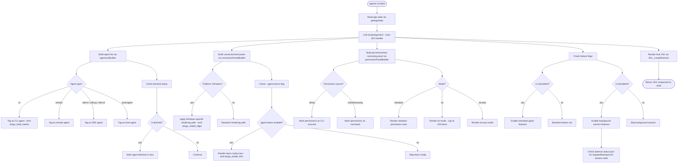

# `/agents`

> Analysis basis: CC v2.1.141 bundle.js (AST extraction + Claude interpretation)
> Minimum version: v2.1.141

---

## Overview

The `/agents` command provides an interactive management interface for agent configurations within Claude Code. It renders a JSX-based UI component that displays the current set of agent configurations, their connectivity status, and tool-permission states, allowing users to inspect and modify agent settings at runtime. The command reads live application state and constructs a structured view that reflects active agents, blocked states, and permission-narrowing policies.

---

## Registration

| Field | Value |
|---|---|
| type | `local-jsx` |
| name | `agents` |
| description | `Manage agent configurations` |
| loc_byte | `11443188` |
| loc_byte_end | `11443313` |
| loc_line | `7154` |
| module_id | `r2q` |
| load_inline | `true` |
| arbor_handler.name | `mI7` |
| arbor_handler.fqn | `claude-2.1.141::mI7` |
| arbor_handler.kind | `AsyncFunction` |
| arbor_handler.resolution_path | `module_id` |
| arbor_handler.n_hits | `0` |

Analysis basis: CC v2.1.141 bundle.js:+11443188

---

## Input Branching

The command's rendering logic involves several distinct branching paths based on agent state, feature flags, platform checks, and permission policies. A Mermaid flowchart is used to capture this structure.



---

## Behavioral Spec

### Main Handler — `agentsCommandHandler` (`mI7`)

The handler is an `AsyncFunction` resolved via `module_id` → `r2q` → `mI7`.

```
async function agentsCommandHandler(context):
    appState = getAppState()                    // reads live app state
    uiComponent = renderAgentsUI(appState)      // delegates to main UI builder
    return createElement(uiComponent)           // wraps result in JSX element
```

Analysis basis: CC v2.1.141 bundle.js:+11442995, +11443035, +11443048

---

### Agent UI Builder — `renderAgentsUI` (`SZ`)

The primary rendering function. Pulls together agent list, connection panel, permission panel, and feature-flag checks to produce a complete JSX tree.

```
function renderAgentsUI(appState):
    agentList     = agentListBuilder(appState)           // zP
    filteredList  = agentStatusFilter(agentList)         // dHH
    configPanel   = connectionConfigPanel(appState)      // CN_
    labelRow      = labelRowBuilder(appState)            // YK
    fullPanel     = fullAgentPanel(appState)             // nHH

    if hasAgent(A, agentList):                           // A.has
        /* agent is known — proceed with full render */

    someActive = agentList.some(isActiveCheck)           // K.some
    filteredActive = agentList.filter(activeFilter)      // K.filter

    if hpH registry has entry:                          // hpH.has
        /* skip duplicate registration */

    mappedRows = agentList.map(rowMapper)                // K.map

    if featureFlag_x1.isEnabled():                      // x1.isEnabled
        /* enable extended agent feature set */

    if featureFlag_O.isEnabled():                       // O.isEnabled
        /* enable background session support */
        checkDaemonStatus()                              // reads daemon.status.json

    normalizedNames = agentList normalised to lowercase  // A.toLowerCase
    includedCheck   = $.includes(normalizedNames)        // $.includes

    if cz(appState):                                    // cz
        /* apply connectivity normalization */

    return composedJSXTree
```

Analysis basis: CC v2.1.141 bundle.js:+11443035, +8988689, +8988728, +8988760, +8988785, +8988797, +8988885, +8988904, +8988932, +8988944, +8988955, +8989031, +8989046, +8989074, +8989085, +8989127, +8989172

---

### Agent List Builder — `agentListBuilder` (`zP`)

Constructs the list of known agents from the registry, classifying each agent by type and emitting a telemetry event.

```
function agentListBuilder(appState):
    rawList = agentRegistryReader(appState)      // dR
    stringified = stringify(rawList)             // mq → String

    for each agent in rawList:
        agentType = readAgentType(agent)         // RH
        switch agentType:
            case "cli":
            case "remote":
            case "sdk-ts":
            case "sdk-py":
            case "sdk-cli":
            case "local-agent":
                classifyAgent(agent, agentType)

    emit telemetry("tengu_slate_harbor")         // +3170926

    return classifiedAgentList
```

Constants found: `"cli"` (bundle.js:+3170896), `"remote"` (bundle.js:+3170907), `"sdk-ts"` (bundle.js:+3171153), `"sdk-py"` (bundle.js:+3171167), `"sdk-cli"` (bundle.js:+3171181), `"local-agent"` (bundle.js:+3171196)

Analysis basis: CC v2.1.141 bundle.js:+3170744, +3170761, +3170806, +3170923

---

### Agent Permission / Tool Registration — `toolPermissionRegistrar` (`j6`)

Handles per-agent tool permission state, including tracking which tools are registered, which are blocked, and managing the permission registry.

```
function toolPermissionRegistrar(agent, toolSpec):
    agentId = agentIdFormatter(agent)        // b76
    toolId  = toolIdFormatter(toolSpec)      // x76
    label   = formatLabel(agentId, toolId)   // Js → RH + ws

    if gMH registry has label:               // gMH.has
        entry = gMH.get(label)               // gMH.get
    
    if not pA_ seen set has label:           // pA_.has
        cachedEntry = gMH.get(label)         // gMH.get
        pA_.add(label)                       // pA_.add
        triggerObserver(cachedEntry)         // mA_
        cleanupObserver(cachedEntry)         // cA_

    R76.add(label)                           // R76.add — track registered tools

    if OF registry has label:                // OF.has
        existingEntry = OF.get(label)        // OF.get
        persistPermission(existingEntry)     // h6

    return registeredEntry
```

Analysis basis: CC v2.1.141 bundle.js:+3120466, +3120503, +3120538, +3120555, +3120566, +3120578, +3120592, +3120609, +3120629

---

### Agent Status Filter — `agentStatusFilter` (`dHH`)

Filters the agent list to exclude agents matching certain criteria (e.g. blocked agents).

```
function agentStatusFilter(agentList):
    filtered = agentList.filter(isNotBlocked)    // H.filter
    /* "blocked" string literal used as filter discriminant */
    return filtered.map(permissionSummaryBuilder) // SP6
```

Constant: `"blocked"` (bundle.js:+8988106)

Analysis basis: CC v2.1.141 bundle.js:+8988045, +8988060

---

### Permission Summary Builder — `permissionSummaryBuilder` (`SP6`)

For each non-blocked agent, builds a permission summary combining allowed and denied tool lists.

```
function permissionSummaryBuilder(agent):
    allPermissions = permissionFlatMapper(agent)     // _LH → mS_.flatMap + PO
    deniedList     = deniedPermissions(agent)        // pS_ → Ym8 + D96 + Ny
    /* "deny" is a discriminant value */
    remainder      = remainingPermissions(agent)     // H_q

    return { agent, allPermissions, deniedList, remainder }
```

Constant: `"deny"` (bundle.js:+9768626), `"cliArg"` (bundle.js:+9769196), `"toolsNarrowing"` (bundle.js:+9769217)

Analysis basis: CC v2.1.141 bundle.js:+9769259, +9769276, +9769300

---

### Connection Config Panel — `connectionConfigPanel` (`CN_`)

Assembles the connection configuration section of the UI, reading multi-source config and registering the React/JSX component state.

```
function connectionConfigPanel(appState):
    configData  = configDataReader(appState)     // Mm → c6 + RH + mq + h_H + j6
    panelData   = configPanelData(appState)      // VDH
    stateHook   = useStateHook()                 // qA
    return buildConfigPanel(configData, panelData, stateHook)
```

Analysis basis: CC v2.1.141 bundle.js:+8988616, +8988640, +8988646

---

### Label Row Builder — `labelRowBuilder` (`YK`)

Constructs the header/label row for the agents UI table.

```
function labelRowBuilder(appState):
    platformId = getPlatformId(appState)    // c6
    /* "windows" is checked here */
    labelText  = formatLabel(platformId)    // h_H
    return labelRow(labelText)
```

Constant: `"windows"` (bundle.js:+4632006)

Analysis basis: CC v2.1.141 bundle.js:+4632142, +4632175

---

### Full Agent Panel — `fullAgentPanel` (`nHH`)

Top-level panel builder; orchestrates sub-components for each agent entry including label row, connectivity check, permission columns, and team configuration.

```
function fullAgentPanel(appState):
    labelRow     = labelRowBuilder(appState)         // YK
    connectivity = connectivityNormalizer(appState)  // cz → RH
    typeProfile  = typeProfileBuilder(appState)      // TP → RH + Z_
    // …layout and string composition via RH

    if agentTeamsEnabled:                            // K1 checks --agent-teams flag
        emit telemetry("tengu_amber_flint")          // +5202897

    confirmRow  = confirmActionRow()                 // cH7 → oi1 + qA
    primaryRow  = primaryActionRow()                 // QH7 → hi1 + qA
    deleteRow   = deleteActionRow()                  // dH7 → ui1 + qA

    configPanel = connectionConfigPanel(appState)    // CN_
    progressRow = progressIndicator()                // Pr1
    envPanel    = envConfigPanel()                   // Ep

    return composedPanel
```

Constant: `"--agent-teams"` (bundle.js:+5202785)

Analysis basis: CC v2.1.141 bundle.js:+8987426, +8987442, +8987546, +8987639, +8987710, +8987729, +8987770, +8987776, +8987782, +8987933, +8987974, +8988001

---

### Environment Config Panel — `envConfigPanel` (`Ep`)

Builds the environment/API-provider section of the agent config panel, checking provider type and feature-flag overrides.

```
function envConfigPanel():
    envRows     = envRowBuilder()             // $h_ → RH + be1 + cq7 + mq
    /* "standard", "tst", "tst-auto" modes selected here */
    /* tst mode capped at 100 items: literal 100 at +9487842 */

    debugMode   = checkDebugMode()            // v → "debug" literal at +198860
    /* checks H.includes, uppercases, trims */

    providerRow = providerRowBuilder()        // WA → RH
    /* provider literals: "bedrock", "foundry", "anthropicAws",
       "mantle", "vertex", "firstParty", "api.anthropic.com" */

    toolSearchFlag = checkToolSearchEnabled() // UM
    /* emits warning if Vertex AI and tool-search beta header present */

    return envPanel
```

Constants: `"standard"` (+9487750), `"tst"` (+9487829), `"tst-auto"` (+9487879), item cap `100` (+9487842), `"debug"` (+198860), `"bedrock"` (+2006501), `"foundry"` (+2006551), `"anthropicAws"` (+2006607), `"mantle"` (+2006661), `"vertex"` (+2006709), `"firstParty"` (+2006718), `"api.anthropic.com"` (+2007407)

Warning literal: `"[ToolSearch:optimistic] disabled: Vertex AI does not accept the tool-search beta header. Set ENABLE_TOOL_SEARCH=true to override."` (bundle.js:+9488764)

Analysis basis: CC v2.1.141 bundle.js:+9488228, +9488268, +9488420, +9488442

---

### Permission Persistence — `permissionPersister` (`h6`)

Persists an agent tool-permission entry, recording a timestamp and triggering any registered change listeners.

```
function permissionPersister(entry):
    resolvedValue = resolvePermissionValue(entry)   // x6
    storeValue    = storeResolver(entry)            // Y0
    versionTag    = versionTagResolver(entry)       // _9_
    changeMap     = changeMapRegistry(entry)        // cMH
    timestamp     = Date.now()                      // +3139585
    observer      = observerNotifier(entry)         // EhL
    notifyObserver(observer, timestamp)
```

Analysis basis: CC v2.1.141 bundle.js:+3139496, +3139510, +3139529, +3139533, +3139585, +3139638

---

### Background Session / Daemon Status Check

When feature flag `O.isEnabled()` is true, the UI polls or reads `daemon.status.json` to determine whether a background session is active.

```
function checkDaemonStatus():
    statusPath = buildStatusPath(PTq, "daemon.status.json")  // b06 → PTq.join + p8
    provider   = daemonStatusProvider()                       // XTq
    timestamp  = Date.now()                                   // +11581298
    sessionId  = sessionIdReader()                            // p7 → GcL.getStore

    if status == "stopped":
        /* surface stopped state in UI */
    if status == "background session":
        /* surface background session indicator */

    payload = serialisePayload()                              // SH → JSON.stringify
    return daemonStatus
```

Constants: `"daemon.status.json"` (+11581186), `"stopped"` (+14499537), `"background session"` (+14499580), column pad width `40` (+14489603), pad string `"  "` (+14487632)

Analysis basis: CC v2.1.141 bundle.js:+11581283, +11581298, +11581330, +11581347, +11581353

---

### State Hook / React Integration — `useStateHook` (`qA`)

A thin React-style state-hook wrapper used throughout the panel sub-components to register and bind local UI state.

```
function useStateHook(initialValue):
    moduleFlag = markAsESModule()             // kjH → "__esModule"
    rawState   = nativeStateInit(initialValue) // nE8
    boundCall  = dZ6.call(...)                // +1603
    boundBind  = cZ6.bind(...)                // +1630
    keyedState = S_K(boundCall, boundBind)    // +1659
    Uo_.set(key, keyedState)                  // +1692 — registers in state map
    return keyedState
```

Analysis basis: CC v2.1.141 bundle.js:+1500, +1592, +1603, +1630, +1659, +1692

---

## State & Side Effects

| Item | Detail |
|---|---|
| Telemetry: `tengu_slate_harbor` | Emitted during agent-type classification in `agentListBuilder`; fires once per `/agents` invocation when agent types are enumerated (bundle.js:+3170926) |
| Telemetry: `tengu_cobalt_ridge` | Emitted from the platform-aware config panel builder (`Mm`) under Windows-specific rendering path (bundle.js:+4632100) |
| Telemetry: `tengu_amber_flint` | Emitted when `--agent-teams` flag is detected during full panel assembly (`K1`) (bundle.js:+5202897) |
| App state read | `getAppState()` called at handler entry (+11442995); no write-back observed at depth ≤ 2 |
| Permission registry writes | `R76.add`, `pA_.add`, `OF.get/has`, `gMH.get/has` — in-memory permission maps mutated during tool registration (+3120578, +3120592, +3120609, +3118107–3118232) |
| Daemon status file read | Reads `daemon.status.json` from daemon status path when background-session feature flag is active (+11581186) |
| React/JSX state registration | `Uo_.set(key, state)` called for each sub-panel that uses state hook (+1692) |
| File system (socket cleanup) | `n6K.unlinkSync` reachable via `q` → socket/file cleanup path (+14444736) |
| `Date.now` calls | Two sites: permission persister (+3139585) and daemon status check (+11581298) |
| Warning output | Tool-search/Vertex AI incompatibility warning may be surfaced in the env panel (+9488764) |

---

## Version History

| Version | Change |
|---|---|
| v2.1.141 | Initial analysis |

---

## Common Mistakes

1. **Expecting text output**: `/agents` is a `local-jsx` command — it renders an interactive JSX component, not plain text. Piping or capturing stdout will not capture the UI.
2. **Assuming static agent list**: The agent list is read from live `appState` on every invocation; changes to agent configuration outside the session may not be reflected until the next invocation.
3. **Overlooking `--agent-teams` flag**: Team configuration rows are only rendered when the `--agent-teams` CLI argument is present. Without it, team-related settings will not appear in the `/agents` UI.
4. **Misinterpreting `blocked` agents**: Agents with a `"blocked"` status are filtered out of the main display list by `agentStatusFilter` and do not appear as active entries.
5. **Vertex AI + tool-search**: Enabling the tool-search beta header while using a Vertex AI provider will trigger a visible warning in the environment panel; set `ENABLE_TOOL_SEARCH=true` to override.
6. **`tst` mode item cap**: In `tst` permission mode the display is capped at 100 items (bundle.js:+9487842); this is not configurable from the CLI.

---

## Appendix — Identifier Mapping

> For bundle debugging only. Identifiers change across versions.

| Identifier | Role |
|---|---|
| `mI7` | Main async handler for `/agents` command (`agentsCommandHandler`) |
| `SZ` | Primary agent UI builder (`renderAgentsUI`) |
| `RH` | String/label formatter utility |
| `zP` | Agent list builder (`agentListBuilder`) |
| `dR` | Agent registry reader |
| `mq` | String coercion helper |
| `j6` | Tool permission registrar (`toolPermissionRegistrar`) |
| `b76` | Agent ID formatter |
| `x76` | Tool ID formatter |
| `Js` | Label concatenation helper |
| `vi6` | Permission cache and observer manager |
| `h6` | Permission persister (`permissionPersister`) |
| `dHH` | Agent status filter (`agentStatusFilter`) |
| `H` | Random/timer utility (Math.random + setTimeout) |
| `SP6` | Permission summary builder (`permissionSummaryBuilder`) |
| `_LH` | Permission flat-mapper |
| `pS_` | Denied-permission builder |
| `H_q` | Remaining-permissions calculator |
| `CN_` | Connection config panel builder (`connectionConfigPanel`) |
| `Mm` | Config data reader (Windows-aware) |
| `qA` | React-style state hook wrapper (`useStateHook`) |
| `cZ6` | State bind helper |
| `YK` | Label row builder (`labelRowBuilder`) |
| `nHH` | Full agent panel orchestrator (`fullAgentPanel`) |
| `cz` | Connectivity normalizer |
| `TP` | Type profile builder |
| `Z_` | Profile sub-formatter |
| `eiH` | Extended panel element |
| `cH7` | Confirm action row builder |
| `K1` | Agent-teams flag checker |
| `Vf4` | Teams config formatter |
| `QH7` | Primary action row builder |
| `dH7` | Delete action row builder |
| `Ep` | Environment config panel builder (`envConfigPanel`) |
| `$h_` | Environment row builder |
| `v` | Debug-mode / string normalizer |
| `WA` | Provider row builder |
| `UM` | Tool-search flag checker |
| `A` | Agent name normalizer (toLowerCase) |
| `f` | Socket/connection handle |
| `q` | File/socket cleanup handler |
| `L` | Connection lifecycle manager |
| `K` | Agent list array operations (some/filter/map) |
| `PL` | Pagination or layout helper |
| `O` | Background-session feature-flag checker |
| `b8` | Background session sub-handler |
| `$` | Inclusion-check array |
| `XTq` | Daemon status provider |
| `Ia` | Status initialiser |
| `p7` | Session store reader (GcL.getStore) |
| `b06` | Daemon status path builder |
| `SH` | JSON serialisation wrapper |

---

Note: index built via Arbor fallback; some signals (telemetry, literals) may be missing — see arbor-fallback.js.