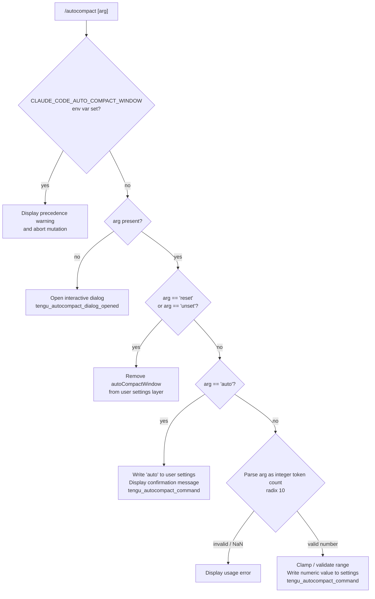

# `/autocompact`

> Analysis basis: CC v2.1.141 bundle.js (AST extraction + Claude interpretation)
> Minimum version: v2.1.141

---

## Overview

`/autocompact` configures the automatic context-compaction window size for a Claude Code session. It accepts either the keyword `auto` (to delegate window sizing to the model) or an explicit token count, and persists the chosen value into the user settings layer. When invoked without an argument, or with an unrecognised value, it opens an interactive dialog instead of applying a change immediately.

---

## Registration

| Field | Value |
|---|---|
| type | `local-jsx` |
| name | `autocompact` |
| description | Configure the auto-compact window size |
| argumentHint | `[auto\|<tokens>]` |
| isHidden | `false` |
| module_id | `n1q` |
| load_inline | `true` |
| loc_byte | `10013910` |
| loc_byte_end | `10014159` |
| loc_line | `5698` |
| arbor_handler.name | `f$7` |
| arbor_handler.fqn | `claude-2.1.141::f$7` |
| arbor_handler.kind | `AsyncFunction` |
| arbor_handler.resolution_path | `module_id` |
| arbor_handler.n_hits | `1` |

Analysis basis: CC v2.1.141 bundle.js:+10013910

---

## Input Branching

The command has five distinct input paths (no argument → dialog; `auto`; `reset`/`unset`; numeric token value; environment-variable lock), so a Mermaid flowchart is used.



Analysis basis: CC v2.1.141 bundle.js:+10008410 (handler `x26`), +10008575 (`reset`/`unset` literals), +10008618 (`ey_` token-parser), +10009228 (confirmation string)

---

## Behavioral Spec

### 1. Entry point — main handler (`f$7`)

`f$7` is the async entry point resolved by Arbor via `module_id → n1q`.

```
async function mainHandler(commandArg, appContext):
    // Render the JSX wrapper (sM.createElement) using
    // the "dialog" presentation key
    // Then delegate all logic to configureAutoCompact(commandArg, appContext)
    emit telemetry: tengu_autocompact_dialog_opened   // when no arg
    return JSX element
```

Analysis basis: CC v2.1.141 bundle.js:+10013595 (`f$7 → x26`), +10013628 (`tengu_autocompact_dialog_opened`), +10013672 (`"dialog"` literal), +10013683 (`sM.createElement`)

---

### 2. Environment-variable precedence check (`x26` — configure function)

Before any mutation, the handler checks whether the environment variable `CLAUDE_CODE_AUTO_COMPACT_WINDOW` is set.

```
function configureAutoCompact(rawArg, ctx):
    if env["CLAUDE_CODE_AUTO_COMPACT_WINDOW"] is set:
        display "CLAUDE_CODE_AUTO_COMPACT_WINDOW is set and takes precedence. Unset it to change this setting."
        return   // abort; no settings written

    trimmedArg = rawArg.trim()

    if trimmedArg == "reset" or trimmedArg == "unset":
        removeAutoCompactWindowFromUserSettings(ctx)
        return

    parsedValue = parseTokenArg(trimmedArg)   // see §3

    if parsedValue is "auto":
        applyFlagSettings(ctx)
        writeSettingValue("autoCompactWindow", "auto", ctx)
        display "Auto-compact window set to auto"
    elif parsedValue is a valid number:
        applyFlagSettings(ctx)
        writeSettingValue("autoCompactWindow", parsedValue, ctx)
        display confirmation with formatted number
    else:
        // no arg or bad value → open dialog
        openDialog(ctx)

    emit telemetry: tengu_autocompact_command
```

Analysis basis: CC v2.1.141 bundle.js:+10008444 (env-var precedence string), +10008546 (`H.trim`), +10008575 (`"reset"`), +10008588 (`"unset"`), +10008882 (`p_`), +10008963 (`applyFlagSettings`), +10009012, +10009068 (`"set"` branch), +10009228 (`"Auto-compact window set to auto"`)

---

### 3. Token-argument parser (`ey_`)

```
function parseTokenArg(arg):
    trimmed = arg.trim()

    if trimmed.endsWith("%"):
        // percentage form: parseFloat, multiply to token count
        pct = parseFloat(trimmed)
        if Number.isFinite(pct):
            return Math.round(pct * 1000)   // scale factor 1000
        else:
            return null

    raw = parseInt(trimmed, 10)   // base 10
    if not Number.isFinite(raw):
        return null

    // raw percentage path: divide by 100 then round
    return Math.round(raw / 100)  // or direct token value depending on branch

    // Special keyword
    if trimmed == "auto":
        return "auto"
```

Key numeric constants observed in the traversal:
- Percentage scale factor: `1000` (bundle.js:+9469613)
- Percentage divisor: `100` (bundle.js:+9469649)
- `Math.round` applied after scaling (bundle.js:+9469722)

Analysis basis: CC v2.1.141 bundle.js:+9469478 (`H.trim`), +9469508 (`"auto"` literal), +9469537 (`endsWith`), +9469555 (`parseFloat`), +9469629 (`parseInt`), +9469675 (`Number.isFinite`), +9469722 (`Math.round`)

---

### 4. Token-count validation (`XX` — integer validator)

The validator is invoked by the settings-read pipeline to confirm that any stored or supplied token integer is within an accepted range.

```
function validateTokenCount(value):
    coerced = parseInt(String(value), 10)   // radix 10
    if isNaN(coerced):
        return { status: "invalid" }

    if coerced < 0 or coerced > 1_000_000:
        return { status: "invalid", reason: "out of range" }

    // branch via oG (minBound), mc (full validation), ZAH (reset helper), wl6 (writer)
    return { status: "valid", value: coerced }
```

Observed numeric bounds:
- Minimum: `0` (bundle.js:+2881785)
- Maximum: `1,000,000` (bundle.js:+2881812)
- Parse radix: `10` (bundle.js:+2881765)

Analysis basis: CC v2.1.141 bundle.js:+2881713 (`parseInt`), +2881773 (`isNaN`), +2881785, +2881812

---

### 5. Settings resolution pipeline (`oi` → `dt` → `B0` / `A98`)

When reading the current auto-compact window value the command walks the standard settings priority chain.

```
function resolveAutoCompactWindow(ctx):
    // Priority (highest → lowest):
    //   1. CLAUDE_CODE_AUTO_COMPACT_WINDOW env var  (+9470082)
    //   2. env layer                                 (+9470274)
    //   3. settings layer                            (+9470344)

    envValue = env["CLAUDE_CODE_AUTO_COMPACT_WINDOW"]
    if envValue is defined:
        // parse and return; also emits tengu_amber_redwood2
        return parseFromEnv(envValue)

    // Apply Math.max / Math.min clamping           (+9470200 / +9470240)
    clamped = clamp(settingsValue, MIN, MAX)

    // Read autoCompactEnabled flag from settings   (+9471419)
    enabled = readFlag("autoCompactEnabled")

    return { value: clamped, enabled: enabled }
```

Analysis basis: CC v2.1.141 bundle.js:+9470082 (`CLAUDE_CODE_AUTO_COMPACT_WINDOW`), +9470200 (`Math.max`), +9470240 (`Math.min`), +9470344 (`"settings"`), +9470362 (`B0`), +9470383 (`A98`), +9471419 (`"autoCompactEnabled"`)

---

### 6. Settings write pipeline (`m_`)

Persists the new value through the layered settings system.

```
async function writeUserSetting(key, value, ctx):
    // Locate settings files via Jf (path resolver) and Xc (path builder)
    // Reads existing settings from disk via MB (file reader)
    // Merges new key-value pair
    // Writes back atomically via $CH (atomic file writer):
    //   - open temp file, write, fchmod, fsync, rename, unlink old
    // Clears in-memory settings caches via ZY   (+24901 / +24913)
    // Reloads settings from disk via jR6 (settings loader)
    // Emits xCH event to signal settings changed (+1192343)
    // Logs via kH (logger)
```

Settings file hierarchy observed:
- `userSettings` → `settings.json` (bundle.js:+1182595)
- `projectSettings` → `settings.json` in `.claude/` (bundle.js:+1182881)
- `localSettings` → `settings.local.json` (bundle.js:+1182953)
- `policySettings` → `managed-settings.json` (bundle.js:+1179513)
- `flagSettings` layer (bundle.js:+1191452)

Analysis basis: CC v2.1.141 bundle.js:+1191492 (`Jf`), +1191527 (`x6`), +1191564 (`Bm8`), +1191598 (`hD`), +1191617 (`$8`), +1191650 (`Y1`), +1191833 (`zc`), +1191952 (`Fu8`), +1191982 (`Xc`), +1192004 (`$CH`), +1192146 (`ZY`), +1192171 (`jR6`), +1192343 (`xCH.emit`)

---

### 7. Model list used in token-model matching (`v1` / `Sw`)

The settings pipeline resolves model-specific context limits. The following model name prefixes are referenced during that resolution:

- `claude-opus-4-7` … `claude-opus-4-0` (bundle.js:+2144444–+2144704)
- `claude-sonnet-4-6` … `claude-sonnet-4-0` (bundle.js:+2144736–+2144892)
- `claude-haiku-4-5` (bundle.js:+2144926)
- `claude-3-7-sonnet`, `claude-3-5-sonnet`, `claude-3-5-haiku`, `claude-3-opus`, `claude-3-sonnet`, `claude-3-haiku` (bundle.js:+2144985–+2145276)
- Cross-checked against `"application-inference-profile"` provider type (bundle.js:+2145412)

Analysis basis: CC v2.1.141 bundle.js:+2144417 (`Sw → toLowerCase`), +2144433 (`includes`), +2145369 (`replace`), +2145392 (`v1 → Sw`), +2145401 (`v1 → H.includes`)

---

## State & Side Effects

| Item | Detail |
|---|---|
| Telemetry: `tengu_autocompact_dialog_opened` | Fired when the command is invoked without arguments and the interactive dialog is opened (bundle.js:+10013630) |
| Telemetry: `tengu_autocompact_command` | Fired after a successful programmatic set or reset of the auto-compact window size (bundle.js:+10009014) |
| Telemetry: `tengu_amber_redwood2` | Fired during settings resolution when the `CLAUDE_CODE_AUTO_COMPACT_WINDOW` env var is active (bundle.js:+9469894) |
| Settings written | `autoCompactWindow` key in user settings layer (`settings.json`); `autoCompactEnabled` flag also consulted |
| Settings caches cleared | In-memory caches `kV6` and `XZ8` are cleared via `ZY` after every write (bundle.js:+24901, +24913) |
| Settings reloaded | `jR6` reloads all settings layers from disk after a write (bundle.js:+1192171) |
| Event emitted | `xCH.emit` signals downstream subscribers that settings have changed (bundle.js:+1192343) |
| Flag settings applied | `applyFlagSettings` is called before writing when a value is confirmed (bundle.js:+10008963) |
| Atomic file write | `$CH` writes settings via temp-file → `fchmod` → `fsync` → `rename` to prevent partial writes (bundle.js:+10002004) |
| Dialog (JSX) | `sM.createElement` renders a `"dialog"`-keyed component when no valid argument is supplied (bundle.js:+10013683) |
| Sound | <!-- TODO: not found in depth-2 traversal; needs --depth 4 --> |

---

## Version History

| Version | Change |
|---|---|
| v2.1.141 | Initial analysis |

---

## Common Mistakes

1. **Setting the env var and the slash command together.** If `CLAUDE_CODE_AUTO_COMPACT_WINDOW` is set in the environment, `/autocompact` will display a precedence warning and refuse to write to settings. Unset the env var first.
2. **Using a float instead of an integer.** The parser calls `parseInt` (radix 10). A value like `50.5` will be truncated to `50`; a pure decimal string without digits before the point (e.g. `.5`) will parse as `NaN` and trigger the error path.
3. **Confusing `reset`/`unset` with `0`.** Passing `0` writes a numeric zero to settings (which is within the valid 0–1,000,000 range); passing `reset` or `unset` removes the key entirely, restoring default behaviour.
4. **Expecting instant propagation.** The write goes through an atomic file round-trip followed by a full reload of all settings layers. Rapid successive calls may observe stale in-memory state until the reload cycle completes.
5. **Not accounting for the `auto` keyword casing.** The parser trims but does not lowercase the argument; `Auto` or `AUTO` will not match the `"auto"` literal and will fall through to the numeric parse path, producing `NaN`.

---

## Appendix — Identifier Mapping

> For bundle debugging only. Identifiers change across versions.

| Identifier | Role |
|---|---|
| `f$7` | Main async handler for `/autocompact` (Arbor-resolved entry point) |
| `x26` | Core configure function: env-var check, arg dispatch, settings write orchestration |
| `oi` | Settings resolution function: reads current auto-compact window from env / settings layers |
| `v1` | Model-name lookup / context-limit resolver |
| `bU6` | Helper used by model resolver (Object.entries iteration) |
| `Sw` | Model name normaliser (toLowerCase / includes / replace) |
| `H` | Random/timer utility (Math.random + setTimeout) |
| `$I8` | Auxiliary called by model resolver |
| `KP` | String replace helper for model names |
| `XX` | Token-count integer validator (parseInt / isNaN / range check) |
| `RH` | String coercion utility |
| `oG` | Lower-bound enforcer for token counts |
| `mc` | Full token-count validator (range + model prefix check) |
| `ZAH` | Token reset/clear helper |
| `wl6` | Token-count writer (parseInt / Number.isFinite / range) |
| `jw` | Auxiliary in settings resolution pipeline |
| `dt` | Token-status classifier (`"valid"` / `"invalid"` / `"capped"`) |
| `v` | Log/debug utility (includes "debug" literal) |
| `B0` | Auto-compact settings reader (reads `autoCompactEnabled` flag) |
| `f7` | Settings-source resolver (`legacyGlobalConfig` / `default` branches) |
| `A98` | Higher-order settings resolver: calls B0, Z_, j6, ey_ |
| `Z_` | Auxiliary within A98 |
| `j6` | Cache-set registry manager (gMH, R76, OF maps) |
| `ey_` | Token-argument string parser (`auto` keyword + percentage + integer) |
| `m_` | Settings write pipeline (file I/O, cache clear, reload, event emit) |
| `Jf` | Settings path resolver (joins paths for userSettings, projectSettings, localSettings) |
| `Xc` | Path builder (VV.resolve, dirname, p8, e8, Oo) |
| `ahK` | Auxiliary path helper (wH6, RH) |
| `ky` | Path join helper (VV.join) |
| `ohK` | Managed-settings path builder |
| `Oo` | Path utility called by Jf and Xc |
| `x6` | Base path resolver |
| `Bm8` | Settings merge helper (calls xDA, Jf, G5H, MC6, zc) |
| `xDA` | Settings object key merger (Object.keys, zc) |
| `G5H` | Settings layer merger for global config (Tt_, hv, mm8, Et_) |
| `MC6` | SDK inline settings merger (gjH, hv, jR, MX, w5H) |
| `hD` | Disk-read wrapper (calls MB) |
| `MB` | File reader (readFileSync, slice, replaceAll, 4096-byte buffer) |
| `$8` | Error code checker (M8) |
| `M8` | Error-code constant holder (ENOENT) |
| `Fu8` | Timestamp cache writer (IR6.set, Date.now) |
| `$CH` | Atomic file writer (open, write, fchmod, fsync, rename, unlink) |
| `q` | Filesystem sync operations (lstatSync, statSync, renameSync, unlinkSync) |
| `O` | Stat result helper (isSymbolicLink, b8) |
| `f` | File handle utility (close, L reference) |
| `SH` | JSON serialiser (JSON.stringify) |
| `ZY` | Settings cache invalidator (kV6.clear, XZ8.clear) |
| `jR6` | Settings file loader (mkdir, readFile, appendFile, writeFile, git check-ignore) |
| `N6` | Settings file path builder (bS6, e8) |
| `vu8` | Settings validator (VL) |
| `hu8` | Git-ignore checker helper (M_) |
| `WyK` | Home-directory path builder (vzA.homedir, JR6.join) |
| `e8` | Error handler / no-op sink |
| `ex` | Settings load orchestrator (calls rS, T1, Fm8, yV6) |
| `rS` | Startup routine called by settings loader |
| `T1` | Memory-usage sampler (U6A set, process.memoryUsage, bx, n6A.push) |
| `Fm8` | Settings load core (Date.now, T8, hV6, zc, WE, xDA, Jf, G5H, MC6) |
| `yV6` | Post-load callback |
| `kH` | Logger (k_, RH, Vq, GvK, aRH.push, Oc.logError) |
| `k_` | Error formatter (Error, String) |
| `Vq` | Log transport selector (cMA / essential-traffic) |
| `GvK` | Log ring-buffer manager (kS6.shift, kS6.push) |
| `p_` | Settings-read entry point (calls ex) |
| `_` | Lodash / utility library (includes, toUpperCase, endsWith, applyFlagSettings) |
| `Q` | App-state or context accessor |
| `iK` | Number formatter (calls gq) |
| `gq` | Locale-aware number formatter (en-US, compact style, T7K) |
| `T7K` | Formatter configuration object |