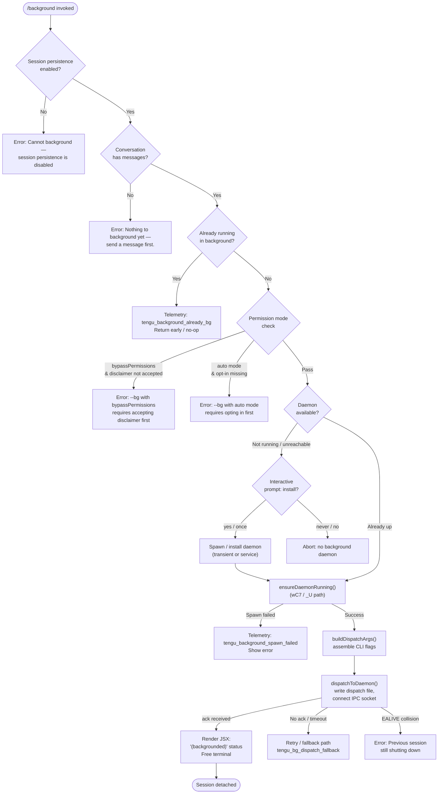

# `/background`

> Analysis basis: CC v2.1.141 bundle.js (AST extraction + Claude interpretation)
> Minimum version: v2.1.141

---

## Overview

`/background` (alias `/bg`) detaches the current interactive Claude Code session from the terminal and continues it as a background daemon job, freeing the terminal for other use. It validates prerequisites (daemon availability, permission mode, session persistence) before forking the session, then dispatches work to a daemon process over a Unix domain socket and renders a JSX status indicator in the terminal.

---

## Registration

| Field | Value |
|---|---|
| type | `local-jsx` |
| name | `background` |
| description | `Continue this session in the background and free the terminal` |
| aliases | `["bg"]` |
| module\_id | `oIq` |
| load\_inline | `true` |
| loc\_byte | `11897772` |
| loc\_byte\_end | `11897992` |
| loc\_line | `7943` |
| immediate | `null` |
| arbor\_handler.name | `cC7` |
| arbor\_handler.fqn | `claude-2.1.141::cC7` |
| arbor\_handler.kind | `AsyncFunction` |
| arbor\_handler.resolution\_path | `module_id` |
| arbor\_handler.n\_hits | `0` |
| `loc_byte_end` | `11897992` |
| `arbor_handler.name` | `cC7` |
| `arbor_handler.kind` | `AsyncFunction` |
| `arbor_handler.resolution_path` | `module_id` |
| `arbor_handler.fqn` | `claude-2.1.141::cC7` |
| `arbor_handler.n_hits` | `0` |

Analysis basis: CC v2.1.141 bundle.js:+11897772

---

## Input Branching

There are multiple distinct gate checks before dispatch, warranting a flowchart.



---

## Behavioral Spec

### 1. Entry Handler (`cC7`)

The Arbor-resolved handler `cC7` is an `AsyncFunction` reached via `module_id` → `oIq`.

```
async function backgroundCommandHandler(appState, options):

    // Gate 1: session persistence
    if not sessionPersistenceEnabled(appState):
        displayError("Cannot background — session persistence is disabled, ...")
        return

    // Gate 2: non-empty conversation
    if conversationMessages(appState).length == 0:
        displayError("Nothing to background yet — send a message first.")
        return

    // Gate 3: already backgrounded
    if isAlreadyBackgrounded(appState):
        emit telemetry "tengu_background_already_bg"
        return

    // Gate 4: permission mode
    permMode = getCurrentPermissionMode()
    if permMode == "bypassPermissions" and not bypassDisclaimerAccepted():
        displayError("--bg with bypassPermissions requires accepting the disclaimer first. ...")
        return
    if permMode == "auto" and not autoModeOptIn():
        displayError("--bg with auto mode requires opting in first. ...")
        return

    // Proceed to dispatch
    emit telemetry "tengu_background"
    result = await spawnBackgroundJob(appState, options)
    if result.error:
        emit telemetry "tengu_background_spawn_failed"
        displayError(result.error)
    else:
        renderBackgroundedStatus()  // JSX: "(backgrounded)"
```

Analysis basis: CC v2.1.141 bundle.js:+11897138, +11897150, +11897190, +11897204, +11897356

---

### 2. Pre-flight Gate: Permission Mode (`gC7`)

```
function checkPermissionModeGates(flags, settings):
    // Parse "--" separator from flags
    rawArgs = flags.slice(flagIndexOf("--") + 1)

    // Check bypass permissions
    if args include "--permission-mode=bypassPermissions"
       or "--dangerously-skip-permissions"
       or "--allow-dangerously-skip-permissions":
        if not disclaimerAlreadyAccepted(settings):
            return { blocked: true, reason: "bypassPermissions" }

    // Check auto mode
    if permissionMode == "auto" and not autoModeOptIn(settings):
        return { blocked: true, reason: "auto" }

    return { blocked: false }
```

Analysis basis: CC v2.1.141 bundle.js:+11891628, +11891672, +11891703, +11891735, +11891781, +11891872, +11892014, +11892034

---

### 3. Dispatch Argument Assembly (`RC7`)

`RC7` constructs the command-line argument vector that will be passed to the daemon worker process.

```
function buildDispatchArgVector(session, options):
    args = []

    // Agent / name flags
    if options.agent:
        args.push("--agent", agentValue)
    if options.name or options.n:
        args.push("--name", nameValue)

    // Resume flag variants
    if flag starts with "--resume=":
        sessionId = flag.slice(9)         // length 9
    elif flag starts with "-r=":
        sessionId = flag.slice(3)         // length 3
    elif flag == "--resume" or "-r":
        sessionId = nextArg

    // Continue / fork
    if flag == "-c" or "--continue":
        args.push("--continue")
    if flag == "--fork-session":
        args.push("--fork-session")

    // Session ID passthrough
    if flag starts with "--session-id=":
        args.push("--session-id=" + value)
    elif flag == "--session-id":
        args.push("--session-id", nextArg)

    // Mode tagging (repl / slash / resume / prompt / bg)
    args.push("--origin", determineOrigin())

    // Model and effort
    if options.model:
        args.push("--model", modelValue)
    if options.effort:
        args.push("--effort", effortValue)
    else:
        args.push("--effort", "default")

    // Environment variables forwarded (subset)
    forwardEnvVars([
        "CLAUDE_CONFIG_DIR",
        "CLAUDE_INTERNAL_FC_OVERRIDES",
        "AWS_REGION", "AWS_DEFAULT_REGION", "AWS_PROFILE",
        "GOOGLE_APPLICATION_CREDENTIALS",
        "GOOGLE_CLOUD_PROJECT", "GCLOUD_PROJECT"
    ])

    return args
```

Analysis basis: CC v2.1.141 bundle.js:+11876557, +11876601, +11876629, +11876646, +11876656, +11876693, +11876720, +11876730, +11876831, +11876851, +11876867, +11877442, +11894142, +11894164, +11894188, +11892621

---

### 4. Daemon Ensure-Running (`_U`)

```
async function ensureDaemonRunning(config):
    status = getDaemonStatus()     // checks "up" / "down"
    emit "daemon_ensure_running"

    if status == "up":
        return { ok: true }

    if serviceExecPathStale():
        emit telemetry "tengu_bg_daemon_service_stale_exec"
        log warning "daemon service exec path is stale (binary deleted) — falling back to transient spawn."
        // fall through to transient

    platform = detectPlatform()   // "macos" / "linux" / "windows"

    if config.permissionMode == "ask":
        emit telemetry "tengu_bg_daemon_cold_start_ask"
        answer = await promptUser("Install as a service now? [y/N/never, or 'once' just for now] ")
        emit telemetry "tengu_bg_daemon_cold_start_ask_answer"
        if answer == "never":
            persistNeverInstall()
            return { ok: false, reason: "user declined" }
        if answer == "no":
            return { ok: false, reason: "No background daemon is running." }
        // yes / once → fall through to install

    if shouldInstallService():
        emit telemetry "tengu_bg_daemon_install"
        installDaemonService(platform)
        // poll up to 5000 ms
        if not daemonReachableWithin(5000):
            return { ok: false, reason: "service installed but the daemon did not become reachable within 5s" }
    else:
        // Transient spawn
        spawnArgs = ["run", "--origin", "transient", "--spawned-by", spawnerId]
        try:
            spawn(claudeBinary, spawnArgs)
        catch EACCES:
            emit telemetry "tengu_bg_daemon_spawn_failed"
            return { ok: false }
        // Poll up to 20000 ms for transient
        if not daemonReachableWithin(20000):
            emit telemetry "tengu_bg_daemon_service_poll_fallthrough" / "daemon_ensure_transient_unreachable"
            return { ok: false }

    return { ok: true }
```

Analysis basis: CC v2.1.141 bundle.js:+11842281, +11842301, +11842321, +11842369, +11842442, +11842688, +11842902, +11843289, +11843347, +11843412, +11843719, +11843748, +11843864, +11843989, +11846747, +11847278, +11847306

---

### 5. Background Dispatch (`rF_`)

`rF_` is the core dispatch function that writes a job description file and connects to the daemon's IPC socket.

```
async function dispatchBackgroundJob(argVector, sessionData, signal):
    jobId = randomBytes(uid)
    dispatchDir = joinPath(jobsDir, jobId)
    mkdir(dispatchDir, mode=0o600)   // octal 384

    // Write dispatch payload atomically
    payloadPath = joinPath(dispatchDir, "cli-bg-dispatch")
    writeFileAtomic(payloadPath, serializeSession(sessionData), mode=0o700)  // octal 448

    // Connect control socket (S$)
    socket = connectControlSocket(daemonSocketPath)
    socket.setTimeout(6000)          // 6 000 ms initial timeout

    // Send dispatch message and await ack
    socket.write(serializeDispatch({ jobId, argVector }))

    ack = await waitForAck(socket, timeoutMs=200)  // "await-ack" phase

    if ack.code == "EALIVE":
        throw error("Previous session is still shutting down — try again in a moment")

    if ack.code == "ESTALE":
        // stale-short path: clean up and retry once
        unlinkDispatchFile(payloadPath)
        emit telemetry "tengu_bg_dispatch_fallback" with reason "stale_short"
        return dispatchBackgroundJob(argVector, sessionData, signal)  // self-recursive retry

    if not ack:
        emit telemetry "tengu_bg_dispatch_fallback" with reason "no ack"
        return { error: "no ack" }

    emit telemetry "tengu_bg_dispatch"
    return { ok: true, jobId }
```

Analysis basis: CC v2.1.141 bundle.js:+11872021, +11872081, +11872133, +11872237, +11872270, +11872278, +11872337, +11872411, +11872482, +11872523, +11872563, +11872714, +11872932, +11872957, +11872964, +11873010, +11873041, +11873137, +11873233, +11873264, +11873439, +11873863

Error codes encountered during dispatch:

| Code | Meaning | Source literal |
|---|---|---|
| `EALIVE` | Prior session still alive — ID collision | bundle.js:+11872584 |
| `ESTALE` | Stale short-lived session | bundle.js:+11872714 |
| `ENOCONN` | Socket not present | bundle.js:+10437389 |
| `ETIMEOUT` | Control socket timed out | bundle.js:+10437546 |
| `ESTARTING` | Daemon still starting | bundle.js:+11873233 |
| `daemon-unreachable` | Daemon not reachable | bundle.js:+11874646 |

---

### 6. Daemon Status Check Before Dispatch (`Q6H`)

```
async function gateCheckDaemonStatus(sessionId):
    uuid = randomUUID().slice(0, 8)   // 8-char job id prefix
    statusFilePath = jobsPath("daemon.status.json")
    mkdir(jobsDir)

    statusResult = readDaemonStatus(statusFilePath)
    if statusResult == "gate_blocked":
        cleanup(jobsDir)
        return { blocked: true }

    return { blocked: false, uuid }
```

Analysis basis: CC v2.1.141 bundle.js:+11876072, +11876112, +11876137, +11876159, +11876174, +11876197, +11581186

---

### 7. JSX Render on Success (`XX8` / `cC7` render path)

After a successful dispatch the command renders a JSX element rather than plain text (registration type is `local-jsx`).

```
function renderBackgroundedStatus(jobId, sessionLabel):
    // Display "(backgrounded)" indicator
    // Sets session display name with "(backgrounded)" suffix
    // Timeout-guard of 120 s for the foreground render loop
    return <BackgroundStatusElement label="(backgrounded)" jobId={jobId} />
```

Relevant literals: `"(backgrounded)"` (bundle.js:+11895221), timeout `120` seconds (bundle.js:+11895028).

Analysis basis: CC v2.1.141 bundle.js:+11894978, +11894991, +11895028, +11895065, +11895079, +11895099, +11895183, +11895186, +11895194, +11895221

---

### 8. Daemon Worker Entry (`cC7` worker side via `$LH`)

When the daemon receives the dispatch and starts its worker, the worker-side entry:

```
function daemonWorkerEntry(taskPayload):
    workerLabel = "daemon-worker"
    taskType    = "task"
    sendDetachRequest()           // "detach-request" message to supervisor
    writeToPipe("background session stopped")
    initializeWorkerSession(taskPayload)
```

Literals: `"daemon-worker"` (bundle.js:+11897138 via `N1`/`pc`), `"task"` (bundle.js:+9988451), `"detach-request"` (bundle.js:+9993617).

Analysis basis: CC v2.1.141 bundle.js:+11897138, +11897190, +11897204

---

## State & Side Effects

| Item | Detail |
|---|---|
| Telemetry: `tengu_background` | Fired on every valid `/background` invocation (bundle.js:+11894570) |
| Telemetry: `tengu_background_already_bg` | Fired when session is already running in background (bundle.js:+11897152) |
| Telemetry: `tengu_background_spawn_failed` | Fired when daemon spawn/dispatch fails (bundle.js:+11894501) |
| Telemetry: `tengu_bg_daemon_cold_start_ask` | Fired when user is asked whether to install daemon (bundle.js:+11843347) |
| Telemetry: `tengu_bg_daemon_cold_start_ask_answer` | Fired with user's answer to install prompt (bundle.js:+11846822) |
| Telemetry: `tengu_bg_daemon_install` | Fired on daemon service install (bundle.js:+11842782) |
| Telemetry: `tengu_bg_daemon_service_stale_exec` | Fired when installed service binary is stale (bundle.js:+11842399) |
| Telemetry: `tengu_bg_daemon_service_poll_fallthrough` | Fired when service poll loop falls through (bundle.js:+11843023) |
| Telemetry: `tengu_bg_daemon_spawn_failed` | Fired on transient spawn EACCES/failure (bundle.js:+11843781) |
| Telemetry: `tengu_bg_dispatch` | Fired on successful IPC dispatch (bundle.js:+11874051) |
| Telemetry: `tengu_bg_dispatch_fallback` | Fired on dispatch retry/fallback (bundle.js:+11874577) |
| Telemetry: `tengu_bg_dispatch_rescued` | Fired when a stale/failed dispatch is rescued (bundle.js:+11879166) |
| Telemetry: `tengu_amber_anchor` | Fired from background-service path (bundle.js:+11880218 via `bC7`) |
| Telemetry: `tengu_config_parse_error` | Fired on config read failure during dispatch setup (bundle.js:+3143249) |
| Telemetry: `tengu_daemon_config_reload` | Fired when daemon reloads its config (bundle.js:+14478760) |
| File system | Creates `jobs/<uuid>/` directory (mode `0o600`) and dispatch payload file (mode `0o700`); cleaned up on failure |
| IPC socket | Connects to daemon control socket; sends dispatch frame; waits ≤ 6 000 ms for ack, then ≤ 200 ms for job ack |
| appState changes | Marks session as backgrounded; attaches "(backgrounded)" label; stops foreground render loop after 120 s |
| Terminal | Frees the interactive terminal after successful dispatch |
| Hook registration | None observed at depth ≤ 2 |
| Sound | None observed |

---

## Version History

| Version | Change |
|---|---|
| v2.1.141 | Initial analysis |

---

## Common Mistakes

1. **Invoking `/background` before sending any message** — the command will reject with "Nothing to background yet — send a message first." At least one conversation turn must exist.
2. **Using `--dangerously-skip-permissions` without prior interactive acceptance** — the disclaimer must have been accepted in a previous interactive session before `/background` with bypass permissions is allowed.
3. **Using `auto` permission mode without opt-in** — run `claude --permission-mode auto` once interactively before using `/background` in auto mode.
4. **No daemon available and declining install** — answering "no" or "never" to the install prompt aborts the backgrounding. "never" also suppresses future prompts permanently.
5. **Immediate retry after a backgrounded session is closing** — the `EALIVE` error means the prior session's socket is still live; wait a moment and retry.
6. **Session persistence disabled** — Claude Code project configurations that disable session persistence (e.g., stateless SDK wrappers) cannot use `/background`; the session would have nothing to resume.

---

## Appendix — Identifier Mapping

> For bundle debugging only. Identifiers change across versions.

| Identifier | Role |
|---|---|
| `cC7` | Main `/background` command handler (AsyncFunction, Arbor-resolved) |
| `PX8` | Background command top-level executor (assembles flags, calls dispatch) |
| `Q6H` | Daemon status gate check; generates job UUID prefix |
| `RC7` | Dispatch argument vector builder |
| `rF_` | Core background dispatch function (writes dispatch file, IPC connect) |
| `_U` | Daemon ensure-running orchestrator |
| `zG6` | Daemon service install / ask-user flow |
| `pD8` | Persistent daemon socket connection handler |
| `S$` | Transient IPC control socket connector |
| `gC7` | Permission mode pre-flight gate checker |
| `lIq` | `--resume` flag parser (handles `--resume=`, `-r=`, `--resume`, `-r`) |
| `QC7` | `--continue` / `-c` flag recognizer |
| `BC7` | `--session-id` flag parser |
| `nIq` | `--fork-session` and session-id flag handler |
| `FC7` | Origin / mode tagging flag builder |
| `dC7` | Dispatch metadata assembler |
| `nF_` | Dispatch payload path-bearing argument sanitizer |
| `pIq` | Dispatch ack state machine |
| `YNH` | Dispatch file path builder |
| `XX8` | JSX render path for backgrounded status |
| `cC7` | Also: daemon worker entry (re-used symbol, worker side) |
| `$LH` | Detach-request sender (daemon worker initialization) |
| `JJH` | Environment / mode classifier for production vs. test |
| `N1` | Daemon-worker label resolver |
| `E1q` | Task-type resolver for daemon worker |
| `Fi` | Output pipe writer for "background session" messages |
| `qg_` | Settings loader (called during pre-flight) |
| `cL` | Config context accessor |
| `b9` | Settings store updater (add/delete/assign) |
| `wB` | Permission-mode reader with debug logging |
| `v` | Log/debug utility (shared, multi-role) |
| `Q6H` | (see above) |
| `Wc` | Settings merger (userSettings / localSettings / flagSettings / policySettings) |
| `I8` | Settings layer reader |
| `h6` | Config save-with-lock writer |
| `cMH` | Config file reader (enforces access guard) |
| `EhL` | File-watch based config reloader |
| `XTq` | Daemon status file writer |
| `b06` | Daemon status file path resolver |
| `NK` | Jobs directory path resolver |
| `G0` | Base jobs path builder |
| `r1` | Job order/state file reader |
| `df` | Job dispatch file atomic writer |
| `QY` | Atomic file write utility (randomBytes temp name) |
| `d2` | Job cache entry deleter |
| `L1H` | Working/active/daemon state label mapper |
| `uIq` | Argument-vector display formatter (joins with `", "`) |
| `pw` | Background service status display (calls `QMH`) |
| `QMH` | Background-service label renderer |
| `bC7` | Amber-anchor telemetry emitter |
| `jpH` | Background status renderer (calls `E9H`) |
| `E9H` | Wraps `wF` for background status display |
| `zLH` | Terminal detach / session handoff coordinator |
| `e6` | Global config save with auth-loss guard |
| `M9_` | Config save-with-lock implementation |
| `XeA` | Config object merger (Object.assign wrapper) |
| `$CH` | Atomic file write with permission preservation |
| `f9_` | Config file safe-write (uses `$CH`) |
| `IO6` | App-state accessor |
| `DQH` | Display queue helper |
| `PaH` | Background job spawner (calls `_J8`, `BN`) |
| `_J8` | Argument list builder (push/join/slice) |
| `BN` | Background Node process spawner |
| `Sz8` | Message serializer / cache-key hasher |
| `U0` | Full agent query executor (Pyq orchestration entry) |
| `_K7` | Message content block mapper |
| `me1` | Message cache key builder |
| `Y8` | Process lifecycle manager (randomUUID, SIGTERM) |
| `j` | Process registry (write/delete) |
| `J` | Process map (values/kill) |
| `gNH` | Background query runner (calls `Yh_`, `Pyq`) |
| `Yh_` | Session hydrator for background job |
| `Pyq` | Main agent query loop (streaming API calls) |
| `LP` | API client factory |
| `WA` | API endpoint resolver |
| `UM` | Auth/credential handler |
| `m1` | Request builder (Ta/zq/mJ) |
| `nxH` | Network transport layer |
| `w0` | Spawn cleanup handler |
| `TK` | Tool filter (H.filter) |
| `Z$` | Compact boundary detector (Df7/VP) |
| `Df7` | Compact boundary VP wrapper |
| `a3H` | Session snapshot / resume-file builder |
| `V6` | Path utility (basename/join) |
| `T0` | Jobs basename / V6 resolver |
| `kH` | Error logger with queue (aRH push, Oc.logError) |
| `k_` | Error/string normalizer |
| `Vq` | Config merge utility (cMA) |
| `cMA` | Config merge implementation |
| `GvK` | Log queue ring-buffer (kS6 shift/push) |
| `lh` | Array.isArray helper |
| `O` | Stream/output object (b8 accessor) |
| `vY8` | Array some-check utility |
| `Tb` | Tool-blocked detector (WQ/TK) |
| `WQ` | Array/TK dispatch helper |
| `OoH` | String startsWith helper |
| `n$` | Socket no-op wrapper (V6/cL) |
| `mp` | Socket message passthrough (V6/cL) |
| `HNq` | Environment/mode string helper |
| `oS` | Production/test mode selector |
| `qV` | App-state getter |
| `tf` | Boolean coercion helper |
| `SH` | JSON.stringify wrapper |
| `TH` | String coercion wrapper |
| `b6` | JSON.parse wrapper |
| `$8` | M8 (message format) wrapper |
| `M8` | Message formatter |
| `RH` | String constructor wrapper |
| `dC7` | (see above — dispatch metadata) |
| `mU` | Dispatch mutation/update helper |
| `a8` | Child-process spawn with timeout/unref |
| `XpH` | Config path helper |
| `iE9` | Object.entries iterator |
| `WpH` | Date.now timestamp wrapper |
| `F76` | File flag constant |
| `$9_` | Backup path builder (dz.join/p8) |
| `X` | MCP SDK connector |
| `iZq` | Token/cost calculator (Math.max) |
| `Ia` | mfH initializer |
| `p7` | AsyncLocalStorage store getter |
| `GvK` | (see above) |
| `N6` | Context-store accessor (bS6/e8) |
| `bS6` | CS6.getStore / Cd resolver |
| `e8` | Context value extractor |
| `YJH` | Message event dispatcher (p7/M8/zF_/TH/Y1/OF_) |
| `T` | Keyboard/input event handler |
| `G8K` | Heartbeat manager (Ps) |
| `Qh` | Queue helper |
| `Y` | Supervisor/remote-control manager |
| `F` | MCP tool filter (B6/gH) |
| `B6` | Keyboard event handler (p/CH/J/S/JH) |
| `gH` | Orphaned-permission set (V) |
| `zG6` | (see above — daemon service ask/install) |
| `_9_` | Config watch helper |
| `x6` | File existence checker |
| `Y0` | Config directory resolver |
| `Y1` | Config value getter |