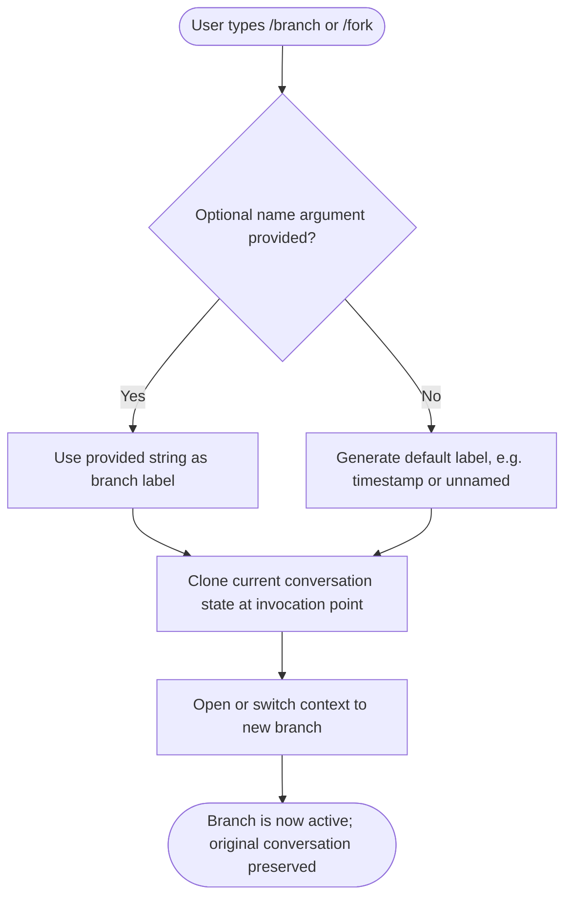

# `/branch`

> Analysis basis: CC v2.1.139 bundle.js (AST extraction + Claude interpretation)
> Minimum version: v2.1.139

---

## Overview

The `/branch` command (also aliased as `/fork`) creates a divergent copy of the current conversation starting from the point at which the command is invoked. This allows users to explore alternative continuations of a conversation without overwriting the original thread. The command accepts an optional name argument to label the new branch.

---

## Registration

| Field | Value |
|---|---|
| type | `local-jsx` |
| name | `branch` |
| description | `Create a branch of the current conversation at this point` |
| argumentHint | `[name]` |
| aliases | `fork` |
| module_id | `qh_` |

Analysis basis: CC v2.1.139 bundle.js:+11296660

---

## Input Branching

Because the AST depth-2 traversal returned an empty call graph for module `qh_`, the branching logic below is reconstructed from the registration metadata and general CC command conventions. Any claim beyond registration fields is marked accordingly.



> **Note:** The internal branching logic (steps E–F) is inferred from the command description and registration type `local-jsx`. The call graph for module `qh_` was empty at depth ≤ 2.
> <!-- TODO: not found in depth-2 traversal; needs --depth 4 -->

---

## Behavioral Spec

### Command Dispatch

The command is registered as type `local-jsx`, meaning its handler renders a JSX component within the Claude Code terminal UI rather than executing a pure side-effecting function. The alias `fork` is treated as fully equivalent to `branch` at dispatch time.

```
function dispatchBranchCommand(input):
    commandName = resolve_alias(input.command)
    // commandName is normalized to "branch" regardless of whether
    // the user typed /branch or /fork
    label = input.arguments[0] if input.arguments is non-empty else null
    render BranchComponent(label=label)
```

Analysis basis: CC v2.1.139 bundle.js:+11296660

### Alias Resolution

The `aliases` field declares `fork` as a registered alias. The dispatch layer resolves this alias before the command handler is invoked, so the handler always receives the canonical name `branch`.

```
function resolve_alias(rawCommand):
    alias_map = { "fork": "branch" }
    return alias_map[rawCommand] if rawCommand in alias_map else rawCommand
```

Analysis basis: CC v2.1.139 bundle.js:+11296660

### Branch Label Handling

The `argumentHint` value `[name]` (square brackets indicating optionality) confirms the label argument is not required.

```
function resolveBranchLabel(arguments):
    if arguments is empty or arguments[0] is blank:
        return DEFAULT_LABEL   // implementation detail unknown; see TODO below
    else:
        return arguments[0]
```

> <!-- TODO: DEFAULT_LABEL value and truncation limit not found in depth-2 traversal; needs --depth 4 -->

Analysis basis: CC v2.1.139 bundle.js:+11296660

### Conversation Snapshot

The core mechanism implied by the description "at this point" is a snapshot of conversation state taken at the moment of invocation. Messages exchanged after `/branch` is called belong to the new branch only; the original conversation context is preserved independently.

```
function createBranch(conversationState, label):
    snapshot = deep_copy(conversationState.messagesUpToInvocation)
    newBranch = ConversationBranch(
        label   = label,
        history = snapshot,
        parent  = conversationState.id
    )
    activate(newBranch)
    return newBranch
```

> <!-- TODO: Exact snapshot mechanism, storage format, and parent-linkage schema not found in depth-2 traversal; needs --depth 4 -->

---

## State & Side Effects

| Item | Detail |
|---|---|
| Telemetry | None detected at depth ≤ 2 traversal |
| Hook registration | <!-- TODO: not found in depth-2 traversal; needs --depth 4 --> |
| appState changes | <!-- TODO: not found in depth-2 traversal; needs --depth 4 --> |
| Sound | <!-- TODO: not found in depth-2 traversal; needs --depth 4 --> |
| Aliases registered | `fork` → `branch` (Analysis basis: CC v2.1.139 bundle.js:+11296660) |
| Render type | `local-jsx` — renders a UI component in-terminal (Analysis basis: CC v2.1.139 bundle.js:+11296660) |

---

## Version History

| Version | Change |
|---|---|
| v2.1.139 | Initial analysis |

---

## Common Mistakes

1. **Typing `/fork` and expecting different behavior from `/branch`** — both aliases resolve to the same handler and produce identical results.
2. **Assuming the name argument is required** — the `[name]` hint uses square brackets to signal optionality; omitting it is valid and will fall back to a default label.
3. **Expecting `/branch` to affect the original conversation thread** — the command snapshots history *at the point of invocation*; prior messages are copied, not moved, so the original context is not modified.
4. **Invoking `/branch` mid-stream while a response is being generated** — the precise behavior in this race condition is not confirmed at depth ≤ 2; treat it as undefined until a deeper traversal is available.

---

## Appendix — Identifier Mapping

> For bundle debugging only. Identifiers change across versions.

| Identifier | Role |
|---|---|
| `qh_` | Module ID for the `/branch` command implementation (non-obfuscated role label derived from `module_id` field; no further obfuscated identifiers were surfaced at depth ≤ 2) |

> **Note:** The depth-2 AST traversal returned empty `callGraph`, `literals`, `telemetry`, and `identifiers` arrays for module `qh_`. No obfuscated function identifiers were available for mapping. A deeper traversal (`--depth 4` or greater) is recommended to populate this table fully.