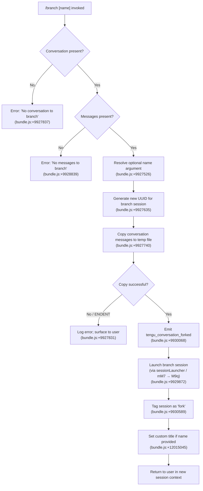

# `/branch`

> Analysis basis: CC v2.1.141 bundle.js (AST extraction + Claude interpretation)
> Minimum version: v2.1.141

---

## Overview

`/branch` (alias `/fork`) creates a divergent copy of the current conversation at its present point in history. It copies the existing conversation's messages into a new session with a fresh UUID, then launches that session so the user can explore an alternate path without disturbing the original thread.

---

## Registration

| Field | Value |
|---|---|
| type | `local-jsx` |
| name | `branch` |
| description | `Create a branch of the current conversation at this point` |
| aliases | `["fork"]` |
| argumentHint | `[name]` |
| module_id | `bR_` |
| load_inline | `true` |
| loc_byte | `11356947` |
| loc_byte_end | `11357141` |
| loc_line | `7041` |
| arbor_handler.name | `mM7` |
| arbor_handler.kind | `AsyncFunction` |
| arbor_handler.resolution_path | `module_id` |
| arbor_handler.fqn | `claude-2.1.141::mM7` |
| arbor_handler.n_hits | `0` |

Analysis basis: CC v2.1.141 bundle.js:+11356947

---

## Input Branching

The command has four distinct branches depending on conversation state:



---

## Behavioral Spec

### Top-level handler — `branchCommandHandler` (`mM7`)

Analysis basis: CC v2.1.141 bundle.js:+9930853

The Arbor symbol graph identifies `mM7` as an `AsyncFunction` reached via `module_id` → `bR_`. It acts as the entry point and delegates immediately to `sessionBranchOrchestrator` (`M9q`).

```
async function branchCommandHandler(context):
    return sessionBranchOrchestrator(context)
```

---

### Session branch orchestrator — `sessionBranchOrchestrator` (`M9q`)

Analysis basis: CC v2.1.141 bundle.js:+9929764

```
async function sessionBranchOrchestrator(context):
    // 1. Retrieve state helpers
    stateReader   = conversationStateReader(context)   // V6
    branchTitle   = resolveBranchTitle(context)        // n$

    // 2. Guard: no active conversation
    if not stateReader.hasConversation():
        throw UserFacingError("No conversation to branch")
        // literal bundle.js:+9927837

    // 3. Perform the file-level copy
    copyResult = fileCopier(context)                   // f9q
    // fileCopier raises on ENOENT or empty messages

    // 4. Find matching session in roster
    existingEntry = roster.find(...)                   // bundle.js:+9929935

    // 5. Parse optional user-supplied name argument
    userLabel = argumentParser(context.args)           // uM7 → bundle.js:+9929441

    // 6. Persist rename metadata if label given
    if userLabel:
        persistRename(sessionId, userLabel)            // Rb  → bundle.js:+9930035

    // 7. Persist agent-name marker
    persistAgentName(sessionId, "fork")                // mKH → bundle.js:+9930053
    // literal "fork" bundle.js:+9930589

    // 8. Emit telemetry
    emit("tengu_conversation_forked")                  // bundle.js:+9930068

    // 9. Record ISO timestamp for the branch event
    timestamp = new Date().toISOString()               // bundle.js:+9930158

    // 10. Resume / attach to new session
    resumeStream(newSession)                           // bundle.js:+9930576

    return branchSessionHandle
```

---

### Conversation file copier — `fileCopier` (`f9q`)

Analysis basis: CC v2.1.141 bundle.js:+9927635

`f9q` performs the low-level I/O to duplicate the current conversation transcript into the branch session's storage path.

```
async function fileCopier(context):
    newSessionId = crypto.randomUUID()                 // bundle.js:+9927635

    // Build source and destination paths
    sourcePath = buildConversationPath(context)        // V6 bundle.js:+9927654
    destDir    = buildBranchDir(newSessionId)          // s3, e8, kk helpers

    // Ensure destination directory exists
    fs.mkdir(destDir, { recursive: true })             // pY8.mkdir bundle.js:+9927691

    // Open source file for reading (utf8, size hint 448)
    readStream = fs.createReadStream(sourcePath, {
        encoding: "utf8",
        highWaterMark: 448                             // bundle.js:+9927722
    })
    // bundle.js:+9927740

    // Wait for 'open' event before proceeding
    // literal "open" bundle.js:+9927799

    // Guard: conversation must exist (ENOENT → surface error)
    on error ENOENT:
        throw UserFacingError("No conversation to branch")

    // Open write stream to destination (highWaterMark: 384)
    writeStream = fs.createWriteStream(destPath, ...)  // bundle.js:+9927886

    // Pipe lines through readline interface
    rl = readline.createInterface(readStream)          // q9q.createInterface bundle.js:+9927980

    lineCount = 0
    for each line in rl:
        writeStream.write(line)
        lineCount++

    // Guard: must have at least one message
    if lineCount === 0:
        cleanup()
        throw UserFacingError("No messages to branch")
        // literal bundle.js:+9928839

    // Signal progress (literal "progress" bundle.js:+9928757)
    emitProgress()

    // Finalize write stream
    writeStream.end()
    await stream.finished(writeStream)                 // K9q.finished bundle.js:+9929249

    return { newSessionId, destPath }
```

Constants used:
- Read encoding: `"utf8"` (bundle.js:+9927773)
- Source chunk size: `448` bytes (bundle.js:+9927722)
- Write chunk size: `384` bytes (bundle.js:+9927932)
- Content type marker: `"text"` (bundle.js:+9927469)
- Default title seed: `"Branched conversation"` (bundle.js:+9927396)

---

### Argument parser / name resolver — `argumentParser` (`uM7`)

Analysis basis: CC v2.1.141 bundle.js:+9929441

```
function argumentParser(rawArgs):
    // Sanitise user-supplied branch name
    sanitised = sanitiseLabel(rawArgs)                 // Sx → H.replace bundle.js:+9929542

    lineNumber = parseInt(firstToken)                  // bundle.js:+9929642
    knownIds.add(lineNumber)
    if knownIds.has(lineNumber):
        return resolvedLabel

    return sanitised or null
```

---

### Session rename persistence — `persistRename` (`Rb`)

Analysis basis: CC v2.1.141 bundle.js:+9930035

When the user provides an optional `[name]` argument, the command persists a `"custom-title"` marker alongside the new session record.

```
function persistRename(sessionId, label):
    conversationLogger(sessionId, label)    // kk  bundle.js:+12015024
    writeLogEntry(sessionId, ...)           // _kH bundle.js:+12015033
    // literal "custom-title" bundle.js:+12015045
    emit("tengu_session_renamed")           // SG6.emit bundle.js:+12015124
    // bundle.js:+12015137
```

---

### Agent-name stamp — `persistAgentName` (`mKH`)

Analysis basis: CC v2.1.141 bundle.js:+9930053

Independently of the title, the command writes the `"fork"` marker to the agent-name slot so the session can be identified as a branch in the roster and UI.

```
function persistAgentName(sessionId, marker):
    conversationLogger(sessionId, marker)   // kk  bundle.js:+12017234
    writeLogEntry(sessionId, ...)           // _kH bundle.js:+12017243
    // literal "agent-name" bundle.js:+12017255
    // literal "fork"        bundle.js:+9930589
    emit("tengu_agent_name_set")            // kg_.emit bundle.js:+12017340
    // bundle.js:+12017353
```

---

### Branch-title builder — `branchTitleBuilder` (`n$`)

Analysis basis: CC v2.1.141 bundle.js:+12015617

```
function branchTitleBuilder(context):
    base  = conversationStateReader()       // V6
    title = conversationLogHelper()         // cL
    return title or "Branched conversation"
    // literal bundle.js:+9927396
```

---

### Conversation name resolver — `conversationNameResolver` (`L9q`)

Analysis basis: CC v2.1.141 bundle.js:+9927448

Locates the matching entry in the session roster and normalises the conversation identifier for use in file paths.

```
function conversationNameResolver(roster, rawId):
    entry = roster.find(e => e.id === rawId)     // _.find  bundle.js:+9927448
    return entry.name.replace(...)               // A.replace bundle.js:+9927526
```

---

## State & Side Effects

| Item | Detail |
|---|---|
| Telemetry — primary | `tengu_conversation_forked` (bundle.js:+9930068) — fired once per successful branch |
| Telemetry — rename | `tengu_session_renamed` (bundle.js:+12015137) — fired when user supplies `[name]` |
| Telemetry — agent name | `tengu_agent_name_set` (bundle.js:+12017353) — fired unconditionally to stamp `"fork"` |
| Telemetry — background infra | Various `tengu_bg_*` events emitted by the session-dispatch layer (not branch-specific) |
| File system | Creates destination directory (recursive `mkdir`) and writes a full copy of the source conversation JSONL file |
| Session roster | Inserts a new session entry tagged `"fork"` and optionally `"custom-title"` |
| appState changes | New session becomes the active session; original session remains unmodified |
| Stream lifecycle | Source `ReadStream` and destination `WriteStream` are both explicitly closed and awaited via `stream.finished` |
| Sound | <!-- TODO: not found in depth-2 traversal; needs --depth 4 --> |
| Hook registration | <!-- TODO: not found in depth-2 traversal; needs --depth 4 --> |

---

## Version History

| Version | Change |
|---|---|
| v2.1.141 | Initial analysis |

---

## Common Mistakes

1. **Branching an empty session** — If no messages have been exchanged yet, the command raises `"No messages to branch"` (bundle.js:+9928839) and exits without creating any files. Start at least one exchange before branching.
2. **Branching outside an active conversation** — If no conversation context is loaded (e.g., invoked in a fresh session that never connected to a conversation), the command raises `"No conversation to branch"` (bundle.js:+9927837).
3. **Name with special characters** — The `[name]` argument is sanitised via regex replacement (bundle.js:+9929542). Characters that do not survive the replacement will be silently stripped; prefer alphanumeric names and hyphens.
4. **Confusing `/branch` with `/fork`** — Both names are fully equivalent (`aliases: ["fork"]`); they invoke the identical handler.
5. **Expecting the original session to change** — `/branch` is non-destructive: the source session is only read, never modified.

---

## Appendix — Identifier Mapping

> For bundle debugging only. Identifiers change across versions.

| Identifier | Role |
|---|---|
| `mM7` | Top-level async handler for `/branch` (arbor_handler) |
| `M9q` | Session branch orchestrator; top-level orchestration logic |
| `f9q` | Conversation file copier; performs ReadStream → WriteStream copy |
| `L9q` | Conversation name resolver; locates roster entry and normalises ID |
| `uM7` | Argument parser; resolves optional user-supplied branch name |
| `Rb` | Session rename persistence; writes `custom-title` log entry |
| `mKH` | Agent-name stamp; writes `"fork"` marker to session agent-name slot |
| `n$` | Branch title builder; derives initial title for new session |
| `cL` | Conversation log helper; low-level log read utility |
| `_kH` | Log-entry writer; appends metadata to conversation log file |
| `kk` | Conversation logger factory |
| `Vf` | Path builder helper used by conversation logger |
| `V6` | Conversation state reader / path provider |
| `s3` | Session storage path helper |
| `e8` | Session ID encoder / helper |
| `Sx` | String sanitiser; regex-replaces special characters in branch names |
| `B1` | String slice helper (indexOf + slice) |
| `UQ` | Autocomplete/suggestion resolver called during session creation |
| `pNH` | Worktree detection utility (called inside `UQ`) |
| `YNq` | File-system directory enumerator for autocomplete |
| `AkH` | Buffer allocation helper |
| `iM` | Internal map/index helper |
| `FB` | Conversation file persistence helper (read/write JSON) |
| `Fq6` | File read/write orchestrator |
| `SH` | JSON serialiser wrapper (`JSON.stringify`) |
| `b6` | JSON parser wrapper (`JSON.parse`) |
| `TH` | String cast helper |
| `RH` | String conversion utility |
| `kH` | Logger / error reporter |
| `k_` | Error constructor helper |
| `Q` | Core logger / output emitter |
| `M8` | Internal message-dispatch helper |
| `H` | Random delay / jitter utility (Math.random + setTimeout) |
| `W` | Background-session task dispatcher |
| `z` | Background-session connection set |
| `Kx` | Graceful shutdown coordinator |
| `L2` | Main agent-loop / hook-runner |
| `K28` | Hook execution engine |
| `tg_` | Pre-tool-use hook dispatcher |
| `sg_` | HTTP hook executor |
| `Ikq` | HTTP hook output parser |
| `q28` | Hook output JSON parser |
| `HQ_` | Hook file/plugin loader |
| `IZ` | Abort-with-timeout helper |
| `w$H` | Background session message formatter |
| `M4` | Background task message builder |
| `SX` | Effort-level resolver for model requests |
| `iE` | Thinking-budget resolver |
| `N6` | API metrics helper |
| `Mo_` | Background session manager / lifecycle controller |
| `NK` | Session-name path joiner |
| `r1` | JSONL session-file reader |
| `cw` | Active-session state checker |
| `df` | Session-state persistence helper |
| `CoH` | Background session heartbeat / timing tracker |
| `jLH` | Session path joiner |
| `hk` | Session-history reader |
| `Fp` | Session-status updater |
| `D` | Spare-session spawner / lifecycle recycler |
| `_o_` | PTY background-process launcher |
| `w` | Background-session dispatch handler |
| `Ao_` | Daemon send-claim (IPC socket writer) |
| `X15` | Claim-send timeout enforcer |
| `P15` | Claim-frame builder |
| `up` | IPC binary frame encoder |
| `j` | Session kill / teardown initiator |
| `N15` | PTY attach / multiplexer session controller |
| `v15` | PTY attach phase manager |
| `qH` | Voice / input session handler |
| `o` | Voice recording finisher |
| `YJH` | Supervisor session closer |
| `iZq` | Supervisor session metrics calculator |
| `G8K` | Heartbeat sender |
| `Ps` | Heartbeat payload builder |
| `T` | Remote-control input handler |
| `p2` | Remote-control configuration loader |
| `m_` | Settings loader |
| `Y` | Daemon session close handler |
| `zF_` | Session-close output flusher |
| `oR` | MCP worker-pool registration helper |
| `ws` | MCP worker shutdown helper |
| `W0H` | MCP worker respawn coordinator |
| `uA_` | MCP worker connection initialiser |
| `SvH` | MCP server connection builder |
| `Eeq` | MCP update applier |
| `XA5` | MCP client-map reconciler |
| `YG6` | Platform memory-pressure checker (macOS) |
| `j6` | Background-session memory guard |
| `xH` | Telemetry event emitter (ok path) |
| `hH` | Telemetry event emitter (bad path) |
| `_XH` | Telemetry field serialiser |
| `p7` | Async-local store reader |
| `YNq` | (see above) |
| `b9` | Observable subscription helper |
| `g` | Permission-classification helper |
| `$f8` | Iron-gate (permission gate) evaluator |
| `nHH` | Permission UI renderer |
| `F` | MCP tool-use permission filter |
| `B6` | Keyboard input filter |
| `gH` | Orphaned-permission set |
| `P` | IPC frame parser / chunker |
| `yf` | IPC frame writer |
| `s6K` | Dispatch-slot lease manager |
| `Lo_` | Lease-record accessor |
| `pw` | Background-service process manager |
| `QMH` | Background-service job-lookup helper |
| `BG` | Project-path builder |
| `XV` | Project sub-path builder |
| `tO` | Path normalisation helper |
| `m$` | Realpath / normalise helper |
| `t7H` | Conversation file line-reader |
| `I15` | PTY column-width calculator |
| `j6H` | Session-journal helper |
| `b` | Idle-exit timer helper |
| `d` | Daemon-timeout helper |
| `c` | PTY write-through helper |
| `l` | PTY filter chain |
| `_Z6` | Raw PTY write helper |
| `$` | IPC socket wrapper |
| `h` | Idle-check helper |
| `Dz8` | Skill/plugin state helper |
| `eHH` | Skill runner |
| `TrH` | Skill cache clearer |
| `bBH` | Hook-presence checker |
| `eg_` | Third-party hook filter |
| `vkq` | Hook verbosity flag |
| `Nkq` | Hook-name normaliser |
| `BLH` | Hook callback result validator |
| `Rm` | Markdown renderer helper |
| `A4H` | Token-count helper |
| `o6H` | Tool-output formatter |
| `kS` | Hook-configuration reader |
| `H28` | Hook-config normaliser |
| `K28` | (see above) |

---

Note: index built via Arbor fallback; some signals (telemetry, literals) may be missing — see arbor-fallback.js.