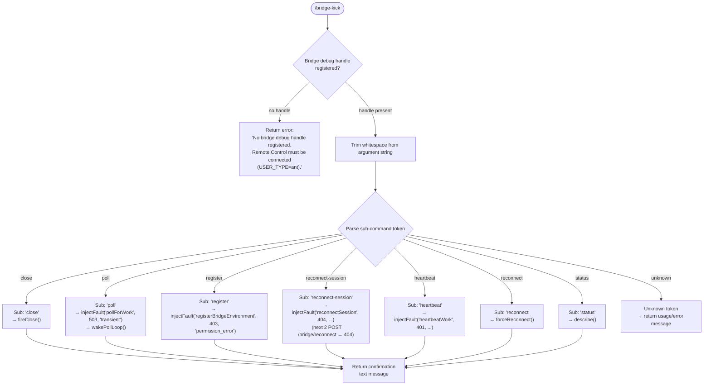

# `/bridge-kick`

> Analysis basis: CC v2.1.132 bundle.js (AST extraction + Claude interpretation)
> Minimum version: v2.1.132

---

## Overview

`/bridge-kick` is a **developer/QA utility** slash command that injects synthetic failure states into the Remote Control bridge layer, enabling manual recovery testing without requiring a real network fault. It accepts a sub-command string selecting which failure mode to arm, then programs the live bridge debug handle accordingly so that the next real bridge operation exercises the target error path. The command is restricted to sessions where `USER_TYPE=ant` (Anthropic-internal) Remote Control is connected.

---

## Registration

| Field | Value |
|---|---|
| type | `local` |
| name | `bridge-kick` |
| description | `Inject bridge failure states for manual recovery testing` |
| supportsNonInteractive | `false` |
| load_inline | `true` |
| handler ident | `Bz7` (resolved via `load_ident` inline shape) |
| `loc_byte_end` | `11273288` |
| `load_ident` | `Bz7` |
| `arbor_handler.name` | `Bz7` |
| `arbor_handler.kind` | `AsyncFunction` |
| `arbor_handler.resolution_path` | `load_ident` |
| `arbor_handler.fqn` | `claude-2.1.132::Bz7` |
| `arbor_handler.n_hits` | `0` |

Analysis basis: CC v2.1.132 bundle.js:+11273104 – +11273288

---

## Input Branching

The handler parses a single positional argument (the sub-command name) and dispatches to one of several fault-injection paths. If no valid bridge debug handle is registered the command aborts immediately with an error message before any dispatch occurs.



---

## Behavioral Spec

### 1. Guard — Bridge Debug Handle Check

```
async function bridgeKickHandler(options):
    rawArg = extractTextArgument(options)           // literal kind "text" @ +11270887
    handle = getBridgeDebugHandle()                 // via B3q @ +11270863

    if handle is null or undefined:
        return errorMessage(
            "No bridge debug handle registered. "  // @ +11270900
            "Remote Control must be connected "
            "(USER_TYPE=ant)."
        )

    subcommand = rawArg.trim()                      // H.trim @ +11270999
    ...
```

Analysis basis: CC v2.1.132 bundle.js:+11270863, +11270887, +11270900, +11270999

---

### 2. Sub-command Dispatch — Numeric Argument Parsing (shared)

Several sub-commands accept an optional numeric parameter (e.g. a custom HTTP status code override). The handler converts the trimmed suffix to a `Number` and validates it with `Number.isFinite` before using it; if the conversion fails the default status code for that sub-command is used.

```
function parseOptionalStatusOverride(tokenRemainder):
    candidate = Number(tokenRemainder)              // @ +11271050
    if Number.isFinite(candidate):                  // @ +11271064
        return candidate
    else:
        return DEFAULT_STATUS_FOR_SUBCOMMAND
```

Analysis basis: CC v2.1.132 bundle.js:+11271050, +11271064

---

### 3. Sub-command: `close`

Arms the bridge to fire a close event immediately.

```
case "close":                                       // literal @ +11271035
    handle.fireClose()                              // A.fireClose @ +11271152
    return confirmationMessage("close armed")
```

Analysis basis: CC v2.1.132 bundle.js:+11271035, +11271152

---

### 4. Sub-command: `poll`

Injects a **transient** (axios-rejection) fault into the next `pollForWork` cycle and then wakes the poll loop so the fault fires immediately rather than on the next natural timer tick.

- Fault type: `"transient"` (bundle.js:+11271281)
- Target operation: `"pollForWork"` (bundle.js:+11271322)
- Injected HTTP status: `503` (bundle.js:+11271360)
- Confirmation message paraphrased: next poll will throw a transient axios rejection; poll loop woken (bundle.js:+11271410)

```
case "poll":                                        // literal @ +11271266
    handle.injectFault(                             // A.injectFault @ +11271300
        operation  = "pollForWork",
        statusCode = 503,
        faultKind  = "transient"
    )
    handle.wakePollLoop()                           // A.wakePollLoop @ +11271374
    return confirmationMessage(POLL_CONFIRM_TEXT)
```

Analysis basis: CC v2.1.132 bundle.js:+11271266, +11271281, +11271300, +11271322, +11271360, +11271374, +11271410

---

### 5. Sub-command: `register`

Arms the next `registerBridgeEnvironment` call to return HTTP 403 with error type `permission_error`, simulating a permission-denied failure during environment registration.

- Target operation: `"registerBridgeEnvironment"` (bundle.js:+11271910)
- Injected HTTP status: `403` (bundle.js:+11271958)
- Fault error type: `"permission_error"` (bundle.js:+11271972)
- Confirmation message paraphrased: next `registerBridgeEnvironment` will 403; trigger with close/reconnect (bundle.js:+11272020)

```
case "register":                                    // literal @ +11271854
    handle.injectFault(
        operation  = "registerBridgeEnvironment",
        statusCode = 403,
        faultKind  = "permission_error"
    )
    return confirmationMessage(REGISTER_CONFIRM_TEXT)
```

Analysis basis: CC v2.1.132 bundle.js:+11271854, +11271910, +11271958, +11271972, +11272020

---

### 6. Sub-command: `poll` — fatal variant

The `poll` path also supports a `fatal` fault variant (distinct from `transient`). When the parsed token selects fatal mode:

- Fault error types observed: `"not_found_error"` (bundle.js:+11271614), `"authentication_error"` (bundle.js:+11271632)
- Injected HTTP status: `404` (bundle.js:+11271610)
- Fault kind string: `"fatal"` (bundle.js:+11271704)

```
case "poll-fatal" (or fatal flag within poll):
    handle.injectFault(
        operation  = "pollForWork",
        statusCode = 404,
        faultKind  = "fatal",
        errorType  = "not_found_error" | "authentication_error"
    )
    handle.wakePollLoop()
    return confirmationMessage(POLL_FATAL_CONFIRM_TEXT)
```

Analysis basis: CC v2.1.132 bundle.js:+11271610, +11271614, +11271632, +11271704

---

### 7. Sub-command: `reconnect-session`

Arms the next **two** `POST /bridge/reconnect` calls to return HTTP 404, exercising the fallthrough from doReconnect Strategy 1 to Strategy 2.

- Target operation: `"reconnectSession"` (bundle.js:+11272378)
- Injected HTTP status: `404` (bundle.js:+11271610, reused)
- Repeat count: **2** calls (bundle.js:+12264283 — literal `2` in helper `H`)
- Confirmation message paraphrased: next 2 POST /bridge/reconnect calls will 404; Strategy 1 falls through to Strategy 2 (bundle.js:+11272478)

```
case "reconnect-session":                           // literal @ +11272329
    handle.injectFault(
        operation   = "reconnectSession",
        statusCode  = 404,
        repeatCount = 2
    )
    return confirmationMessage(RECONNECT_SESSION_CONFIRM_TEXT)
```

The repeat-count value of `2` is produced by helper function `randomIntHelper` (identifier `H`), which uses `Math.random` and `setTimeout` internally — indicating the count may have a stochastic or deferred component in some code paths.

Analysis basis: CC v2.1.132 bundle.js:+11272329, +11272378, +11272478, +12264283, +12264285, +12264322

---

### 8. Sub-command: `heartbeat`

Injects an HTTP 401 fault into the next `heartbeatWork` operation, simulating an authentication expiry during heartbeat.

- Target operation: `"heartbeatWork"` (bundle.js:+11272646)
- Injected HTTP status: `401` (bundle.js:+11272613)
- Sub-command token: `"heartbeat"` (bundle.js:+11272583)

```
case "heartbeat":                                   // literal @ +11272583
    handle.injectFault(
        operation  = "heartbeatWork",
        statusCode = 401
    )
    return confirmationMessage(HEARTBEAT_CONFIRM_TEXT)
```

Analysis basis: CC v2.1.132 bundle.js:+11272583, +11272613, +11272646

---

### 9. Sub-command: `reconnect`

Calls `forceReconnect()` on the bridge debug handle, immediately triggering the full `reconnectEnvironmentWithSession()` flow. This is a live action, not a fault arm; the effect is immediate.

- Confirmation message paraphrased: `reconnectEnvironmentWithSession()` called; watch debug.log (bundle.js:+11272917)

```
case "reconnect":                                   // literal @ +11272860
    handle.forceReconnect()                         // A.forceReconnect @ +11272879
    return confirmationMessage(RECONNECT_CONFIRM_TEXT)
```

Analysis basis: CC v2.1.132 bundle.js:+11272860, +11272879, +11272917

---

### 10. Sub-command: `status`

Calls `describe()` on the bridge debug handle and returns its output as the command's text response, allowing the operator to inspect the current state of any armed faults before they fire.

```
case "status":                                      // literal @ +11272983
    description = handle.describe()                 // A.describe @ +11273017
    return textMessage(description)
```

Analysis basis: CC v2.1.132 bundle.js:+11272983, +11273017

---

## State & Side Effects

| Item | Detail |
|---|---|
| Telemetry | None detected in this command (telemetry array is empty) |
| Bridge debug handle | Read from global registry via `getBridgeDebugHandle()` (`B3q`); no write to the registry itself |
| `injectFault` side effect | Writes a pending fault into the bridge layer that fires on the next matching operation; consumed (one-shot) after firing, except for the `reconnect-session` case which is consumed after **2** calls |
| `fireClose` side effect | Immediately fires a close event on the bridge connection |
| `wakePollLoop` side effect | Sends a wakeup signal to the poll-loop timer so the injected fault fires without waiting for the next natural poll interval |
| `forceReconnect` side effect | Immediately invokes `reconnectEnvironmentWithSession()`; not deferred |
| `describe` side effect | Read-only inspection; no state mutation |
| appState changes | None detected at depth-2 traversal |
| Sound | None detected |
| Non-interactive | `supportsNonInteractive: false` — the command must be invoked in an interactive session |

---

## Version History

| Version | Change |
|---|---|
| v2.1.132 | Initial analysis — 7 sub-commands documented: `close`, `poll`, `register`, `reconnect-session`, `heartbeat`, `reconnect`, `status` |

---

## Common Mistakes

1. **Running outside `USER_TYPE=ant` sessions.** The bridge debug handle is only registered when Remote Control is connected with an Anthropic-internal user type. Invoking `/bridge-kick` in a standard user session returns the "No bridge debug handle registered" error immediately and performs no action.

2. **Expecting `injectFault` to fire instantly (except `poll`).** For `register`, `reconnect-session`, and `heartbeat` sub-commands, the fault is *armed* but does not fire until the corresponding bridge operation is naturally invoked (e.g. a close/reconnect cycle for `register`). Only the `poll` sub-command additionally calls `wakePollLoop()` to trigger immediate execution.

3. **Forgetting the `reconnect-session` fault is consumed over 2 calls.** The fault count is 2, so two consecutive `POST /bridge/reconnect` requests will each see a 404 before the bridge resumes normal behaviour.

4. **Confusing `reconnect` (live action) with `reconnect-session` (fault injection).** The `reconnect` sub-command calls `forceReconnect()` immediately; it does not arm a fault. Use `reconnect-session` to stage a 404 fault and then use `reconnect` (or a natural reconnect trigger) to fire it.

5. **Using `/bridge-kick` in non-interactive mode.** `supportsNonInteractive` is `false`; the command will not be dispatched from CI pipelines or headless invocations.

6. **Omitting the sub-command argument entirely.** Without a valid sub-command token the handler falls through to the unknown-token path and returns a usage/error message without modifying any bridge state.

---

## Appendix — Identifier Mapping

> For bundle debugging only. Identifiers change across versions.

| Identifier | Role |
|---|---|
| `Bz7` | Main async handler for `/bridge-kick`; resolved via `load_ident` inline shape (resolution path: `load_ident`) |
| `B3q` | `getBridgeDebugHandle` — retrieves the registered bridge debug handle from the global registry |
| `H` | `randomIntHelper` (or deferred-fault scheduler) — uses `Math.random` and `setTimeout`; involved in computing repeat-count for `reconnect-session` fault |
| `A` | Bridge debug handle instance — exposes `fireClose`, `injectFault`, `wakePollLoop`, `forceReconnect`, `describe` |