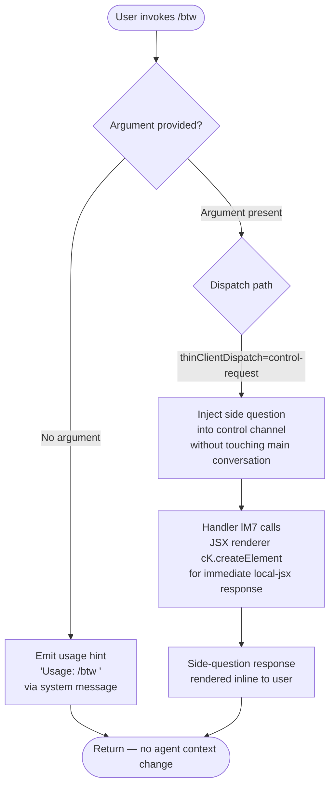

# `/btw`

> Analysis basis: CC v2.1.141 bundle.js (AST extraction + Claude interpretation)
> Minimum version: v2.1.141

---

## Overview

`/btw` ("by the way") is a lightweight slash command that lets the user inject a quick side question into Claude Code without disrupting the flow of the primary conversation thread. It dispatches the question as a `control-request` to the thin-client layer and returns a `local-jsx` rendered response immediately (the `immediate: true` flag), keeping the main agent context intact.

---

## Registration

| Field | Value |
|---|---|
| type | `local-jsx` |
| name | `btw` |
| description | Ask a quick side question without interrupting the main conversation |
| argumentHint | `<question>` |
| immediate | `true` |
| thinClientDispatch | `control-request` |
| module_id | `z9q` |
| load_inline | `true` |
| loc_byte | `9936641` |
| loc_byte_end | `9936880` |
| loc_line | `5548` |
| arbor_handler.name | `lM7` |
| arbor_handler.fqn | `claude-2.1.141::lM7` |
| arbor_handler.kind | `AsyncFunction` |
| arbor_handler.resolution_path | `module_id` |
| arbor_handler.n_hits | `0` |

Analysis basis: CC v2.1.141 bundle.js:+9936641

---

## Input Branching

Three distinct branches exist based on the user's input to the command:



Analysis basis: CC v2.1.141 bundle.js:+9936239 (usage string), +9936278 (system role), +9936347 (JSX render call)

---

## Behavioral Spec

### Entry Point — Async Handler (`lM7`)

The Arbor-resolved handler `lM7` (an `AsyncFunction`, resolved via `module_id` path through module `z9q`) is the top-level entry for the command.

```
async function handleBtwCommand(args, context):
    if args is empty or blank:
        emitSystemMessage("Usage: /btw <your question>")
        return

    sideQuestion = args.trim()

    // Dispatch as a control-request, bypassing the main conversation agent
    response = await dispatchControlRequest(sideQuestion, context)

    // Render response immediately using local-jsx JSX element factory
    return renderJSX(sideQuestion, response)
```

Analysis basis: CC v2.1.141 bundle.js:+9936237 (call to `H`), +9936301 (call to `e6`), +9936347 (`cK.createElement`)

---

### Usage Guard (`H` — random jitter utility)

When called from `lM7`, the utility referenced as `H` introduces a small timing jitter using `Math.random` and `setTimeout`. This is used for rate-smoothing or anti-collision purposes on the control-request path, not for any user-visible branching.

```
function jitterDelay(baseMs):
    // Generates a random delay between 1× and 2× baseMs
    multiplier = 1 + Math.random()   // range [1, 2)
    delay = baseMs * multiplier
    setTimeout(callback, delay)
```

Constants observed: multiplier lower bound `1` (bundle.js:+12516072), upper bound factor `2` (bundle.js:+12516056).

Analysis basis: CC v2.1.141 bundle.js:+12516058 (`Math.random`), +12516095 (`setTimeout`)

---

### Config Save Path (`e6` → `M9_` → `cMH`)

After the side question is dispatched, the call graph shows that `lM7` invokes `e6`, which fans out into a chain responsible for persisting any updated configuration state that may have been touched during the dispatch. This is a shared utility path used across multiple commands.

```
async function saveConfig(context):
    baseDir = resolveConfigDir(context)           // M9_: dirname, mkdirSync
    acquireConfigLock(baseDir)                    // M9_: lock with Date.now timeout
    if lockContentionDetected:
        emitTelemetry("tengu_config_lock_contention")
        logWarning("Lock acquisition took longer than expected...")

    existingConfig = readConfigFile(baseDir)      // cMH: readFileSync, utf-8
    if authLossWouldOccur(existingConfig, cache):
        emitTelemetry("tengu_config_auth_loss_prevented")
        logWarning("saveConfigWithLock: re-read config is missing auth...")
        return  // Refuse to write; protect auth credentials

    if staleWriteDetected:
        emitTelemetry("tengu_config_stale_write")

    backupConfig(existingConfig)                  // cMH: copyFileSync, backups dir
    writeConfigAtomic(newConfig)                  // cMH: writeFileSync + renameSync
    releaseConfigLock(baseDir)
```

Key literals:
- Lock warning message: `"Lock acquisition took longer than expected - another Claude instance may be running"` (bundle.js:+3140579)
- Auth-loss guard message: `"saveConfigWithLock: re-read config is missing auth that cache has; refusing to write to avoid wiping ~/.claude.json. See GH #3117."` (bundle.js:+3140995)
- Config access guard: `"Config accessed before allowed."` (bundle.js:+3142612)
- File encoding: `"utf-8"` (bundle.js:+3142695)
- Backup directory name: `"backups"` (bundle.js:+3142180)
- Backup file marker: `".backup."` (bundle.js:+3141465)
- Max backup rotation count: `5` (bundle.js:+3141598)
- Config file permissions mask: `384` (octal `0600`) (bundle.js:+3141880)
- Lock timeout: `60000` ms (bundle.js:+3141349)

Analysis basis: CC v2.1.141 bundle.js:+3137670 (`e6`→`M9_`), +3137851 (`e6`→`cMH`), +3140395 (`L.mkdirSync`), +3142668 (`q.readFileSync`)

---

### Global Config Fallback Guard (`e6` → `F76`)

A secondary auth-loss guard runs on the global config save path, distinct from the local config path:

```
function saveGlobalConfigFallback(cache, reReadConfig):
    if reReadConfig is missing auth that cache has:
        logWarning("saveGlobalConfig fallback: re-read config is missing auth that cache has; refusing to write. See GH #3117.")
        return  // Refuse to overwrite
    proceedWithWrite(reReadConfig)
```

Literal: `"saveGlobalConfig fallback: re-read config is missing auth that cache has; refusing to write. See GH #3117."` (bundle.js:+3137877)

Analysis basis: CC v2.1.141 bundle.js:+3137867 (`e6`→`F76`)

---

### JSX Response Rendering

`lM7` ends by calling `cK.createElement` to produce the local-jsx output. Because `immediate: true` is set on the registration, the rendered element is returned to the CLI shell immediately without awaiting the main conversation agent loop.

```
function renderBtwResponse(question, answer):
    element = createElement(BtwResponseComponent, {
        question: question,
        answer: answer
    })
    return element   // displayed inline; does not mutate main conversation
```

Analysis basis: CC v2.1.141 bundle.js:+9936347

---

### Background Session Dispatch Infrastructure (`w`)

The `thinClientDispatch: "control-request"` path ultimately touches the background session manager (`w`). Key behavior observed at depth 2:

```
function backgroundSessionDispatch(request):
    session = sessionMap.get(sessionId)

    // Memory pressure check
    freeMemMB = os.freemem() / 1024
    if freeMemMB < LOW_MEM_THRESHOLD:
        emitTelemetry("tengu_bg_dispatch_low_mem")

    // SIGKILL escalation if session unresponsive
    if sessionUnresponsive after 30s:
        session.kill("SIGKILL")
        setTimeout(escalationHandler, 15_000)
        emitTelemetry("tengu_bg_dispatch_sigkill_escalate")

    // Spare session management
    if spareSessionAvailable:
        emitTelemetry("tengu_bg_spare_claim")
        claimSpareSession()
    else if spareClaimFailed:
        emitTelemetry("tengu_bg_spare_claim_fail")

    // Spawn new background session if needed
    spawnProcess(daemonArgs)
    emitTelemetry("tengu_bg_spare_enable")
```

Constants:
- SIGKILL escalation window: `30` seconds (bundle.js:+14465058), with `15` s grace (bundle.js:+14465069)
- Memory unit divisor: `1024` bytes per KB (bundle.js:+14465576)
- Session signal: `"SIGKILL"` (bundle.js:+14465151)
- Spare label: `"spare"` (bundle.js:+14465817)

Analysis basis: CC v2.1.141 bundle.js:+14465103, +14465413, +14465682, +14466297, +14466418, +14466681

---

## State & Side Effects

| Item | Detail |
|---|---|
| Telemetry: `tengu_config_lock_contention` | Emitted when config file lock acquisition exceeds expected time (bundle.js:+3140668) |
| Telemetry: `tengu_config_stale_write` | Emitted when a stale write to config is detected and aborted (bundle.js:+3140804) |
| Telemetry: `tengu_config_parse_error` | Emitted when the config file cannot be parsed (bundle.js:+3143249) |
| Telemetry: `tengu_config_auth_loss_prevented` | Emitted when a write that would erase auth credentials is blocked (bundle.js:+3141147) |
| Telemetry: `tengu_bg_dispatch_sigkill_escalate` | Emitted when background session escalated to SIGKILL (bundle.js:+14465103) |
| Telemetry: `tengu_bg_dispatch_low_mem` | Emitted when free memory falls below threshold during dispatch (bundle.js:+14465682) |
| Telemetry: `tengu_bg_spare_enable` | Emitted when a spare background session is enabled (bundle.js:+14466297) |
| Telemetry: `tengu_bg_spare_claim` | Emitted when the spare session is successfully claimed (bundle.js:+14466418) |
| Telemetry: `tengu_bg_spare_claim_fail` | Emitted when claiming the spare session fails (bundle.js:+14466681) |
| Hook registration | None observed in depth-2 traversal |
| appState changes | No direct appState mutation; side question dispatched via control-request channel only |
| Config file | May write updated config atomically via `writeFileSync` + `renameSync`; protected against auth-loss (bundle.js:+3140995) |
| Config backup | Creates timestamped backup in `backups/` subdirectory, retaining up to 5 copies (bundle.js:+3142180, +3141598) |
| Config permissions | Written with mode `0600` (octal 384) (bundle.js:+3141880) |
| Sound | None observed |
| Main conversation context | Not modified; `thinClientDispatch: "control-request"` bypasses main agent loop |

---

## Version History

| Version | Change |
|---|---|
| v2.1.141 | Initial analysis |

---

## Common Mistakes

1. **Forgetting the argument**: Invoking `/btw` with no text simply emits the usage hint `"Usage: /btw <your question>"` and returns — no question is sent. Always include the question text immediately after the command.
2. **Expecting main-thread context**: `/btw` dispatches via a `control-request` channel and does **not** have access to the current main conversation's context window. Complex questions that require prior conversation history should be asked in the main thread instead.
3. **Assuming synchronous response**: Although `immediate: true` causes the rendered element to appear quickly, the underlying handler is an `AsyncFunction` (`lM7`). Network latency or background-session startup can still introduce delays.
4. **Confusing `/btw` with a persistent note**: The command is stateless from the main conversation's perspective — it neither reads from nor writes to the main conversation history.
5. **Triggering config lock contention**: If another Claude Code instance is running simultaneously and both attempt to write config, the `tengu_config_lock_contention` event is emitted and a warning is logged. This is expected behavior but can slow the response.

---

## Appendix — Identifier Mapping

> For bundle debugging only. Identifiers change across versions.

| Identifier | Role |
|---|---|
| `lM7` | Main async handler for `/btw` command (Arbor-resolved via module_id `z9q`) |
| `H` | Jitter/delay utility using `Math.random` + `setTimeout` |
| `e6` | Config save orchestrator; fans out to `M9_`, `cMH`, `F76`, and others |
| `M9_` | Low-level config file writer with lock acquisition and backup rotation |
| `_` | Filesystem utility (path resolution, `readdirStringSync`, `statSync`) |
| `x6` | Path existence / access check utility |
| `L` | Filesystem module wrapper (mkdirSync, copyFileSync, statSync, unlinkSync, readdirStringSync) |
| `q` | Secondary filesystem module (readFileSync, mkdirSync, statSync, copyFileSync, readdirStringSync, renameSync, unlinkSync) |
| `f` | Promise/async finalizer; calls `A.close`, `q.close` on completion |
| `XeA` | Config object factory; calls `Dr8` and `Object.assign` |
| `Dr8` | Config field initializer; calls `PeA` |
| `v` | HTTP/API request builder; handles headers, method, body serialization |
| `J7K` | Request dispatch helper; calls `zV`, `w7K`, `Qt_` |
| `SH` | JSON serializer wrapper (`JSON.stringify`) |
| `t7` | URL/path string manipulation utility (replace, at, lastIndexOf, slice) |
| `MSH` | Model/API string builder; calls `M6A` |
| `X7K` | File upload handler; computes `Buffer.byteLength`, calls `S6A`, `Dv6`, `P7K` |
| `Q` | Shared state/context accessor |
| `M8` | Error construction/formatting utility |
| `cMH` | Config read-and-backup handler; reads with `readFileSync`, writes backup via `copyFileSync` |
| `b6` | JSON parse wrapper (`JSON.parse`) |
| `DR` | String prefix stripper (`startsWith` + `slice`) |
| `rE9` | Directory scanner; reads directory entries filtered by prefix |
| `kH` | Error aggregator; logs errors via `Oc.logError`, collects into `aRH` |
| `$9_` | Path joiner; combines `dz.join` with `p8` |
| `w` | Background session manager; handles spawn, SIGKILL escalation, memory checks |
| `F76` | Global config fallback guard; prevents auth-loss on global config write |
| `A` | Case-normalizer utility (`f.toLowerCase`) |
| `Z` | String prefix checker (used in config directory scanning) |
| `X` | MCP/SDK connection manager; handles `connected`/`failed` states, `Promise.all` |
| `gT8` | MCP transport initializer |
| `k_` | Error type factory (wraps `Error` and `String`) |
| `V` | Array/buffer slice helper |
| `$CH` | Atomic file writer with symlink resolution, temp file, `fchmodSync`, `fsyncSync`, `renameSync` |
| `O` | File stat wrapper; checks `isSymbolicLink` |
| `$8` | Error code helper; uses `M8` |
| `XpH` | Context or config snapshot accessor (called from `e6`) |
| `iE9` | Entry iterator over config object (`Object.entries`) |
| `WpH` | Timestamp recorder; uses `Date.now` |
| `f9_` | File write helper; calls `$CH` for atomic writes |

---

Note: index built via Arbor fallback; some signals (telemetry, literals) may be missing — see arbor-fallback.js.