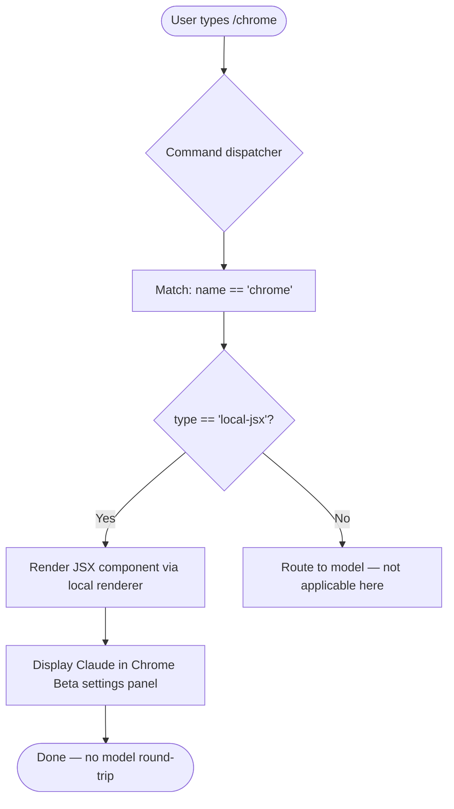

# `/chrome`

> Analysis basis: CC v2.1.133 bundle.js (AST extraction + Claude interpretation)
> Minimum version: v2.1.133

---

## Overview

The `/chrome` command is a settings-access slash command that opens or displays the **Claude in Chrome (Beta)** configuration panel within the Claude Code CLI. It is registered as a `local-jsx` command, meaning its output is rendered as a local JSX component rather than routed to the model as a prompt. The command provides users with a direct entry point into browser-extension integration settings.

---

## Registration

| Field | Value |
|---|---|
| type | `local-jsx` |
| name | `chrome` |
| description | `Claude in Chrome (Beta) settings` |
| module_id | `_Oq` |

Analysis basis: CC v2.1.133 bundle.js:+11322547

---

## Input Branching

Because the depth-2 call graph traversal returned no call edges and no literal constants were found in the implementation, detailed branching logic within the command handler cannot be verified from the extracted data.

<!-- TODO: not found in depth-2 traversal; needs --depth 4 -->

The following flowchart represents the minimal verified behavior based on the `local-jsx` type classification:



Analysis basis: CC v2.1.133 bundle.js:+11322547

---

## Behavioral Spec

### Settings Panel Rendering

Because the command type is `local-jsx`, execution never sends a message to the Claude model. Instead, the CLI dispatcher invokes the associated JSX component directly and renders it in the terminal UI.

```
function handleChromeCommand(inputArgs):
    // No argument parsing literals were found in the extracted data
    // The command is dispatched purely by name match
    component = resolveLocalJsxComponent(commandName = "chrome")
    renderInTerminalUI(component)
    // No telemetry events are emitted (none found in extraction)
    // No model prompt is constructed or sent
    return RENDERED
```

Analysis basis: CC v2.1.133 bundle.js:+11322547

### Local JSX Dispatch Contract

Commands registered with `type: "local-jsx"` follow a distinct execution path from `prompt`, `tool`, or `ui` typed commands. The dispatcher resolves the component from the module identified by `module_id` (`_Oq`) and mounts it as an interactive terminal UI element.

```
function dispatchLocalJsx(registration):
    module = loadModule(registration.module_id)   // module_id = "_Oq"
    component = module.defaultExport()
    mount(component, context = currentTerminalPane)
```

<!-- TODO: not found in depth-2 traversal; needs --depth 4 -->
Internal props passed to the component, any sub-navigation within the settings panel, and persistence behavior are not resolvable from the depth-2 traversal.

Analysis basis: CC v2.1.133 bundle.js:+11322547

---

## State & Side Effects

| Item | Detail |
|---|---|
| Telemetry | None found — no `tengu_*` events were detected in the depth-2 traversal |
| Hook registration | <!-- TODO: not found in depth-2 traversal; needs --depth 4 --> |
| appState changes | <!-- TODO: not found in depth-2 traversal; needs --depth 4 --> |
| Model round-trip | None — `local-jsx` type bypasses the model entirely |
| Sound | <!-- TODO: not found in depth-2 traversal; needs --depth 4 --> |
| Persistence | <!-- TODO: not found in depth-2 traversal; needs --depth 4 --> |

Analysis basis: CC v2.1.133 bundle.js:+11322547

---

## Version History

| Version | Change |
|---|---|
| v2.1.133 | Initial analysis — command registered as `local-jsx`, module `_Oq`, described as "Claude in Chrome (Beta) settings" |

---

## Common Mistakes

1. **Expecting a model response**: Because `/chrome` is typed `local-jsx`, it never sends a message to Claude. Users who type `/chrome` expecting a generated answer about browser integration will instead see a settings UI panel.
2. **Assuming argument support**: No argument-parsing literals were found in the extraction. Passing additional text after `/chrome` may be silently ignored or unsupported; behavior with arguments is unverified at depth-2 traversal.
3. **Confusing Beta status with instability of the command itself**: The description labels the feature "Beta," which refers to the Claude in Chrome browser extension, not to the slash command registration mechanism itself.
4. **Looking for telemetry confirmation**: No `tengu_*` events are emitted by this command at the verified traversal depth, so usage cannot be confirmed via telemetry logs at this time.

---

## Appendix — Identifier Mapping

> For bundle debugging only. Identifiers change across versions.

| Identifier | Role |
|---|---|
| `lY7` | Primary implementation symbol for the `/chrome` command — likely the exported handler function or JSX component factory registered under module `_Oq` |