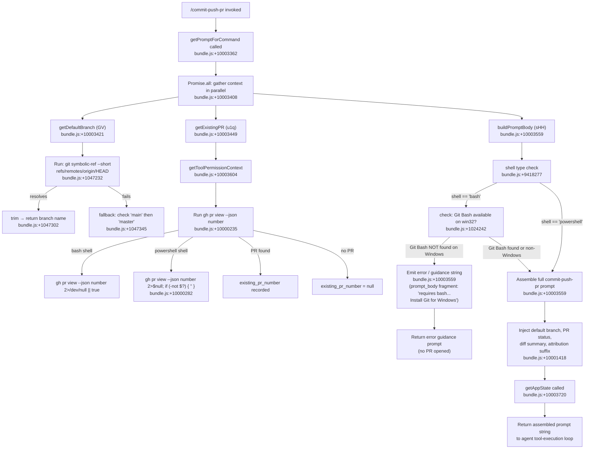

# `/commit-push-pr`

> Analysis basis: CC v2.1.141 bundle.js (AST extraction + Claude interpretation)
> Minimum version: v2.1.141

---

## Overview

`/commit-push-pr` is a `prompt`-type slash command that instructs the Claude Code agent to stage and commit all pending changes, push the branch to the remote, and open a pull request — all in a single invocation. The command builds its prompt via `getPromptForCommand`, gathers the current Git context (default branch, existing PR status, staged diff summary) in parallel before constructing the instruction string, and hands control to the agent's normal tool-execution loop.

---

## Registration

| Field | Value |
|---|---|
| type | `prompt` |
| name | `commit-push-pr` |
| description | `Commit, push, and open a PR` |
| loc_byte | `10003158` |
| loc_byte_end | `10003899` |
| loc_line | `5691` |
| handler_method | `getPromptForCommand` |
| handler_method_start | `10003362` |
| handler_method_end | `10003898` |
| prompt_body.length | `203` characters |
| prompt_body.trace | `call→sHH(...) (1 literals)` |
| arbor_handler.name | `getPromptForCommand` |
| arbor_handler.fqn | `claude-2.1.141::getPromptForCommand` |
| arbor_handler.kind | `Method` |
| arbor_handler.resolution_path | `direct` |
| arbor_handler.n_hits | `4` |

Analysis basis: CC v2.1.141 bundle.js:+10003158

---

## Input Branching

The handler has **4+ distinct paths** driven by shell type, existing-PR detection, and platform checks. A Mermaid flowchart is required.



---

## Behavioral Spec

### 1. Handler Entry — `getPromptForCommand`

The Arbor-resolved handler (`getPromptForCommand`, `direct` resolution, 4 hits) is an inline `ObjectMethod` on the registration object.

```
async function getPromptForCommand(context):
    [defaultBranch, existingPR, promptBody] = await Promise.all([
        resolveDefaultBranch(context),          // GV
        resolveExistingPR(context),              // u1q
        buildCommitPushPrPrompt(context)         // sHH
    ])
    appState = context.getAppState()             // _.getAppState
    toolPermCtx = context.getToolPermissionContext() // _.getToolPermissionContext
    return promptBody
```

Analysis basis: CC v2.1.141 bundle.js:+10003362

---

### 2. Default Branch Resolution — `resolveDefaultBranch` (`GV`)

```
async function resolveDefaultBranch(context):
    cached = branchCache.get("defaultBranch")    // Du8 → C_H.get; literal "defaultBranch" @ +1036531
    if cached is not null:
        return cached

    result = await runGit([
        "symbolic-ref", "--short",               // literals @ +1047207, +1047222
        "refs/remotes/origin/HEAD"               // literal @ +1047232
    ])

    if result succeeds:
        branch = result.trim()                   // _.trim @ +1047302
        branchCache.set("defaultBranch", branch)
        return branch

    // Fallback: probe well-known default branch names
    for candidate in ["main", "master"]:         // literals @ +1047345, +1047352
        exists = await runGit([
            "show-ref", "--verify", "--quiet",   // literals @ +1047414, +1047425, +1047436
            "refs/heads/" + candidate
        ])
        if exists:
            branchCache.set("defaultBranch", candidate)
            return candidate

    return null
```

Analysis basis: CC v2.1.141 bundle.js:+10003421 (call site), +1047165 (GV body)

---

### 3. Existing PR Detection — `resolveExistingPR` (`u1q`)

Calls the sub-function `m1q` (string-replacement / normalization helper) and `YK` (current-directory resolver).

```
async function resolveExistingPR(context):
    shellType = determineShell(context)          // mvH → xfH path

    if shellType == "powershell":                // literal @ +9418523
        cmd = "gh pr view --json number 2>$null; if (-not $?) { \"\" }"
        // literal @ +10000282
    else:  // bash
        cmd = "gh pr view --json number 2>/dev/null || true"
        // literal @ +10000235

    output = await runShellCommand(cmd, context)
    prNumber = parseJsonField(output, "number")
    return prNumber  // null if no PR found
```

Analysis basis: CC v2.1.141 bundle.js:+10003449 (call site), +9999353 (u1q body), +10000235, +10000282

---

### 4. Shell-Type Determination — `determineShell` (`mvH` / `xfH` / `gi8`)

```
function determineShell(context):
    // xfH: check if model name ends with known suffix → v1
    // gi8: re-uses xfH check
    // mvH: orchestrates; calls m1 (model resolver) and p_ (settings loader)
    if context.shellOverride:
        return context.shellOverride

    if platform == "win32":                      // literal @ +1024242
        if gitBashAvailable():
            return "bash"                        // literal @ +9418277
        else:
            return "powershell"                  // literal @ +9418523

    return "bash"
```

Analysis basis: CC v2.1.141 bundle.js:+9695521 (mvH), +2146548 (xfH), +2147200 (gi8)

---

### 5. Prompt Body Construction — `buildCommitPushPrPrompt` (`sHH`)

`sHH` is the sole literal-bearing call in `prompt_body.trace`. It assembles the instruction string the agent receives.

```
async function buildCommitPushPrPrompt(context):
    shell = determineShell(context)              // via Mm/YK helpers

    // Guard: bash required but Git Bash absent on Windows
    if shell == "bash" AND platform == "win32" AND NOT gitBashAvailable():
        return ERROR_MESSAGE
        // fragment: "requires bash (`shell: bash` in frontmatter)
        //            but Git Bash was not found. Install Git for Windows
        //            (https://git-scm.com/downloads/win), or change the
        //            skill's frontmatter to `shell: powershell`."
        // Full message @ bundle.js:+10003559 via sHH

    // Gather diff summary for context
    diffSummary = await runGit(["diff", "--cached", "--name-status"])
    // literals "diff", "--cached", "--name-status" @ +6658696, +6658703, +6658714

    // Build attribution suffix (conditional)
    attributionSuffix = ""
    if attributionEnabled(context):
        attributionSuffix = ", ending with the attribution text shown in the example below"
        // literal @ +10001418

    // Assemble final prompt string (≈203 chars core)
    prompt = assembleInstructions(
        defaultBranch   = resolvedDefaultBranch,
        existingPR      = resolvedPRNumber,
        diffSummary     = diffSummary,
        shell           = shell,
        attribution     = attributionSuffix
    )

    // Replace escape sequences in prompt text
    // tH8 → H.replace @ +4757171
    // Bt1: trim/join helper for multi-part prompt @ +9419094
    // s17: applies Bt1 + TH (string coercion) @ +9419177

    return prompt
```

Analysis basis: CC v2.1.141 bundle.js:+10003559 (sHH call site), +9418286 (sHH body)

---

### 6. Tool Execution Dispatch — `dispatchToolCall` (`eD`)

After the prompt is returned to the agent, tool calls flow through `eD`, which:

1. Reads `appState` via `A.getAppState` (bundle.js:+9776876).
2. Evaluates permission rules via `T57` (permission checker, bundle.js:+9776834).
3. Checks sandbox flags: `U_.isSandboxingEnabled`, `U_.isAutoAllowBashIfSandboxedEnabled` (bundle.js:+9773836, +9773862).
4. Invokes the auto-mode classifier pipeline `vJ6` when mode is `auto` (bundle.js:+9779551).
5. Records tool result via `tFH` → `fr9` → `fOH` (writes file if non-text content present, bundle.js:+4757876).
6. Updates `appState` via `qoH` → `H.setAppState` (bundle.js:+9771302).

```
async function dispatchToolCall(toolName, input, context):
    appState = context.getAppState()
    permResult = checkPermissions(toolName, input, appState)  // T57

    if permResult == "deny":
        return { denied: true, reason: permResult.reason }

    if permResult == "ask":
        if context.isHeadless:
            abort("Action requires interactive approval...")
            // literal @ +9777678
        else:
            userDecision = await promptUser()

    if autoModeEnabled:
        classifierResult = await runAutoModeClassifier(input)  // vJ6
        if classifierResult == "block":
            return { denied: true }

    result = await executeTool(toolName, input)
    persistToolResult(result)                     // tFH / fOH
    context.setAppState(updatedState)             // qoH
    return result
```

Analysis basis: CC v2.1.141 bundle.js:+9776834 (T57), +9779551 (vJ6), +9777678 (headless error)

---

### 7. PR Attribution

A debug string `"PR Attribution: returning default (no data)"` is present at bundle.js:+9698251, indicating that when PR data cannot be fetched the handler falls back gracefully rather than erroring.

```
function prAttribution(prData):
    if prData is null or empty:
        log.debug("PR Attribution: returning default (no data)")
        return defaultAttributionText
    return buildAttributionFromPR(prData)
```

Analysis basis: CC v2.1.141 bundle.js:+9698251

---

### 8. Memory / Context Injection (`z8q` / `K77` / `_P_`)

Before the prompt is sent, the handler optionally prepends memory and file-context items:

```
async function injectContextItems(messages, context):
    // K77: enumerate loaded memory keys
    memoryKeys = Array.from(contextMap.keys())           // K77 @ +9696784
    // _P_: for each memory file, resolve content + metadata
    for key in memoryKeys:
        content = await resolveMemoryFile(key)           // _P_ → ZzH → ZY1
        messages.unshift(content)

    // literals: "memory" @ +9698326, "memories" @ +9698335
    return messages
```

Analysis basis: CC v2.1.141 bundle.js:+9698050 (K77 call), +9696854 (_P_ call)

---

## State & Side Effects

| Item | Detail |
|---|---|
| Telemetry — `tengu_bg_spare_enable` | Background spare process management, fired during daemon setup (bundle.js:+14464520) |
| Telemetry — `tengu_bg_spare_spawn` | Fires when a new spare background process is spawned (bundle.js:+14464880) |
| Telemetry — `tengu_bg_low_mem_mb` | Emitted when free memory is below threshold on macOS (bundle.js:+11848152) |
| Telemetry — `tengu_cobalt_ridge` | Branch/session tracking event associated with `j6` path (bundle.js:+4632100) |
| Telemetry — `tengu_auto_mode_fallback_to_ask` | Fires when auto-mode classifier degrades to interactive ask (bundle.js:+9777799) |
| Telemetry — `tengu_auto_mode_decision` | Records classifier allow/deny decision (bundle.js:+9778591) |
| Telemetry — `tengu_auto_mode_config` | Emitted with classifier configuration at startup (bundle.js:+8031188) |
| Telemetry — `tengu_auto_mode_malformed_tool_input` | Fires when classifier receives malformed input (bundle.js:+8016776) |
| Telemetry — `tengu_auto_mode_outcome` | Final outcome of auto-mode classifier cycle (bundle.js:+8032048) |
| Telemetry — `tengu_bash_allowlist_strip_all` | Fires when entire Bash allowlist is stripped (bundle.js:+9779899) |
| Telemetry — `tengu_iron_gate_closed` | Fires when auto-mode classifier is entirely unavailable and blocks (bundle.js:+9782425) |
| Telemetry — `tengu_auto_mode_denial_limit_exceeded` | Fires when consecutive/total denial count exceeds limit (bundle.js:+9771756) |
| Telemetry — `tengu_tool_empty_result` | Fires when a tool returns an empty result (bundle.js:+4758956) |
| Telemetry — `tengu_tool_result_persisted` | Fires when a tool result is written to disk (bundle.js:+4759196) |
| Telemetry — `tengu_daemon_config_reload` | Fires when daemon configuration is reloaded (bundle.js:+14478760) |
| Telemetry — `tengu_daemon_control` | Fires on daemon start/stop control events (bundle.js:+14499703) |
| Hook registration | `pOA` registers `exit` and `error` listeners on the spawned process via `H.on` (bundle.js:+1019705, +1019757) |
| appState changes | `qoH` calls `H.setAppState` after each tool result is applied (bundle.js:+9771302) |
| File I/O | `fOH` may write non-text tool results to a temp file via `eH8.writeFile` (bundle.js:+4757876); `kS1` creates directories and writes transcript files via `oVH.mkdir` / `oVH.writeFile` (bundle.js:+8014994, +8015539) |
| Process lifecycle | `_o_` spawns background PTY host processes via `Bun.spawn` (bundle.js:+14445871); `LOA`/`$OA` kill processes via `H.kill` on timeout or abort (bundle.js:+1012392, +1012949) |
| Sound | `<!-- TODO: not found in depth-2 traversal; needs --depth 4 -->` |
| Literal constant — self-reference | `"/commit-push-pr"` at bundle.js:+10003877 (closing registration string) |

---

## Version History

| Version | Change |
|---|---|
| v2.1.141 | Initial analysis |

---

## Common Mistakes

1. **Running on Windows without Git Bash installed.** If the skill's frontmatter specifies `shell: bash` and Git Bash is not found, the command emits a guidance error instead of opening a PR. Install Git for Windows or change the frontmatter to `shell: powershell`.
2. **No `gh` CLI available.** The existing-PR detection step runs `gh pr view`; if the GitHub CLI is absent or unauthenticated, the command will silently treat the PR as non-existent and attempt to create a new one.
3. **Uncommitted merge conflicts or empty diff.** Because the command stages and commits all changes, running it with unresolved conflicts or a clean working tree may produce an unexpected commit or a `nothing to commit` error from the agent.
4. **Sandbox restrictions blocking Bash.** When sandboxing is enabled without `isAutoAllowBashIfSandboxedEnabled`, the Bash tool calls required for `git` and `gh` will trigger permission prompts or auto-mode classifier evaluation, potentially blocking the workflow in headless mode (bundle.js:+9773836).
5. **Using `/commit-push-pr` as a repeatable automation step.** The PR-detection logic falls back to a default when no data is found (bundle.js:+9698251). In CI/headless scenarios, ensure `gh` is authenticated and the remote is correctly configured; otherwise attribution and PR-linking will silently use defaults.

---

## Appendix — Identifier Mapping

> For bundle debugging only. Identifiers change across versions.

| Identifier | Role |
|---|---|
| `__handler_commit-push-pr` | BFS synthetic entry point for the command handler (not a real bundle symbol) |
| `GV` | `resolveDefaultBranch` — queries `git symbolic-ref` and caches result |
| `Du8` | Branch-name cache read helper (reads `"defaultBranch"` key) |
| `M_` | Shell command execution orchestrator (wraps `jXH` process spawner) |
| `jXH` | Core process-spawn function; sets up stdout/stderr streams and exit handling |
| `eOA` | Stream encoding setup helper (utf8, win32 `.exe`/`cmd` paths) |
| `sx8` | stdout stream data handler |
| `tx8` | stderr stream data handler |
| `Hu8` | Stream finalizer / close handler |
| `MOA` | Numeric argument validator (`Number.isFinite`) |
| `CA6` | Command argument builder / error formatter |
| `ax8` | `Reflect.apply`-based wrapper for spawned-process calls |
| `pOA` | Process event listener registrar (`exit`, `error` via `H.on`) |
| `fOA` | Timeout race helper (`setTimeout` / `Promise.race` / `clearTimeout`) |
| `$OA` | Process kill helper (`H.kill` + `q.finally`) |
| `KOA` | Process stdout/stderr collector (bound) |
| `LOA` | SIGTERM sender (bound, `H.kill`) |
| `uOA` | Parallel stream consumer (`Promise.all` over stream readers) |
| `mA6` | Buffered-data string assembler |
| `bOA` | Pipe-setup helper (`A.pipe`) |
| `xOA` | Stream-add helper (`SOA.default`, `A.add`) |
| `DOA` | Stream-bind factory (`Fx8.bind`) |
| `D` | Top-level tool-execution dispatcher / session manager |
| `j6` | Session/branch tracking function (updates `gMH`, `R76`, `OF` sets) |
| `$` | Disposable resource manager (`XTq`) |
| `YG6` | macOS memory-check helper (`c6` + `j6`) |
| `_o_` | Background PTY host spawner (`Bun.spawn`, socket setup, `JU.mkdir/unlink`) |
| `Q` | Generic result/queue handler |
| `kH` | Error logger / error-push helper (`Oc.logError`, `aRH.push`) |
| `lkK` | String coercion utility |
| `z8q` | Context-gathering orchestrator for prompt construction (calls `ThH`, `M36`, `iY`, `p_`, `H`, `v`, etc.) |
| `ThH` | Conversation-history accessor |
| `M36` | Message normalizer / formatter |
| `iY` | API-URL / environment resolver (`qA`, `q`, `gM_`) |
| `qA` | API endpoint builder (`kjH`, `nE8`, `dZ6`, `cZ6`, `S_K`, `Uo_`) |
| `q` | Sync file-unlink helper (`n6K.unlinkSync`) |
| `gM_` | Staging/local URL resolver (`M36`, `f64`) |
| `p_` | Settings loader (`ex` → `Fm8`) |
| `ex` | Settings-load wrapper (`rS`, `T1`, `Fm8`, `yV6`) |
| `T1` | Deduplication guard for settings load (`U6A.has/add`, `bx`) |
| `Fm8` | Settings-from-disk reader (policy + flag settings, emits `settings_load_started/completed`) |
| `H` | Jitter-retry helper for API calls (`Math.random`, `setTimeout`) |
| `v` | Model/version info formatter (calls `I66`, `J7K`, `SH`, `t7`, `MSH`, `X7K`) |
| `J7K` | Model identifier parser (`zV`, `w7K`, `Qt_`) |
| `Qt_` | Model tier classifier (`jKK`, `PKK`) |
| `SH` | JSON-stringify wrapper |
| `t7` | Branch/path truncation helper (`T6A`, `H.replace`, `q.at`, `A.lastIndexOf`, `A.slice`) |
| `T6A` | Path-map builder (`$7K.map`) |
| `A` | Lowercase-coercion utility (`f.toLowerCase`) |
| `MSH` | Output-write helper (`M6A` → `H.write`) |
| `X7K` | File I/O orchestrator (reads, appends, renames, manages temp files) |
| `bhH` | Buffered-write scheduler (`clearTimeout`, `setTimeout`, `setImmediate`, `j.join`) |
| `A_H` | Path assembly helper (`I6A`, `$PH.join`, `p8`, `V6`) |
| `Cv8` | EISDIR error handler (`M8`) |
| `y6A` | Join-and-validate path helper |
| `k6A` | File-stat + rename + unlink helper |
| `P7K` | Directory-create + appendFile + rotate helper |
| `b9` | Set-tracking write guard (`jI8.add/delete`, `Object.assign`) |
| `K77` | Context-map key enumerator (`Array.from`, `A.keys`, `Object.keys`) |
| `_P_` | Memory-file resolver (reads file content, computes stat, builds context entries) |
| `ZzH` | Context-type factory (`N6`, `VL`, `e8`) |
| `V6` | Context-entry value wrapper |
| `f` | WebSocket/connection close helper |
| `Y` | Supervisor config update / MCP server lifecycle manager |
| `z` | Daemon stop/control handler (`hH`, `xH`, `oR`, `Kx`) |
| `ZY1` | Memory file metadata extractor (basename, extname, `DW4`/`EY1` extension checks) |
| `TW4` | Diff-context builder (`ZzH`, `M_`, `u_`) |
| `IY1` | Git diff stats parser (`--stat`, `file changed`, `files changed`, `parseInt`) |
| `L` | Promise-queue helper (`q.add/delete`, `f.finally`) |
| `M77` | Conversation-history trimmer (finds last `compact_boundary`, slices, calls `q77`, `f77`) |
| `Vf` | Message-role formatter (`Rd`, `s3`, `e8`, `_$.join`, `V6`) |
| `Rd` | Role string resolver |
| `e8` | Content-block type tagger |
| `gS6` | File line-reader (buffered, handles UTF-8 BOM) |
| `qNK` | Buffer-from-string factory |
| `MNK` | Line-scan helper (indexOf, toString, DXH) |
| `$NK` | Compact-boundary scanner |
| `ONK` | Buffer copy helper (allocUnsafe, copy) |
| `zNK` | Sub-buffer extractor |
| `YNK` | Line finalizer |
| `ZXH` | NDJSON / compact-boundary line parser (`kyK`, `yyK`, `SyK`, `hyK`) |
| `kyK` | Line-type classifier |
| `yyK` | Content-concat helper |
| `SyK` | JSON-parse with substring extraction |
| `hyK` | Single-line JSON parser |
| `K` | Pad-end / map utility for table formatting |
| `q77` | User-message filter (`H.filter`, `A77`) |
| `A77` | Message-trimmer / array-flattener |
| `f77` | Sidechain / meta message filter (`L77.has`, `VS_`) |
| `VS_` | Team-member file checker (`L8q`, `VvH`, `K8q.isTeamMemFile`) |
| `v1` | Model-display-name resolver (`bU6`, `Sw`, `H.includes`, `$I8`, `KP`) |
| `bU6` | Settings-entry resolver (`p_`, `Object.entries`) |
| `Sw` | Model-string normalizer (toLowerCase, includes, replace) |
| `KP` | Model-alias replacement helper |
| `m1` | Model-routing orchestrator (`Ta`, `zq`, `mJ`) |
| `Ta` | Model-tier dispatcher (`qV`, `m8H`, `zA`, `uB`) |
| `uB` | Model-capability resolver (startsWith `anthropic.`, `bU6`, `lxH`, `ItA`, etc.) |
| `zq` | Model-identifier normalizer (`TAH`, `xV`, `nxH`, `bV`, `vtA`, `pf`, `LF6`, `ixH`) |
| `TAH` | Allowlist checker (`GAH.includes`) |
| `xV` | Extended-context flag resolver (`pf`, `DM`) |
| `nxH` | Non-extended model resolver |
| `bV` | Base-model resolver (`pf`, `DM`) |
| `vtA` | Auto-select helper (`bV`) |
| `pf` | Provider-type resolver (`WA`: `firstParty`, `anthropicAws`, `gateway`) |
| `LF6` | Allowlist includes-check helper |
| `ixH` | Boolean-coercion for model field (`RH`) |
| `mJ` | Model-config finalizer (`zq`, `DX`) |
| `DX` | Full model-config assembler (`KA`, `pB`, `ufH`, `rxH`, `bV`, `qP`, `pf`, `WA`, `DM`, `xV`) |
| `kY1` | Opus-model identifier check (`H.includes`) |
| `u1q` | `resolveExistingPR` — detects whether a PR already exists for the branch |
| `mvH` | Shell-detection / prompt-context orchestrator |
| `xfH` | Model-suffix / shell-type checker (`H.endsWith`, `v1`) |
| `gi8` | Reuses `xfH` for secondary shell check |
| `m1q` | Prompt-string escape helper (`H.replace`) |
| `YK` | Current working directory resolver (`c6`, `h_H`) |
| `sHH` | `buildCommitPushPrPrompt` — assembles the full agent instruction string |
| `Mm` | Prompt-part builder (`c6`, `RH`, `mq`, `h_H`, `j6`) |
| `RH` | String coercion (wraps `String`) |
| `mq` | Secondary string coercion |
| `tH8` | Escape-sequence replacer in prompt text |
| `eD` | Tool-call dispatcher (permission check, auto-mode, state update) |
| `T57` | Permission evaluator (sandbox flags, allow/ask/deny rules, `Z7` reason builder) |
| `SP6` | `deny`-rule evaluator (`_LH`, `pS_`, `H_q`) |
| `US_` | `allow`-rule evaluator (`gvH`, `pS_`, `H_q`) |
| `pT` | Sandbox permission gate (`U_.isSandboxingEnabled`, `U_.areUnsandboxedCommandsAllowed`, `D57`) |
| `Z7` | Permission-reason string builder (`A7`, `LoH`, `vt`, `b8`, `x_H`) |
| `ZY8` | Recursive permission-check helper |
| `bQ` | Permission-request accumulator |
| `__q` | Internal permission-state flag |
| `s8q` | Safety-check helper |
| `e8q` | `FvH`/`pS_` evaluation helper |
| `Xz6` | App-state merge helper |
| `qoH` | `setAppState` wrapper (`Object.assign`, `H.setAppState`) |
| `L_q` | Pending-state finalizer |
| `P9` | `Object.hasOwn` + `H.startsWith` attribute checker |
| `uA8` | Tool-input sanitizer |
| `Nx` | Tool metadata resolver |
| `$E_` | Auto-mode gate flag |
| `rq1` | Allow-set adder (`H`, `q.add`) |
| `vJ6` | Auto-mode classifier pipeline orchestrator |
| `hS1` | Classifier state setter (`_.set`) |
| `RS1` | Classifier result transformer (`SS1`) |
| `GS1` | Classifier context builder (`j6`, `m1`) |
| `BF4` | Permission-template renderer |
| `TK` | Tool-input filter (`H.filter`) |
| `yS1` | Tool-input array validator / pusher |
| `xF4` | XML fast-path classifier (`xV8`, `Ti`, `fE_`) |
| `SS1` | Classifier input serializer (`A.get`, `q.toAutoClassifierInput`, `TH`, `TS1`, `SH`) |
| `J` | Process-pool map (values + kill) |
| `Lj` | Token-usage logger (`qOH`, `Ui9`, `g36`, `AZ`) |
| `Ti` | Tool-invocation recorder |
| `fE_` | Auto-mode event emitter (`sVH` → `"auto_mode"`) |
| `rF4` | Fast-path result handler (`uS1`) |
| `nF4` | Full XML two-stage classifier runner |
| `oF4` | Slow-path result handler (`uS1`) |
| `WS1` | Classifier warm-start helper |
| `xS1` | Classifier invocation logger |
| `KKH` | Token/message-array formatter (`Y1`, `Array.isArray`, `TH`, `h2`, `q.filter`) |
| `KE_` | Classifier-context extractor (`IZ`, `iF4`, `gC`, `f`) |
| `AE_` | Additional-evidence builder |
| `zH6` | Context-window overflow guard |
| `qE_` | Evidence-serializer |
| `YS1` | Tool-declaration finder (`H.find`) |
| `JQ` | Classifier outcome reporter (`hH`, `xH`, `Q`) |
| `ff8` | Classifier response parser |
| `DS1` | Schema-safe-parse validator (`_.safeParse`) |
| `pS1` | Prompt-too-long guard (`wf_`) |
| `TH` | String constructor wrapper |
| `kS1` | Transcript file writer (`oVH.mkdir/writeFile`, `aVH.dirname`) |
| `mS1` | Timeout / connection-error classifier (`Ud`, `M8`, `_.toLowerCase`) |
| `OzH` | Deny-set deleter (`H`, `q.delete`) |
| `qF6` | Permission-flag resolver (`bfH` → `dfL`, `QfL`) |
| `bfH` | Flag-reader helper |
| `aeH` | `inputTokens` token-count accessor |
| `Uj` | `outputTokens` token-count accessor |
| `seH` | `cacheReadInputTokens` token-count accessor |
| `teH` | `cacheCreationInputTokens` token-count accessor |
| `CE` | Session-context appender (`j6`) |
| `M_q` | Conversation-state merger |
| `uq1` | Unused-permission pruner |
| `G57` | Permission-count governor (`mq1`, `Q`, `P9`, `v`, `qoH`) |
| `mq1` | Per-type denial counter |
| `f_q` | Final-state committer |
| `W57` | Hook-rewrite permission evaluator (`ALH`, `foH`, `WDH`, `OC`, `eV`, `k_`) |
| `ALH` | Hook-result formatter (`v`, `M4`, `oX`) |
| `foH` | Hook-passthrough check (`v`) |
| `WDH` | Post-hook permission re-evaluator |
| `OC` | Hook-output collector (`ft`) |
| `eV` | Hook-error formatter (`cf`) |
| `k_` | Generic error/string thrower |
| `K_q` | Permission-context finalizer |
| `wj` | Stop-sequence handler (`F_q`) |
| `F_q` | Stop-reason dispatcher (`$`, `M`) |
| `M` | MCP/tool-result value extractor (`SvH`, `Eeq`, `L.get`, `L.values`, `XA5`) |
| `tFH` | Tool-result mapper (`H.mapToolResultToToolResultBlockParam`, `fr9`, `Kr9`) |
| `fr9` | Tool-result block builder (`YA4`, `Q`, `P9`, `Or9`, `zr9`, `fOH`, `$OH`, `MOH`) |
| `YA4` | Result-text trimmer / array checker |
| `Or9` | Array-type result checker |
| `zr9` | Result-reduce aggregator |
| `fOH` | Non-text result persister (`eH8.writeFile`, `l1`, `qr9`, `l36`) |
| `$OH` | Result-size estimator |
| `MOH` | Result-line counter (`l1`) |
| `Kr9` | Token-budget result trimmer (`Number.isFinite`, `j6`, `Math.min`) |
| `Bt1` | Multi-part prompt joiner (trim + push + join) |
| `s17` | Prompt-section finalizer (`Bt1`, `TH`) |

Note: index built via Arbor fallback; some signals (telemetry, literals) may be missing — see arbor-fallback.js.