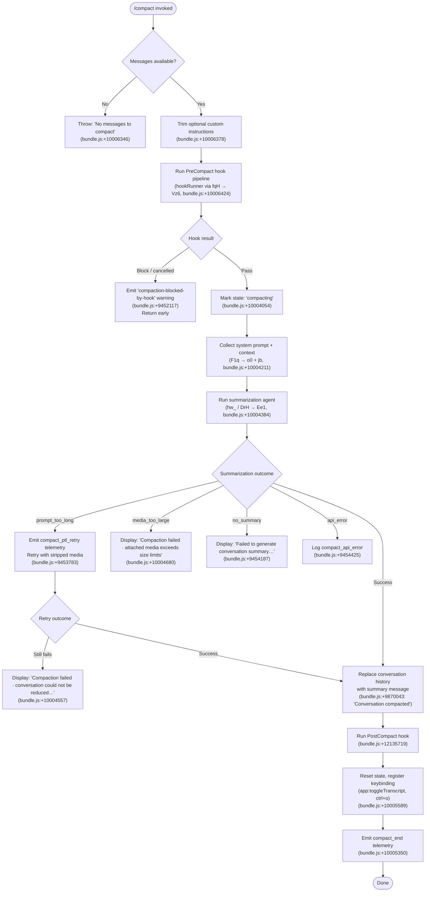

# `/compact`

> Analysis basis: CC v2.1.141 bundle.js (AST extraction + Claude interpretation)
> Minimum version: v2.1.141

---

## Overview

`/compact` frees context window space by summarizing the current conversation into a concise representation that replaces the full message history. It optionally accepts custom summarization instructions, runs PreCompact and PostCompact hooks, and writes telemetry at each major lifecycle stage. The command supports both interactive and non-interactive modes (`supportsNonInteractive: true`).

---

## Registration

| Field | Value |
|---|---|
| type | `local` |
| name | `compact` |
| description | Free up context by summarizing the conversation so far |
| argumentHint | `<optional custom summarization instructions>` |
| supportsNonInteractive | `true` |
| thinClientDispatch | `post-text` |
| module_id | `g1q` |
| load_inline | `true` |
| loc_byte | `10007195` |
| loc_byte_end | `10007508` |
| arbor_handler.name | `e37` |
| arbor_handler.fqn | `claude-2.1.141::e37` |
| arbor_handler.kind | `AsyncFunction` |
| arbor_handler.resolution_path | `module_id` |
| arbor_handler.n_hits | `0` |

Analysis basis: CC v2.1.141 bundle.js:+10007195

---

## Input Branching

The handler has 4+ distinct paths depending on message availability, hook result, summarization outcome, and error type — a flowchart is used.



---

## Behavioral Spec

### 1. Entry Guard — Message Availability

```
async function compactCommandHandler(args, context):
    customInstructions = args.trim()  // bundle.js:+10006378
    messages = context.getMessages()
    if messages is empty:
        throw Error("No messages to compact")  // bundle.js:+10006346
```

Analysis basis: CC v2.1.141 bundle.js:+10006340, +10006346, +10006378

### 2. Auto-Compact Detection (`autoCompactEnabled`)

The handler reads the `autoCompactEnabled` field from app state (literal: `"autoCompactEnabled"` at bundle.js:+9471419) to differentiate manual invocations from automatic threshold-triggered compaction. Telemetry distinguishes these as `compact_manual` vs `compact_auto` (bundle.js:+9452756, +9452771).

```
function classifyCompactionTrigger(appState):
    if appState.autoCompactEnabled and trigger == "threshold":
        return "compact_auto"
    else:
        return "compact_manual"
```

Analysis basis: CC v2.1.141 bundle.js:+9452756, +9452771, +9471419

### 3. PreCompact Hook Pipeline

```
async function runPreCompactHooks(hookRunner, context):
    // hookRunner = fqH → Vz6 → j6 → vi6 chain
    result = await hookRunner("PreCompact", context)  // literal: "PreCompact" at bundle.js:+12105588
    if result.decision == "block":
        emitWarning("compaction-blocked-by-hook")  // bundle.js:+9452117
        return BLOCKED
    return PASS
```

Analysis basis: CC v2.1.141 bundle.js:+10006424, +9452117, +12105588

### 4. State Transition During Compaction

The compaction lifecycle uses three state labels (all literals found in bundle):

| Label | Meaning | loc_byte |
|---|---|---|
| `"hooks_start"` | Pre-compact hooks beginning | +10003998 |
| `"pre_compact"` | Hooks passed, compaction about to start | +10004021 |
| `"compacting"` | Active summarization in progress | +10004054 |
| `"compact_start"` | Summarization agent launched | +10004354 |
| `"compact_end"` | Summarization finished (success or fail) | +10005350 |

```
function setCompactingState(stateManager, label):
    stateManager.setState({ phase: label })  // via xTH → T36.setState
```

Analysis basis: CC v2.1.141 bundle.js:+10004054, +10004967

### 5. Context Collection

```
async function collectCompactionContext(appState, systemPromptFetcher):
    systemPrompt = await systemPromptFetcher.getSystemPrompt()  // jb → H.getSystemPrompt
    promptContext = await buildFullPromptContext(appState)      // o0: assembles memory, env, tools, hooks
    return { systemPrompt, promptContext }
```

`o0` (context assembler) orchestrates memory loading (`uG6`), environment info (`Hm7`, `eu7`), brief context (`fm7`), and tool/permission context (`iu7`). It calls into `bx7.buildCombinedMemoryPrompt` for the memory prompt.

Analysis basis: CC v2.1.141 bundle.js:+10004211, +10005784, +12209810

### 6. Summarization Agent (`hw_` / `DrH`)

The summarization is a nested async agent loop:

```
async function runSummarizationAgent(messages, customInstructions, options):
    // hw_ dispatches via Lj (session slicing) → gA8 (message group processor)
    // DrH is the main summarization driver used in reactive-compact path
    
    messageGroups = sliceMessagesIntoGroups(messages)     // Lj → H.slice
    
    if messageGroups.length < 2:
        log("Reactive compact: fewer than 2 groups, nothing to compact")  // bundle.js:+5370514
        emit("too_few_groups")
        return SKIP
    
    for each group in messageGroups:
        summary = await summarizeGroup(group, customInstructions)
        if summary fails with "prompt_too_long":
            retry with mediaStripped = true               // tengu_compact_ptl_retry
        elif summary fails with "media_too_large":
            retry stripped; if still fails emit "media_unstrippable"
    
    return combinedSummary
```

The summarization agent is instructed with a fixed system prompt fragment beginning with "You are a helpful AI assistant tasked with summarizing conversations." (bundle.js:+9464282). Tool use is explicitly denied during compaction: if a tool call is attempted the agent returns `"deny"` with reason `"Tool use is not allowed during compaction"` (bundle.js:+9462313, +9462328).

Analysis basis: CC v2.1.141 bundle.js:+10004384, +5370514, +9462313, +9464282

### 7. Compact Boundary Marker

A special sentinel message with type `"compact_boundary"` (literal at bundle.js:+9870533) and role `"system"` (bundle.js:+9870511) is inserted at index `[1, 0]` (literals at bundle.js:+9870587, +9870592) to mark where history was replaced.

```
function insertCompactBoundary(messageList, summaryText):
    boundaryMsg = {
        role: "system",
        type: "compact_boundary",
        content: summaryText
    }
    messageList.splice(1, 0, boundaryMsg)  // position [1, 0]
    emit("Conversation compacted")          // bundle.js:+9870043
```

Analysis basis: CC v2.1.141 bundle.js:+9870511, +9870533, +9870587, +9870592

### 8. Error Paths and User-Facing Messages

| Error Condition | User Message | Telemetry | loc_byte |
|---|---|---|---|
| Prompt too long | "Compaction failed · conversation could not be reduced below the context limit" | `tengu_compact_ptl_retry` | +10004557 |
| Media too large | "Compaction failed · attached media exceeds size limits" | — | +10004680 |
| No summary in response | "Failed to generate conversation summary - response did not contain valid text content" | `tengu_compact_failed` | +9454187 |
| API error | "unknown error" (fallback) | `tengu_compact_failed` | +10004805 |
| User cancels | "Compaction canceled." | — | +10006813 |

Analysis basis: CC v2.1.141 bundle.js:+10004557, +10004680, +10004805, +10006813

### 9. PostCompact Cleanup and Hook

```
async function postCompactCleanup(context):
    runPostCompactHooks()          // hook event: "PostCompact" (bundle.js:+12135719)
    clearCaches()                  // oA8 → l8q.clear, Dq1 → jz6.clear + tD_.clear
    resetAutonomousLoopDelivered() // a$4.resetAutonomousLoopDelivered (bundle.js:+5394130)
    registerToggleKeybinding(      // rJ → "app:toggleTranscript", "ctrl+o"
        action="app:toggleTranscript",
        scope="Global",
        key="ctrl+o"
    )
    emitToUI("Compacted " + messageCount)  // bundle.js:+10005728
    emitTelemetry("compact_end")           // bundle.js:+10005350
```

Analysis basis: CC v2.1.141 bundle.js:+5394028, +5394130, +10005350, +10005589, +12135719

### 10. Reactive Auto-Compact Path

When the context window usage crosses a threshold, a reactive auto-compact fires automatically (not user-invoked). The reactive path uses `gA8` (reactive message group processor) and emits distinct telemetry:

- `tengu_reactive_compact_attempt` (bundle.js:+5371237)
- `tengu_reactive_compact_failed` (bundle.js:+5397213)
- `tengu_reactive_compact_succeeded` (bundle.js:+5399106)

The reactive path stores metadata under `"compactMetadata"` key (bundle.js:+10004889) and marks the trigger with label `"compact_reactive"` (bundle.js:+5397429).

Analysis basis: CC v2.1.141 bundle.js:+5371237, +5397213, +5397429, +5399106

---

## State & Side Effects

| Item | Detail |
|---|---|
| Telemetry — compact lifecycle | `tengu_compact` (bundle.js:+9455614), `tengu_compact_failed` (+9465448), `tengu_compact_ptl_retry` (+9453823), `tengu_compact_cache_prefix` (+9453372), `tengu_compact_cache_sharing_success` (+9463089), `tengu_compact_cache_sharing_fallback` (+9463674) |
| Telemetry — reactive compact | `tengu_reactive_compact_attempt` (+5371237), `tengu_reactive_compact_failed` (+5397213), `tengu_reactive_compact_succeeded` (+5399106), `tengu_precomputed_compact_discarded` (+5377608) |
| Telemetry — post compact | `tengu_post_compact_file_restore_success` (+9465930), `tengu_post_compact_file_restore_error` (+9465972), `tengu_repl_hook_finished` (+12139929) |
| Hook registration | PreCompact hook (`"PreCompact"`, bundle.js:+12105588) runs before summarization; PostCompact hook (`"PostCompact"`, bundle.js:+12135719) runs after success |
| appState changes | Phase field cycles through `hooks_start` → `pre_compact` → `compacting` → (cleared); compact boundary inserted at position [1, 0] of message list |
| Cache clearing | `l8q.clear` via `oA8` (bundle.js:+9753909); `jz6.clear` + `tD_.clear` via `Dq1` (bundle.js:+5321363, +5321375) |
| Keybinding registration | `app:toggleTranscript` / `ctrl+o` / scope `Global` registered after success (bundle.js:+10005589, +10005621) |
| Autonomous loop reset | `a$4.resetAutonomousLoopDelivered()` called post-compact (bundle.js:+5394130) |
| Sound | <!-- TODO: not found in depth-2 traversal; needs --depth 4 --> |
| compactMetadata | Written to app state key `"compactMetadata"` after successful compact (bundle.js:+10004889) |
| Tool-use guard | All tool calls during summarization return `"deny"` — `"Tool use is not allowed during compaction"` (bundle.js:+9462328) |

---

## Version History

| Version | Change |
|---|---|
| v2.1.141 | Initial analysis |

---

## Common Mistakes

1. **Running `/compact` on an empty conversation.** The command immediately throws `"No messages to compact"` (bundle.js:+10006346). Ensure at least one exchange exists before invoking.
2. **Expecting tool calls to complete during compaction.** The summarization agent denies all tool use; any pending tool invocations should be resolved before running `/compact`.
3. **Assuming `/compact` and auto-compact are interchangeable.** Manual `/compact` emits `compact_manual` telemetry and can be cancelled by the user; auto-compact (triggered by context threshold) emits `compact_auto` and runs silently.
4. **Not handling PreCompact hook blocking.** If a PreCompact hook returns `"block"`, compaction is silently aborted with a warning. Scripts that rely on compaction succeeding should check for this case.
5. **Expecting conversation history to persist after compaction.** After success, the full message list is replaced by a single summary message with a `compact_boundary` sentinel. Previous messages are not recoverable via the API.
6. **Providing custom instructions that include media.** If media attachments cause the summarization prompt to exceed limits, the first retry strips media. If the prompt is still too long after stripping, compaction fails entirely.

---

## Appendix — Identifier Mapping

> For bundle debugging only. Identifiers change across versions.

| Identifier | Role |
|---|---|
| `e37` | Main async handler for `/compact` command (arbor_handler) |
| `Z$` | Message slicer / conversation group builder |
| `Df7` | Conversation group formatter |
| `VP` | Group validation helper |
| `fqH` | Auto-compact configuration reader |
| `Vz6` | Hook pipeline entry point (PreCompact/PostCompact) |
| `Z_` | Session state accessor |
| `j6` | Hook registry lookup |
| `b76` | Hook registry initializer A |
| `x76` | Hook registry initializer B |
| `Js` | Hook set builder |
| `vi6` | Per-hook deduplication/execution tracker |
| `h6` | Hook execution scheduler |
| `XX` | Model configuration resolver |
| `RH` | String coercion utility |
| `oG` | Token limit calculator |
| `VAH` | Model string normalizer |
| `mc` | Model capability checker (extended context) |
| `v1` | Model family classifier |
| `Uy` | Provider type resolver A |
| `yw` | Provider type resolver B |
| `ZAH` | Extended model config builder |
| `wl6` | Model context window config builder |
| `jw` | Compact argument validator |
| `A98` | Auto-compact threshold evaluator |
| `B0` | Feature flag / app-state config reader |
| `f7` | Global config accessor |
| `ey_` | Auto-compact percentage parser |
| `H$7` | Main compaction orchestrator (called by `e37`) |
| `AZ` | Agent query executor |
| `fK7` | Message normalization pipeline |
| `RFH` | Token counter caller |
| `jh_` | System prompt/context assembler for compaction agent |
| `ug` | MCP server state aggregator |
| `M4` | MCP client builder |
| `SX` | MCP effort/config resolver |
| `iE` | MCP tool permission helper |
| `kk` | MCP tool schema builder |
| `N6` | MCP tool list builder |
| `L2` | Hook execution engine (main) |
| `Rm` | Hook policy settings reader |
| `v` | Role/header normalizer |
| `A4H` | Hook session state builder |
| `HQ_` | Hook filter / query matcher |
| `O` | Background session descriptor |
| `vkq` | Hook verbosity filter |
| `eg_` | Third-party hook filter |
| `Nkq` | Hook name filter |
| `Q` | Generic state/queue accessor |
| `SH` | JSON serializer wrapper |
| `kH` | Hook result log writer |
| `xH` | Hook feature flag accessor |
| `_XH` | Hook flag secondary accessor |
| `IZ` | AbortController / timeout manager |
| `j` | Worker/callback process handle |
| `o6H` | Hook output formatter |
| `kS` | Hook sync executor |
| `H28` | Hook sync state machine |
| `tg_` | MCP tool response handler |
| `q28` | Hook JSON output parser |
| `sg_` | HTTP hook executor |
| `Ikq` | HTTP hook response parser |
| `BLH` | Hook blocklist checker |
| `K28` | Shell hook executor (spawns process) |
| `hH` | Hook feature-ok/bad reporter |
| `K` | Worker thread manager |
| `L` | Task queue / connection tracker |
| `f` | Process/stream handle |
| `M` | MCP server manager |
| `SvH` | MCP server connection handler |
| `Eeq` | MCP update applier |
| `$` | MCP client set accessor |
| `XA5` | MCP server update orchestrator |
| `F1q` | System prompt + conversation collector for compaction |
| `o0` | Full context assembler (memory + env + tools) |
| `DQ_` | App-state deep reader |
| `uO8` | Agent/subagent status collector |
| `p_` | Exec context builder |
| `bu7` | Style/code preference injector |
| `xu7` | PM instruction builder |
| `PQ_` | Context management mode resolver |
| `zm7` | Context-management state builder |
| `BO6` | Job/task loader |
| `uu7` | Task dispatcher |
| `iu7` | Schedule/routine context builder |
| `uG6` | Memory file loader and prompt builder |
| `Hm7` | Environment info (full) builder |
| `eu7` | Environment info (simple) builder |
| `fm7` | Brief-mode check |
| `Om7` | Focus-mode builder |
| `au7` | Agent memory system-prompt injector |
| `cq1` | Computed-context cache runner |
| `gu7` | Growthbook feature-flag context builder |
| `Qu7` | Verified-vs-assumed context resolver |
| `du7` | Duplicate context-management guard |
| `cu7` | Scratchpad/FRC context builder |
| `ru7` | Remote-control context builder |
| `XNq` | Memory-dir disabled check |
| `RMH` | OAuth/auth header builder |
| `jb` | System prompt loader for main thread |
| `aq` | Session accessor |
| `sw` | Session switch helper |
| `Gz8` | Model string formatter |
| `ay_` | Effort-level resolver |
| `hw_` | Reactive-compact main driver |
| `Lj` | Message group slicer (for compact) |
| `qOH` | Usage tracker set checker |
| `Ui9` | Compact usage initializer |
| `g36` | Group slice builder |
| `gA8` | Reactive-compact message group processor |
| `rQH` | Message push helper |
| `dq1` | Gap size calculator |
| `w` | Daemon worker process manager |
| `C$4` | Per-group summarization runner |
| `J` | Background agent process map |
| `b$4` | Fallback gap calculator |
| `V0` | Model + effort resolver (compact agent) |
| `D8` | Diagnostic queue accessor |
| `JK1` | Post-compact state writer / telemetry emitter |
| `u36` | Header entry builder |
| `gTH` | Thinking-block header builder |
| `Mg` | Model metadata reader |
| `G36` | Cache header builder |
| `PhH` | Prompt-header helper |
| `KdH` | Context-length resolver |
| `Iz6` | Random UUID generator |
| `Te` | Tool-set accumulator |
| `e$4` | At-mention / file reference resolver |
| `YzH` | System prompt joiner for compaction |
| `Sw_` | Compact cache-prefix builder |
| `MqH` | Message quota helper |
| `PA8` | Token rounding helper |
| `jA8` | Token counter (human + assistant messages) |
| `gn` | Post-compact cleanup orchestrator |
| `Dm` | Compact context type detector |
| `lA8` | Precomputed compact discarding logic |
| `HK1` | Precomputed compact timing checker |
| `p36` | Permission gate checker |
| `GT` | Global tool-use gate |
| `Ge` | Image/attachment handler |
| `AI8` | Attachment content processor |
| `YI8` | Image format converter |
| `aq1` | Session-start hook runner |
| `Bn` | Branch/session context builder |
| `oA8` | l8q cache clearer |
| `Dq1` | jz6 / tD_ cache clearer |
| `Uj` | Output-token counter resetter |
| `kw_` | Post-compact final state writer |
| `xTH` | App state phase setter (via T36.setState) |
| `B1q` | UI notification builder for compact success |
| `VnH` | Model variant display builder |
| `bg4` | Model label/icon resolver |
| `rJ` | Keybinding registrar |
| `Da6` | Keybinding action registry lookup |
| `wa6` | Keybinding platform adapter |
| `zOH` | OTEL metrics emitter |
| `$L` | OTEL span builder |
| `MV8` | OTEL attribute setter |
| `AgH` | OTEL metric recorder |
| `GH6` | OTEL gauge recorder |
| `Bt` | State-set helper (post-compact) |
| `bn9` | State-set executor |
| `DrH` | Compact summarization session driver |
| `lQH` | Compact message limit enforcer |
| `BA8` | Message text trimmer |
| `Y8` | Message ID generator |
| `Ee1` | Summarization agent event loop |
| `Ir1` | Interval heartbeat initializer |
| `Vr1` | Interval response handler |
| `wZ` | Agent turn executor |
| `Yw_` | Tool-permission context builder during compact |
| `G` | Agent pool / task registry |
| `um` | Random-bytes generator |
| `We` | Compact context wrapper |
| `lC` | Subagent exit handler |
| `bA8` | Media size guard |
| `$zH` | Compact abort flag checker |
| `UA8` | Compact stream handler |
| `D` | Daemon process record |
| `h$4` | Fork-agent queue processor |
| `jw_` | Compact token budget calculator |
| `LqH` | Max output token resolver |
| `SMH` | Model-specific output token capper |
| `dt` | Token value parser/validator |
| `VT` | Last assistant message finder |
| `lh` | Array content type checker |
| `V` | Streaming response accumulator |
| `s8H` | Status message emitter |
| `vX6` | Tool search mode decider |
| `__` | Underscore utility wrapper |
| `ujH` | Tool search feature flag |
| `MZH` | Model tool-search compatibility checker |
| `AvH` | Tool availability inspector |
| `$h_` | Tool search mode classifier |
| `tq7` | Tool search threshold evaluator |
| `Jw_` | Message content flattener |
| `FA8` | Attachment stripper for retry |
| `Vq7` | Message content filter (compact) |
| `Iq7` | Tool-result normalizer |
| `IX6` | Tool-result content extractor |
| `oy_` | Recursive content walker |
| `je1` | Surrogate-pair char handler |
| `niH` | Compact notification injector |
| `Yh_` | Synthesis block parser |
| `Pyq` | Main query/request pipeline |
| `U0` | Message normalization and tool-tracking pipeline |
| `m57` | Tool-result block builder |
| `g57` | Content-type classifier group |
| `AR_` | Attachment reference rebuilder |
| `Q57` | Tool-result dedup checker |
| `S` | Rate-limit / blur state tracker |
| `vY8` | Tool-tracking set updater |
| `s57` | UUID-tagged tool-use builder |
| `ZW` | Compact message writer |
| `hZ_` | History trimmer |
| `NY8` | Message normalization entry |
| `Ep` | Tool-use permission checker |
| `fR_` | Tool-result content mapper |
| `p57` | Tool-result presence checker |
| `N` | Away-summary generator |
| `T` | Remote-control input handler |
| `U57` | Tool-result content validator |
| `PL` | Permission level resolver |
| `wAq` | Message walk helper |
| `c57` | Content-block compacter |
| `Y` | Terminal/renderer update handler |
| `a_q` | Queue/accumulation helper |
| `t57` | Tool-result text joiner |
| `W` | Skills/event bus handler |
| `d57` | Message normalization token counter |
| `DJ6` | Thinking-block orphan filter |
| `Jf7` | Trailing thinking-block filter |
| `YJ6` | Whitespace-only assistant message filter |
| `jf7` | Empty assistant content fixer |
| `l57` | Message list normalizer |
| `o_q` | Message list tail trimmer |
| `s_q` | Message tail appender |
| `F57` | Content-block every-filter |
| `q` | File/session state map |
| `X` | MCP connection pool |
| `gT8` | MCP client getter |
| `k_` | Error string builder |
| `Xe1` | Context-size trimmer for compact retry |
| `aBH` | Cache-prefix validator |
| `KTH` | Content-block type validator |
| `wf_` | Cache-prefix parser |
| `tl` | Cache prefix start-check |
| `sA8` | File-reference attachment resolver |
| `vq7` | File-path deduplicator |
| `ai6` | Tool-name prefix checker |
| `oA` | File-path normalizer/resolver |
| `kq7` | File-reference builder |
| `a2` | File content reader |
| `I0H` | CLAUDE.md / memory file reader |
| `dk_` | At-mention file processor |
| `WrH` | At-mention permission checker |
| `iS6` | File existence checker |
| `kpH` | Tool-name extractor (for at-mention) |
| `x6` | File-read executor |
| `AA7` | PDF reference handler |
| `DI` | OTEL at-mention span |
| `JXH` | File size calculator |
| `H7` | String index helper |
| `$9` | UUID generator (la1.randomUUID wrapper) |
| `Z5` | Token counter (rounds) |
| `_98` | Local-agent task attachment processor |
| `S3` | Task file path builder |
| `ZiH` | Task directory resolver |
| `tA8` | Plan file reference processor |
| `m0` | File content with metadata builder |
| `$8` | M8 error type checker |
| `H98` | Local-agent file attachment builder |
| `eA8` | Image/binary attachment processor |
| `sV8` | Attachment cache setter |
| `Nq7` | Image slice/resize helper |
| `zzH` | Tool-use permission set builder |
| `lk_` | Allowed/denied tool set diffuser |
| `z` | Daemon process descriptor |
| `P` | Stdio stream reader |
| `W9` | Tool permission gate |
| `sE` | Tool search enablement flag |
| `AdH` | Tool permission context builder |
| `QY_` | Permission query builder |
| `mq` | String coercion (String wrapper) |
| `t1H` | Team-tool permission filter |
| `dnH` | Denied tool name set builder |
| `_LH` | MCP tool flat-mapper |
| `zO6` | Tool name filter (case-insensitive) |
| `l88` | Tool name case matcher |
| `gY_` | Tool group label builder |
| `ff4` | Tool group formatter |
| `qq` | Tool allowlist/denylist merger |
| `SdA` | Settings allowlist reader |
| `hdA` | Settings denylist reader |
| `mw` | Auth/provider config builder |
| `qdH` | Tool-use event permission builder |
| `M91` | Tool-use permission state tracker |
| `bm` | Plugin hook loader |
| `JL` | Git executor |
| `tY` | I8 stream reader |
| `I8` | Stream content parser |
| `LgH` | Plugin hook injector |
| `JCH` | Hook log appender |
| `T8` | File log writer |
| `Dz6` | Main agent loop (oX dispatch) |
| `oX` | Core agent request/response orchestrator |
| `Vf` | Verbose/model string formatter |
| `Rd` | Model display name builder |
| `e8` | Model ID accessor |
| `zP` | CLI/remote context classifier |
| `dR` | Context mode reader |
| `i76` | REPL context list getter |
| `Gz6` | Message content reformatter |
| `R$4` | Message text normalizer |
| `fn` | Usage tracker |
| `Te1` | Compact completion status writer |
| `TH` | String() coercion helper |
| `gN` | Turn-count queue manager |
| `_h_` | RH-based response header builder |

Note: index built via Arbor fallback; some signals (telemetry, literals) may be missing — see arbor-fallback.js.