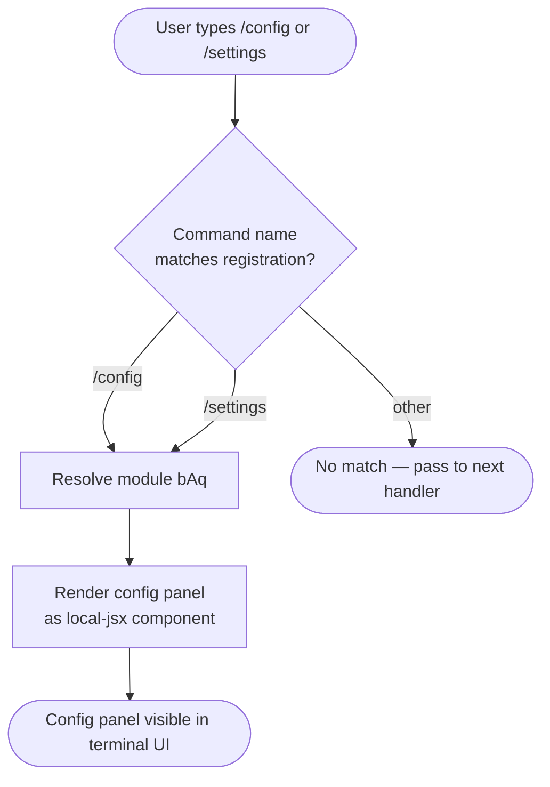

```
---
type: feature-spec
feature: "config"
cc_version: 2.1.141
updated: "2026-05-18"
tags: ["config", "commands", "slash-commands"]
source: "bundle-analysis"
bundle_verified: true
inherited_from: 2.1.139
analysis_basis: "CC v2.1.139 bundle.js (AST extraction + Claude interpretation)"
author: "ryujaeuk <ryujaeuk@gmail.com>"
repository: "https://github.com/MyLittleLuckyDog/cc-gnothi"
license: "AGPL-3.0-only"
---

# `/config`

> Analysis basis: CC v2.1.139 bundle.js (AST extraction + Claude interpretation)
> Minimum version: v2.1.139

---

## Overview

The `/config` command (also accessible as `/settings`) opens the configuration panel inside the Claude Code CLI session. It is registered as a `local-jsx` command, meaning its output is rendered as a JSX component directly within the terminal UI rather than producing plain text output. No argument parsing or sub-command routing was detected at depth-2 traversal.

---

## Registration

| Field | Value |
|---|---|
| type | `local-jsx` |
| name | `config` |
| description | `Open config panel` |
| aliases | `["settings"]` |
| module\_id | `bAq` |

Analysis basis: CC v2.1.139 bundle.js:+10341567

---

## Input Branching

Because the AST traversal located no entry functions inside module `bAq` at depth ≤ 2, no internal branching logic could be confirmed from the source data. The single confirmed behavior is that invoking `/config` (or its alias `/settings`) causes the configuration panel JSX component to be rendered.



Analysis basis: CC v2.1.139 bundle.js:+10341567

<!-- TODO: internal panel branching logic not found in depth-2 traversal; needs --depth 4 -->

---

## Behavioral Spec

### Open Configuration Panel

```
function openConfigPanel(commandInput):
    # Triggered when the user invokes /config or /settings
    # No arguments are parsed at the registration layer

    component = resolveLocalJsxModule("bAq")

    # Render the component into the active terminal UI pane
    renderInline(component)

    # Control passes to the JSX component; further
    # interaction logic is encapsulated inside that component.
    return RENDERED
```

Analysis basis: CC v2.1.139 bundle.js:+10341567

<!-- TODO: internal state management, form fields, and save/cancel logic of the config panel
     are not found in depth-2 traversal; needs --depth 4 -->

---

## State & Side Effects

| Item | Detail |
|---|---|
| Telemetry | None detected at depth-2 traversal <!-- TODO: needs --depth 4 --> |
| Hook registration | None detected at depth-2 traversal <!-- TODO: needs --depth 4 --> |
| appState changes | Not confirmed at depth-2 traversal <!-- TODO: needs --depth 4 --> |
| Sound | None detected at depth-2 traversal <!-- TODO: needs --depth 4 --> |
| Alias | `/settings` resolves identically to `/config` |
| Render mode | `local-jsx` — panel is rendered inline in the terminal UI, not as plain text |

---

## Version History

| Version | Change |
|---|---|
| v2.1.139 | Initial analysis. Command registered as `local-jsx`, module `bAq`, with alias `settings`. |

---

## Common Mistakes

1. **Expecting text output** — Because the command type is `local-jsx`, invoking `/config` does not print plain text. It renders an interactive UI panel. Scripted or piped usage that expects stdout content will not receive any.
2. **Forgetting the `/settings` alias** — `/settings` is a fully equivalent alias registered at the same command object. Both spellings open the same panel.
3. **Passing arguments** — No argument-handling logic was found at depth-2 traversal. Any text typed after `/config` or `/settings` is not guaranteed to be processed; treat the command as zero-argument.
4. **Assuming immediate persistence** — Configuration changes made inside the panel may require an explicit save or confirm action within the JSX component. The exact save mechanism is not confirmed at depth-2 traversal.

---

## Appendix — Identifier Mapping

> For bundle debugging only. Identifiers change across versions.

| Identifier | Role |
|---|---|
| `bAq` | Module identifier for the `/config` command implementation (not an obfuscated function name, but the bundle module ID assigned to this command) |

> No obfuscated function identifiers were returned by the depth-2 AST traversal for this command.
> <!-- TODO: identifier table will be populated once --depth 4 traversal of module bAq is available -->
```