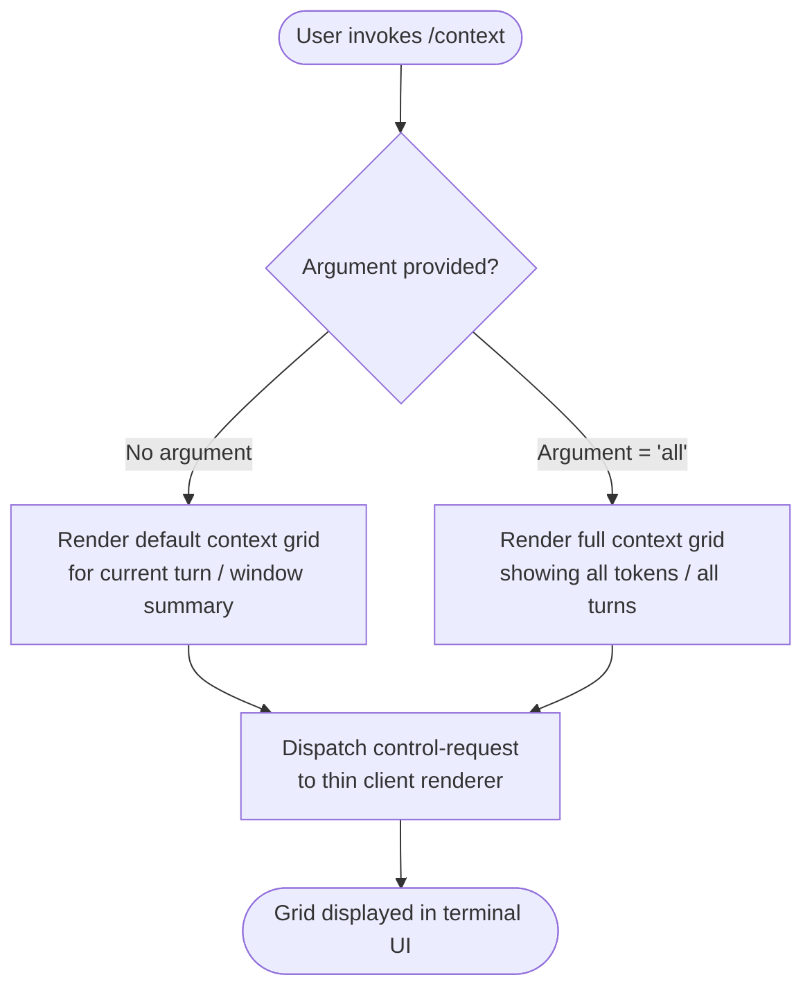

# `/context`

> Analysis basis: CC v2.1.139 bundle.js (AST extraction + Claude interpretation)
> Minimum version: v2.1.139

---

## Overview

The `/context` command renders the active session's context window usage as a colored grid visualization directly in the terminal UI. It gives the user an at-a-glance representation of how much of the available context capacity has been consumed, using color coding to convey utilization levels. The command operates locally within the client and dispatches its rendering request through the thin-client control channel.

---

## Registration

| Field | Value |
|---|---|
| type | `local-jsx` |
| name | `context` |
| description | `Visualize current context usage as a colored grid` |
| argumentHint | `[all]` |
| thinClientDispatch | `control-request` |
| module\_id | `nAq` |

Analysis basis: CC v2.1.139 bundle.js:+10359785

---

## Input Branching

The command accepts an optional argument token `all`, as indicated by the `argumentHint` field. The branching logic inferred from registration metadata is as follows:



> **Note:** The precise behavioral difference between the default mode and the `all` argument mode cannot be fully characterized from the depth-2 AST traversal, because no entry functions were resolved for module `nAq`. The branching above is inferred from the `argumentHint: "[all]"` registration field.
> Analysis basis: CC v2.1.139 bundle.js:+10359785

---

## Behavioral Spec

### Context Grid Rendering

The command's registered type is `local-jsx`, meaning its output is a JSX component rendered locally in the CLI terminal rather than sent to the model or processed server-side.

```
function renderContextCommand(args):
    mode = parseArgument(args)          // "all" or default

    contextData = fetchCurrentContextMetrics()
    // contextData contains: token counts per turn,
    // total capacity, current usage, utilization ratio

    grid = buildColoredGrid(contextData, mode)
    // Each cell in the grid represents a portion of the context window
    // Color coding reflects utilization bands:
    //   e.g., low / medium / high / critical fill level

    dispatchControlRequest(grid)
    // Sends the rendered JSX grid through the thin-client
    // control-request channel for display
```

> The thin-client dispatch type `control-request` indicates this command communicates through the client-side control plane rather than the standard message channel.
> Analysis basis: CC v2.1.139 bundle.js:+10359785

### Argument Parsing

```
function parseArgument(args):
    token = args.trim().toLowerCase()
    if token == "all":
        return MODE_ALL        // show complete context across all turns
    else:
        return MODE_DEFAULT    // show summary / current window only
```

> <!-- TODO: not found in depth-2 traversal; needs --depth 4 -->
> The exact token enumeration and fallback behavior for unrecognized arguments are not confirmed by the extracted AST data.

### Grid Construction

```
function buildColoredGrid(contextData, mode):
    totalCells  = computeCellCount(contextData.capacity)
    filledCells = computeCellCount(contextData.usedTokens)

    grid = []
    for i in range(totalCells):
        if i < filledCells:
            color = selectColor(utilization = filledCells / totalCells)
        else:
            color = COLOR_EMPTY
        grid.append(Cell(color))

    return GridComponent(grid)
```

> <!-- TODO: not found in depth-2 traversal; needs --depth 4 -->
> Specific color thresholds, cell count formula, and grid dimensions are not present in the extracted literals array (which is empty for module `nAq`).

---

## State & Side Effects

| Item | Detail |
|---|---|
| Telemetry | None detected — the `telemetry` array is empty for this command |
| Hook registration | <!-- TODO: not found in depth-2 traversal; needs --depth 4 --> |
| appState changes | No appState mutations confirmed; command appears read-only with respect to session state |
| Sound | <!-- TODO: not found in depth-2 traversal; needs --depth 4 --> |
| Render target | JSX component dispatched via `control-request` to the thin-client display layer |
| Side effects | None confirmed beyond terminal UI update |

---

## Version History

| Version | Change |
|---|---|
| v2.1.139 | Initial analysis — command registered at bundle.js:+10359785, module `nAq`; no entry functions resolved at depth ≤ 2 |

---

## Common Mistakes

1. **Expecting model output**: Because the command type is `local-jsx` with `thinClientDispatch: "control-request"`, the grid is rendered entirely on the client side. No message is sent to the model, and no AI-generated text is produced in response to `/context`.
2. **Treating `[all]` as required**: The brackets in `argumentHint: "[all]"` denote an optional argument. Invoking `/context` without any argument is valid and produces a default view.
3. **Assuming telemetry coverage**: Unlike many other Claude Code commands, `/context` emits no detected telemetry events. Usage of this command is not reflected in `tengu_*` event streams based on the current extraction.
4. **Confusing context visualization with context management**: `/context` is a read-only visualization tool. It does not truncate, compress, or otherwise modify the context window.
5. **Passing arbitrary arguments**: Only the `all` token is indicated by registration metadata. Passing other arguments may be silently ignored or fall back to default behavior — the exact handling is <!-- TODO: not found in depth-2 traversal; needs --depth 4 -->.

---

## Appendix — Identifier Mapping

> For bundle debugging only. Identifiers change across versions.

| Identifier | Role |
|---|---|
| `nAq` | Module identifier for the `/context` command implementation (not an obfuscated function name; included for bundle navigation reference) |

> **Note:** The `identifiers` array returned by the AST extraction is empty for module `nAq`. No obfuscated function-level identifiers were resolved at traversal depth ≤ 2. A deeper traversal (`--depth 4` or greater) targeting module `nAq` is required to populate this table with function-level mappings.