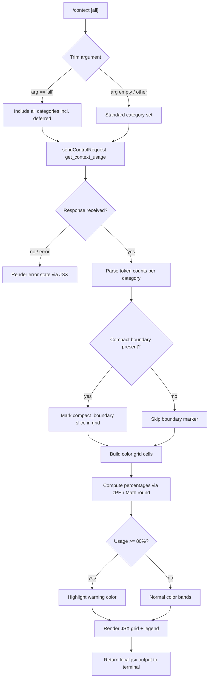

# `/context`

> Analysis basis: CC v2.1.141 bundle.js (AST extraction + Claude interpretation)
> Minimum version: v2.1.141

---

## Overview

The `/context` command visualizes the current conversation's context-window usage as a colored grid of cells. It dispatches a `get_context_usage` control request to the local agent, then renders the response as a JSX component with categorized color bands representing different token consumers (system prompt, tools, messages, memory files, etc.), along with percentage labels and a compact-boundary marker.

---

## Registration

| Field | Value |
|---|---|
| type | `local-jsx` |
| name | `context` |
| description | `Visualize current context usage as a colored grid` |
| argumentHint | `[all]` |
| thinClientDispatch | `control-request` |
| module_id | `jLq` |
| load_inline | `true` |
| loc_byte | `10404121` |
| loc_byte_end | `10404347` |
| loc_line | `5749` |
| arbor_handler.name | `sY7` |
| arbor_handler.fqn | `claude-2.1.141::sY7` |
| arbor_handler.kind | `AsyncFunction` |
| arbor_handler.resolution_path | `module_id` |
| arbor_handler.n_hits | `0` |

Analysis basis: CC v2.1.141 bundle.js:+10404121

---

## Input Branching

Five or more distinct branches exist (argument parsing, control-request result handling, category mapping, percentage rendering, and the optional `[all]` expansion path), so a Mermaid flowchart is used.



Analysis basis: CC v2.1.141 bundle.js:+10402755 (handler entry `sY7`), +10402786 (`"all"` literal), +10403222 (threshold `80`)

---

## Behavioral Spec

### Handler Entry — `contextCommandHandler` (`sY7`)

```
async function contextCommandHandler(argument, appContext):
    trimmedArg = argument.trim()                         // +10402761
    includeAll = (trimmedArg == "all")                   // +10402786

    // Send a control request to the local agent subprocess
    response = await appContext.sendControlRequest(
        "get_context_usage",                             // +10402851
        { all: includeAll }
    )

    categoryData = parseContextUsageResponse(response)  // -> Q26

    grid = buildContextGrid(categoryData)               // -> Zz8 chain
    return renderJSX(grid)                              // -> d26.createElement
```

Analysis basis: CC v2.1.141 bundle.js:+10402755, +10402821, +10402881, +10402885

---

### Control-Request Dispatch — `sendControlRequest`

The handler calls `K.sendControlRequest` with the string `"get_context_usage"` (Analysis basis: CC v2.1.141 bundle.js:+10402821). The `thinClientDispatch: "control-request"` registration field confirms this path is used in thin-client/remote contexts as well.

---

### Category Data Parsing — `contextUsageParser` (`Q26`)

```
function contextUsageParser(rawResponse, includeAll):
    // Filter to known category names
    categories = rawResponse.filter(/* known keys */)  // +10400858

    // Identify each category slice
    for each category in categories:
        entry = rawResponse.find(c => c.name == category)  // +10401176
        label = CATEGORY_LABELS[category]                  // see literals

    // Locate compact_boundary marker
    boundary = rawResponse.find(c => c.name == "compact_boundary")  // +9870533

    return { categories, boundary }
```

Known category label strings present in the bundle (Analysis basis: CC v2.1.141 bundle.js):

| Key string | Display label |
|---|---|
| `"system"` (+10402968) | `"System prompt"` (+9482541) |
| `"projectSettings"` (+10401842) | `"Project"` (+10401862) |
| `"userSettings"` (+10401882) | `"User"` (+10401899) |
| `"localSettings"` (+10401916) | `"Local"` (+10401934) |
| `"plugin"` (+10402024) | `"Plugin"` (+10402035) |
| `"built-in"` (+10402054) | `"Built-in"` (+10402067) |
| `"Free space"` (+10400893) | `"Free space"` |
| `"Autocompact buffer"` (+10400916) | `"Autocompact buffer"` |

Additional legend labels observed:

| Label | Color hint in bundle |
|---|---|
| `"System tools"` (+9482619) | `"inactive"` (+9482649) |
| `"MCP tools"` (+9482682) | `"cyan_FOR_SUBAGENTS_ONLY"` (+9482709) |
| `"MCP tools (deferred)"` (+9482757) | — |
| `"System tools (deferred)"` (+9482842) | — |
| `"Custom agents"` (+9482930) | `"permission"` (+9482961) |
| `"Memory files"` (+9482996) | `"claude"` (+9483026) |
| `"Skills"` (+9483057) | — |
| `"Messages"` (+9483557) | `"purple_FOR_SUBAGENTS_ONLY"` (+9483583) |

Analysis basis: CC v2.1.141 bundle.js:+10400858

---

### Percentage Formatting — `percentFormatter` (`zPH`)

```
function percentFormatter(value, total):
    ratio = value / total
    rounded = Math.round(ratio * 100)        // +204431
    if rounded < 20:
        return "< 20"                         // +204411  (threshold: 20, +204402)
    if rounded < 10:                          // threshold: 10, +204444
        return String(rounded) + ".0"         // suffix ".0", +204372
    return String(rounded)
```

The formatter uses locale `"en-US"` and style `"compact"` for large-number display (Analysis basis: CC v2.1.141 bundle.js:+206349, +206367).

Analysis basis: CC v2.1.141 bundle.js:+204431

---

### Grid Construction — `buildContextGrid` (`Zz8`)

```
function buildContextGrid(categoryData):
    totalTokens = sum of all category token counts

    // Compute grid cell count, rows, columns
    maxCells = Math.min(...)                 // +9483394
    cellsPerRow = Math.floor(...)            // +9484135
    usedCells = Math.round(
        (usedTokens / totalTokens) * maxCells
    )                                        // +9483973

    // Insert compact_boundary marker if present
    if boundary exists:
        boundaryCell = Math.round(
            (boundary.offset / totalTokens) * maxCells
        )                                    // via Z$ / Df7, +9870663

    // Build per-category colored cell arrays (aH.push path)
    grid = []
    for each category in orderedCategories:
        cells = Math.round(
            (category.tokens / totalTokens) * maxCells
        )
        grid.push({ color: categoryColor(category), count: cells })

    // Threshold warning: if usedTokens/totalTokens >= 0.80, apply warning color
    // threshold constant: 80 (+10403222)

    return grid
```

Analysis basis: CC v2.1.141 bundle.js:+9481583, +9483318, +9483383, +9483394, +9483973, +10403222

---

### Compact-Boundary Marker — `compactBoundarySlice` (`Z$` / `Df7`)

```
function compactBoundarySlice(rawResponse):
    // Locate entry named "compact_boundary"  (+9870533)
    entry = rawResponse.find(e => e.name == "compact_boundary")
    if not entry: return null
    // Return token offset for boundary position
    return entry.tokenOffset        // VP (+9870616), H.slice (+9870686)
```

Analysis basis: CC v2.1.141 bundle.js:+9870533, +9870663

---

### JSX Rendering — `contextGridRenderer` (`aY7` → `Zz8`)

```
function contextGridRenderer(grid, percentFormatter, boundaryCell):
    rows = chunkIntoRows(grid, cellsPerRow)
    jsx = []
    for each row in rows:
        rowJsx = row.map(cell => renderCell(cell.color, cell.count))
        jsx.push(rowJsx)

    // Append legend row
    legend = buildLegend(CATEGORY_LABELS, percentFormatter)

    // Output via d26.createElement / HHH.createElement
    return createElement("div", { style: ... }, rows, legend)
```

The MCP data event listener (`MlH`, `K.on("data", ...)`) subscribes to streaming updates from the control-request channel and calls `du` → `$L_` → `CR9.createElement` to patch the rendered output in real time (Analysis basis: CC v2.1.141 bundle.js:+7468420, +3627911).

Analysis basis: CC v2.1.141 bundle.js:+10402885, +10403164, +7468487

---

### Fullscreen / Terminal-Mode Guards — `fullscreenModeGate` (`lA`)

Before invoking the renderer, the handler checks for terminal compatibility:

- String `"local-agent"` mode required (Analysis basis: CC v2.1.141 bundle.js:+3240151)
- Fullscreen is disabled under `"iTerm.app"` tmux-CC mode (message literal: `"fullscreen disabled: tmux -CC (iTerm2 integration mode) detected…"`, +3240306)
- Fullscreen is disabled under Windows-over-SSH (ConPTY) (message literal starts with `"fullscreen disabled: Windows over SSH…"`, +3240492)
- The `"bg"` rendering variant is selected when applicable (+3240661)
- Default rendering mode is `"default"` (+3240722)

Analysis basis: CC v2.1.141 bundle.js:+3240143, +3240151

---

## State & Side Effects

| Item | Detail |
|---|---|
| Telemetry | `tengu_amber_creek` (+3240879), `tengu_pewter_brook` (+3240787), `tengu_marlin_porch` (+3599437), `tengu_amber_redwood2` (+9469894), `tengu_slate_harrier` (+12219131), `tengu_chair_sermon` (+9832602), `tengu_verified_vs_assumed` (+12198449), `tengu_sparrow_ledger` (+12209678) |
| Control request | Emits `get_context_usage` control request to local-agent subprocess via `K.sendControlRequest` (+10402821) |
| appState changes | None observed at depth ≤ 2; `Bt` → `bn9` → `T36.setState` path is present in the call graph (+4665482) indicating possible loading-state toggle during fetch |
| Streaming | Subscribes to `"data"` event on control-request channel (`MlH` / `K.on`, +7468420) for live updates |
| Sound | None observed |
| Hook registration | None observed |

---

## Version History

| Version | Change |
|---|---|
| v2.1.141 | Initial analysis |

---

## Common Mistakes

1. **Passing an argument other than `all`**: The only recognized optional argument is the literal string `"all"` (Analysis basis: CC v2.1.141 bundle.js:+10402786). Any other text is silently treated as the default (non-all) mode.
2. **Expecting token counts in non-local-agent sessions**: The command issues a `control-request` that only the local agent subprocess handles. In remote or thin-client sessions without a live local agent, the request will fail or return an empty result.
3. **Interpreting the `< 20` display as zero**: The percentage formatter clips small values to the string `"< 20"` (Analysis basis: CC v2.1.141 bundle.js:+204411); this does not mean the category is empty.
4. **Missing the compact-boundary marker**: The boundary line only appears when an `autoCompactEnabled` session has a prior compaction point recorded. It will be absent in fresh sessions.
5. **Confusing `cyan_FOR_SUBAGENTS_ONLY` and `purple_FOR_SUBAGENTS_ONLY` colors**: These color bands only appear in the grid when the command is invoked inside a sub-agent context; they are not shown in a normal top-level session.

---

## Appendix — Identifier Mapping

> For bundle debugging only. Identifiers change across versions.

| Identifier | Role |
|---|---|
| `sY7` | Main async handler for `/context` command (Arbor-resolved) |
| `lA` | Fullscreen / terminal-mode gate; selects rendering path |
| `FRH` | Feature-flag check (uses `fIK.has`) |
| `Y1_` | Terminal color-support probe |
| `mq` | String converter utility (wraps `String()`) |
| `RH` | Logging / reporting helper |
| `El` | Environment-info gatherer |
| `mRL` | Terminal multiplexer detector (iTerm/tmux) |
| `uRL` | Checks `H.startsWith` for terminal prefix |
| `v` | File-write / output helper |
| `J7K` | Debug-mode output brancher |
| `Qt_` | Token formatting helper |
| `H` | Timer / random-based utility (Math.random, setTimeout) |
| `SH` | JSON.stringify wrapper |
| `t7` | Path/extension extractor |
| `T6A` | Maps over file-type array |
| `MSH` | Write-to-stream helper |
| `M6A` | Low-level H.write wrapper |
| `X7K` | File-append/rotation manager |
| `bhH` | Output buffer flusher (clearTimeout, setTimeout, setImmediate) |
| `A_H` | Path-join + version-check helper |
| `Cv8` | Checksum helper (`M8`) |
| `y6A` | Path-join utility |
| `k6A` | File stat / rename / unlink helper |
| `P7K` | Directory-create + append-file helper |
| `b9` | Set-mutation helper (jI8.add / delete / Object.assign) |
| `H56` | Boolean coercion wrapper |
| `p_` | Settings loader entry |
| `ex` | Settings load orchestrator |
| `rS` | Settings read helper |
| `T1` | Deduplication set (U6A) + memory usage recorder |
| `Fm8` | Full settings-load pipeline (Date.now, telemetry) |
| `yV6` | Post-load settings post-processor |
| `pRL` | Rendering mode dispatcher |
| `j6` | Conversation/session state reader |
| `b76` | Session config field accessor |
| `x76` | Session config fallback accessor |
| `Js` | Session reader combining `RH` + `ws` |
| `vi6` | Session deduplication set (pA_, gMH) |
| `h6` | Session timestamp recorder (Date.now, cMH) |
| `V3` | Argument pre-processor (calls `njH`) |
| `njH` | Argument normalizer |
| `K` | Control-request channel (sendControlRequest, padEnd) |
| `L` | Streaming event listener queue |
| `f` | Stream close / finalize helper |
| `MlH` | Data-event subscriber for streaming response |
| `du` | JSX element factory wrapper |
| `$L_` | JSX write-event creator (CR9.createElement) |
| `Q9H` | Context-grid JSX wrapper |
| `ZUH` | Grid sub-component (lA, El, j6, RH) |
| `Q26` | Category data parser and label mapper |
| `iK` | Locale percentage formatter caller |
| `gq` | Locale number formatter (T7K) |
| `T7K` | Underlying Intl/locale formatter |
| `vCH` | Category color selector |
| `zPH` | Percentage display formatter (Math.round, "< 20") |
| `TH` | String coercion utility |
| `aY7` | Grid renderer dispatcher |
| `Z$` | Compact-boundary locator |
| `Df7` | Compact-boundary offset extractor (VP) |
| `VP` | Token-offset reader |
| `Bt` | Loading-state toggle |
| `bn9` | setState caller (T36.setState) |
| `Zz8` | Core grid-building function |
| `aG` | Model/provider config resolver |
| `Ta` | Model metadata table |
| `qV` | Context-window size lookup |
| `m8H` | Token-limit mapper |
| `uB` | Model string normalizer |
| `bV` | Provider branch (pf/DM) |
| `pf` | First-party provider handler |
| `DM` | Multi-provider dispatcher (WhH, G4L, ZdA, CU6, WA) |
| `xV` | Provider fallback (pf/DM) |
| `B0` | Conversation message-list reader |
| `f7` | Message-list processor |
| `WE` | Token-dedup set (YH6, _.add/has) |
| `I8` | Cache-hit checker |
| `oi` | Auto-compact window calculator |
| `v1` | Model-ID normalizer |
| `bU6` | Settings entry resolver (p_, Object.entries) |
| `Sw` | Model-string case/replace normalizer |
| `KP` | Model-string replace helper |
| `XX` | Context-size resolver (parseInt, isNaN) |
| `oG` | Size-table lookup (VAH) |
| `mc` | Context-size path (VAH, v1, _.includes) |
| `ZAH` | Alternate context-size path (VAH, v1) |
| `wl6` | Context-size with override (VAH, parseInt, Number.isFinite) |
| `jw` | Compact-window helper |
| `dt` | Token-limit validator (parseInt, isNaN, "valid"/"invalid"/"capped") |
| `A98` | Auto-compact candidate builder |
| `Z_` | Compacted-message slice helper |
| `ey_` | Token-string parser (parseFloat, parseInt, Math.round) |
| `o0` | Full system-prompt assembler |
| `DQ_` | System-prompt header renderer |
| `N6` | Current-store accessor (bS6, CS6.getStore) |
| `bS6` | AsyncLocalStorage store getter |
| `e8` | Store fallback accessor |
| `uO8` | MCP object-values mapper |
| `IT` | System-prompt injection helper |
| `bu7` | Code-style prompt builder |
| `I9_` | Code-style string component |
| `V9_` | Code-style template component |
| `xu7` | Additional prompt section builder |
| `PQ_` | Prompt section combiner (v1, RH, mq, PM, j6) |
| `zm7` | Prompt wrapper (PQ_) |
| `BO6` | Background-session prompt injector |
| `uu7` | BO6 wrapper |
| `iu7` | Instructions prompt builder |
| `uU` | Feature-flag accessor |
| `cz` | Client-type checker ("sdk-ts"/"sdk-py"/"sdk-cli") |
| `lu7` | Instructions sub-section builder |
| `$O6` | Prompt segment injector |
| `XT` | Feature-enabled checker ("disabled") |
| `u4` | Prompt utility helper |
| `nu7` | Routine/schedule prompt builder |
| `RLH` | Reminder block builder (SaH, kdH, N_) |
| `Cp` | Content flatMap helper (Array.isArray, _.map) |
| `uG6` | Memory directory loader |
| `bK` | Memory-path resolver (bd, RH, mq, hi6, p_) |
| `_4H` | Memory dir creator (x6, _.mkdir, M8, v) |
| `Ir` | File-type classifier (isFile, isDirectory) |
| `hH` | File-stat helper (Q) |
| `Qz` | Memory file reader (j6) |
| `pr1` | Memory prompt assembler (LM_.join, O.push/join) |
| `qkH` | Memory query helper (j6, s3, e8, cz, zP, YK) |
| `mr1` | Memory read helper (QEH) |
| `ur1` | Memory content loader (QEH, L.push) |
| `ug_` | Memory push collector (QEH, f.push, qkH) |
| `Q` | Generic promise/async helper |
| `pu7` | Prompt utility section |
| `Hm7` | Environment info (wX, wQ_, Cp) |
| `wX` | Model display-name resolver |
| `wQ_` | Working-directory description builder |
| `eu7` | Full environment section builder |
| `jQ_` | OS info collector (YkH.version/release/type) |
| `tf` | Shell/CWD info collector |
| `JQ_` | Shell description builder |
| `Uu7` | Language/locale prompt |
| `Bu7` | Output-style prompt |
| `Am7` | Background-session context |
| `qm7` | Scratchpad/FRC prompt builder |
| `r6H` | Scratchpad section (j6) |
| `XJH` | Scratchpad path builder (D4.join, gX8, V6) |
| `Km7` | Context-management section |
| `fm7` | Brief-mode checker (Cu7.isBriefEnabled) |
| `Om7` | Focus prompt builder (Z_, p_, h6, PM) |
| `au7` | Reproduce-verify workflow prompt |
| `cq1` | GrowthBook / feature-flag prompt section |
| `A7H` | Feature-flag evaluator |
| `_I8` | Feature-flag prompt formatter |
| `ou7` | Language section |
| `Fu7` | Output-style section |
| `gu7` | Tool-listing helper (mu7, Cp) |
| `mu7` | Tool description builder |
| `Qu7` | Tool-listing section (j6, Cp) |
| `du7` | Tool-listing dispatcher (PQ_) |
| `cu7` | Tool-use section (H.has, zP, Cp, cz) |
| `zP` | Tool invocation logger (dR, mq, RH, j6) |
| `ru7` | Remaining tool sections (Cp) |
| `XNq` | Team-memory notice builder (PNq, ug_) |
| `PNq` | Team-memory path builder (bK, Qz, KkH.*) |
| `RMH` | History/compaction reminder (hE, UM, WA) |
| `hE` | History helper (z8_, RH) |
| `UM` | Utility mapper |
| `WA` | API/provider base-URL resolver |
| `jb` | System-prompt getter (aq, sw, H.getSystemPrompt) |
| `aq` | Async prompt fetcher |
| `sw` | Prompt formatter |
| `bq7` | Per-server prompt builder (aw, Cq7, mrH, Iz8) |
| `Cq7` | Prompt-section parser (H.match/split/trim, A.slice) |
| `Iz8` | Prompt orchestrator (_m7, WNq, pkq) |
| `_m7` | Per-server async prompt builder |
| `WNq` | Combined memory+prompt builder |
| `pkq` | Prompt-section slicer (H.indexOf/slice, A.startsWith) |
| `mrH` | MCP server prompt renderer (kvH, v, TH, kH, Re1) |
| `kvH` | Token-count request helper |
| `kH` | Token-count error logger (k_, RH, Vq, GvK, aRH, Oc.logError) |
| `Re1` | Token-count result renderer |
| `xq7` | Additional server-prompt builder (RH, U36, PP, mrH) |
| `U36` | Server filter (j6, H.filter) |
| `uq7` | Sub-agent system-prompt builder (M, QDH, nC, fg) |
| `M` | MCP state manager (SvH, Eeq, L.get/values, XA5) |
| `SvH` | MCP server-state sync helper |
| `Eeq` | MCP update applicator (H.applyMcpUpdate, fY8, A.cleanup) |
| `XA5` | MCP client-list builder |
| `QDH` | Server-prompt parallel fetcher (Promise.all, vz8, mrH) |
| `vz8` | Individual MCP server prompt builder |
| `z` | Background-session dispatcher (hH, xH, oR, Kx) |
| `xH` | File-stat helper (Q) |
| `oR` | Session-event router (ws, MF.push, W0H, uA_) |
| `Kx` | Session race/all helper (Promise.race/all, a8, process.exit) |
| `G` | MCP server registry (rX6, gT8) |
| `P` | Session client handler (Buffer.concat, w.off, yf, N15) |
| `j` | Protocol frame helper (w) |
| `w` | Background worker manager (A.get, Q, S.kill, Date.now, j6) |
| `yf` | Session write helper (H.end, SH) |
| `N15` | Session message protocol handler (full PTY/IPC message dispatch) |
| `Uq7` | Sub-agent conversation-context builder |
| `Z5` | Math.round wrapper |
| `O` | Sub-agent queue (b8) |
| `D` | Sub-agent spawn/dispose manager |
| `YG6` | macOS low-memory monitor (c6, j6) |
| `_o_` | Background spare-session spawner (Bun.spawn, JU.mkdir/unlink) |
| `Bq7` | Batch server-prompt builder (Promise.all, _.map, mrH) |
| `mq7` | Sub-agent prompt with memory (oz_, N6, Se1, QDH) |
| `oz_` | Context-window overlap check (u0, r1H, uU) |
| `r1H` | Filter helper (H.filter, _.some, Fvq) |
| `Se1` | Session-level memory getter (KK) |
| `KK` | Memory cache (KZ9.get/set, LZ9.has/add, H.find) |
| `dq7` | Token-accounting per-slot builder |
| `Fq7` | SH/Z5 usage slot formatter |
| `gq7` | Usage slot getter (Z5, SH, A.get) |
| `Qq7` | Usage slot renderer (SH, Z5) |
| `U0` | Full conversation-context manager (large, handles all message types) |
| `m57` | Message transformer (oP6, K.push, Array.isArray, q.push) |
| `g57` | Message group builder (Pf_, Xf_, Wf_, fe6, Gf_) |
| `AR_` | Message array reducer |
| `Q57` | Message-set predicate (Array.isArray, A.some, _.has) |
| `S` | Blur/focus cache manager (Date.now, Math.min) |
| `vY8` | Message filter (_.some) |
| `s57` | UUID generator (bZ.randomUUID) |
| `Y8` | Message ID factory (bZ.randomUUID) |
| `ZW` | Message timestamp wrapper |
| `hZ_` | Message history slicer |
| `NY8` | Message normalizer (kY8, t_q, n57) |
| `Ep` | Context assembly entry (v, WA, UM) |
| `fR_` | Attachment filter (Array.isArray, _.some, _.map, ai) |
| `p57` | Attachment mapper (ai, GE, A.map, v) |
| `N` | Conversation turn generator |
| `T` | Key-event / remote-control handler |
| `U57` | Tool-use detection (H.some, Array.isArray) |
| `PL` | Prompt loader |
| `wAq` | Prompt post-processor |
| `c57` | Message filter predicate |
| `Y` | Rendering update dispatcher |
| `a_q` | Message push helper (q.push, K.push) |
| `jh_` | Full message-block assembler (K1, Y8, S57, TP, Qk_, jh_, Rx) |
| `t57` | Text-block join helper (_.push/join, A.trim) |
| `W` | Debounce/flush manager (z.add/clear, setTimeout, f.emit) |
| `d57` | Delta-message builder (kY8, t_q, i57) |
| `DJ6` | Thinking-block filter (Array.isArray, K.some, _.add, L.every) |
| `Jf7` | Message truncator (H.at, A.at, IX6, A.slice) |
| `YJ6` | Deferred-tool message rebuilder |
| `jf7` | Empty-content filter (Array.isArray, H.slice) |
| `l57` | Conversation tail builder (_.at, H.slice, _.push, Y8, ZW) |
| `o_q` | Message orphan cleaner (L.findLastIndex, qR_) |
| `s_q` | Summary message builder (A.at, NY8, A.push) |
| `F57` | Long-message slicer ($.every/filter, K.slice, H.slice) |
| `pq7` | Parallel system-prompt section builder |
| `az_` | Context overlap helper (r1H, u0, uU) |
| `sG` | Model-segment normalizer (zq, v1, rfL.has) |
| `zq` | Model-name segment resolver (oG, xV, nxH, bV, vtA, pf) |
| `EX6` | Token-estimate helper (Z5, py_) |
| `py_` | Token estimator |
| `k_` | Error/string coercion helper |
| `aHH` | Auto-compact threshold calculator (Math.min, LqH, B0, oi) |
| `LqH` | Max-output-token resolver (SMH, dt) |
| `SMH` | Token-limit lookup (v1, zY9, Math.min) |
| `e` | Voice-recording timer (T.current, d.setTimeout, v, o) |
| `d` | File-read/unlink helper (l26, cLq) |
| `l26` | Read file + parse (mb.readFile, DwH, $8, Y1) |
| `cLq` | File unlink helper (mb.unlink, DwH, $8) |
| `o` | Main render loop (v, Date.now, Promise.resolve, DH, a8, p_, rP8) |
| `l` | Route filter (r.filter) |
| `DH` | Render dispatcher |
| `a8` | Timeout/abort controller |
| `JhH` | Language/locale detector (H.toLowerCase, Nt_.has, _.split) |
| `Cn_` | Screen-name builder (QK, Rn_.basename, _, SJ, _Qq, vo7) |
| `rP8` | Voice-stream WebSocket manager |
| `NH` | State/metadata reporter (s.reportState, s.reportMetadata) |
| `VH` | View-state tracker (O, Z, MH) |
| `iH` | Hook-event logger (v, LH.push, $9) |
| `EH` | Plugin list manager (full plugin state machine) |
| `g` | Permission classifier ($f8, nHH) |
| `iH8` | `usage` query helper (qOH) |
| `qOH` | Usage feature-flag checker (Q36.has) |
| `fqH` | Compact-window full-path builder (Vz6, XX, jw, v1, A98) |
| `Vz6` | Session-path builder (Z_, j6) |
| `aH` | Terminal screen-cell row builder |
| `w9` | Cell-byte processor |
| `Tq` | Cell-index helper (f$.indexOf) |
| `f$` | Low-level cell table |
| `y9` | Unicode cell builder |
| `uH` | Process/CWD metadata holder |
| `aA` | ANSI cell builder |
| `vA` | Fatal error handler (console.error, process.exit) |
| `AX` | Crash log writer (fSH.writeFileSync, gv8.join) |
| `JH` | Command / cancel dispatcher |
| `XH` | Sub-session command dispatcher (j6) |
| `z6` | Agent execution runner ($HH, oHK, performance.now, aH, RH, v, TH) |
| `JCH` | Structured log writer (Date.now, T8) |
| `T8` | File log appender (rkK, x6, SH, L.appendFileSync, L.mkdirSync) |
| `E18` | Event emitter |
| `$HH` | Plugin/MCP registry builder (qQ, cqH, $YH, MHH, Dw6, Object.assign) |
| `cqH` | MCP config loader (LW, qQ, vlH, GP, k3, az, v, cqH, IlH, hI) |
| `MHH` | MCP tool-list builder (Object.entries, vlH, A.push) |
| `Dw6` | MCP tool-dedup map builder |
| `oHK` | Headless plugin-install orchestrator |
| `Ig` | Plugin install guard (RH) |
| `lO8` | Plugin object-store manager |
| `CDH` | Plugin cache clearer (dO8.clear) |
| `zZ` | Plugin feature-flag gate (v, hV6, ZY, It_) |
| `P81` | Plugin-zip-cache validator (a$6, Error, aN.join) |
| `X81` | Plugin-zip-cache loader (a$6, Error, aN.join) |
| `Cb` | Plugin-store entry builder (dTH, p_, Object.entries, BA, J$_) |
| `YT8` | Plugin reconcile-and-install runner |
| `E81` | Plugin error handler |
| `iHK` | Plugin-state entry builder (vg, Object.entries, A95, v, H95, _95) |
| `v28` | Plugin-metadata updater (LMq, BT, HaH, vg, Object.keys, fZ, _U7, ELH, v, TH) |
| `rsH` | Round-millisecond helper (Math.round) |
| `GH` | AbortController map (v, z6.abort) |

---

Note: index built via Arbor fallback; some signals (telemetry, literals) may be missing — see arbor-fallback.js.