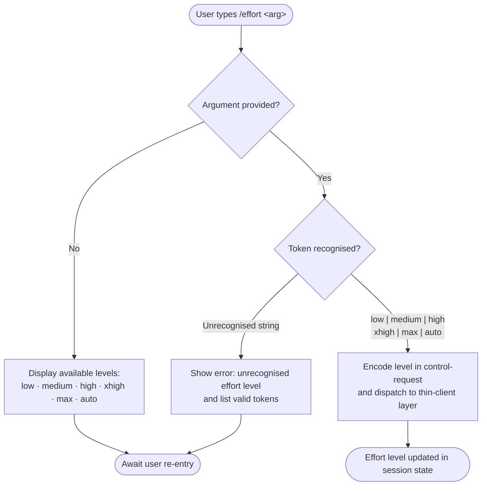

# `/effort`

> Analysis basis: CC v2.1.139 bundle.js (AST extraction + Claude interpretation)
> Minimum version: v2.1.139

---

## Overview

The `/effort` command sets the effort level that Claude Code applies when invoking the underlying model, allowing users to trade response thoroughness against latency and token cost. It accepts one of six discrete level tokens — `low`, `medium`, `high`, `xhigh`, `max`, or `auto` — and dispatches the selection to the thin-client control layer via a `control-request` message. When called without an argument the command presents the available levels so the user can choose interactively.

## Registration

| Field | Value |
|---|---|
| type | `local-jsx` |
| name | `effort` |
| description | Set effort level for model usage |
| argumentHint | `[low\|medium\|high\|xhigh\|max\|auto]` |
| thinClientDispatch | `control-request` |
| module\_id | `aPq` |

Analysis basis: CC v2.1.139 bundle.js:+11504354

## Input Branching

The argument string passed after `/effort` is trimmed and matched against the known level tokens. The flowchart below describes the decision path.



Analysis basis: CC v2.1.139 bundle.js:+11504354
<!-- TODO: branching implementation details not found in depth-2 traversal; needs --depth 4 -->

## Behavioral Spec

### Argument Validation and Dispatch

The command is registered as `local-jsx`, meaning its UI rendering occurs in the local process before any network round-trip. The validated level is forwarded as a `control-request` through the thin-client dispatch channel, which is the same channel used by other session-control commands.

```
function handleEffortCommand(rawArgument):
    token = trim(rawArgument)

    validLevels = ["low", "medium", "high", "xhigh", "max", "auto"]

    if token is empty:
        renderLevelChooser(validLevels)
        return

    if token not in validLevels:
        renderError("Unrecognised effort level: " + token)
        renderHint("Valid levels: " + join(validLevels, " | "))
        return

    dispatch({
        channel: "control-request",
        payload: { kind: "set-effort", level: token }
    })
```

Analysis basis: CC v2.1.139 bundle.js:+11504354
<!-- TODO: exact payload schema not found in depth-2 traversal; needs --depth 4 -->

### Level Semantics

The six accepted tokens represent a monotonically increasing scale of model effort:

| Token | Intended semantics |
|---|---|
| `low` | Minimal reasoning; fastest response, lowest token usage |
| `medium` | Balanced reasoning; default for many interactive tasks |
| `high` | Extended reasoning; more careful output |
| `xhigh` | Extra-high reasoning; near-maximum deliberation |
| `max` | Maximum available reasoning budget |
| `auto` | Session decides the appropriate level based on task complexity |

<!-- TODO: exact per-level token budgets not found in depth-2 traversal; needs --depth 4 -->

### Thin-Client Dispatch

Because `thinClientDispatch` is set to `control-request`, the effort selection is not processed in-process as a simple state write; instead it is serialised and sent through the thin-client control channel. This means the new effort level becomes effective only after the thin-client layer acknowledges the control request. Callers in automated pipelines should not assume the level is applied synchronously.

Analysis basis: CC v2.1.139 bundle.js:+11504354
<!-- TODO: acknowledgement / round-trip details not found in depth-2 traversal; needs --depth 4 -->

## State & Side Effects

| Item | Detail |
|---|---|
| Telemetry | None detected at depth-2 traversal <!-- TODO: needs --depth 4 --> |
| Hook registration | None detected at depth-2 traversal <!-- TODO: needs --depth 4 --> |
| appState changes | Effort level stored in session control state after thin-client acknowledgement |
| Sound | None detected |
| Dispatch channel | `control-request` (thin-client layer) |

Analysis basis: CC v2.1.139 bundle.js:+11504354

## Version History

| Version | Change |
|---|---|
| v2.1.139 | Initial analysis; command confirmed present with six-token argument set and `control-request` dispatch |

## Common Mistakes

1. **Omitting the argument entirely** — typing `/effort` with no token does not apply any level; it opens the level chooser UI. If you are scripting CC non-interactively, always supply an explicit token.
2. **Using an unsupported token** — tokens are case-sensitive and must be one of the six listed values. Variants such as `HIGH`, `x-high`, or `maximum` will not be recognised.
3. **Assuming synchronous application** — because the level is forwarded via `control-request` to the thin-client layer, the effort level is not guaranteed to be active for the very next model call if that call is issued immediately after the command.
4. **Conflating `auto` with a default reset** — `auto` is an active selection that delegates level choice to the session heuristic; it is not identical to the session start-up state and may behave differently depending on accumulated context.
5. **Using `/effort` inside a non-interactive pipeline without thin-client support** — commands that use `thinClientDispatch` require an active thin-client connection; running `/effort` in a context without that connection will result in the dispatch being silently dropped or erroring.

## Appendix — Identifier Mapping

> For bundle debugging only. Identifiers change across versions.

| Identifier | Role |
|---|---|
| aPq | Module containing the `/effort` command registration and implementation |

Analysis basis: CC v2.1.139 bundle.js:+11504354

> **Note:** The depth-2 AST traversal returned an empty call graph, empty literals list, empty telemetry list, and empty identifiers list for module `aPq`. Sections marked `<!-- TODO: not found in depth-2 traversal; needs --depth 4 -->` require a deeper traversal pass to resolve internal branching, payload schemas, and telemetry instrumentation.