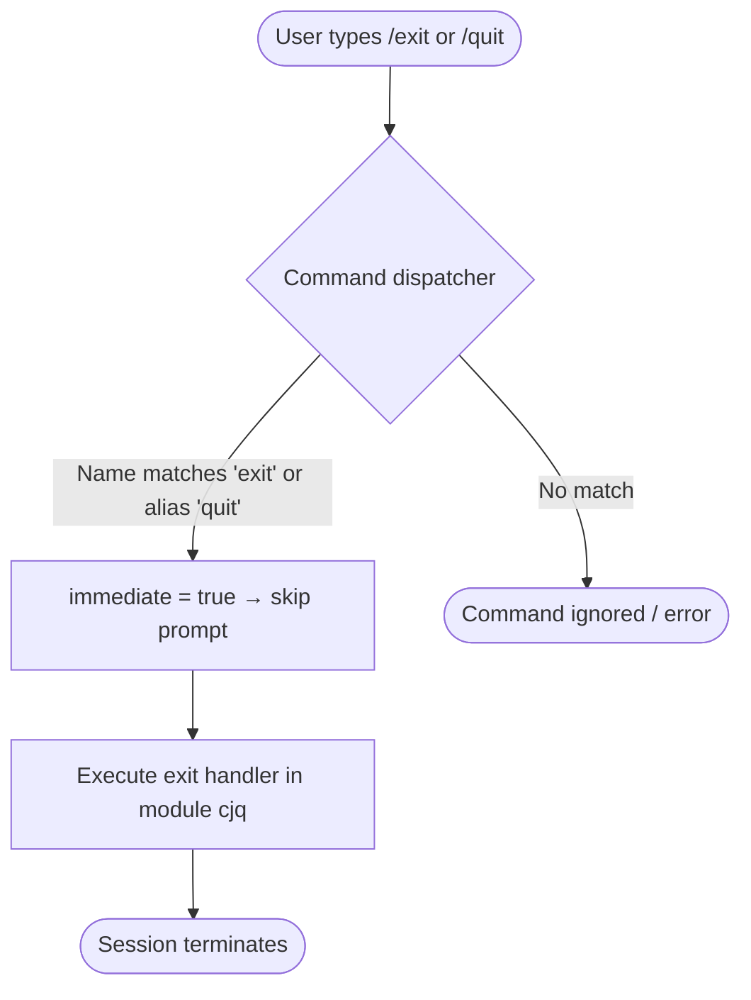

# `/exit`

> Analysis basis: CC v2.1.139 bundle.js (AST extraction + Claude interpretation)
> Minimum version: v2.1.139

---

## Overview

The `/exit` command (also accessible as `/quit`) terminates the Claude Code CLI session immediately upon invocation. It is registered as an `immediate` slash command of type `local-jsx`, meaning execution is triggered without requiring confirmation or additional input from the user.

---

## Registration

| Field | Value |
|---|---|
| type | `local-jsx` |
| name | `exit` |
| description | *(null — no description registered)* |
| aliases | `quit` |
| immediate | `true` |
| module\_id | `cjq` |

Analysis basis: CC v2.1.139 bundle.js:+11456967

---

## Input Branching

Because the `immediate` flag is `true` and no call graph entries or literals were recovered for module `cjq`, the command presents a single, unconditional execution path: invocation triggers termination with no sub-command parsing, no argument handling, and no confirmation prompt.



Analysis basis: CC v2.1.139 bundle.js:+11456967 (`immediate: true`, `aliases: ["quit"]`)

---

## Behavioral Spec

### Immediate Dispatch

Because the registration sets `immediate: true`, the command dispatcher does not wait for the user to press Enter a second time or supply arguments. The handler in module `cjq` is invoked synchronously as soon as the command token is recognised.

```
function onSlashCommandRecognised(token, registry):
    entry = registry.lookup(token)          // matches "exit" or "quit"
    if entry.immediate is true:
        invoke(entry.handler)               // no argument collection phase
    else:
        collectArguments()
        invoke(entry.handler, args)
```

Analysis basis: CC v2.1.139 bundle.js:+11456967

### Alias Resolution

The token `/quit` is treated as fully equivalent to `/exit`. Resolution happens at the dispatcher level before the handler is called; the handler itself receives no information about which alias was used.

```
function resolveAlias(token, entry):
    if token in entry.aliases or token == entry.name:
        return entry          // identical handler either way
    return null
```

Analysis basis: CC v2.1.139 bundle.js:+11456967 (`aliases: ["quit"]`)

### Session Termination

<!-- TODO: not found in depth-2 traversal; needs --depth 4 -->

The precise mechanism by which the process exits (e.g., `process.exit()` call, React root unmount sequence, cleanup hooks) is not recoverable from the depth-2 AST traversal of module `cjq`. No entry functions were identified in that module during extraction.

---

## State & Side Effects

| Item | Detail |
|---|---|
| Telemetry | None detected — no `tengu_*` events found in depth-2 traversal |
| Hook registration | <!-- TODO: not found in depth-2 traversal; needs --depth 4 --> |
| appState changes | <!-- TODO: not found in depth-2 traversal; needs --depth 4 --> |
| Sound | <!-- TODO: not found in depth-2 traversal; needs --depth 4 --> |
| Argument parsing | None — `immediate: true` bypasses all argument collection |
| Confirmation prompt | None — command executes unconditionally |

---

## Version History

| Version | Change |
|---|---|
| v2.1.139 | Initial analysis — registration confirmed at bundle.js:+11456967 |

---

## Common Mistakes

1. **Expecting a confirmation prompt.** Because `immediate: true` is set, the session ends the moment the command is dispatched. There is no "Are you sure?" step.
2. **Using `/exit` with arguments.** No argument parsing is wired to this command; any trailing text after `/exit` or `/quit` is silently ignored by the dispatcher.
3. **Assuming `/quit` behaves differently from `/exit`.** Both tokens resolve to the identical handler via the alias table; there is no behavioral difference between them.
4. **Expecting telemetry confirmation before exit.** No telemetry events are registered for this command at depth-2 traversal depth; do not rely on a telemetry flush as a signal that the command was processed.

---

## Appendix — Identifier Mapping

> For bundle debugging only. Identifiers change across versions.

| Identifier | Role |
|---|---|
| *(none recovered)* | No obfuscated identifiers were reached during the depth-2 AST traversal of module `cjq`. The extractor reported "no entry functions found for module 'cjq'". Run a deeper traversal (recommended: `--depth 4`) to recover internal symbols. |