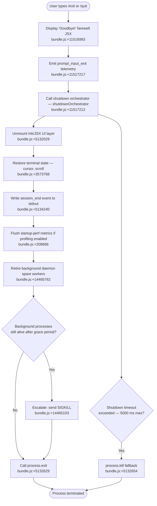

# `/exit`

> Analysis basis: CC v2.1.141 bundle.js (AST extraction + Claude interpretation)
> Minimum version: v2.1.141

---

## Overview

`/exit` (aliased as `/quit`) terminates the Claude Code CLI session immediately. When invoked, the command displays a farewell message ("Goodbye!"), emits a `prompt_input_exit` telemetry marker, performs an orderly shutdown sequence (flushing UI state, persisting session data, retiring background workers), and finally calls `process.exit`. The command is classified as `immediate`, meaning it executes without entering the normal agent prompt loop.

---

## Registration

| Field | Value |
|---|---|
| type | `local-jsx` |
| name | `exit` |
| description | `null` |
| aliases | `["quit"]` |
| immediate | `true` |
| module_id | `m0q` |
| load_inline | `true` |
| loc_byte | `11517779` |
| loc_byte_end | `11517940` |
| loc_line | `7190` |
| arbor_handler.name | `jN7` |
| arbor_handler.fqn | `claude-2.1.141::jN7` |
| arbor_handler.kind | `AsyncFunction` |
| arbor_handler.resolution_path | `module_id` |
| arbor_handler.n_hits | `1` |

Analysis basis: CC v2.1.141 bundle.js:+11517779

---

## Input Branching

The exit flow has more than three distinct phases/branches (pre-shutdown UI teardown, session-end event emission, background-process retirement, process termination race, and error escalation path), so a flowchart is used.



---

## Behavioral Spec

### 1. Command Entry Point — `exitCommandHandler` (handler: `jN7`)

The Arbor-resolved handler `jN7` is an `AsyncFunction` reached via `module_id → m0q`.

```
async function exitCommandHandler(context):
    // 1. Render farewell message
    renderFarewellComponent()           // dU_.createElement call — bundle.js:+11517106
                                        // displays literal "Goodbye!" — bundle.js:+11516993

    // 2. Render inner exit component
    renderInnerExitComponent()          // JN7 → ZP — bundle.js:+11517199

    // 3. Run background-process fork helper
    forkBackgroundProcessHelper()       // N1 → pc  — bundle.js:+11517029

    // 4. Start random-delay utility (cosmetic animation or timing jitter)
    startTimingHelper()                 // H — bundle.js:+11517041

    // 5. Send detach-request to daemon layer
    sendDetachRequest()                 // $LH — bundle.js:+11517045

    // 6. Write session metadata
    persistSessionState()               // tf — bundle.js:+11517062

    // 7. Push scroll-summary update
    pushScrollSummary()                 // sY8 — bundle.js:+11517076

    // 8. Invoke the primary shutdown orchestrator
    await shutdownOrchestrator()        // R9 — bundle.js:+11517212

    // 9. Emit prompt_input_exit telemetry marker
    emitTelemetry("prompt_input_exit")  // literal — bundle.js:+11517217
```

Analysis basis: CC v2.1.141 bundle.js:+11517029–11517217

---

### 2. Detach-Request to Daemon Layer — `detachRequestDispatcher` (`$LH`)

Before tearing down the UI, the handler signals the background daemon to detach the current session.

```
function detachRequestDispatcher():
    writeDetachMessage(                 // Fi → Bi.write — bundle.js:+9993608
        type: "detach-request"          // literal — bundle.js:+9993617
    )
    updateDaemonState()                 // zF6 — bundle.js:+9993583
    notifyDaemonWorker()                // E1q — bundle.js:+9993602
    scheduleJobCleanup()                // j6H — bundle.js:+9993663
```

Analysis basis: CC v2.1.141 bundle.js:+9993583

---

### 3. Shutdown Orchestrator — `shutdownOrchestrator` (`R9`)

This is the most complex callee, coordinating UI teardown, process retirement, and the final `process.exit` call.

```
async function shutdownOrchestrator():
    // Phase A — Unmount UI
    unmountInkUI()                      // mEH → H.unmount — bundle.js:+5132029
    restoreTerminalCursor()             // Qo6 → Bs.writeSync — bundle.js:+3573768
                                        // ESC-7 / ESC-8 sequences — bundle.js:+3573901/3573912

    // Phase B — Write final output
    writeSessionEndMarker()             // nOH.writeSync "session_end" — bundle.js:+5134240
    escapeShellSpecialChars()           // ZY_ — replaces \\ and \" — bundle.js:+5132340/5132363

    // Phase C — Telemetry flush (cache eviction hint)
    emitCacheEvictionHint()             // telemetry "tengu_cache_eviction_hint" — bundle.js:+5134205

    // Phase D — Startup perf report if enabled
    flushStartupPerfReport()            // h66 → LN8 — bundle.js:+5134167
                                        // "startup-perf" literal — bundle.js:+208000

    // Phase E — Background worker retirement
    retireAllSettledWorkers()           // Y — u.retireIfSettled — bundle.js:+14465762

    // Phase F — Race between graceful shutdown and hard timeout
    result = await Promise.race([
        gracefulShutdownChain(),        // xhH → Promise.all — bundle.js:+5133965
        hardTimeout(                    // Math.max(5000, 3500) ms — bundle.js:+5133869/5133876
            clearTimeout, process.exit  // VY_ — bundle.js:+5133852
        )
    ])                                  // bundle.js:+5133989

    // Phase G — Cleanup timers
    clearTimeout(shutdownTimer)         // bundle.js:+5134066

    // Phase H — Final exit
    callProcessExit()                   // VY_ → process.exit — bundle.js:+5132629
```

Analysis basis: CC v2.1.141 bundle.js:+5133772

---

### 4. Hard-Exit Path — `hardExitExecutor` (`VY_`)

If the graceful path does not complete within the timeout window:

```
function hardExitExecutor():
    clearTimeout(activeTimer)           // bundle.js:+5132548
    instance = W4.get(key)              // retrieve process handle — bundle.js:+5132581
    if instance exists:
        process.exit(0)                 // bundle.js:+5132629
    else:
        process.kill(pid, signal)       // fallback kill — bundle.js:+5132654
    // "unreachable" guard thrown if neither path taken — bundle.js:+5132702
```

Analysis basis: CC v2.1.141 bundle.js:+5132548

---

### 5. Background Daemon Spare-Worker Lifecycle (reachable via `Y` → `YJH`)

During exit, the daemon spare-worker pool is reconciled. This is also where several background-related telemetry events originate:

```
function reconcileDaemonSparePool():
    for each worker in activeWorkers:
        worker.retireIfSettled()        // bundle.js:+14465762
    if lowMemoryCondition:
        emit("tengu_bg_dispatch_low_mem")   // bundle.js:+14465682
    if sigkillEscalationNeeded:
        emit("tengu_bg_dispatch_sigkill_escalate")  // bundle.js:+14465103
        worker.kill("SIGKILL")          // bundle.js:+14465151
    reloadDaemonConfig()                // emit("tengu_daemon_config_reload") — bundle.js:+14478760
```

Analysis basis: CC v2.1.141 bundle.js:+14465103

---

### 6. Terminal State Restoration — `terminalRestorer` (`Qo6`)

```
function terminalRestorer():
    stdout.writeSync(ESC_SAVE_CURSOR)   // "\x1b7" — bundle.js:+3573901
    stdout.writeSync(ESC_RESTORE_CURSOR)// "\x1b8" — bundle.js:+3573912
    // Terminal multiplexer detection:
    if TERM_PROGRAM == "tmux":
        replaceEscapeSequences()        // J0 — bundle.js:+3233367
    // Version-gated inline image protocol:
    // ghostty >= 1.2.0 — bundle.js:+3308274/3308304
    // iTerm.app >= 3.6.6 — bundle.js:+3308343/3308375
    applyTerminalCompatLayer()          // i0H — bundle.js:+3573921
```

Analysis basis: CC v2.1.141 bundle.js:+3573768

---

### 7. Scroll Summary Flush — `scrollSummaryFlusher` (`sY8`)

Before shutdown, accumulated scroll metrics are pushed:

```
function scrollSummaryFlusher():
    currentScroll = getScrollValue()    // fV — bundle.js:+9987351
    scrollArray.push(currentValue)      // H.push — bundle.js:+9987356
    computeScrollDelta()                // g37 — bundle.js:+9987397
    truncateToDisplayWidth()            // c1 → q8 → Bun.stringWidth — bundle.js:+9987412
```

The scroll summary feeds into `tengu_scroll_summary` telemetry.
Analysis basis: CC v2.1.141 bundle.js:+9987351

---

### 8. Startup Performance Report — `startupPerfReporter` (`h66` → `d6A` → `B6A`)

If startup profiling was enabled, the exit path flushes the performance report to disk:

```
function flushStartupPerfReport():
    if not profilingEnabled:
        log("Startup profiling not enabled")    // bundle.js:+207231
        return
    if checkpoints.length == 0:
        log("No profiling checkpoints recorded") // bundle.js:+207321
        return
    report = buildReport(checkpoints)   // B6A — bundle.js:+207864
    writeFileSync(reportPath, report, "utf8")   // e8H → t8H.writeFileSync — bundle.js:+207900
    emit("tengu_startup_perf")          // bundle.js:+208686
```

Analysis basis: CC v2.1.141 bundle.js:+207725

---

## State & Side Effects

| Item | Detail |
|---|---|
| Telemetry — `prompt_input_exit` | Emitted immediately on `/exit` invocation (bundle.js:+11517217) |
| Telemetry — `tengu_scroll_summary` | Scroll metrics flushed during pre-shutdown (bundle.js:+5133417) |
| Telemetry — `tengu_cache_eviction_hint` | Cache advisory written during shutdown orchestration (bundle.js:+5134205) |
| Telemetry — `tengu_startup_perf` | Startup profiling report flushed if profiling was active (bundle.js:+208686) |
| Telemetry — `tengu_bg_dispatch_sigkill_escalate` | Fired if a background worker must be force-killed (bundle.js:+14465103) |
| Telemetry — `tengu_bg_dispatch_low_mem` | Fired if low memory triggers pre-emptive worker eviction (bundle.js:+14465682) |
| Telemetry — `tengu_bg_spare_enable` | Fired when spare worker pool is enabled (bundle.js:+14466297) |
| Telemetry — `tengu_bg_spare_claim` | Fired when a spare slot is claimed (bundle.js:+14466418) |
| Telemetry — `tengu_bg_spare_claim_fail` | Fired on failed spare claim (bundle.js:+14466681) |
| Telemetry — `tengu_bg_spare_spawn` | Fired when a spare worker is spawned (bundle.js:+14464880) |
| Telemetry — `tengu_daemon_config_reload` | Fired when daemon configuration is reloaded at exit (bundle.js:+14478760) |
| Telemetry — `tengu_amber_creek` | Internal layout/render telemetry (bundle.js:+3240879) |
| Telemetry — `tengu_pewter_brook` | Internal layout/render telemetry (bundle.js:+3240787) |
| UI teardown | Ink JSX component unmounted via `H.unmount` (bundle.js:+5132029) |
| Terminal state | Cursor save/restore sequences written; multiplexer escape patching applied (bundle.js:+3573901) |
| Daemon detach | `"detach-request"` message sent to daemon layer before shutdown (bundle.js:+9993617) |
| Session-end marker | `"session_end"` literal written to stdout (bundle.js:+5134240) |
| Startup perf file | Performance report written to disk if profiling active (bundle.js:+179513) |
| Background workers | `retireIfSettled()` called on all workers; SIGKILL escalation if needed (bundle.js:+14465762) |
| `process.exit` | Called unconditionally after grace period (max ~5000 ms) (bundle.js:+5132629) |
| `process.kill` | Fallback if primary exit handle is unavailable (bundle.js:+5132654) |
| Hard timeout | Shutdown timeout window: `Math.max(5000, 3500)` ms (bundle.js:+5133869/5133876) |
| Sound | <!-- TODO: not found in depth-2 traversal; needs --depth 4 --> |

---

## Version History

| Version | Change |
|---|---|
| v2.1.141 | Initial analysis |

---

## Common Mistakes

1. **Using `/exit` mid-agent-turn**: Because `immediate: true` is set, the command bypasses the agent loop entirely. Any in-flight agent response is not awaited before shutdown begins.
2. **Expecting `/quit` to behave differently**: `/quit` is a registered alias and is functionally identical to `/exit` at the handler level (bundle.js:+11517779).
3. **Assuming instant termination**: The shutdown sequence can take up to ~5 seconds while workers retire and the daemon detaches. Scripts that wrap the CLI should wait for the process to fully exit rather than assuming the prompt returning means the process ended.
4. **Conflating description with UI label**: The `description` field is `null` in the registration. The "Goodbye!" string (bundle.js:+11516993) is a farewell UI string, not a command description; it will not appear in `/help` listings.
5. **Profiling output confusion**: If startup profiling is active, `/exit` will write a profiling report file to disk. This is a side effect that may surprise automated test environments.

---

## Appendix — Identifier Mapping

> For bundle debugging only. Identifiers change across versions.

| Identifier | Role |
|---|---|
| `jN7` | Main exit command handler (`AsyncFunction`, Arbor-resolved via `module_id`) |
| `N1` | Background-process fork helper |
| `pc` | Fork helper callee (child of `N1`) |
| `H` | Random-delay / timing-jitter utility (uses `Math.random`, `setTimeout`) |
| `$LH` | Detach-request dispatcher to daemon layer |
| `zF6` | Daemon state updater (child of `$LH`) |
| `E1q` | Daemon worker notifier (child of `$LH`) |
| `NDH` | Sub-routine of `E1q` |
| `b8` | Sub-routine of `E1q` / background-session context |
| `Fi` | Message writer (`Bi.write` wrapper) |
| `SH` | JSON serializer (`JSON.stringify` wrapper) |
| `j6H` | Job cleanup scheduler (child of `$LH`) |
| `tf` | Session metadata persistence helper |
| `sY8` | Scroll summary flusher |
| `fV` | Scroll value getter (child of `sY8`) |
| `g37` | Scroll delta computation |
| `tE` | Scheduled-task / cron time formatter |
| `K` | Column padder / cron field formatter |
| `w` | Background session spawner / process manager |
| `L` | Async task tracker (add/finally/delete) |
| `J` | Process kill aggregator |
| `D` | Daemon spare-worker bootstrap / reconciler |
| `$` | XTq-based helper (terminal query?) |
| `j` | Date calculation helper (UTC day/hour operations) |
| `zI` | Cron expression trimmer |
| `I64` | Cron field parser (split/match/parseInt/Set) |
| `A` | Lowercase normalizer / push accumulator |
| `CFH` | Cron time-slot resolver (month/day/hour/minute) |
| `_` | Generic iteration variable / Date base |
| `O` | Date mutator for cron scheduling |
| `f` | Stream closer (A.close / q.close) |
| `q` | File unlinker / abort signal helper |
| `s1` | Duration rounding utility (`Math.floor`, `Math.round`) |
| `c1` | Display-width substring splitter |
| `q8` | `Bun.stringWidth` wrapper |
| `a9` | Grapheme-aware string helper |
| `oO` | Sub-helper of `a9` |
| `JN7` | Inner exit JSX component renderer |
| `R9` | Shutdown orchestrator (primary exit sequencer) |
| `mEH` | UI unmount + terminal restore coordinator |
| `Ah` | Sub-routine of `mEH` |
| `Qo6` | Terminal cursor save/restore writer |
| `i0H` | Terminal compatibility layer (ghostty / iTerm version gating) |
| `c0H` | Sub-routine of `Qo6` |
| `J0` | tmux/screen escape sequence replacer |
| `RH` | `String()` cast helper |
| `ZY_` | Shell-escape / final stdout writer |
| `KV` | Sub-helper of `ZY_` / `w_8` |
| `oS` | Sub-helper of `ZY_` |
| `V6` | Path/filesystem utility |
| `kO6` | `statSync`-based path checker |
| `Rd` | Sub-helper of `kO6` |
| `e8` | Sub-helper of `kO6` |
| `x6` | Existence checker |
| `n$` | Nested path resolver |
| `cL` | Sub-helper of `n$` |
| `bA1` | Sub-helper of `ZY_` |
| `VY_` | Hard-exit executor (`process.exit` / `process.kill`) |
| `xhH` | Graceful shutdown chain (`Promise.all` over all workers) |
| `Y` | Background worker lifecycle manager (retireIfSettled, config reload) |
| `YJH` | Daemon config reloader / supervisor reporter |
| `p7` | Async-local-storage store getter |
| `M8` | Sub-helper of `YJH` |
| `zF_` | OF_-based helper (child of `YJH`) |
| `TH` | `String()` wrapper for code field |
| `iZq` | Object-key width calculator (for formatted output) |
| `T` | Input event stopper / remote-control settings gate |
| `p` | Event with `preventDefault` |
| `p2` | `userSettings` reader |
| `V` | Config stop/updateConfig/start lifecycle |
| `G8K` | Heartbeat initializer |
| `Ps` | Sub-helper of `G8K` |
| `Z` | Supervisor start helper |
| `Q` | Generic resolve/callback |
| `h66` | Startup perf report trigger |
| `LN8` | Performance mark recorder and report builder |
| `bx` | `require("perf_hooks")` wrapper |
| `d6A` | Report directory resolver |
| `i6A` | Report path constructor |
| `e8H` | Sync file writer (openSync/writeFileSync/fsyncSync/closeSync) |
| `B6A` | Report content formatter |
| `v` | Log-level dispatcher ("debug" etc.) |
| `w_8` | Scroll-summary telemetry emitter |
| `CA1` | Sub-helper of `w_8` |
| `RA1` | Timing/rounding helper for scroll summary |
| `hA1` | Sub-helper of `RA1` |
| `lA` | Fullscreen / terminal-mode configurator |
| `FRH` | Feature-flag checker (`fIK.has`) |
| `Y1_` | Sub-routine for `lA` (`mq` / `RH` path) |
| `El` | `mRL`-based helper |
| `H56` | Boolean fullscreen flag resolver |
| `p_` | `ex`-based plugin helper |
| `pRL` | `j6`-based persistence relay |
| `j6` | Event-store dispatcher (gMH/OF/R76 sets) |
| `eeH` | Sub-helper called near session_end emission |
| `a8` | Abort-signal / timeout wrapper (500 ms literal) |