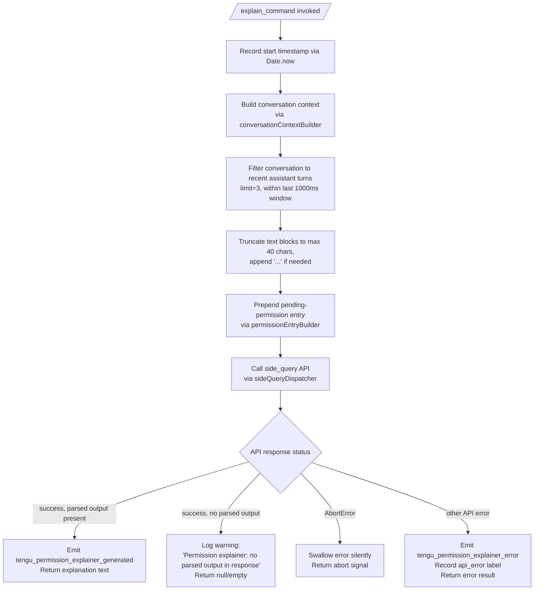

# `/explain_command`

> Analysis basis: CC v2.1.141 bundle.js (AST extraction + Claude interpretation)
> Minimum version: v2.1.141

---

## Overview

`/explain_command` is an internal tool-type command that generates human-readable explanations of why Claude Code is requesting a particular permission or tool invocation. It operates as a "permission explainer" sub-feature — accepting contextual information about a pending tool call, dispatching a side-query to the language model, and returning structured prose the UI can surface to the user in a permission-approval dialog.

---

## Registration

| Field | Value |
|---|---|
| type | `tool` |
| name | `explain_command` |
| description | `null` (not set in registration) |
| loc_byte | `12637915` |
| loc_byte_end | `12637951` |
| loc_line | `9272` |
| arbor_handler.name | `wbq` |
| arbor_handler.fqn | `claude-2.1.141::wbq` |
| arbor_handler.kind | `AsyncFunction` |
| arbor_handler.resolution_path | `direct` |
| arbor_handler.n_hits | `1` |

Analysis basis: CC v2.1.141 bundle.js:+12637915

The registration object spans bytes `(12637915, 12637951)`. The `description` field is explicitly `null`, meaning the command does not expose a human-readable description string in the tool registry. The literal string `"explain_command"` appears at byte `+12637933` and the literal `"permission_explainer"` at `+12637973` — the latter is used internally as the feature-label for telemetry and log scoping.

Analysis basis: CC v2.1.141 bundle.js:+12637933, +12637973

---

## Input Branching

The handler (`wbq`) exhibits four major distinct branches based on the outcome of the side-query API call:



Analysis basis: CC v2.1.141 bundle.js:+12637610, +12637655, +12637673, +12637820, +12638240, +12638396, +12638448, +12638497, +12638500, +12638610, +12638692, +12638745, +12638949, +12639068, +12639104, +12639139

---

## Behavioral Spec

### Main Handler (`wbq`)

```
async function permissionExplainerHandler(toolInput, appContext):
    startTime = Date.now()                          // +12637634

    // Step 1: Build conversation excerpt
    recentMessages = buildConversationContext(appContext)  // mg7, +12637655
    filteredMessages = filterAndTruncateMessages(recentMessages)  // pg7, +12637673

    // Step 2: Construct explainer prompt
    explainerPrompt = buildExplainerPrompt(toolInput, filteredMessages)  // m1, +12637820

    // Step 3: Dispatch side query to the model
    response = await dispatchSideQuery(explainerPrompt, appContext)  // gC, +12637833

    // Step 4: Validate and inspect response
    if response contains no parsed output:
        log("Permission explainer: no parsed output in response")  // +12638745
        return empty result

    emit telemetry("tengu_permission_explainer_generated", {...})  // +12638398, +12638500

    // Step 5: Check permission type
    isKnownPermissionType = checkPermissionType(toolInput)  // P9, +12638448
    featureFlags = resolveFeatureFlags(appContext)           // hH, +12638497

    // Step 6: Return structured explanation
    return {
        explanation: parsedOutput,
        durationMs: Date.now() - startTime
    }

exception AbortError:                                         // +12639068
    return abort sentinel                                     // silently handled

exception other:
    emit telemetry("tengu_permission_explainer_error", {label: "api_error"})  // +12638610, +12639139
    return error result
```

Analysis basis: CC v2.1.141 bundle.js:+12637610

---

### Conversation Context Builder (`conversationContextBuilder` / `mg7`)

```
function buildConversationContext(appContext):
    // Serialize conversation state for inclusion in the side-query prompt
    serialized = jsonStringify(appContext.messages)     // SH -> JSON.stringify, +12637120
    result = String(serialized)                         // +12637146
    return result
```

Analysis basis: CC v2.1.141 bundle.js:+12637655, +12637120

---

### Message Filter and Truncator (`filterAndTruncateMessages` / `pg7`)

```
function filterAndTruncateMessages(messages):
    // Keep only assistant-role messages
    filtered = messages.filter(m => m.role == "assistant")   // +12637209, +12637186

    // Retain last N=3 messages within last 1000ms
    recencyWindow = 1000                                      // +12637174
    maxMessages = 3                                           // +12637229
    reversed = filtered.reverse()                             // +12637254

    // Truncate text blocks to 40 characters
    truncated = []
    for message in reversed.slice(0, maxMessages):           // +12637397
        for block in message.content:
            if block.type == "text":                          // +12637312
                if block.text.length > 40:
                    block.text = block.text.slice(0, 40) + "..."  // +12637410
        truncated.unshift(message)                           // +12637418

    // Rejoin into a single formatted context string
    return truncated.join(separator)                         // +12637451
```

Constants:
- Recency window: 1000 ms (bundle.js:+12637174)
- Maximum retained messages: 3 (bundle.js:+12637229)
- Text block truncation threshold: 40 characters (bundle.js:+14489603)
- Truncation suffix: `"..."` (bundle.js:+12637410)

Analysis basis: CC v2.1.141 bundle.js:+12637186

---

### Explainer Prompt Builder (`buildExplainerPrompt` / `m1`)

```
function buildExplainerPrompt(toolInput, conversationExcerpt):
    // Resolve model alias for the side-query
    modelAlias = resolveModelAlias(toolInput.model)         // Ta -> zq, +2143511
    normalizedAlias = normalizeModelName(modelAlias)        // zq, +2143547

    // Build the structured prompt for the explainer query
    promptParts = assembleExplainerPromptParts(toolInput, conversationExcerpt)  // mJ, +2143560

    return {
        model: normalizedAlias,
        messages: promptParts,
        queryType: "side_query"                              // literal, +12273231
    }
```

Analysis basis: CC v2.1.141 bundle.js:+12637820, +2143511

---

### Side-Query Dispatcher (`dispatchSideQuery` / `gC`)

```
async function dispatchSideQuery(prompt, appContext):
    // Resolve authentication and API client
    apiClient = resolveApiClient(appContext)                 // vu, +12273199
    headers = buildRequestHeaders(appContext)                // iWH, +12273337

    // Check existing tool-use history to avoid duplicates
    existingExplanations = getExistingExplanations(appContext)  // im7, +12273383
    contentHash = computeContentHash(prompt)                // WQ_ -> ckq.createHash("sha256"), +12273392

    if contentHash already in existingExplanations:
        return cachedExplanation

    // Select model and build message list
    selectedModel = selectModelForQuery(appContext)          // sVH, +12274062
    messageList = buildMessageList(prompt, appContext)       // v$H, +12274550

    // Apply prompt-cache annotation if 1h cache config is active
    if cacheEnabled:                                         // lTH, +12275013
        annotateWithCacheControl(messageList)               // "cache_control", +12275098

    // Dispatch fetch to Anthropic API
    response = await fetch(apiEndpoint, {
        method: "POST",
        headers: headers,
        body: messageList,
        signal: AbortSignal.timeout(timeout)                // SF6, +2191719
    })

    // Apply permission-domain routing
    permissionRouted = routeByPermissionDomain(response)    // Dg, +12275031

    emit telemetry("tengu_api_success")                     // +12274655
    return permissionRouted
```

Analysis basis: CC v2.1.141 bundle.js:+12273199, +12273316, +12273392

---

### Permission Type Checker (`checkPermissionType` / `P9`)

```
function checkPermissionType(toolInput):
    // Determine whether the tool use is a known MCP tool or built-in
    if Object.hasOwn(toolInput, knownPermissionKey):        // +3094042
        return true
    if toolInput.name.startsWith("mcp_tool"):               // "mcp_tool", +3094122; +3094094
        return "mcp"
    return "builtin"
```

Analysis basis: CC v2.1.141 bundle.js:+12638448, +3094042, +3094094, +3094122

---

## State & Side Effects

| Item | Detail |
|---|---|
| Telemetry | `tengu_permission_explainer_generated` (success path, +12638398); `tengu_permission_explainer_error` (error path, +12638610); `tengu_api_success` (API layer, +12274655); `tengu_prompt_cache_1h_config` (cache annotation, +12235618); `tengu_config_parse_error` (config subsystem, +3143249); `tengu_oauth_token_refresh_*` family (auth layer, various bytes) |
| Hook registration | None detected in depth-2 traversal |
| appState changes | No direct appState mutations observed; read-only access to conversation history and auth context |
| Config access | Reads global/project config via config subsystem (`cMH`); config must be initialized before invocation — guarded by "Config accessed before allowed." error (bundle.js:+3142612) |
| File I/O | Config subsystem performs `readFileSync` (UTF-8, +3142668, +3142695), `statSync` (+3143209), `mkdirSync` (+3143428), `readdirSync` (+3143486), `copyFileSync` for backup rotation (+3143757); backup directory named `"backups"` (+3142180) |
| Auth side effects | OAuth token refresh may be triggered during API call; refresh telemetry emitted to `tengu_oauth_token_refresh_*` events |
| Sound | None detected |
| Network | Single HTTPS POST to Anthropic API endpoint; uses `AbortSignal.timeout`; response streamed via SSE reader |
| Content hash | SHA-256 (hex) computed over prompt content to detect duplicate explanation requests (bundle.js:+12230343, +12230370) |

---

## Version History

| Version | Change |
|---|---|
| v2.1.141 | Initial analysis |

---

## Common Mistakes

1. **Assuming `/explain_command` is a user-facing slash command.** It is registered as type `tool`, not `prompt`. It is invoked programmatically by the permission-approval UI layer, not directly typed by the user in the REPL.
2. **Expecting a `description` field.** The registration has `description: null`. No description string is exposed to the tool registry or help system.
3. **Not providing sufficient conversation context.** The handler only retains the last 3 assistant-role messages within a 1000 ms recency window. Callers that pass stale or empty conversation state will produce low-quality explanations.
4. **Ignoring the AbortError path.** The handler silently absorbs `AbortError` (bundle.js:+12639068). Callers should not treat a missing explanation as a hard failure; the permission dialog must handle the null/empty return gracefully.
5. **Sending MCP tool names without the `mcp_tool` prefix.** The permission-type checker (`P9`) uses `startsWith("mcp_tool")` to distinguish MCP tools from built-ins; names that deviate from this convention will be misclassified.
6. **Bypassing the content-hash cache.** The dispatcher (`gC`) deduplicates explanation requests using SHA-256 over the prompt. Callers that modify the prompt on every invocation defeat the cache and increase API costs.

---

## Appendix — Identifier Mapping

> For bundle debugging only. Identifiers change across versions.

| Identifier | Role |
|---|---|
| `wbq` | Main async handler for `explain_command` (arbor_handler, AsyncFunction) |
| `fc_` | Configuration loader called from main handler |
| `h6` | Config file watcher / config state manager |
| `x6` | Internal utility (path or value resolver) |
| `_9_` | Low-level config helper |
| `cMH` | Config read/write core (readFileSync, statSync, mkdirSync, copyFileSync) |
| `b6` | JSON parser wrapper (JSON.parse) |
| `DR` | String prefix/slice utility |
| `M8` | Config merge or apply helper |
| `rE9` | Directory reader and file resolver |
| `v` | Log-level or message formatter |
| `kH` | File watcher error handler / log-error dispatcher |
| `Q` | Generic async task queue or result container |
| `$9_` | Backup path builder |
| `w` | Background daemon session manager |
| `EhL` | File watch lifecycle manager |
| `Jl` | Watch-event debounce handler |
| `b9` | State-set mutation helper |
| `mg7` | Conversation context serializer |
| `SH` | JSON.stringify wrapper |
| `pg7` | Message filter and truncator |
| `H` | Random / timer utility (Math.random, setTimeout) |
| `A` | Case-folding / lowercase comparator |
| `f` | Socket or stream close manager |
| `L` | Promise/task lifecycle tracker |
| `m1` | Explainer prompt assembler |
| `Ta` | Prompt-part builder (top-level) |
| `qV` | Prompt sub-component builder |
| `m8H` | Prompt template utility |
| `uB` | Model name parser and validator |
| `M` | Model registry / map accessor |
| `K` | Column-width formatter |
| `bU6` | Model entry enumerator (Object.entries) |
| `lxH` | Language list inclusion checker |
| `ItA` | Model alias index locator |
| `nfL` | Capability inclusion checker |
| `TAH` | Known-model set membership tester |
| `zq` | Model name normalizer (trim, toLowerCase, replace) |
| `ifL` | Alias-to-id resolver |
| `mJ` | Prompt parts assembler (messages array) |
| `DX` | Prompt content-type dispatcher |
| `KA` | Plan-tier resolver |
| `pB` | Max-plan matcher |
| `ufH` | Team-plan matcher |
| `rxH` | Enterprise-plan matcher |
| `bV` | Model/version bound-checker |
| `qP` | First-party provider resolver |
| `pf` | Provider type discriminator |
| `WA` | API route builder |
| `DM` | Dynamic model config builder |
| `xV` | Versioned model alias resolver |
| `gC` | Side-query dispatcher (main API call) |
| `vu` | API client factory and request builder |
| `bD` | Async-local-storage store accessor |
| `BZL` | URL/path parser (split, trim, indexOf, slice) |
| `N1` | Session context accessor |
| `pc` | Session store getter |
| `Ml` | Locale/store resolver |
| `kl6` | Locale store getter |
| `V6` | Version or variant selector |
| `RH` | String coercion wrapper |
| `Xf` | OAuth flow orchestrator |
| `V8_` | OAuth token refresh with file-lock |
| `JO` | Token or credential holder |
| `pZL` | Request header assembler |
| `hmH` | Header builder with timestamp |
| `Z_` | Credential or scope resolver |
| `yu6` | Proxy auth helper executor |
| `H2H` | Proxy response handler |
| `YSA` | Proxy auth response parser |
| `NoK` | Numeric timeout parser |
| `ER` | Error result builder |
| `cj` | Proxy credential injector |
| `QZL` | API streaming session manager |
| `UM` | Usage-metrics accumulator |
| `dZL` | Header redaction/filtering helper |
| `gZL` | Log-level message router |
| `L8_` | Token budget calculator (Math.max, Number) |
| `FZL` | SSE stream reader with watchdog |
| `yw` | Provider-route classifier |
| `RU6` | Route builder (WA + RH) |
| `X4L` | Header prefix matcher |
| `SU6` | Case-insensitive provider resolver |
| `Kz` | Proxy config resolver |
| `yc` | Proxy URL parser |
| `JC6` | Proxy credential loader |
| `DSA` | Proxy auth finalizer |
| `UZL` | API client initializer |
| `zl6` | SDK instance builder |
| `MV` | SDK module version setter |
| `phH` | Platform header builder |
| `rjH` | Region/endpoint resolver |
| `bA` | OAuth endpoint validator |
| `FfH` | Gateway JWT refresh orchestrator |
| `hV8` | JWT expiry checker |
| `mML` | Gateway token refresh HTTP caller |
| `oV6` | Gateway token response parser |
| `yV8` | Timestamp annotator |
| `p46` | Header key lowercaser |
| `hMH` | SDK error/warn logger |
| `S` | Window focus / away-summary trigger |
| `XF` | Away-summary generator |
| `N` | Away-summary cache checker |
| `Z` | Generic abort/cancel token |
| `Icq` | Rate-limit checker |
| `V` | Regex match helper |
| `W` | Skill/tool reload debouncer |
| `z` | Daemon or background worker set |
| `w$H` | Config-change broadcaster |
| `bBH` | Tool-list membership tester |
| `Dz8` | Debounce state tracker |
| `eHH` | Permission response dispatcher |
| `TrH` | Permission cache clearer |
| `ej` | Agent session builder |
| `j$` | Agent auth resolver |
| `FR` | API response formatter |
| `FU6` | Response wrapper builder |
| `JL` | Message role tagger |
| `Q46` | Result code classifier |
| `ja` | OAuth file-descriptor reader |
| `yu` | Auth context merger |
| `LuH` | WIF (Workload Identity Federation) credential resolver |
| `SF6` | WIF token exchange HTTP caller |
| `hH` | Feature-flag success emitter |
| `xH` | Feature-flag failure emitter |
| `FML` | Provider inclusion filter |
| `G` | MCP server token store |
| `rX6` | Token store getter |
| `gT8` | Token store setter |
| `P` | Socket/stream data framer |
| `j` | Background worker handle |
| `yf` | Stream write/end helper |
| `N15` | Background daemon IPC protocol handler |
| `k15` | Protocol frame encoder |
| `$` | IPC socket writer |
| `pw` | Background service descriptor |
| `Lo_` | IPC lease tracker |
| `s6K` | IPC dispatch rate-limiter |
| `a8` | Abort-aware async timer |
| `BG` | Socket path builder |
| `m$` | Real-path resolver |
| `t7H` | JSONL conversation file reader |
| `I15` | Stall detector (Math.max, j6) |
| `u` | IPC write-with-timeout helper |
| `p` | Interval-based keepalive |
| `j6H` | Session lifecycle logger |
| `NK` | Named-pipe path builder |
| `v15` | Worker bootstrap sequence |
| `qH` | Input focus ref tracker |
| `b` | Terminal supervisor heartbeat writer |
| `o` | Voice recording session manager |
| `F` | MCP tool-name filter |
| `g` | Permission classify/allow/deny router |
| `c` | PTY write proxy |
| `l` | Tool-result filter |
| `_Z6` | Raw socket write/destroy helper |
| `TH` | String identity coercer |
| `iWH` | Request header injector (model, auth) |
| `v1` | Model-string sanitizer |
| `Sw` | Model-name case normalizer |
| `$I8` | Model ID validator |
| `KP` | Model string replacer |
| `Uy` | API route builder (WA wrapper) |
| `im7` | Existing explanation finder (H.find, A.find) |
| `WQ_` | SHA-256 content hasher |
| `Qi6` | Cache-hit explanation loader |
| `mq` | String coercer |
| `gi6` | Cache-miss path initializer |
| `sVH` | Model-selection and context-window builder |
| `KI8` | Context-window size resolver |
| `j6` | Tool-registration and config-change dispatcher |
| `b76` | Tool registration helper A |
| `x76` | Tool registration helper B |
| `Js` | Tool state tracker |
| `vi6` | Tool deduplication checker |
| `LI8` | Tool list builder |
| `hE` | Env/platform header builder |
| `z8_` | WA-based route constructor |
| `Xyq` | Message transform helper |
| `Xl6` | Temperature / sampling param injector |
| `h2` | Message-role mapper |
| `v$H` | Message-list builder with cache annotation |
| `hu` | Temp-file and random-bytes manager |
| `e6` | Config write orchestrator |
| `q5` | Model context builder |
| `mw` | Agent turn orchestrator |
| `t4H` | Tool-input validator |
| `lTH` | Cache-control annotation injector |
| `CA4` | Cache-control applicator |
| `cTH` | Cache-control type builder |
| `Dg` | Permission-domain router |
| `RA4` | Agent-type prefix resolver |
| `f68` | Custom-agent path builder |
| `lM_` | Slash-index extractor |
| `Q$H` | Thread-name prefix checker |
| `HH6` | Final response packager |
| `P9` | Permission-type classifier (MCP vs builtin) |
| `D8` | Feature-flag sad-path emitter |

---

Note: index built via Arbor fallback; some signals (telemetry, literals) may be missing — see arbor-fallback.js.