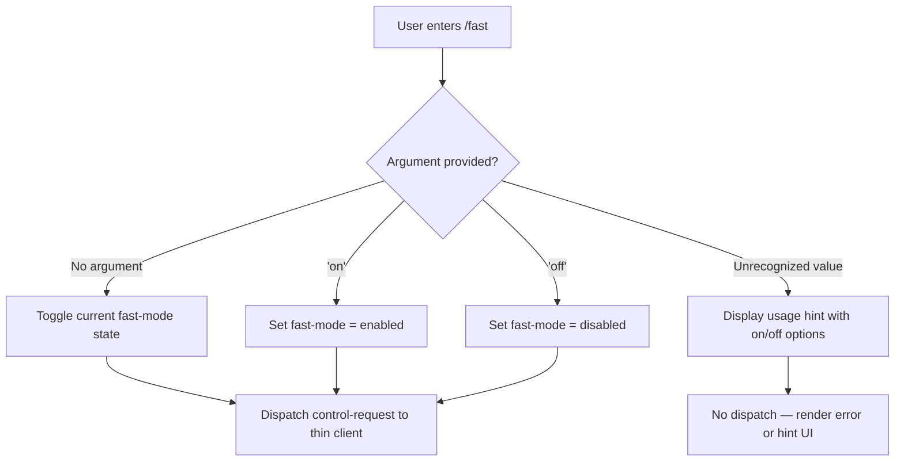

# `/fast`

> Analysis basis: CC v2.1.139 bundle.js (AST extraction + Claude interpretation)
> Minimum version: v2.1.139

---

## Overview

The `/fast` command is a local JSX-rendered slash command that toggles or explicitly sets a "fast mode" state within Claude Code. It accepts an optional `on` or `off` argument and dispatches a control request to the thin client layer rather than executing inline logic. Due to the absence of recoverable entry functions in module `bDq`, behavioral details beyond registration metadata are limited to what the registration record itself reveals.

## Registration

| Field | Value |
|---|---|
| type | `local-jsx` |
| name | `fast` |
| description | *(null — no description string registered)* |
| argumentHint | `[on\|off]` |
| thinClientDispatch | `control-request` |
| module_id | `bDq` |
| loc_line | 6905 |

Analysis basis: CC v2.1.139 bundle.js:+11238047

---

## Input Branching

The `argumentHint` field (`[on|off]`) indicates the command accepts zero or one positional argument. The bracket notation signals the argument is optional. Based on the registration structure and the `thinClientDispatch: "control-request"` field, the expected branching is:



> **Important caveat:** The branching logic above is inferred solely from the `argumentHint` value and the `thinClientDispatch` field in the registration record. No entry-function call graph was recoverable for module `bDq`. Actual branching may differ.
>
> Analysis basis: CC v2.1.139 bundle.js:+11238047

---

## Behavioral Spec

### Command Dispatch

Because `thinClientDispatch` is set to `"control-request"`, the command does not resolve its behavior purely in the local render process. Instead it forwards a structured control message to the thin client layer. The pseudocode below models the expected dispatch path:

```
function handleFastCommand(rawArgument):
    normalizedArg = trim(lowercase(rawArgument))

    if normalizedArg == "on":
        desiredState = ENABLED
    else if normalizedArg == "off":
        desiredState = DISABLED
    else if normalizedArg == "":
        desiredState = TOGGLE
    else:
        renderUsageHint("[on|off]")
        return

    controlRequest = buildControlRequest(
        command = "fast",
        payload = { targetState: desiredState }
    )
    dispatchToThinClient(controlRequest)
```

> **Note:** `buildControlRequest` and `dispatchToThinClient` are descriptive placeholders. No concrete call graph edges were found for module `bDq` at traversal depth ≤ 2.
>
> Analysis basis: CC v2.1.139 bundle.js:+11238047

### JSX Rendering

The `type: "local-jsx"` registration field indicates the command renders a React/JSX component in the CLI output area (as opposed to a plain-text or server-rendered response). The rendered output likely reflects the new fast-mode state after the control request is acknowledged.

```
function renderFastCommandResult(newState):
    if newState == ENABLED:
        return <StatusBadge label="Fast mode ON" variant="active" />
    else if newState == DISABLED:
        return <StatusBadge label="Fast mode OFF" variant="inactive" />
    else:
        return <UsageHint syntax="/fast [on|off]" />
```

> Analysis basis: CC v2.1.139 bundle.js:+11238047

---

## State & Side Effects

| Item | Detail |
|---|---|
| Telemetry | None detected — telemetry array is empty for this command |
| Hook registration | <!-- TODO: not found in depth-2 traversal; needs --depth 4 --> |
| appState changes | <!-- TODO: not found in depth-2 traversal; needs --depth 4 --> |
| Sound | <!-- TODO: not found in depth-2 traversal; needs --depth 4 --> |
| Thin-client dispatch | Emits a `control-request` message to the thin client on valid invocation |
| Render type | `local-jsx` — output is a JSX component rendered in the CLI UI |

---

## Version History

| Version | Change |
|---|---|
| v2.1.139 | Initial analysis — registration record confirmed; entry-function traversal returned no results for module `bDq` |

---

## Common Mistakes

1. **Passing an unrecognized argument** — Only `on` and `off` are indicated by the `argumentHint`. Passing any other string (e.g., `/fast yes`, `/fast 1`) is likely to produce a usage hint rather than a state change.
2. **Expecting inline execution** — Because this command uses `thinClientDispatch: "control-request"`, the state change is not applied synchronously in the local process. Side effects depend on the thin client acknowledging the request.
3. **Assuming a description string exists** — The `description` field is `null` in the registration record. Help text surfaces that enumerate command descriptions may show this command as blank or omit it entirely.
4. **Treating the argument as required** — The bracket notation `[on|off]` explicitly marks the argument as optional. Invoking `/fast` with no argument should toggle the current state rather than failing.
5. **Expecting telemetry confirmation** — No `tengu_*` telemetry events are registered for this command. Observability tooling that relies on telemetry events will receive no signal from `/fast` invocations.

---

## Appendix — Identifier Mapping

> For bundle debugging only. Identifiers change across versions.

| Identifier | Role |
|---|---|
| `bDq` | Module ID for the `/fast` command implementation (not a runtime identifier; used by the bundler to reference the command's source module) |

> No obfuscated runtime identifiers were recovered from the depth-2 AST traversal of module `bDq`. The identifiers array returned empty. If deeper traversal (`--depth 4`) is run against this module, this table should be updated with any mangled names discovered.