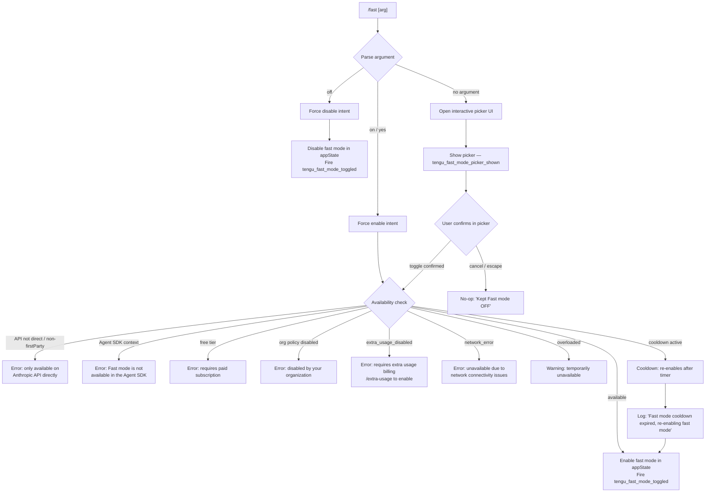

# `/fast`

> Analysis basis: CC v2.1.141 bundle.js (AST extraction + Claude interpretation)
> Minimum version: v2.1.141

---

## Overview

`/fast` toggles **Fast mode** — a research-preview capability that routes requests through a higher-throughput inference path available exclusively on the Anthropic API (direct). When invoked without an argument the command opens an interactive picker UI; with `on` or `off` it sets the state directly. The command performs availability checks (subscription tier, org policy, network status, Agent SDK context) before committing the state change and fires the `tengu_fast_mode_toggled` telemetry event on every confirmed toggle.

---

## Registration

| Field | Value |
|---|---|
| type | `local-jsx` |
| name | `fast` |
| description | `Toggle fast mode ( ... only)` |
| argumentHint | `[on\|off]` |
| immediate | `null` |
| thinClientDispatch | `control-request` |
| isHidden | `null` |
| module_id | `TPq` |
| load_inline | `true` |
| loc_byte | `11298192` |
| loc_byte_end | `11298469` |
| loc_line | `6947` |
| arbor_handler.name | `_V7` |
| arbor_handler.fqn | `claude-2.1.141::_V7` |
| arbor_handler.kind | `AsyncFunction` |
| arbor_handler.resolution_path | `module_id` |
| arbor_handler.n_hits | `3` |

Analysis basis: CC v2.1.141 bundle.js:+11298192

---

## Input Branching

Five or more distinct runtime paths exist (argument value × availability state × UI mode), so a Mermaid flowchart is used.



Analysis basis: CC v2.1.141 bundle.js:+11297238 (handler entry `_V7`), +2132460 (free-tier literal), +2132618 (org-policy literal), +2132964 (API-direct error), +2133216 (Agent SDK error), +2132673 (extra_usage_disabled), +2132797 (network literal), +11296449 (overloaded literal), +2134267 (cooldown literal)

---

## Behavioral Spec

### Main Handler (`_V7`)

```
async function fastModeHandler(args, appState):
    argument = args[0]  // "on", "off", or undefined

    if argument == "off":
        setFastMode(appState, enabled=false)
        emitTelemetry("tengu_fast_mode_toggled", {value: "off"})
        return renderStatusLine("Fast mode OFF")

    if argument in ["on", "yes"]:
        result = await checkFastModeAvailability(appState)
        if result.available:
            setFastMode(appState, enabled=true)
            emitTelemetry("tengu_fast_mode_toggled", {value: "on"})
        else:
            return renderError(result.message)
        return

    // No argument — show interactive picker
    emitTelemetry("tengu_fast_mode_picker_shown")
    showFastModePicker(appState)
```

Analysis basis: CC v2.1.141 bundle.js:+11297238, +11297252, +11297371

---

### Availability Check (`checkAvailability` / call-chain through `Xa`)

```
async function checkFastModeAvailability(appState):
    // Step 1: Confirm API provider is direct Anthropic
    provider = getApiProvider(appState)
    if provider not in ["firstParty"] or provider in
            ["bedrock", "foundry", "anthropicAws", "mantle", "vertex"]:
        return {available: false,
                message: "Fast mode is only available when using the Anthropic API directly"}

    // Step 2: Reject Agent SDK context
    if runningInsideAgentSDK(appState):
        return {available: false,
                message: "Fast mode is not available in the Agent SDK"}

    // Step 3: Check subscription tier
    subscriptionTier = getUserTier(appState)
    if subscriptionTier == "free":
        return {available: false,
                message: "Fast mode requires a paid subscription"}

    // Step 4: Check organisation policy
    orgPolicy = getOrgFastModePolicy(appState)
    if orgPolicy == "preference" (disabled):
        return {available: false,
                message: "Fast mode has been disabled by your organization"}

    // Step 5: Check extra-usage billing gate
    if featureFlag == "extra_usage_disabled":
        return {available: false,
                message: "Fast mode requires extra usage billing · /extra-usage to enable"}

    // Step 6: Check network availability
    networkState = getNetworkState(appState)
    if networkState == "network_error":
        return {available: false,
                message: "Fast mode unavailable due to network connectivity issues"}

    // Step 7: Check overload status
    if fastModeStatus == "overloaded":
        return {available: false, severity: "warning",
                message: "Fast mode overloaded and is temporarily unavailable"}

    return {available: true}
```

Analysis basis: CC v2.1.141 bundle.js:+2132964 (API-direct check), +2006501 (bedrock), +2006551 (foundry), +2006607 (anthropicAws), +2006661 (mantle), +2006709 (vertex), +2133216 (Agent SDK), +2132460 (free tier), +2132618 (org disabled), +2132673 (extra_usage_disabled), +2132797 (network error), +11296449 (overloaded)

---

### Prefetch / Caching Logic (`cxH`)

The handler also orchestrates a background prefetch of Fast mode eligibility to reduce latency on subsequent calls.

```
async function prefetchFastModeStatus(appState):
    if inFlightPromise exists:
        log("Fast mode prefetch in progress, returning in-flight promise")
        return inFlightPromise

    lastFetchTime = getLastFetchTimestamp(appState)
    if (Date.now() - lastFetchTime) < RECENT_THRESHOLD:
        log("Skipping fast mode prefetch, fetched recently")
        return

    auth = await resolveAuth(appState)
    if auth == null:
        log("No auth available")
        return

    try:
        response = await callFastModeStatusEndpoint(auth)
        cacheFastModeResult(appState, response)
    catch (err):
        if isAxiosError(err) and err.status in [401, 403]:
            handleOAuthRecovery(err)
        else:
            emitTelemetry("tengu_org_penguin_mode_fetch_failed")
        setFastModeStatus(appState, "network_error")
```

Analysis basis: CC v2.1.141 bundle.js:+2136706 (in-flight log), +2136953 (skip log), +2137129 (no auth log), +2137222 (axios error check), +2137264 (401), +2137290 (403), +2138125 (telemetry)

---

### Interactive Picker UI (`Xj8` / `Pj8`)

```
function renderFastModePicker(appState):
    currentFastMode = appState.fastMode         // "fastMode" key
    currentModel   = appState.model

    display:
        title = " Fast mode (research preview)"
        rows:
            - label "Fast mode"  value "ON " | "OFF"
            - availability warning if overloaded
            - "You've hit your fast limit · resets in <countdown>"
              (rendered when rate-limited; countdown uses s1 formatter)
            - link: https://code.claude.com/docs/en/fast-mode

    key bindings:
        tab   → toggle
        enter → confirm
        escape / cancel → dismiss ("Kept Fast mode OFF")

    on confirm:
        if toggled:
            call fastModeHandler(["on"|"off"], appState)
            emitTelemetry("tengu_fast_mode_toggled")
```

Analysis basis: CC v2.1.141 bundle.js:+11296208 ("Fast mode"), +11296277 ("ON"), +11296283 ("OFF"), +11296449 (overloaded), +11296503 (rate-limit message), +11296532 (" · resets in "), +11296723 (docs URL), +11295501 (" Fast mode (research preview)"), +11294896 ("Kept Fast mode OFF"), +11293939 ("Fast mode OFF"), +11297412 ("shortcut")

---

### Cooldown Auto-Recovery (`mi8`)

```
function monitorFastModeCooldown(appState):
    if fastModeState == "cooldown":
        startTimer():
            onExpiry:
                log("Fast mode cooldown expired, re-enabling fast mode")
                setFastMode(appState, enabled=true)
                emitTelemetry("tengu_fast_mode_toggled")
```

Analysis basis: CC v2.1.141 bundle.js:+2134214 ("cooldown"), +2134267 (cooldown-expired log), +2134327 (`YtA.emit`)

---

### Status Display Rendering

The command renders a compact status footer in the JSX output:

```
function renderFastModeStatusFooter(fastModeState):
    if fastModeState == "enabled (cached)":
        show green indicator
    if fastModeState == "disabled (network_error)":
        show dim/warning indicator

    countdown display:
        format = humaniseMs(resetTimestamp - Date.now())
        // uses thresholds: 86400000 ms (days), 3600000 ms (hours),
        //                  60 (minutes), else seconds
        // fallback: "0s"
```

Analysis basis: CC v2.1.141 bundle.js:+2138052 ("enabled (cached)"), +2138071 ("disabled (network_error)"), +203613 ("0s"), +203718 (86400000), +203752 (3600000), +203825 (60)

---

### AppState Key Mapping (`ULH` / `jj8`)

The command reads and writes several appState keys during execution:

| appState key | Purpose |
|---|---|
| `fastMode` | Boolean enable/disable state |
| `model` | Current model identifier (e.g., `"opus-4-6"`, `"opus-4-7"`) |
| `cacheBreakerPhrase` | Cache-busting string injected into requests |
| `autoCompactWindow` | Compact window configuration |
| `briefTranscript` | Transcript brevity flag |
| `isBriefOnly` | Brief-only mode flag |

Analysis basis: CC v2.1.141 bundle.js:+11293066 ("fastMode"), +11293149 ("model"), +11292582 ("cacheBreakerPhrase"), +11292723 ("autoCompactWindow"), +11292860 ("briefTranscript"), +11292971 ("isBriefOnly")

---

## State & Side Effects

| Item | Detail |
|---|---|
| Telemetry: `tengu_fast_mode_toggled` | Fired on every confirmed on/off toggle (bundle.js:+11293768) |
| Telemetry: `tengu_fast_mode_picker_shown` | Fired when the interactive picker is rendered (bundle.js:+11297461) |
| Telemetry: `tengu_org_penguin_mode_fetch_failed` | Fired when background eligibility fetch fails (bundle.js:+2138125) |
| Telemetry: `tengu_penguins_off` | Fired when fast mode is switched off via the availability path (bundle.js:+2133070) |
| Telemetry: `tengu_config_parse_error` | Fired on settings file parse failures during prefetch (bundle.js:+3143249) |
| Telemetry: `tengu_config_lock_contention` | Fired when config lock is slow to acquire (bundle.js:+3140668) |
| Telemetry: `tengu_config_stale_write` | Fired on stale config write detection (bundle.js:+3140804) |
| Telemetry: `tengu_config_auth_loss_prevented` | Fired when auth-wipe prevention triggers (bundle.js:+3141147) |
| Telemetry: `tengu_oauth_401_sdk_callback_refreshed` | OAuth token refresh on 401 (bundle.js:+2907761) |
| Telemetry: `tengu_oauth_401_recovered_from_disk` | OAuth recovery from disk (bundle.js:+2908456) |
| Telemetry: `tengu_oauth_401_recovered_from_keychain` | OAuth recovery from keychain (bundle.js:+2908809) |
| Telemetry: `tengu_feature_ok` / `tengu_feature_bad` | Feature flag evaluation outcome (bundle.js:+945566, +945624) |
| Telemetry: `tengu_daemon_yield` | Daemon yield event during background work (bundle.js:+14482794) |
| appState changes | Writes `fastMode` boolean; may also update cached status fields |
| Background prefetch | Spawns async HTTP call to verify eligibility and caches result; uses `H` (timer) and `Math.random` for jitter (bundle.js:+12516058) |
| thinClientDispatch | `control-request` — dispatched to thin client in remote/proxy sessions |
| Settings persistence | On toggle, writes updated setting via `jR6` → `K5H.writeFile` / `K5H.appendFile` path (bundle.js:+1051348) |
| Sound | <!-- TODO: not found in depth-2 traversal; needs --depth 4 --> |

---

## Version History

| Version | Change |
|---|---|
| v2.1.141 | Initial analysis — Fast mode toggle with interactive picker, availability gating, cooldown auto-recovery, and background prefetch cache |

---

## Common Mistakes

1. **Using `/fast on` on a non-direct API provider** (Bedrock, Vertex, AWS, Mantle, Foundry): the command will immediately return the error "Fast mode is only available when using the Anthropic API directly" and will not change any state.
2. **Using `/fast on` inside an Agent SDK session**: Fast mode is explicitly blocked and returns "Fast mode is not available in the Agent SDK".
3. **Expecting `/fast off` to trigger an availability check**: The `off` direction bypasses all availability checks and immediately disables the feature.
4. **Ignoring the cooldown state**: When Fast mode enters cooldown the timer auto-recovers; manually toggling `/fast off` then `/fast on` during cooldown may conflict with the automatic recovery.
5. **Assuming the picker argument is case-sensitive**: The argument is normalised to lowercase before comparison — `ON`, `On`, `YES` all resolve to the enable path.

---

## Appendix — Identifier Mapping

> For bundle debugging only. Identifiers change across versions.

| Identifier | Role |
|---|---|
| `_V7` | Main async handler for `/fast` command (arbor_handler) |
| `qK` | App state reader / getter utility |
| `WA` | API provider / auth context resolver |
| `RH` | String utility / formatting helper |
| `H` | Timer wrapper (Math.random + setTimeout jitter) |
| `Xa` | Availability check orchestrator |
| `j6` | Feature-flag / Growthbook experiment evaluator |
| `b76` | Growthbook experiment helper A |
| `x76` | Growthbook experiment helper B |
| `Js` | Feature-flag string resolver |
| `ws` | Flag store subscriber |
| `vi6` | Feature-flag cache lookup and setter |
| `mA_` | Growthbook experiment event emitter |
| `cA_` | Experiment result recorder |
| `h6` | Config file read/copy utility |
| `x6` | File-system error classifier |
| `_9_` | Config path resolver |
| `cMH` | Config backup and read helper |
| `EhL` | File-watch setup/teardown |
| `v` | Logging / debug output utility |
| `J7K` | Debug log formatter |
| `Qt_` | Log level gate (jKK / PKK) |
| `SH` | JSON stringify wrapper |
| `_` | General string / array utility |
| `t7` | Request-body redaction helper |
| `T6A` | Sensitive-key mapper |
| `q` | Node `fs` sync operations wrapper |
| `A` | String normalisation (toLowerCase etc.) |
| `MSH` | Terminal write helper |
| `M6A` | Raw terminal write |
| `X7K` | Transcript / log-file writer |
| `bhH` | Debounced write queue |
| `A_H` | Log-file path builder |
| `Cv8` | Log directory size checker |
| `y6A` | Log file path joiner |
| `k6A` | Log file rotate-on-size utility |
| `P7K` | Log file append worker |
| `b9` | Active-session tracker (Set operations) |
| `Z_` | Client identifier constant |
| `DH6` | VS-Code client detection (`claude-vscode`) |
| `Nv` | Auth / network state flag |
| `I8` | Settings store accessor |
| `$C6` | Settings cache reader |
| `Pt_` | Settings Map.has / Map.get lookup |
| `Bm8` | Settings object builder (policySettings, flagSettings) |
| `Xt_` | Settings Map.set writer |
| `xi8` | Current app-state snapshot getter |
| `ufL` | OAuth/API-key auth selector |
| `cxH` | Fast-mode prefetch coordinator (async) |
| `Vq` | Auth header builder |
| `cMA` | Header key formatter |
| `ej` | API client initialiser |
| `j$` | Anthropic API client factory |
| `JL` | API key / environment variable reader |
| `yu` | Auth token resolver (env + settings) |
| `G8_` | API key helper config reader |
| `$V` | Auth mode selector |
| `pl8` | File-descriptor key reader |
| `IR` | Key slicer (first 20 chars) |
| `NE` | App-state write helper |
| `UfL` | Request auth header injector |
| `bA` | OAuth URL validator |
| `bfA` | OAuth URL allow-list checker |
| `zIK` | OAuth URL environment builder |
| `Du` | OAuth 401 retry manager |
| `PVL` | OAuth 401 recovery flow |
| `oWH` | OAuth retry gate |
| `g46` | OAuth token refresh caller |
| `AH6` | OAuth recovery state tracker |
| `Q` | React / JSX element factory shim |
| `hH` | Feature-flag "ok" event emitter |
| `xH` | Feature-flag "bad" event emitter |
| `ja` | File-descriptor token reader |
| `aK` | Async IEA caller |
| `U8H` | OAuth recovery result merger |
| `kH` | API request executor with error logging |
| `Xf` | Request retry wrapper |
| `m_` | Settings loader from disk |
| `Jf` | Settings file path resolver |
| `Xc` | Settings directory resolver |
| `ahK` | Settings watcher setup |
| `ky` | Settings join-path helper |
| `ohK` | Managed-settings path resolver |
| `Oo` | Settings file existence checker |
| `hD` | Per-project settings reader |
| `MB` | Raw settings file reader (readFileSync) |
| `$8` | File write helper (M8) |
| `M8` | Atomic file write utility |
| `Fu8` | Settings load timestamp recorder |
| `$CH` | Atomic safe-write (tmp + rename) |
| `O` | fs.lstat / symbolic-link checker |
| `f` | File handle / close utility |
| `ZY` | Settings cache clear (kV6 + XZ8) |
| `jR6` | Settings persist-to-disk worker |
| `N6` | Git check-ignore runner |
| `vu8` | VL path helper |
| `hu8` | M_ git runner |
| `WyK` | Home-dir config path builder |
| `e8` | Settings existence helper |
| `ex` | Settings load + telemetry wrapper |
| `rS` | Settings load span opener |
| `T1` | Memory-usage sampler |
| `Fm8` | Full settings load pipeline |
| `yV6` | Settings load span closer |
| `e6` | Global config save helper |
| `M9_` | Config save with lock and backup |
| `L` | fs async / sync operations (mkdirSync, statSync, etc.) |
| `XeA` | Config object merger |
| `F76` | Config auth-loss guard |
| `$9_` | Backup path joiner |
| `Z` | Config entry prefix checker |
| `X` | MCP SDK client factory |
| `V` | Config backup slicer |
| `XpH` | Config field enumerator |
| `iE9` | Config entries iterator |
| `WpH` | Config write timestamp recorder |
| `f9_` | Global config fallback writer |
| `K` | Terminal column/row formatter |
| `Pj8` | Fast-mode JSX panel builder |
| `jj8` | AppState parameter parser (cacheBreakerPhrase, autoCompactWindow, fastMode, model…) |
| `CfH` | Flag-settings applicator |
| `pN` | V3 / CCR mode checker |
| `V3` | CCR context identifier |
| `dxH` | Model-name display formatter |
| `uc` | Model display string builder |
| `qP` | Model picker data provider |
| `ULH` | AppState schema type parser (String / Number / Boolean) |
| `gY` | AppState read + DX dispatcher |
| `DX` | AppState field dispatcher |
| `zq` | Model-alias normaliser (opusplan, sonnet, haiku, best…) |
| `owH` | Fast-mode panel status row renderer |
| `Vs` | Theme resolver |
| `t76` | Theme name mapper |
| `zr6` | Theme include-list checker |
| `iMH` | ANSI prefix stripper |
| `FV9` | Theme colour resolver |
| `f7` | Fast-mode availability status fetcher |
| `WE` | Active-session set manager |
| `YA` | Foreground colour parser (rgb, ansi256, ansi:) |
| `_3H` | Chalk colour dispatcher |
| `PF` | Colour fallback handler |
| `Yu` | Model display-name formatter |
| `kE` | Number format helper (ZtA) |
| `ZtA` | Integer / fixed-decimal formatter |
| `X2H` | AppState qK-based updater |
| `Xj8` | Fast-mode picker interactive component (React) |
| `f6` | AppState useSyncExternalStore hook |
| `wL_` | AppState context accessor |
| `d_` | AppState store subscriber |
| `mi8` | Fast-mode cooldown timer + re-enable emitter |
| `$` | XTq status writer |
| `XTq` | Daemon status file writer |
| `Ia` | Status message formatter |
| `mfH` | Status line trimmer |
| `p7` | AsyncLocalStorage store getter |
| `b06` | Daemon status file path builder |
| `n_` | MCP handler registrar (useEffect-based) |
| `g2` | MCP context reader |
| `M` | MCP server map manager |
| `SvH` | MCP server connection worker |
| `$HH` | MCP transport factory |
| `hI` | MCP client initialiser |
| `__` | String normaliser wrapper |
| `rX6` | MCP server dedup filter |
| `xL7` | MCP reconnect timer |
| `$78` | MCP tool-list fetcher |
| `M78` | MCP aK caller |
| `_8` | MCP debug logger |
| `Nh_` | MCP OAuth authenticate tool handler |
| `kh_` | MCP OAuth complete_authentication tool handler |
| `sHq` | MCP rh_ + p7 request runner |
| `Ih_` | MCP tool invocation wrapper |
| `fG_` | MCP tool-call filter |
| `J` | Process kill map |
| `y` | Daemon write / supervisor logger |
| `_7` | MCP error logger |
| `TH` | String coercion helper |
| `iHq` | MCP U$H state reader |
| `oX6` | MCP port parser A |
| `oh_` | MCP port parser B |
| `Eeq` | MCP server update applier |
| `fY8` | MCP SH status formatter |
| `sI` | MCP cleanup runner |
| `XA5` | MCP full server reconciler |
| `z78` | MCP tool-set membership checker |
| `a8` | Abort-controller / timeout wrapper |
| `irH` | MCP SH state serialiser |
| `s1` | Human-readable duration formatter (floor/round) |

---

Note: index built via Arbor fallback; some signals (telemetry, literals) may be missing — see arbor-fallback.js.