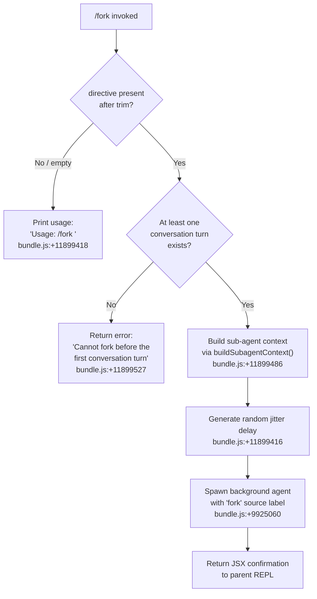

# `/fork`

> Analysis basis: CC v2.1.141 bundle.js (AST extraction + Claude interpretation)
> Minimum version: v2.1.141

---

## Overview

`/fork` spawns a background sub-agent that inherits the full current conversation context (messages, system prompt, tool permission settings, and memory state). The caller provides a short directive string that becomes the forked agent's initial task instruction. The parent session continues interactively while the background agent runs independently.

---

## Registration

| Field | Value |
|---|---|
| type | `local-jsx` |
| name | `fork` |
| description | `Spawn a background agent that inherits the full conversation` |
| argumentHint | `<directive>` |
| module_id | `Kvq` |
| load_inline | `true` |
| loc_byte | `11899789` |
| loc_byte_end | `11899985` |
| loc_line | `7943` |
| arbor_handler.name | `Kb7` |
| arbor_handler.fqn | `claude-2.1.141::Kb7` |
| arbor_handler.kind | `AsyncFunction` |
| arbor_handler.resolution_path | `module_id` |
| arbor_handler.n_hits | `0` |

Analysis basis: CC v2.1.141 bundle.js:+11899789

---

## Input Branching

There are three distinct paths based on directive presence and conversation state.



---

## Behavioral Spec

### Handler Entry — `forkCommandHandler` (`Kb7`)

```
async function forkCommandHandler(input):
    directive = input.trim()                          // bundle.js:+11899394
    if directive is empty:
        display "Usage: /fork <directive>"            // bundle.js:+11899418
        return

    jitter = randomJitter()                           // bundle.js:+11899416
    context = buildSubagentContext(directive)         // bundle.js:+11899486

    if context indicates no prior turn:
        display "Cannot fork before the first conversation turn"  // bundle.js:+11899527
        return

    spawn background agent with context              // bundle.js:+9925060
    return confirmation UI element
```

Analysis basis: CC v2.1.141 bundle.js:+11899394

---

### Context Snapshot — `buildSubagentContext` (`SR_`)

Assembles the complete context package that the background agent will inherit.

```
function buildSubagentContext(directive):
    systemPrompt  = captureSystemPrompt()            // bundle.js:+9924990
    replContexts  = getReplContexts()                // bundle.js:+9925100
    messageSlice  = getConversationMessages(50, 49)  // bundle.js:+9925245, +9925258
    uniqueId      = generateHexId(8 bytes)           // bundle.js:+9925275 (randomBytes, 8 bytes, hex)
    timestamp     = Date.now()                       // bundle.js:+9925302
    agentContext  = buildAgentRegistration(          // bundle.js:+9925315
                      uniqueId, timestamp,
                      type="local_agent",            // bundle.js:+9660742
                      status="running",              // bundle.js:+9660787
                      kind="general-purpose"         // bundle.js:+9660861
                    )
    toolPerms     = getToolPermissionContext()        // bundle.js:+9925547
    subagentState = buildSubagentState(              // bundle.js:+9925729
                      source="subagent",             // bundle.js:+9925744
                      spawnMode="spawn"              // bundle.js:+9925809
                    )
    agentMemory   = captureMemoryPrompt()            // bundle.js:+9925901
    yYHContext    = buildModelAndOutputContext()     // bundle.js:+9925503
    return assembled context object
```

Analysis basis: CC v2.1.141 bundle.js:+9924973

---

### Sub-agent System Prompt Composition (`xM7`)

Builds the full system prompt for the background agent by assembling multiple sections.

```
function buildAgentSystemPrompt(appState):
    sections = []
    sections.push(getAppState())                     // bundle.js:+9926568
    promptSections = Array.from(sectionBuilders)     // bundle.js:+9926668
    // Sections contributed by o0 and its callees:
    sections.push(agentRoleSection())               // software engineering agent intro
    sections.push(memorySection())                  // CLAUDE.md + team memory
    sections.push(environmentSection())             // cwd, worktree info, platform
    sections.push(toolGuidanceSection())            // tool-use instructions
    sections.push(toneSection())                    // style & conciseness directives
    sections.push(contextManagementSection())       // compression, brief mode
    sections.push(backgroundSessionMarker(          // source label = "bg"
                    source="bg"                     // bundle.js:+12216633
                  ))
    systemPrompt = sections.join()
    // role prefix added at bundle.js:+11899458 ("system")
    return { role: "system", content: systemPrompt }
```

Analysis basis: CC v2.1.141 bundle.js:+9926568

---

### Jitter Delay (`randomJitter`, `H`)

Before dispatching, the handler inserts a small random delay to stagger concurrent fork launches.

```
function randomJitter():
    // Uses Math.random() with constants 2 and 1
    // bundle.js:+12516056 (value 2), +12516072 (value 1)
    base    = Math.random() * 2              // bundle.js:+12516058
    delay   = setTimeout(resolve, base * 1)  // bundle.js:+12516095
    return delay
```

Analysis basis: CC v2.1.141 bundle.js:+12516058

---

### Background Agent Lifecycle (`cnH` → `tIH`)

Once context is ready the agent registration routine creates filesystem artifacts and registers the agent with the global agent set.

```
function launchLocalAgent(context):
    ensure_subagents_dir()                       // vr.mkdir, bundle.js:+12080442
    create_socket_path()                         // S3 + Qg_.join, bundle.js:+12078495
    symlink_session()                            // vr.symlink, bundle.js:+12080760
    open_pipe()                                  // vr.open via Q58, bundle.js:+12080585
    register_with_tracker(                       // K.register, bundle.js:+9661053
        agentId,
        status = "pending",                      // bundle.js:+12081678
        timestamp = Date.now()
    )
    start_agent_run_loop()                       // UT + VM, bundle.js:+9660701
```

Analysis basis: CC v2.1.141 bundle.js:+9660695

---

### Fork Conversation Slice

The conversation passed to the forked agent is trimmed to the last **50 messages** (constant at bundle.js:+9925245) with a tail-fence at index **49** (bundle.js:+9925258), preventing unbounded context growth.

The fork source label is the string `"fork"` (bundle.js:+9925060) embedded in the agent registration, distinguishing it from `"resume"` (bundle.js:+9925179) and `"subagent"` (bundle.js:+9925744) launches.

---

### Context Reference File

The parent session writes a context-reference artifact keyed `"fork-context-ref"` (bundle.js:+12002656) so that the background agent can reload parent-session memory state if needed.

---

### Message Reconstruction for Fork (`y$8`)

Message objects are validated and rebuilt before being handed to the background agent.

```
function rebuildMessagesForFork(messages):
    filtered = []
    for msg in messages:
        if msg.role == "assistant":              // bundle.js:+8813487
            // include tool_use blocks           // bundle.js:+8812817
            filtered.push(processAssistantMsg(msg))
        elif msg.role == "user":                 // bundle.js:+8813509
            // include tool_result blocks        // bundle.js:+8812976
            // "ok" / "err" status kept          // bundle.js:+8813092, +8813021
            filtered.push(processUserMsg(msg))
    return filtered
```

Analysis basis: CC v2.1.141 bundle.js:+8813399

---

### Sub-agent Watchdog (`WnH`)

After the background agent starts, a watchdog monitors it.

```
function subagentWatchdog(agentId):
    STALL_TIMEOUT = 600000   // 10 minutes, bundle.js:+8057243
    POLL_INTERVAL = 10       // bundle.js:+8057238
    status = "none"          // bundle.js:+8057259

    while agent_running:
        wait(POLL_INTERVAL)
        if no_progress_for(STALL_TIMEOUT):
            emit("subagent_stall_timeout")       // bundle.js:+8058391
            _.abort()                            // bundle.js:+8058248

    if completed:
        emit("subagent_complete")                // bundle.js:+8058371
    elif errored:
        emit("subagent_async_errored")           // bundle.js:+8060601
```

Constants: stall timeout 600 000 ms (bundle.js:+8057243); poll granularity 10 ms (bundle.js:+8057238).

Analysis basis: CC v2.1.141 bundle.js:+8057177

---

### Safety Classifier for Handoff (`wf8` / `Ei`)

Before the forked agent's output is returned to the parent, a handoff safety classifier is invoked.

```
function classifySubagentHandoff(output):
    result = runHandoffClassifier(output)        // vJ6, bundle.js:+8055535
    if result == "unavailable":                  // bundle.js:+8055823
        warn("Handoff classifier unavailable…") // bundle.js:+8056309
        // still allow output with warning       // bundle.js:+8056398
        return ALLOW_WITH_WARNING
    elif result == "blocked":                    // bundle.js:+8055851
        return BLOCK
    else:
        return ALLOW
```

Analysis basis: CC v2.1.141 bundle.js:+8055502

---

## State & Side Effects

| Item | Detail |
|---|---|
| Telemetry — subagent launch | `tengu_async_agent_stall_timeout` (bundle.js:+8058134) |
| Telemetry — agent tool | `tengu_agent_tool_completed` (bundle.js:+8054250) |
| Telemetry — agent tool terminated | `tengu_agent_tool_terminated` (bundle.js:+8060124) |
| Telemetry — forked turns exceeded | `tengu_forked_agent_default_turns_exceeded` (bundle.js:+5352508) |
| Telemetry — agent summary skipped | `tengu_agent_summary_skipped` (bundle.js:+6515160) |
| Telemetry — auto-mode decision | `tengu_auto_mode_decision` (bundle.js:+8055876) |
| Telemetry — cache eviction | `tengu_cache_eviction_hint` (bundle.js:+8054793) |
| Filesystem — subagents dir | Created via `vr.mkdir` under the sessions `subagents/` path (bundle.js:+12080442) |
| Filesystem — context ref | Written as `fork-context-ref` artifact (bundle.js:+12002656) |
| Filesystem — socket / pipe | Created via `vr.symlink` + `vr.open` for IPC (bundle.js:+12080760, +12080585) |
| Agent registry | Registered in global agent tracker with status `"pending"` → `"running"` (bundle.js:+12081678, +9660787) |
| AbortController | A new `AbortController` (via `Xq`, bundle.js:+4528540) is wired to the background agent; the parent can cancel via `A.abort()` (bundle.js:+4528795) |
| appState changes | Background agent sets its own `appState` via `H.setAppState` (bundle.js:+5348831); parent state is read-only during fork context assembly |
| Sound / UI | None detected in depth-2 traversal |

---

## Version History

| Version | Change |
|---|---|
| v2.1.141 | Initial analysis |

---

## Common Mistakes

1. **Running `/fork` before any conversation turn** — The command explicitly blocks forks when no prior assistant turn exists (`"Cannot fork before the first conversation turn"`, bundle.js:+11899527). Send at least one message first.
2. **Omitting the directive argument** — Without a non-empty directive string the command prints only a usage hint (`"Usage: /fork <directive>"`, bundle.js:+11899418) and does nothing.
3. **Expecting the fork to share live state** — The forked agent receives a snapshot of the conversation (capped at 50 messages) and a copy of the tool permission context, not a live reference. Changes made in the parent after fork do not propagate.
4. **Assuming unlimited turns** — The background agent is subject to a default turn ceiling; exceeding it fires `tengu_forked_agent_default_turns_exceeded` (bundle.js:+5352508) and the agent is stopped.
5. **Ignoring the safety classifier warning** — When the handoff classifier is unavailable the output is still surfaced to the user but flagged. Callers should not silently discard the warning text (bundle.js:+8056398).

---

## Appendix — Identifier Mapping

> For bundle debugging only. Identifiers change across versions.

| Identifier | Role |
|---|---|
| `Kb7` | Fork command handler (async entry point) |
| `SR_` | Sub-agent context builder |
| `xM7` | Agent system-prompt assembler |
| `o0` | System-prompt section aggregator |
| `y$8` | Message reconstruction for fork |
| `H9q` | Directive trimmer / validator |
| `um` | Hex random-ID generator |
| `cnH` | Local-agent launch coordinator |
| `tIH` | Agent filesystem setup (mkdir, symlink, pipe) |
| `cX8` | Active-agent set manager (add/delete) |
| `cg_` | Agent directory creator |
| `S3` | Socket path builder |
| `Q58` | Combined filesystem init (cX8 + cg_ + S3 + open) |
| `UT` | Agent run-loop entry |
| `VM` | Agent state-update dispatcher |
| `QN` | AbortController factory |
| `Xq` | AbortController with max-listeners cap |
| `OH4` | Weak-ref deref helper A |
| `zH4` | Weak-ref deref helper B |
| `t2` | Agent timestamp recorder |
| `K` | Agent column formatter |
| `yYH` | Model + output-style context builder |
| `aG` | Model selector |
| `Ta` | Model-tier resolver |
| `zq` | Model string normalizer |
| `WnH` | Sub-agent watchdog / event loop |
| `hJ6` | Agent turn-start recorder |
| `MS_` | Agent metric snapshot |
| `Dz` | Flush pending I/O for agent |
| `LKH` | Agent turn-completion recorder |
| `g5` | HTML-entity replacer |
| `F5` | Task-notification enqueuer |
| `XnH` | Agent message-type filter |
| `TK` | Text-block filter |
| `HIH` | Token-tracker accessor |
| `KK` | Token-cache get/set |
| `dz6` | Agent main event processor |
| `iJ_` | Deferred-tool set updater |
| `W` | Debounced skill-reload scheduler |
| `wZ` | Agent stream-event handler |
| `Y8` | Agent session-ID generator |
| `sO1` | Agent state updater |
| `P` | Buffered line-reader |
| `Y` | Agent output renderer |
| `YJH` | Agent result writer |
| `iZq` | Agent output column-width calculator |
| `T` | Remote-control key handler |
| `G8K` | Heartbeat emitter |
| `UYH` | Repl-tool-call recorder |
| `RvH` | Tool-permission evaluator |
| `RJ6` | Agent state patch applier A |
| `fKH` | Agent state patch applier B |
| `SJ6` | State-sync dispatcher |
| `Df8` | Agent progress dispatcher |
| `Of8` | Task-progress telemetry emitter |
| `zf8` | Sub-agent completion handler |
| `VT` | Last-assistant-message finder |
| `D` | Memory-pressure cache evictor |
| `jM` | Error stringifier |
| `iN` | Lowercase-tool-name checker |
| `$L` | Event emitter / audit logger |
| `C1H` | SHA-256 tool-call hasher |
| `Og4` | Handoff eligibility checker |
| `Jf8` | Agent turn-end recorder |
| `hH` | React render helper |
| `wf8` | Handoff classifier orchestrator |
| `CS1` | Classifier state initializer |
| `vJ6` | Auto-mode classifier runner |
| `MKH` | Mid-agent metric recorder |
| `TH` | String-coercion utility |
| `Ib` | Full agent-session initializer (parent side) |
| `vk_` | Session-path setter |
| `qA8` | Process-name metadata writer |
| `y11` | Memory-dir cache get |
| `k11` | Absolute-delta checker |
| `r34` | Process-name push |
| `S1H` | YAML load/dump wrapper |
| `Jm` | Session YAML loader |
| `j6` | React element factory |
| `h6` | Batched render scheduler |
| `s` | Agent-session runner (full query loop) |
| `FJ8` | Initial-message processor |
| `mE` | Base-64 decoder |
| `THH` | Session-resume loader |
| `hG` | Event emitter |
| `OE6` | Project-path resolver |
| `FQ` | Session-file closer |
| `j_8` | Session YAML path builder |
| `wvH` | Session close helper |
| `ckH` | Model-context builder for session |
| `n6H` | Session tail-file closer |
| `wE6` | Working-directory switcher |
| `l6H` | Session metadata re-appender |
| `k_` | Error constructor wrapper |
| `Ei` | Tool-permission set builder |
| `PE_` | Permission-flag filter |
| `PO` | Permission-object constructor |
| `zP` | Permission-mode resolver |
| `cz` | Permission stringifier |
| `LH` | REPL input handler (key events) |
| `rH` | Available-tool list builder |
| `fH` | Tool-output enqueuer |
| `q6` | Tool schema transformer |
| `MH` | MCP tool invoker |
| `iH` | Hook-event collector |
| `c87` | System-prompt getter |
| `Yj6` | System-prompt section builder |
| `RH` | String coercer |
| `tP6` | Agent session bootstrapper |
| `M4` | Model-parameter builder |
| `oX` | Query executor (inner loop) |
| `GP` | Tool-include checker |
| `I8` | Built-in tool registry lookup |
| `l1H` | Read-file state tracker |
| `Ma1` | Tool-name set builder |
| `l87` | Slash-command list builder |
| `sP6` | Command description resolver |
| `B1` | First-segment extractor |
| `tnH` | Tool-sort comparator |
| `Y6` | Session-message batch writer |
| `p6` | Session plugin renderer |
| `Q6` | Message component renderer |
| `NH` | Session state/metadata reporter |
| `n6` | Command prompt resolver |
| `lH` | Prompt interpolator |
| `K6` | Timer manager |
| `Q87` | Sub-agent tool builder |
| `zzH` | Tool-search feature builder |
| `Ep` | Standard tool set |
| `MZH` | Tool-search eligibility checker |
| `AvH` | Tool-some predicate |
| `lk_` | Deferred-tools pool manager |
| `Yw_` | Sub-agent context packager |
| `Ik_` | MCP tool-list builder |
| `rz_` | Tool-deduplication reducer |
| `s1H` | Retry back-off calculator |
| `sG` | Tool-flag resolver |
| `kk_` | Session-file opener |
| `cL` | Session transcript handler |
| `B87` | Main agent query function |
| `lA8` | Session cache manager |
| `za1` | Agent-metric getter |
| `jj` | Metric key formatter |
| `CvH` | Metric timestamp recorder |
| `UKH` | Sub-agent session builder |
| `$S` | Cost/token accumulator |
| `Rn9` | Desktop-session file writer |
| `bTH` | Desktop config file builder |
| `Oa1` | MCP-session cleanup |
| `tEH` | Memory-dir cleanup |
| `Nk_` | Session-path cleanup |
| `zi1` | Tool-state batch updater |
| `sIH` | Individual tool-state updater |
| `zFH` | Task-notification pusher |
| `DQ_` | Message-role checker |
| `N6` | YAML parser/serializer |
| `uO8` | Plugin-list builder |
| `p_` | Promise utility |
| `bu7` | Code-style section builder |
| `xu7` | Model-name section builder |
| `PQ_` | Memory-mode section builder |
| `zm7` | Memory-mode variant builder |
| `BO6` | Bash-tool guidance builder |
| `uu7` | Extended bash guidance builder |
| `iu7` | Tool-usage guidance builder |
| `uG6` | Memory-file section builder |
| `pu7` | Placeholder section |
| `Hm7` | Environment-info static section builder |
| `eu7` | Environment-info dynamic section builder |
| `Uu7` | Language section builder |
| `Bu7` | Output-style section builder |
| `Am7` | Background-session section builder |
| `qm7` | Scratchpad section builder |
| `Km7` | FRC section builder |
| `fm7` | Context-management section builder |
| `Om7` | Focus/brief section builder |
| `au7` | Reproduce-verify section builder |
| `cq1` | Additional context injector |
| `ou7` | Env section builder |
| `Fu7` | GrowthBook section builder |
| `gu7` | System-info section builder |
| `Qu7` | Doing-tasks section builder |
| `du7` | Memory-mode alias |
| `cu7` | Tool-usage alias |
| `ru7` | Tone section builder |
| `XNq` | Memory-dir status section builder |
| `RMH` | First-party provider checker |
| `jb` | Main-thread system-prompt getter |
| `aq` | Async-queue helper |
| `sw` | Session-write helper |
| `xH` | Error-display helper |
| `Pt4` | Tool-use message rebuilder |
| `Xt4` | Tool-result message rebuilder |
| `jt4` | Code-block message rebuilder |
| `hc1` | Content-block filter |
| `Wt4` | Assistant-message validator |
| `H9q` | Directive trimmer |
| `um` | Random-bytes ID generator |
| `IT` | Internal telemetry helper |
| `pT_` | Model-flag helper |
| `UB` | Async-local-storage runner |
| `bD` | Async-local-storage getter |
| `BB` | Context-store accessor |
| `C2` | Context-store inner getter |
| `eVH` | Backoff helper |
| `X36` | Fork-specific extra context builder |
| `TdH` | Fork post-setup callback |

---

Note: index built via Arbor fallback; some signals (telemetry, literals) may be missing — see arbor-fallback.js.