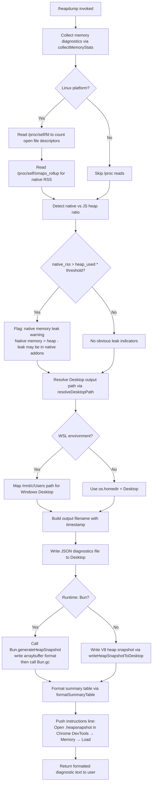

# `/heapdump`

> Analysis basis: CC v2.1.141 bundle.js (AST extraction + Claude interpretation)
> Minimum version: v2.1.141

---

## Overview

`/heapdump` is a hidden developer diagnostic command that captures a snapshot of the Node.js/Bun JavaScript heap and writes it to the user's Desktop directory. It also collects supplementary memory statistics (process memory usage, V8 heap statistics, heap space breakdown, resource usage, open file descriptors, and Linux smaps data) and emits a formatted diagnostic summary alongside the `.heapsnapshot` file path.

---

## Registration

| Field | Value |
|---|---|
| type | `local` |
| name | `heapdump` |
| description | `Dump the JS heap to ~/Desktop` |
| loc_byte | `11452680` |
| loc_byte_end | `11452843` |
| loc_line | `7163` |
| supportsNonInteractive | `true` |
| isHidden | `true` |
| module_id | `JWq` |
| load_inline | `true` |
| arbor_handler.name | `aI7` |
| arbor_handler.fqn | `claude-2.1.141::aI7` |
| arbor_handler.kind | `AsyncFunction` |
| arbor_handler.resolution_path | `module_id` |
| arbor_handler.n_hits | `0` |

Analysis basis: CC v2.1.141 bundle.js:+11452680

---

## Input Branching

The command has 4+ distinct branches based on runtime environment detection, platform checks, and runtime type (Bun vs. V8). A Mermaid flowchart is used.



---

## Behavioral Spec

### Top-level Handler (`aI7` — `heapdumpCommandHandler`)

The handler is an `AsyncFunction` resolved via `module_id` path through module `JWq`.

```
async function heapdumpCommandHandler(context):
    diagnosticsText = await runHeapDumpAndDiagnostics(context)
    lines = []
    lines.push(diagnosticsText)
    lines.push("Open the .heapsnapshot in Chrome DevTools → Memory → Load to inspect retainers.")
    return lines.join(newline)
```

Analysis basis: CC v2.1.141 bundle.js:+11451549, +11451668, +11451695, +11451817

---

### Memory Statistics Collector (`rI7` — `collectMemoryStats`)

Gathers a comprehensive snapshot of the process's memory state at the time of invocation:

```
async function collectMemoryStats():
    stats = {}
    stats.memoryUsage      = process.memoryUsage()
    stats.heapStatistics   = v8.getHeapStatistics()           // via pj8 module alias
    stats.resourceUsage    = process.resourceUsage()
    stats.uptime           = process.uptime()
    stats.heapSpaceStats   = v8.getHeapSpaceStatistics()      // via pj8 module alias
    stats.activeHandles    = process._getActiveHandles().length
    stats.activeRequests   = process._getActiveRequests().length

    // Linux-only: read open file descriptor count
    if platform is Linux:
        fdEntries = await fs.readdir("/proc/self/fd")         // loc_byte: 11447942, 11447954
        stats.openFds = fdEntries.length

    // Linux-only: read smaps_rollup for native RSS
    if platform is Linux:
        smapsText = await fs.readFile("/proc/self/smaps_rollup", "utf8")  // loc_byte: 11448004, 11448017, 11448043
        stats.nativeRss = parseSmapsRss(smapsText)

    // Import Bun's JSC bindings for additional heap info
    jscModule = await import("bun:jsc")                       // loc_byte: 11448102

    // Compute ratio: native vs JS heap (threshold check)
    // threshold: 100 (loc_byte: 11448395), units: bytes, divisor: 1048576 (1 MiB) (loc_byte: 11448248)
    // window: 3600 seconds used in age checks (loc_byte: 11448243)
    nativeRatio = stats.nativeRss / stats.memoryUsage.heapUsed
    if nativeRatio > 100:
        stats.leakWarning = "Native memory > heap - leak may be in native addons (node-pty, sharp, etc.)"
        // loc_byte: 11448481
    else:
        stats.leakWarning = null

    return stats
```

Analysis basis: CC v2.1.141 bundle.js:+11447711, +11447735, +11447761, +11447787, +11447812, +11447854, +11447891, +11447942, +11448004, +11448102

---

### Desktop Path Resolver (`l3A` — `resolveDesktopPath`)

Determines the correct Desktop path, with special handling for WSL environments:

```
function resolveDesktopPath():
    home = os.homedir()                              // loc_byte: 992204
    desktopPath = path.join(home, "Desktop")        // loc_byte: 992240, 992250

    // WSL detection: look for /mnt/c/Users prefix
    if desktopPath contains "/mnt/c/Users":          // loc_byte: 992472
        // Exclude system-only user folders
        excludedNames = ["Public", "Default", "Default User", "All Users"]
        // loc_byte: 992516, 992535, 992555, 992580
        desktopPath = resolveWindowsDesktopUnderWSL(home, excludedNames)

    desktopPath = desktopPath.replace(pattern, normalized)   // loc_byte: 992380
    return desktopPath
```

Analysis basis: CC v2.1.141 bundle.js:+992197, +992204, +992240, +992380, +992417, +992472

---

### Core Dump Orchestrator (`DWq` — `runHeapDumpAndDiagnostics`)

Orchestrates collection, file writing, snapshot generation, and summary formatting:

```
async function runHeapDumpAndDiagnostics(context):
    // Collect memory statistics
    memStats = await collectMemoryStats()             // loc_byte: 11450223

    // Resolve output directory
    desktopDir = resolveDesktopPath()                // loc_byte: 11450506

    // Build output file path
    outputPath = path.join(desktopDir, timestampedFilename)  // loc_byte: 11450615

    // Write JSON diagnostics sidecar file
    // File mode: 384 (0o600 — owner read/write only) (loc_byte: 11450693)
    await fs.writeFile(outputPath + ".json", JSON.stringify(memStats), { mode: 384 })
    // loc_byte: 11450658, 11450674

    // Generate heap snapshot
    await writeHeapSnapshot(outputPath)              // loc_byte: 11450749

    // Fire telemetry event
    emit("tengu_heap_dump")                          // loc_byte: 11450800

    // Format and return summary
    summary = formatSummaryTable(memStats)           // loc_byte: 11450978 .. 11451057
    return summary
```

Analysis basis: CC v2.1.141 bundle.js:+11450210, +11450223, +11450269, +11450311, +11450506, +11450518, +11450615, +11450658, +11450674, +11450693, +11450749, +11450798, +11450800

---

### Heap Snapshot Writer (`oI7` — `writeHeapSnapshot`)

Handles runtime-specific heap snapshot generation:

```
async function writeHeapSnapshot(basePath):
    // Determine runtime
    if runtime is Bun:
        snapshot = Bun.generateHeapSnapshot("v8", "arraybuffer")
        // loc_byte: 11451249, 11451274, 11451279
        fs.writeFileSync(basePath + ".heapsnapshot", snapshot)  // loc_byte: 11451229
        Bun.gc(/* force */ true)                                // loc_byte: 11451306
    else:
        // V8 path — uses Node.js built-in v8.writeHeapSnapshot
        writeV8HeapSnapshot(basePath)
```

Analysis basis: CC v2.1.141 bundle.js:+11451229, +11451249, +11451274, +11451279, +11451306

---

### Diagnostic Summary Formatter (`sI7` — `formatSummaryTable`)

Renders a human-readable summary table of memory metrics:

```
function formatSummaryTable(memStats):
    lines = []
    maxLabelWidth = Math.max(...labelLengths)        // loc_byte: 11451924

    // Format each metric row
    for each metric in memStats:
        valueInMiB = (metric.bytes / 1048576).toFixed(decimals)  // loc_byte: 11448248, 11448604
        lines.push(padded row)

    // Classify memory profile
    if nativeRatio > threshold:
        lines.push("— most memory is native (NOT in the .heapsnapshot)")  // loc_byte: 11452052
    else:
        lines.push("— most memory is JS heap (inspect the .heapsnapshot)")  // loc_byte: 11451992

    if noLeakIndicators:
        lines.push("  (no obvious leak indicators)")  // loc_byte: 11452189

    // Append advisory from AsH (advisory formatter)
    advisory = formatAdvisory(memStats)              // loc_byte: 11452236

    return lines.join(newline)
```

Analysis basis: CC v2.1.141 bundle.js:+11451924, +11451992, +11452052, +11452189, +11452236, +11452324, +11452598

---

### Memory Threshold Constants

| Constant | Value | Meaning | loc_byte |
|---|---|---|---|
| MiB divisor | `1048576` | Bytes per mebibyte for display formatting | `+11448248` |
| Native/heap ratio alert threshold | `100` | Multiplier above which native > JS heap triggers warning | `+11448395` |
| GiB threshold | `1073741824` | 1 GiB boundary for heap size classification | `+11452598` |
| File permissions mode | `384` | Octal `0o600` — owner read/write only | `+11450693` |
| Column padding | `8` | Summary table column width | `+11452324` |
| Age window | `3600` | Seconds (used in internal stat age checks) | `+11448243` |

---

## State & Side Effects

| Item | Detail |
|---|---|
| Telemetry | `tengu_heap_dump` (emitted once per invocation, loc_byte: +11450800) |
| Telemetry (indirect, bg subsystem) | `tengu_bg_dispatch_sigkill_escalate`, `tengu_bg_dispatch_low_mem`, `tengu_bg_spare_enable`, `tengu_bg_spare_claim`, `tengu_bg_spare_claim_fail`, `tengu_bg_proto_mismatch`, `tengu_bg_dispatch_stale_drop`, `tengu_bg_attach_legacy_autorespawn`, `tengu_bg_attach`, `tengu_bg_attach_stall_gave_up`, `tengu_bg_attach_stall_respawn`, `tengu_bg_attach_kick` |
| File written — diagnostics JSON | `~/Desktop/<timestamp>.json` (mode `0o600`) |
| File written — heap snapshot | `~/Desktop/<timestamp>.heapsnapshot` (V8 format, loadable in Chrome DevTools) |
| GC triggered | `Bun.gc(true)` called after snapshot generation when running under Bun runtime |
| appState changes | None observed at depth-2 traversal |
| Sound | None observed |
| Hook registration | None observed |
| Visibility | `isHidden: true` — command does not appear in `/help` listings |
| Non-interactive support | `supportsNonInteractive: true` — can be called from CI / scripted contexts |

---

## Version History

| Version | Change |
|---|---|
| v2.1.141 | Initial analysis |

---

## Common Mistakes

1. **Expecting the command to appear in `/help`** — `isHidden: true` means `/heapdump` is intentionally absent from the standard command listing; it must be typed explicitly.
2. **Running on a non-Desktop path** — the output is always written to `~/Desktop`. On Linux machines without a graphical Desktop folder, the directory may not exist; create it beforehand or the write will fail.
3. **WSL users expecting a Linux path** — on WSL the resolver maps to the Windows `Desktop` under `/mnt/c/Users/<user>/Desktop`; the `.heapsnapshot` file appears in Windows Explorer, not the WSL filesystem root.
4. **Opening the `.heapsnapshot` with a text editor** — the file is a V8 heap snapshot binary/JSON hybrid; use Chrome DevTools → Memory panel → "Load" to navigate retainers and allocation trees.
5. **Ignoring the `.json` sidecar** — the companion JSON file contains process-level metrics (uptime, resource usage, open FDs, smaps) that are not embedded in the `.heapsnapshot` and are essential for diagnosing native-addon leaks.
6. **Misreading the native-memory warning** — the warning "Native memory > heap — leak may be in native addons" fires when `native_rss / heap_used > 100` (an integer ratio, not a percentage). It does not confirm a leak; it is a heuristic to direct investigation toward native modules such as `node-pty` or `sharp`.

---

## Appendix — Identifier Mapping

> For bundle debugging only. Identifiers change across versions.

| Identifier | Role |
|---|---|
| `aI7` | `heapdumpCommandHandler` — top-level async command handler (arbor_handler) |
| `DWq` | `runHeapDumpAndDiagnostics` — core orchestrator: collects stats, writes files, returns summary |
| `rI7` | `collectMemoryStats` — gathers process.memoryUsage, V8 heap stats, /proc data |
| `oI7` | `writeHeapSnapshot` — runtime-branching snapshot writer (Bun vs. V8) |
| `sI7` | `formatSummaryTable` — renders human-readable memory metric table |
| `l3A` | `resolveDesktopPath` — resolves ~/Desktop with WSL path normalization |
| `V6` | `logOrEmit` — logging/output helper called at multiple points |
| `G` | `asyncRunner` — async utility called within stats collection |
| `X` | `connectionManager` — connection pool utility (reachable via stats path) |
| `kH` | `subprocessRunner` — subprocess execution utility |
| `k_` | `errorWrapper` — error construction/wrapping helper |
| `P` | `bufferAccumulator` — buffer concatenation and data stream handler |
| `j` | `streamIndexer` — stream/buffer index utility |
| `w` | `daemonProcessManager` — background daemon process lifecycle manager |
| `yf` | `streamEndHandler` — handles stream `.end()` and shutdown sequencing |
| `N15` | `sessionProtocolHandler` — background session protocol message dispatcher |
| `TH` | `stringCoercer` — thin wrapper around `String()` coercion |
| `v` | `subprocessSpawner` — spawns subprocesses with environment setup |
| `J7K` | `spawnConfigBuilder` — builds spawn configuration objects |
| `Qt_` | `pathResolver` — resolves executable paths |
| `H` | `randomDelayRetrier` — retry helper with random jitter and setTimeout |
| `SH` | `jsonStringifyWrapper` — wraps `JSON.stringify` |
| `t7` | `pathBasenameExtractor` — extracts filename components from paths |
| `T6A` | `fileMapTransformer` — maps over file entries |
| `q` | `unlinkSyncCaller` — calls `fs.unlinkSync` for file removal |
| `A` | `lowercaseNormalizer` — lowercases strings for comparison |
| `MSH` | `writeStreamManager` — manages writable stream lifecycle |
| `M6A` | `streamWriter` — writes data to a stream handle |
| `X7K` | `logFileWriter` — writes log files with rotation/rename logic |
| `bhH` | `batchJoinFlusher` — batches and joins strings with deferred flush |
| `A_H` | `logEntryFormatter` — formats structured log entries for output |
| `x6` | `mkdirHelper` — creates directories recursively |
| `Cv8` | `metadataAttacher` — attaches metadata to log objects |
| `y6A` | `logPathBuilder` — constructs log file paths |
| `k6A` | `logFileRotator` — renames/rotates existing log files |
| `P7K` | `logFileAppender` — appends data to log files with rotation |
| `b9` | `activeSetTracker` — tracks a set of active items with add/delete |
| `K` | `columnFormatter` — formats columns with padding for table display |
| `L` | `promiseLeaseTracker` — tracks promises with add/delete/finally lifecycle |
| `f` | `fileHandleCloser` — closes open file and queue handles |
| `Q` | `resultAggregator` — aggregates results from async operations |
| `z7H` | `diagnosticLineBuilder` — builds formatted diagnostic output lines |
| `AsH` | `advisoryFormatter` — appends advisory/hint text to summary output |
| `rX6` | `asyncRunnerHelper` — helper called within async runner `G` |
| `gT8` | `taskScheduler` — schedules async tasks |
| `Zk` | `connectionStateTracker` — tracks connection state transitions |
| `kp` | `connectionPingHandler` — handles connection ping/pong |
| `eKH` | `errorClassifier` — classifies connection errors |
| `An` | `ackHandler` — handles acknowledgement messages |
| `I66` | `envReader` — reads environment variables for subprocess config |
| `zV` | `executableLocator` — locates executables on PATH |
| `w7K` | `shellEscaper` — escapes shell arguments |
| `jKK` | `pathSegmentValidator` — validates individual path segments |
| `PKK` | `absolutePathChecker` — checks whether a path is absolute |
| `xv` | `spawnOptionsMerger` — merges spawn option objects |
| `MSH` | `writeStreamManager` — see above |
| `b6` | `sessionStateInitializer` — initializes session state fields |
| `v1q` | `protocolVersionChecker` — checks protocol version compatibility |
| `Lo_` | `leaseGranter` — grants session leases |
| `s6K` | `awaitAckSender` — sends await-acknowledgement messages |
| `a8` | `dispatchRouter` — routes incoming dispatch messages |
| `_Z6` | `snapshotHandler` — handles snapshot protocol messages |
| `j6` | `spareSessionPreallocator` — preallocates spare background sessions |
| `Ao_` | `spareSessionClaimer` — claims a preallocated spare session |
| `Mo_` | `spareClaimFailureLogger` — logs spare session claim failures |
| `D` | `daemonVersionEmitter` — emits daemon version information |
| `M8` | `metadataLogger` — logs metadata objects |
| `YG6` | `memFreeMiB` — reads system free memory in MiB |
| `j6H` | `resizeDebouncer` — debounces terminal resize events |
| `NK` | `nudgeScheduler` — schedules nudge messages |
| `v15` | `repaintScheduler` — schedules terminal repaint operations |
| `c6` | `platformDetector` — detects current OS platform string |
| `_sH` | `fsPromisesModule` — Node.js `fs/promises` module alias |
| `pj8` | `v8Module` — Node.js `v8` module alias (heap statistics) |
| `ZU_` | `outputPathModule` — path utility for output file construction |
| `YWq` | `fsSyncModule` — synchronous `fs` module alias |
| `Gx8` | `osModule` — Node.js `os` module alias |
| `zM` | `pathModule` — Node.js `path` module alias |
| `HE8` | `osFreememModule` — `os` module alias used for `freemem()` |
| `bv` | `fsModule` — `fs/promises` module alias used in log rotation |
| `$8` | `backupSuffix` — generates backup filename suffix |
| `n6K` | `fsSyncAlt` — alternate synchronous `fs` module alias |
| `fo_` | `joinPathHelper` — joins path segments |
| `BG` | `tempDirProvider` — provides temporary directory path |
| `m$` | `tempFileNamer` — names temporary files |
| `t7H` | `supervisorRestarter` — restarts supervisor process |
| `otH` | `rmHelper` — async `rm` file removal helper |
| `I15` | `viewportSizer` — computes terminal viewport dimensions |
| `u` | `jobRegistry` — registry of active background jobs |
| `p` | `jobEntry` — individual job entry in registry |
| `Z` | `idleWatcher` — watches for idle state transitions |
| `S6A` | `writeCompletionHandler` — handles post-write completion steps |
| `Dv6` | `priorWritePromise` — promise representing prior write operation |

---

Note: index built via Arbor fallback; some signals (telemetry, literals) may be missing — see arbor-fallback.js.