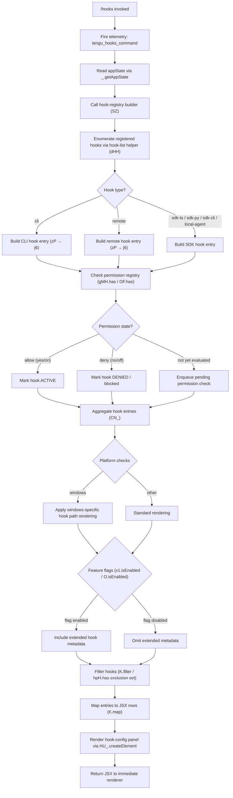

# `/hooks`

> Analysis basis: CC v2.1.141 bundle.js (AST extraction + Claude interpretation)
> Minimum version: v2.1.141

---

## Overview

The `/hooks` command renders a live, read-only view of every hook currently configured for tool events inside the active Claude Code session. It reads the application state, compiles the hook registry into a structured JSX component, and displays each hook entry (tool name, trigger event, action, and status) without modifying any configuration. The command is marked `immediate`, so it bypasses the normal agent round-trip and renders its output synchronously.

---

## Registration

| Field | Value |
|---|---|
| type | `local-jsx` |
| name | `hooks` |
| description | `View hook configurations for tool events` |
| immediate | `true` |
| module_id | `fXq` |
| load_inline | `true` |
| loc_byte | `11344691` |
| loc_byte_end | `11344841` |
| loc_line | `7041` |
| arbor_handler.name | `EV7` |
| arbor_handler.fqn | `claude-2.1.141::EV7` |
| arbor_handler.kind | `AsyncFunction` |
| arbor_handler.resolution_path | `module_id` |
| arbor_handler.n_hits | `0` |

Analysis basis: CC v2.1.141 bundle.js:+11344691

---

## Input Branching

The command execution involves more than three distinct branches: tool-event classification, hook-type discrimination (CLI vs remote vs SDK variants), permission-check gating, daemon-status awareness, and feature-flag checks. A flowchart is required.



---

## Behavioral Spec

### 1. Command Entry Point — `hookCommandHandler` (`EV7`)

The Arbor-resolved handler is `EV7` (AsyncFunction, resolved via `module_id` → `fXq`).

```
async function hookCommandHandler(context):
    emit telemetry("tengu_hooks_command")           # loc_byte 11344464
    appState = context.getAppState()                # loc_byte 11344496
    hookPanel = buildHookPanel(appState)            # loc_byte 11344536 (SZ)
    return createElement(hookPanel)                 # loc_byte 11344566
```

Analysis basis: CC v2.1.141 bundle.js:+11344462

---

### 2. Hook Registry Builder — `buildHookPanel` (`SZ`)

`SZ` is the primary composition function. It orchestrates five sub-tasks: enumerate hooks, compute per-hook status, aggregate results, apply feature flags, and produce the renderable hook list.

```
function buildHookPanel(appState):
    rawHooks = enumerateHooks(appState)             # dHH, loc_byte 8988760
    statusMap = computeHookStatuses(rawHooks)       # CN_, loc_byte 8988785
    displayRows = buildDisplayRows(appState)         # nHH, loc_byte 8988885

    # Feature-flag gate
    if x1.isEnabled():                              # loc_byte 8988955
        filtered = displayRows.filter(not in hpH)  # loc_byte 8989031 / 8989046
        extended = displayRows.map(withMetadata)    # loc_byte 8989074
    else:
        filtered = displayRows

    # Platform-specific path inclusion
    if A.has(platform):                             # loc_byte 8988904
        filtered = applyPlatformPaths(filtered)

    # Secondary feature flag (O.isEnabled)
    if O.isEnabled():                               # loc_byte 8989085
        filtered = augmentWithDaemonStatus(filtered)

    return assemblePanel(filtered)                  # PL, loc_byte 8988944
```

Analysis basis: CC v2.1.141 bundle.js:+8988689

---

### 3. Hook Enumeration — `enumerateHooks` (`dHH`)

`dHH` filters the raw hook list and delegates to `SP6` for per-hook status classification.

```
function enumerateHooks(appState):
    allHooks = H.filter(appState.hooks, isRelevant) # loc_byte 8988045
    return allHooks.map(hook => classifyHook(hook)) # SP6, loc_byte 8988060
```

`SP6` calls two helpers:
- `_LH` — flattens the `mS_` hook store using `.flatMap`, then applies `PO` to normalise each entry (Analysis basis: CC v2.1.141 bundle.js:+9769259)
- `pS_` — resolves the deny-list (`"deny"` literal at loc_byte 9768626) by checking `Ym8`, `D96`, and `Ny` (Analysis basis: CC v2.1.141 bundle.js:+9769276)
- `H_q` — aggregates the results (Analysis basis: CC v2.1.141 bundle.js:+9769300)

Permission sources distinguished in `pS_`:
- `"cliArg"` — permission originated from a CLI argument (loc_byte 9769196)
- `"toolsNarrowing"` — permission originated from tool-narrowing configuration (loc_byte 9769217)

---

### 4. Hook Type Resolver — `resolveHookType` (`zP`)

`zP` reads the hook's source field and branches on the string values `"cli"` and `"remote"` (literals at loc_byte 3170896 and 3170907). Additional SDK variants (`"sdk-ts"`, `"sdk-py"`, `"sdk-cli"`, `"local-agent"`) are handled as sub-cases (literals at loc_bytes 3171153, 3171167, 3171181, 3171196).

```
function resolveHookType(hook):
    type = hook.source
    match type:
        case "cli":
            entry = buildCliEntry(hook)   # dR, loc_byte 3170744
        case "remote":
            entry = buildRemoteEntry(hook)
        case "sdk-ts" | "sdk-py" | "sdk-cli" | "local-agent":
            entry = buildSdkEntry(hook, type)
    label = formatLabel(hook)             # mq → String, loc_byte 3170761
    styled = applyStyle(label)            # RH, loc_byte 3170806
    registration = registerHook(entry)    # j6, loc_byte 3170923
    emit telemetry("tengu_slate_harbor")  # loc_byte 3170926
    return registration
```

Analysis basis: CC v2.1.141 bundle.js:+3170744

---

### 5. Hook Registration Entry Builder — `registerHookEntry` (`j6`)

`j6` writes each resolved hook into the runtime registry. It checks two distinct maps (`gMH` and `OF`) and one de-duplication set (`R76`).

```
function registerHookEntry(entry):
    key = buildKey(entry)            # b76, loc_byte 3120466
    icon = resolveIcon(entry)        # x76, loc_byte 3120503
    styled = styleEntry(key)         # Js,  loc_byte 3120538
    if gMH.has(key):                 # loc_byte 3120555
        deduped = deduplicate(entry) # vi6, loc_byte 3120566
    R76.add(key)                     # loc_byte 3120578
    if OF.has(key):                  # loc_byte 3120592
        existing = OF.get(key)       # loc_byte 3120609
        merged = mergeEntry(existing, entry)  # h6, loc_byte 3120629
    return merged or entry
```

`h6` (mergeEntry) records a timestamp via `Date.now()` (loc_byte 3139585) and delegates formatting to `EhL` (loc_byte 3139638).

Analysis basis: CC v2.1.141 bundle.js:+3120466

---

### 6. Status Aggregator — `aggregateStatuses` (`CN_`)

`CN_` collects per-hook status objects, applies `VDH` formatting (loc_byte 8988640), and invokes `qA` — the React-style state-setter — to publish the computed status map to the component tree.

```
function aggregateStatuses(hooks):
    statuses = hooks.map(hook => computeStatus(hook))  # Mm, loc_byte 8988616
    formatted = VDH(statuses)                          # loc_byte 8988640
    qA(formatted)                                      # loc_byte 8988646
    return formatted
```

`Mm` (computeStatus) checks the platform string `"windows"` (literal loc_byte 4632006), calls `h_H` for path normalisation (loc_byte 4632068), and again calls `registerHookEntry` (`j6`) for de-duplication (loc_byte 4632097).

```
function computeStatus(hook):
    if platform == "windows":
        path = normalizePath(hook.path)  # h_H
    label = formatLabel(hook)            # mq
    styled = applyStyle(label)           # RH
    entry = registerHookEntry(hook)      # j6
    emit telemetry("tengu_cobalt_ridge") # loc_byte 4632100
    return entry
```

Analysis basis: CC v2.1.141 bundle.js:+8988616

---

### 7. Display Row Builder — `buildDisplayRows` (`nHH`)

`nHH` is the most branching sub-function. It constructs the final visual rows by composing event labels (`YK`), status decorators (`cz`, `TP`), permission actions (`cH7`, `QH7`, `dH7`), and the full hook-config panel (`CN_`, `Ep`).

```
function buildDisplayRows(appState):
    baseRows = buildBaseRows(appState)        # YK, loc_byte 8987426
    withStatus = addStatus(baseRows)          # cz, loc_byte 8987442
    withType = addType(withStatus)            # TP, loc_byte 8987546
    withError = addError(withType)            # RH, loc_byte 8987639
    withExpand = addExpandToggle(withError)   # eiH, loc_byte 8987710

    # Permission action columns
    allowAction  = buildAllowAction()         # cH7, loc_byte 8987729
    blockAction  = buildBlockAction()         # K1,  loc_byte 8987770
    approveAction = buildApproveAction()      # QH7, loc_byte 8987776
    denyAction   = buildDenyAction()          # dH7, loc_byte 8987782

    rows = attachActions(withExpand,
             allowAction, blockAction,
             approveAction, denyAction)
    rows = attachHookConfig(rows)             # CN_, loc_byte 8987933
    rows = attachToolSearchInfo(rows)         # Ep,  loc_byte 8988001
    rows = applyPrioritySort(rows)            # Pr1, loc_byte 8987974
    return rows
```

**Permission action sub-builders** share the same pattern — each wraps a JSX icon (`oi1`, `hi1`, `ui1`) and attaches a `qA` callback:

```
function buildAllowAction():   # cH7
    icon = renderIcon(oi1)     # loc_byte 8988451
    return attachCallback(icon, qA)  # loc_byte 8988457

function buildApproveAction(): # QH7
    icon = renderIcon(hi1)     # loc_byte 8988373
    return attachCallback(icon, qA)  # loc_byte 8988379

function buildDenyAction():    # dH7
    icon = renderIcon(ui1)     # loc_byte 8988412
    return attachCallback(icon, qA)  # loc_byte 8988418
```

**Tool-search info attachment** (`Ep`) checks for the Vertex AI context using the `WA` helper and the string `"bedrock"` / `"foundry"` / `"anthropicAws"` / `"mantle"` / `"vertex"` / `"firstParty"` provider identifiers (literals at loc_bytes 2006501–2006718). When Vertex AI is detected and the override is absent, a notice is attached:

> "…disabled: Vertex AI does not accept the tool-search beta header. Set ENABLE_TOOL_SEARCH=true to override." (literal loc_byte 9488764)

**Permission agent registration** (`K1`) checks the `--agent-teams` flag (literal loc_byte 5202785) and calls `registerHookEntry` (`j6`) once more (loc_byte 5202894).

```
function buildBlockAction():           # K1
    emit telemetry("tengu_amber_flint") # loc_byte 5202897
    if hasFlag("--agent-teams"):
        applyTeamPermission(hook)      # Vf4, loc_byte 5202875
    entry = registerHookEntry(hook)    # j6,  loc_byte 5202894
    return entry
```

Analysis basis: CC v2.1.141 bundle.js:+8987426

---

### 8. Boolean Permission Literals

The permission-evaluation helpers (`RH`, `mq`) compare against the following string constants:

| Meaning | Values | loc_byte |
|---|---|---|
| Affirmative (allowed) | `"yes"`, `"on"` | 25237, 25243 |
| Negative (denied) | `"no"`, `"off"` | 25388, 25393 |
| Blocked status | `"blocked"` | 8988106 |
| Deny classification | `"deny"` | 9768626 |

Analysis basis: CC v2.1.141 bundle.js:+25237

---

### 9. Daemon Status Integration

When the secondary feature flag (`O.isEnabled`) is active, `b8` (loc_byte 14499575) reads daemon state. Key literals used:

- `"stopped"` — daemon not running (loc_byte 14499537)
- `"background session"` — session type identifier (loc_byte 14499580)
- `"daemon.status.json"` — status file path component (loc_byte 11581186)

The daemon-status path is assembled by `b06` joining `PTq` segments (loc_byte 11581172) and using `p8` for the base path (loc_byte 11581181). Session context is retrieved via `GcL.getStore()` (loc_byte 3807243).

Analysis basis: CC v2.1.141 bundle.js:+14499575

---

### 10. Display Formatting

`RH` (styleEntry) converts values to `String` (loc_byte 25188). Column padding uses a width of **40** characters (literal loc_byte 14489603) with a two-space separator `"  "` (literal loc_byte 14487632) via `.padEnd`. Hook names are lowercased for map lookups via `.toLowerCase()` (loc_byte 14489529).

Analysis basis: CC v2.1.141 bundle.js:+14489603

---

## State & Side Effects

| Item | Detail |
|---|---|
| Telemetry | `tengu_hooks_command` (loc_byte 11344464) — fired once on command entry |
| Telemetry | `tengu_slate_harbor` (loc_byte 3170926) — fired per hook-type resolution |
| Telemetry | `tengu_cobalt_ridge` (loc_byte 4632100) — fired per hook status computation |
| Telemetry | `tengu_amber_flint` (loc_byte 5202897) — fired when block-action is built (agent-teams path) |
| appState changes | Read-only: `_.getAppState()` is called but no write-back is observed in depth-2 traversal |
| Permission registry | `gMH`, `OF`, `R76`, `pA_` are read and written during hook enumeration — these are runtime caches, not persisted config |
| React state | `qA` (state setter) is called to publish the formatted status map; triggers a re-render of the panel |
| Feature flags | `x1.isEnabled()` and `O.isEnabled()` gate extended metadata and daemon-status rows respectively |
| Filesystem | `b06` reads `daemon.status.json` when daemon-status feature flag is active; `q.unlinkSync` may be called via `q` (loc_byte 14444736) in cleanup paths |
| Sound | None observed in depth-2 traversal |
| Hook registration | This command **displays** hooks; it does not register new hooks |

---

## Version History

| Version | Change |
|---|---|
| v2.1.141 | Initial analysis |

---

## Common Mistakes

1. **Expecting `/hooks` to edit configuration** — the command is purely a viewer. It renders hook state from `appState` and does not expose any modification UI directly through the slash command. Use the Claude Code settings file or CLI flags to modify hook configuration.
2. **Assuming the output is static** — because the handler is `immediate` and of type `local-jsx`, the displayed panel is a live React component. Permission state changes (via `qA` callbacks on each row's action buttons) will cause the panel to re-render in place.
3. **Confusing `"blocked"` with `"deny"`** — `"blocked"` is a display-level status string applied to the rendered row; `"deny"` is the internal permission-classification value. They co-exist in the data model and serve different roles.
4. **Overlooking the Vertex AI notice** — if the active API provider is Vertex AI and `ENABLE_TOOL_SEARCH` is not set, a notice is appended to the hook panel indicating that tool-search is disabled. This is informational, not an error in the hook configuration.
5. **Expecting daemon rows unconditionally** — daemon status rows (showing `"stopped"` or `"background session"`) only appear when the `O.isEnabled()` feature flag is active. On installations without that flag, those rows are silently omitted.
6. **Misreading `immediate: true`** — this flag means the command renders without sending a message to the AI agent. It does not mean the command is instantaneous in wall-clock time; it still awaits `appState` resolution and may perform filesystem reads for daemon status.

---

## Appendix — Identifier Mapping

> For bundle debugging only. Identifiers change across versions.

| Identifier | Role |
|---|---|
| `EV7` | Main hook command handler (AsyncFunction; Arbor-resolved via module_id `fXq`) |
| `Q` | Telemetry emitter helper |
| `_` | Context/appState accessor namespace |
| `SZ` | Hook panel builder — top-level composition function |
| `RH` | Style/string formatter (wraps `String()`) |
| `zP` | Hook type resolver (branches on `"cli"`, `"remote"`, SDK variants) |
| `dR` | CLI hook entry builder |
| `mq` | Label formatter (wraps `String()`) |
| `j6` | Hook registration entry builder (checks `gMH`, `OF`, `R76`) |
| `b76` | Hook key builder |
| `x76` | Hook icon resolver |
| `Js` | Hook entry styler |
| `vi6` | De-duplication helper (uses `pA_` set and `gMH` map) |
| `h6` | Hook entry merger (records `Date.now()` timestamp) |
| `dHH` | Hook enumerator (filters then classifies hooks) |
| `H` | Base hook array / utility host (also has `Math.random`, `setTimeout`) |
| `SP6` | Per-hook status classifier |
| `_LH` | Hook store flattener (`mS_.flatMap`) |
| `pS_` | Deny-list resolver (checks `Ym8`, `D96`, `Ny`) |
| `H_q` | Status aggregation helper inside `SP6` |
| `CN_` | Status aggregator (calls `Mm`, `VDH`, `qA`) |
| `Mm` | Per-hook status compute function |
| `qA` | React-style state setter / callback dispatcher |
| `cZ6` | Callback binder (`.bind`) used inside `qA` |
| `YK` | Base display-row builder |
| `nHH` | Full display-row builder (composes all columns and actions) |
| `cz` | Status decorator for display rows |
| `TP` | Type decorator for display rows |
| `Z_` | Sub-helper used by `TP` |
| `eiH` | Expand/collapse toggle builder |
| `cH7` | Allow-action column builder |
| `K1` | Block-action column builder (fires `tengu_amber_flint`; checks `--agent-teams`) |
| `Vf4` | Team-permission applicator (used inside `K1`) |
| `QH7` | Approve-action column builder |
| `dH7` | Deny-action column builder |
| `Ep` | Tool-search info attachment (checks provider, Vertex AI notice) |
| `$h_` | Tool-search configuration reader |
| `v` | Provider/environment identifier parser |
| `WA` | Provider-type checker (checks `"bedrock"`, `"foundry"`, etc.) |
| `UM` | Tool-search availability helper |
| `A` | Platform-to-path map (lowercases platform for lookup) |
| `f` | File-handle abstraction (has `.close`, `.finally`) |
| `q` | File-set abstraction (has `.unlinkSync`, `.add`, `.delete`) |
| `L` | File-operation wrapper (`.add`, `.finally`, `.delete`) |
| `K` | Hook display-row collection (`.filter`, `.map`, `.padEnd`) |
| `PL` | Panel assembly function |
| `O` | Feature-flag accessor with `.isEnabled()` (daemon-status flag) |
| `b8` | Daemon status reader |
| `$` | Session/context set (has `.includes`; backed by `XTq`) |
| `XTq` | Session-context builder (uses `Date.now`, `p7`, `b06`, `SH`) |
| `Ia` | Context initialiser helper |
| `p7` | Async-local-storage store reader (`GcL.getStore`) |
| `b06` | Daemon status file path builder (joins `PTq`, uses `p8`) |
| `SH` | JSON serialiser wrapper (`JSON.stringify`) |

---

Note: index built via Arbor fallback; some signals (telemetry, literals) may be missing — see arbor-fallback.js.