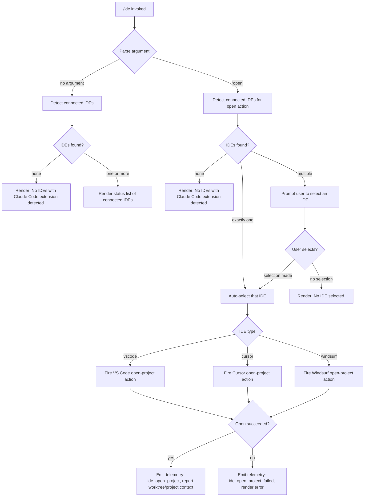

# `/ide`

> Analysis basis: CC v2.1.141 bundle.js (AST extraction + Claude interpretation)
> Minimum version: v2.1.141

---

## Overview

The `/ide` command manages IDE integrations for Claude Code by detecting connected IDEs (VS Code, Cursor, Windsurf, JetBrains family), displaying their current status, and optionally opening the current project inside a selected IDE. When the `open` sub-command is provided, the handler resolves which IDE is available, fires the open-project action, and reports success or failure via inline JSX output.

---

## Registration

| Field | Value |
|---|---|
| type | `local-jsx` |
| name | `ide` |
| description | `Manage IDE integrations and show status` |
| argumentHint | `[open]` |
| module_id | `k7q` |
| load_inline | `true` |
| loc_byte | `10509870` |
| loc_byte_end | `10510026` |
| loc_line | `5804` |
| arbor_handler.name | `rw7` |
| arbor_handler.fqn | `claude-2.1.141::rw7` |
| arbor_handler.kind | `AsyncFunction` |
| arbor_handler.resolution_path | `module_id` |
| arbor_handler.n_hits | `0` |

Analysis basis: CC v2.1.141 bundle.js:+10509870

---

## Input Branching

There are four distinct execution branches based on the argument provided and IDE detection results, requiring a Mermaid flowchart.



Analysis basis: CC v2.1.141 bundle.js:+10505930 (handler entry `rw7`), +10506038 (`open` literal), +10506147 (no-IDE message), +10506285 (no-selection message)

---

## Behavioral Spec

### Handler Entry — `ideCommandHandler` (`rw7`)

The main handler is the async function `rw7`, resolved via `module_id` → `k7q` by the Arbor symbol graph.

```
async function ideCommandHandler(args, appContext):
    emit telemetry("tengu_ext_ide_command")          // always fires on entry

    detectedIDEs = await detectConnectedIDEs()       // calls ideDetector (MQH)

    if args[0] == "open":
        if detectedIDEs is empty:
            return renderMessage("No IDEs with Claude Code extension detected.")

        if detectedIDEs.length == 1:
            selectedIDE = detectedIDEs[0]
        else:
            selectedIDE = await promptUserToSelectIDE(detectedIDEs)  // calls tf
            if selectedIDE is null:
                return renderMessage("No IDE selected.")

        ideType = resolveIDEType(selectedIDE)        // one of: "vscode","cursor","windsurf"
        result  = await openProjectInIDE(selectedIDE, context)

        if result.ok:
            emit telemetry("ide_open_project", {ideType, context: "worktree"|"project"})
        else:
            emit telemetry("ide_open_project_failed")
            return renderError(result.error)

        if result.exitedWithoutOpening:
            renderMessage("Exited without opening IDE")

    else:  // status display path
        renderIDEStatusPanel(detectedIDEs)           // bold headers via M6.bold
        filterAndRenderExtensionStatus(detectedIDEs) // calls L.filter + Qw7
```

Analysis basis: CC v2.1.141 bundle.js:+10505930, +10506052, +10506076, +10506145, +10506458, +10506546, +10506688, +10506997, +10507015, +10507086, +10507125, +10507480, +10507541

### IDE Detection — `ideDetector` (`MQH`)

```
async function ideDetector():
    emit telemetry("ide_detect")

    // Enumerate running processes per platform
    if platform == "linux":
        processList = shell("ps aux | grep -E 'code|cursor|windsurf|idea|...' | grep -v grep")
    else:
        processList = nativeProcessQuery()           // uses u54 / M_8

    candidates = parseProcessList(processList)       // parseInt, RH, r_1 (regex match)

    results = await Promise.all(candidates.map(c => probeIDE(c)))  // b54 → StA

    // Filter out JetBrains processes that are system-level or non-IDE
    results = results.filter(r => r.ideType != "appcode" or isValidJetBrains(r))

    if results is empty:
        emit telemetry("ide_detect_failed")

    return results
```

Analysis basis: CC v2.1.141 bundle.js:+5115384 (parseInt), +5115447 (Promise.all), +5115495 (ET platform check), +5116727 (`ide_detect`), +5116791 (`ide_detect_failed`), +5120261 (Linux ps command), +5120635 (`appcode`), +5111834 (`jetbrains`)

### IDE Process Probe — `ideProbe` (`u54`)

```
async function ideProbe(candidate):
    // Build search paths:
    //   - home directory + ".claude"
    //   - on WSL: "/mnt/c/Users/<username>"
    //   - skip: "Public", "Default", "Default User", "All Users"

    basePaths = [MA1.homedir(), ...]
    if platform == "wsl":
        addWindowsPaths(basePaths)       // /mnt/c/Users filtering

    for each basePath in basePaths:
        resolved = WI.resolve(basePath)
        stat     = x6(resolved)         // stat call

        if stat.isDirectory() or stat.isSymbolicLink():
            realPath = LA1.realpath(resolved)
            if not visited.has(realPath):
                visited.add(realPath)
                results.push(realPath)

    // Identify IDE type string "ide" in process metadata
    return {paths: results, ideType: "ide"}
```

Analysis basis: CC v2.1.141 bundle.js:+5113177, +5113254 (MA1.homedir), +5113268 (`.claude`), +5113313 (`wsl`), +5113475 (`/mnt/c/Users`), +5113569–5113633 (skip list), +5113930 (LA1.realpath), +5113974 (visited.has)

### IDE Type Resolution — `resolveIDEName` (`Mj`)

```
function resolveIDEName(processEntry):
    name = processEntry.toLowerCase()               // H.toLowerCase
    prefix = extractPrefix(name)                    // B1: indexOf + slice

    baseName = WI.basename(name)                    // filesystem basename

    if name includes "cursor":  return "cursor"
    if name includes "windsurf": return "windsurf"
    if name includes "code":    return "vscode"
    // JetBrains detection via vEH (product-code map)

    return resolvedIDEType
```

Analysis basis: CC v2.1.141 bundle.js:+5121081 (`IDE` label), +5121136, +5121180, +5121194, +5121268

### Open-Project Action — `openProjectInIDE` (`XY_` → `Q54`)

```
async function openProjectInIDE(selectedIDE, context):
    // Determine IDE client (cj → jXH): SSE or WebSocket connection
    // Connection types detected: "sse-ide" | "ws-ide"

    ideClient = await resolveIDEClient(selectedIDE)   // cj

    projectContext = determineContext()               // "worktree" or "project"
    entries        = Object.entries(ideClient.capabilities)

    // Filter supported open actions
    supported = entries.filter(([k]) => k.includes("open"))

    openResult = await ideClient.openProject({
        path:    currentWorkingDirectory,
        context: projectContext,
    })

    return openResult
```

Analysis basis: CC v2.1.141 bundle.js:+5120773, +5119372, +5119406, +5119675, +5119732, +5120675, +10503917 (`sse-ide`), +10503937 (`ws-ide`), +10506519 (`worktree`), +10506530 (`project`)

### Extension Status Rendering — `renderExtensionStatus` (`Qw7`)

```
function renderExtensionStatus(ideList):
    // Called at end of non-open path
    // Uses L.filter to remove disconnected entries
    // Renders bold IDE names (M6.bold) with connection status
    // Suggests "restart your IDE" when extension is not responding
```

Hint text `"restart your IDE"` is injected into the status panel when an IDE is detected but the Claude Code extension is unresponsive.

Analysis basis: CC v2.1.141 bundle.js:+10507480, +10507541, +10507150 (`restart your IDE`)

### Extension Installation Callback — `onInstallIDEExtension` (`_.onInstallIDEExtension`)

The handler registers a callback that fires when the user triggers IDE extension installation from within the IDE status panel. This is a side-effect registration, not a visible output.

Analysis basis: CC v2.1.141 bundle.js:+10507059

---

## State & Side Effects

| Item | Detail |
|---|---|
| Telemetry — `tengu_ext_ide_command` | Fires unconditionally on every `/ide` invocation (bundle.js:+10505932) |
| Telemetry — `ide_detect` | Fires when IDE detection runs (bundle.js:+5116727) |
| Telemetry — `ide_detect_failed` | Fires when detection finds no candidates (bundle.js:+5116791) |
| Telemetry — `ide_open_project` | Fires on successful open-project action (bundle.js:+10506485) |
| Telemetry — `ide_open_project_failed` | Fires when open-project fails (bundle.js:+10506592) |
| Hook registration | `_.onInstallIDEExtension` callback registered during render (bundle.js:+10507059) |
| appState changes | None observed in depth-2 traversal |
| Sound | None observed |
| IDE connection protocols | Supports both SSE (`sse-ide`) and WebSocket (`ws-ide`) transport for IDE extension communication (bundle.js:+10503917, +10503937) |
| Platform-specific paths | WSL path handling for `/mnt/c/Users`; skips `Public`, `Default`, `Default User`, `All Users` accounts (bundle.js:+5113475–5113633) |

---

## Version History

| Version | Change |
|---|---|
| v2.1.141 | Initial analysis |

---

## Common Mistakes

1. **Invoking `/ide open` with no IDE running**: The command will report "No IDEs with Claude Code extension detected." — ensure VS Code, Cursor, Windsurf, or a supported JetBrains IDE is running with the Claude Code extension installed and active before using `open`.
2. **Expecting JetBrains support on Linux without the extension active**: The Linux detection path uses a broad `ps aux` grep (bundle.js:+5120261); the IDE process must be visible in the process list *and* the extension must be reachable over SSE or WebSocket.
3. **Running `/ide open` in WSL without Windows paths accessible**: The WSL path probe looks under `/mnt/c/Users` (bundle.js:+5113475). If that mount is not present, Windows-hosted IDEs will not be detected.
4. **Confusing status display with open**: `/ide` (no argument) renders a status panel; `/ide open` performs the actual open action. The argument hint `[open]` is optional.
5. **Assuming automatic IDE selection when multiple IDEs are connected**: When more than one supported IDE is detected, the command prompts the user to choose; it does not auto-select the most recently used IDE.

---

## Appendix — Identifier Mapping

> For bundle debugging only. Identifiers change across versions.

| Identifier | Role |
|---|---|
| `rw7` | Main `/ide` command handler (AsyncFunction, arbor-resolved via module_id `k7q`) |
| `_x_` | Inner render/display helper called from the command registration layer |
| `MQH` | IDE detector — enumerates running IDE processes, emits `ide_detect` / `ide_detect_failed` |
| `M_8` | IDE process scan orchestrator — runs parallel probes via `Promise.all` |
| `u54` | Single IDE path probe — resolves home dir, WSL paths, symlinks |
| `b54` | IDE probe batch wrapper — maps candidates through `StA` |
| `StA` | Individual IDE process status reader (shell invocation, parseInt, isNaN) |
| `XY_` | Open-project action dispatcher — routes to `Q54` |
| `Q54` | IDE client open-project implementation — Object.entries, capability filter |
| `cj` | IDE client resolver — selects SSE or WebSocket transport (calls `jXH`) |
| `jXH` | IDE extension client factory — wires up connection handlers |
| `Mj` | IDE name resolver — toLowerCase, basename, type detection |
| `B1` | String prefix extractor — indexOf + slice |
| `N6` | App-state store accessor (used for tool-state reads) |
| `bS6` | Tool-state getter — calls `CS6.getStore` |
| `Cd` | Tool-state helper |
| `e8` | Tool-state helper |
| `H` | General-purpose collection / spawn result handle (context-dependent) |
| `A` | Path normalizer / collection accessor (context-dependent) |
| `f` | File/socket handle (context-dependent) |
| `q` | Set/collection or filesystem module (context-dependent) |
| `L` | Promise / collection helper (context-dependent) |
| `D` | Daemon normalizer / background-session manager |
| `j6` | Connection registry lookup / background session getter |
| `Js` | Session-state formatter |
| `RH` | String normalizer / formatter |
| `ws` | WebSocket session writer |
| `vi6` | Session deduplication guard |
| `mA_` | Session event emitter — randomUUID, `wl.emit` |
| `cA_` | Session cleanup handler |
| `h6` | Background session file watcher / config reader |
| `cMH` | Config file reader — readFileSync, statSync, mkdirSync |
| `EhL` | File-watch session manager — `mi6.watchFile` / `mi6.unwatchFile` |
| `XTq` | Daemon status writer — writes `daemon.status.json` |
| `Ia` | Daemon status helper |
| `p7` | Store context getter (`GcL.getStore`) |
| `b06` | Status file path builder (`PTq.join`) |
| `SH` | JSON serializer (`JSON.stringify`) |
| `YG6` | Platform memory check (macos, 1024 MB threshold) |
| `_o_` | Background spare process spawner — `Bun.spawn`, SIGTERM |
| `F1` | Feature-flag accessor |
| `hH` | Feature-flag positive checker |
| `xH` | Feature-flag negative checker |
| `H4q` | Spare socket path builder |
| `nQ` | Socket path resolver |
| `_4q` | Alternate spare path builder |
| `G15` | Spawn argument assembler |
| `W3` | Array type guard (`Array.isArray`) |
| `j15` | Spawn options merger (`Object.assign`) |
| `hk` | PTY-pid path helper |
| `DNH` | PTY directory name resolver |
| `Q` | Shared utility / error constructor |
| `kH` | Error formatter / log helper |
| `k_` | Error constructor wrapper |
| `Vq` | Network-mode selector |
| `cMA` | Network-mode normalizer |
| `GvK` | Queue shift/push manager |
| `w` | Background session dispatch loop |
| `S` | Session kill / retry scheduler |
| `N` | Away-summary / session re-attach orchestrator |
| `v` | Log-level classifier / message formatter |
| `Uf8` | Rate-limit state reader (`CnH.getState`) |
| `es7` | Summary skip-reason evaluator |
| `Icq` | Shared constant or state snapshot |
| `Z` | Shared state variable |
| `_18` | Away-summary generator — abort controller, tool-use guard |
| `LAq` | UUID generator (`bZ.randomUUID`) |
| `g` | Conversation segment accessor |
| `u` | Session timeout/write helper |
| `Ao_` | Daemon claim sender — socket connect, framing |
| `X15` | Claim send-timeout handler (5000 ms timeout) |
| `W15` | Socket connect-and-send helper |
| `M8` | Error code tagger |
| `a8` | Low-level socket connector (setTimeout, clearTimeout) |
| `P15` | Claim frame builder (`qU.buildClaimFrame`) |
| `TH` | String coercer |
| `up` | Binary frame serializer (Buffer.from, writeUInt32BE, writeUInt8) |
| `Mo_` | Background job lifecycle manager — roster, spawn, retire |
| `K` | Roster entry formatter (padEnd) |
| `NK` | Job socket path resolver |
| `G0` | Job base path builder |
| `r1` | Roster file reader — NX.stat, NX.readFile, JSON parse |
| `$8` | Error tagger |
| `b6` | JSON parser (`JSON.parse`) |
| `cw` | Active-job counter |
| `gE` | Active-job state evaluator |
| `df` | Roster file writer (`QY`, `kX.join`, `SH`) |
| `QY` | Atomic file writer (randomBytes temp name, rename) |
| `d2` | Roster cache invalidator |
| `CoH` | Roster persistence coordinator |
| `gp` | Roster file reader with parse + validation |
| `hD7` | Roster directory initializer |
| `jLH` | Job socket path builder |
| `Fp` | PTY socket path builder |
| `yb_` | PTY path validator |
| `SoH` | PTY socket base-path resolver |
| `p` | Session inactivity guard |
| `tf` | IDE selection prompt (user pick list) |
| `r_1` | Process-name regex matcher |
| `W` | Skills / config-change event emitter |
| `z` | IDE set accumulator |
| `oR` | IDE registration handler |
| `Kx` | Graceful-exit race (`Promise.race`, `process.exit`) |
| `w$H` | Config-change broadcast handler |
| `M4` | Effort-value resolver |
| `L2` | Hook runner — full hook dispatch pipeline |
| `bBH` | Hook-active predicate |
| `Dz8` | Policy settings reader |
| `eHH` | Policy snapshot handler |
| `PqH` | Policy queue reader |
| `BO8` | Policy batch operand |
| `qs1` | Policy settings serializer |
| `TrH` | CO8 cache clearer |
| `P` | IPC frame reader — Buffer.concat, indexOf, subarray |
| `j` | IPC socket forwarder |
| `yf` | IPC end-of-stream writer |
| `N15` | IPC session handler — full attach/dispatch/resize/kill pipeline |
| `k15` | IPC session sub-handler |
| `M` | Tool-use filter / content router |
| `pw` | Background service identifier |
| `Lo_` | IPC lease tracker |
| `s6K` | IPC heartbeat / lease manager (30 000 ms window, 25 ms precision) |
| `BG` | Session log path builder |
| `m$` | Session log real-path normalizer |
| `t7H` | Session log line reader |
| `I15` | Stall detection timer |
| `j6H` | Session state tracker |
| `v15` | Session resume / re-attach handler |
| `qH` | Terminal focus tracker |
| `b` | Supervisor idle-exit timer |
| `o` | Voice / terminal I/O handler |
| `F` | MCP tool-use filter |
| `c` | PTY write forwarder |
| `l` | Event-listener filter |
| `_Z6` | IPC write/destroy helper |
| `G` | Render-pipeline output handler |
| `X` | MCP connection handler (sdk/sse/dynamic) |
| `gT8` | MCP transport factory |
| `$A1` | Process kill helper (`process.kill`) |
| `Mj` | IDE name resolver (see above) |
| `B1` | String prefix extractor (see above) |
| `D8` | Shared error state |
| `O8` | App-state reader helper |
| `XY_` | Open-project dispatcher (see above) |
| `Q54` | IDE client open-project impl (see above) |
| `cj` | IDE client resolver (see above) |
| `jXH` | IDE extension client factory (see above) |
| `Nn` | IDE extension status display helper |
| `Qw7` | Extension status renderer (final render step) |

---

Note: index built via Arbor fallback; some signals (telemetry, literals) may be missing — see arbor-fallback.js.