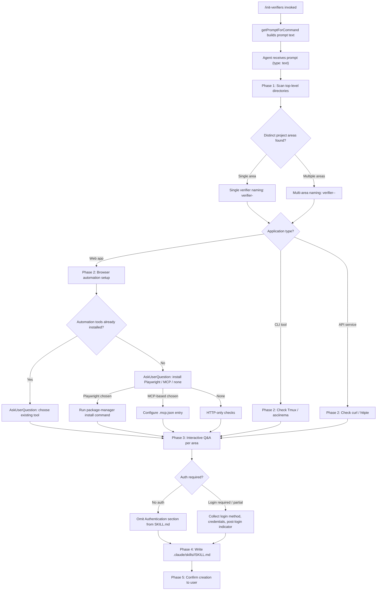

# `/init-verifiers`

> Analysis basis: CC v2.1.132 bundle.js (AST extraction + Claude interpretation)
> Minimum version: v2.1.132

---

## Overview

`/init-verifiers` is a `prompt`-type slash command that scaffolds one or more verifier skill files for the current project. When invoked, it dispatches a structured multi-phase prompt to the agent via `getPromptForCommand`, directing the agent to auto-detect the project's composition, interactively gather configuration from the user, and write ready-to-use `SKILL.md` files under `.claude/skills/`. The generated skills are consumed by the Verify agent to perform functional verification (web UI, CLI, or API) of code changes.

---

## Registration

| Field | Value |
|---|---|
| type | `prompt` |
| name | `init-verifiers` |
| description | `Create verifier skill(s) for automated verification of code changes` |
| handler_method | `getPromptForCommand` |
| handler_method_start (byte) | `10371959` |
| handler_method_end (byte) | `10381863` |
| prompt_body length | `9761 characters` |
| prompt_body trace | `inline template` |
| loc_byte | `10371737` |
| loc_byte_end | `10381864` |
| loc_line | `5990` |
| `handler_method_start` | `10371959` |
| `handler_method_end` | `10381863` |
| `prompt_body.length` | `9761` chars |
| `prompt_body.trace` | `inline template` |
| `arbor_handler.name` | `getPromptForCommand` |
| `arbor_handler.kind` | `Method` |
| `arbor_handler.resolution_path` | `direct` |
| `arbor_handler.fqn` | `claude-2.1.132::getPromptForCommand` |
| `arbor_handler.n_hits` | `1` |

Analysis basis: CC v2.1.132 bundle.js:+10371737

The handler is defined as an inline `ObjectMethod` named `getPromptForCommand` directly on the registration object (resolution path: `direct`), confirmed by Arbor with `n_hits: 1`. The synthetic identifier `__handler_init-verifiers` used in the BFS call graph is bookkeeping only; the real entry point is `getPromptForCommand`.

---

## Input Branching

The command accepts no user-supplied arguments. Its branching logic is entirely internal to the multi-phase prompt that `getPromptForCommand` delivers to the agent. The agent's own decision tree — governed by project detection results and user responses — drives all branching.



Analysis basis: CC v2.1.132 bundle.js:+10371959

---

## Behavioral Spec

### Phase 1 — Project Auto-Detection

```
function detectProjectAreas(workingDirectory):
    areas = []
    for each top-level subdirectory in workingDirectory:
        if subdirectory contains package.json OR Cargo.toml OR pyproject.toml OR go.mod:
            area = {
                path: subdirectory,
                language: inferPrimaryLanguage(subdirectory),
                packageManager: inferPackageManager(subdirectory),
                appType: inferApplicationType(subdirectory),
                existingE2ETools: scanE2ETools(subdirectory),
                devServerInfo: extractDevServerConfig(subdirectory)
            }
            areas.append(area)
    return areas

function inferApplicationType(path):
    if framework in {React, Next.js, Vue, Svelte, ...}:
        return "web-app"          // → Playwright verifier
    if hasCliEntryPoint(path):
        return "cli-tool"         // → Tmux verifier
    if framework in {Express, FastAPI, Gin, ...}:
        return "api-service"      // → HTTP verifier
    return "unknown"
```

Analysis basis: CC v2.1.132 bundle.js:+10371959

Exclusion rule: unit tests and type-checking are explicitly out of scope — the prompt instructs the agent **not** to create verifiers for those workflows, as they are covered by the standard build/test pipeline.

---

### Phase 2 — Verification Tool Setup

```
function setupVerificationTooling(area):
    if area.appType == "web-app":
        detectedTools = checkInstalledBrowserTools(area.path)
        // checks package.json deps AND .mcp.json entries
        if detectedTools is not empty:
            chosen = AskUserQuestion(present detectedTools as options)
        else:
            chosen = AskUserQuestion(offer: Playwright / ChromeDevTools MCP /
                                           ClaudeChromeExtension / None)

        if chosen == "Playwright":
            cmd = buildPlaywrightInstallCommand(area.packageManager)
            // npm  → "npm install -D @playwright/test && npx playwright install"
            // yarn → "yarn add -D @playwright/test && yarn playwright install"
            // pnpm → "pnpm add -D @playwright/test && pnpm exec playwright install"
            // bun  → "bun add -D @playwright/test && bun playwright install"
            runShellCommand(cmd)

        elif chosen in {"ChromeDevToolsMCP", "ClaudeChromeExtension"}:
            if userConfirmsViaAskUserQuestion():
                writeMCPServerEntry(".mcp.json", chosen)
            // ClaudeChromeExtension also requires Chrome Web Store extension

        elif chosen == "None":
            // HTTP-only checks; no package installation

    elif area.appType == "cli-tool":
        verifyCommandAvailable("tmux")
        asciinemaPresent = runCommand("which asciinema")
        if not asciinemaPresent:
            informUser("asciinema is optional but recommended for recording")

    elif area.appType == "api-service":
        verifyCommandAvailable("curl")      // typically system-installed
        verifyCommandAvailable("http")      // httpie, optional
```

Analysis basis: CC v2.1.132 bundle.js:+10371959

---

### Phase 3 — Interactive Q&A

```
function gatherVerifierConfig(areas):
    configs = []
    for each area in areas:
        config = {}

        // Naming
        if length(areas) == 1:
            suggestedName = "verifier-" + mapTypeToSuffix(area.appType)
            // e.g. "verifier-playwright", "verifier-cli", "verifier-api"
        else:
            projectId = inferShortId(area.path)  // folder name or package name
            suggestedName = "verifier-" + projectId + "-" + mapTypeToSuffix(area.appType)
            // e.g. "verifier-frontend-playwright"

        // CONSTRAINT: name MUST contain the substring "verifier" (case-insensitive)
        // The Verify agent discovers skills by searching for "verifier" in the folder name
        config.name = AskUserQuestion(suggest: suggestedName, allow custom)

        // Type-specific questions
        if area.appType == "web-app":
            config.devServerCommand = AskUserQuestion("Dev server command?")
            config.devServerURL     = AskUserQuestion("Dev server URL?")
            config.readySignal      = AskUserQuestion("Text that signals server is ready?")

        elif area.appType == "cli-tool":
            config.entryPoint  = AskUserQuestion("Entry point command?")
            config.useAsciinema = AskUserQuestion("Record with asciinema?")

        elif area.appType == "api-service":
            config.serverCommand = AskUserQuestion("API server command?")
            config.baseURL       = AskUserQuestion("Base URL?")

        // Authentication
        authNeed = AskUserQuestion(
            "Does your app require authentication?",
            options: ["None", "Full login required", "Some pages require auth"]
        )
        if authNeed != "None":
            config.loginMethod    = AskUserQuestion(
                options: ["Form-based", "API token/key", "OAuth/SSO", "Other"]
            )
            config.loginURL       = AskUserQuestion("Login URL?")
            config.credentials    = AskUserQuestion(
                "Test credentials? (suggest env vars: TEST_USER, TEST_PASSWORD)"
            )
            config.postLoginCheck = AskUserQuestion(
                options: ["URL redirect", "Element appears", "Cookie/token set"]
            )

        configs.append(config)
    return configs
```

Analysis basis: CC v2.1.132 bundle.js:+10371959

---

### Phase 4 — Skill File Generation

```
function generateSkillFile(config):
    outputPath = ".claude/skills/" + config.name + "/SKILL.md"

    frontmatter = buildFrontmatter(
        name        = config.name,
        description = descriptionFor(config.appType),
        allowedTools = selectAllowedTools(config)
    )

    // Tool sets by verifier type:
    //   web-app  → Bash(npm*), Bash(yarn*), Bash(pnpm*), Bash(bun*),
    //              mcp__playwright__*, Read, Glob, Grep
    //   cli-tool → Tmux, Bash(asciinema*), Read, Glob, Grep
    //   api      → Bash(curl*), Bash(http*), Bash(npm*), Bash(yarn*),
    //              Read, Glob, Grep
    // MCP-based browser tools substitute mcp__<server>__* as appropriate

    sections = [
        "# " + titleFor(config.name),
        "## Project Context",       // filled from detection results
        "## Setup Instructions",    // dev server start / entry point
        authSection(config),        // present only when auth is required
        "## Reporting",             // PASS/FAIL per step
        "## Cleanup",               // stop servers, close browser, final summary
        "## Self-Update"            // agent self-correction via AskUserQuestion + Edit
    ]

    writeFile(outputPath, frontmatter + join(sections))
```

The `TodoWrite` tool tracks the agent's progress across all five phases throughout execution.

Analysis basis: CC v2.1.132 bundle.js:+10371959

---

### Phase 5 — Post-Creation Confirmation

```
function confirmCreation(generatedSkills):
    for each skill in generatedSkills:
        inform user:
            - Created path: ".claude/skills/" + skill.name + "/SKILL.md"
            - Discovery rule: folder name must contain "verifier" (case-insensitive)
            - User may edit the SKILL.md directly to customise
            - Re-run /init-verifiers to add verifiers for additional areas
            - Verifier will offer to self-update when its own instructions become stale
```

Analysis basis: CC v2.1.132 bundle.js:+10371959

---

## State & Side Effects

| Item | Detail |
|---|---|
| Telemetry | None detected in depth-2 traversal |
| Files written | `.claude/skills/<verifier-name>/SKILL.md` per verifier created |
| Files modified (optional) | `.mcp.json` when an MCP-based browser tool is configured |
| Package installation (optional) | Playwright packages installed via detected package manager |
| TodoWrite usage | Agent tracks multi-phase progress via TodoWrite throughout execution |
| Hook registration | <!-- TODO: not found in depth-2 traversal; needs --depth 4 --> |
| appState changes | <!-- TODO: not found in depth-2 traversal; needs --depth 4 --> |
| Sound | <!-- TODO: not found in depth-2 traversal; needs --depth 4 --> |

---

## Version History

| Version | Change |
|---|---|
| v2.1.132 | Initial analysis; five-phase prompt covering auto-detection, tool setup, interactive Q&A, skill generation, and confirmation |

---

## Common Mistakes

1. **Naming a skill without "verifier" in the folder name.** The Verify agent discovers skills by substring-matching `"verifier"` (case-insensitive) against the folder name. Any custom name that omits this substring will be silently ignored by the Verify agent.

2. **Creating verifiers for unit tests or type-checking.** The command explicitly instructs the agent to skip these; only functional verification targets (web UI, CLI, API) should be scaffolded.

3. **Hardcoding credentials in SKILL.md.** The prompt instructs the agent to recommend environment variables (e.g., `TEST_USER`, `TEST_PASSWORD`) rather than embedding plain-text secrets in the skill file.

4. **Placing skill files outside `.claude/skills/`.** The output path is fixed as `.claude/skills/<verifier-name>/SKILL.md` relative to the project root. Skills placed elsewhere will not be auto-loaded.

5. **Running the command in a directory with no recognisable project manifests.** Phase 1 scans for `package.json`, `Cargo.toml`, `pyproject.toml`, and `go.mod`; a directory containing none of these may yield no detected areas, leaving the agent unable to suggest meaningful verifier configurations.

6. **Assuming a single verifier always suffices for a monorepo.** The command supports creating multiple verifier skills in one run — one per distinct project area. Expecting a single SKILL.md for a multi-area repo will result in incomplete coverage.

---

## Appendix — Identifier Mapping

> For bundle debugging only. Identifiers change across versions.

| Identifier | Role |
|---|---|
| `__handler_init-verifiers` | Synthetic BFS entry point representing the `getPromptForCommand` ObjectMethod on the `init-verifiers` registration object; not a real exported function |