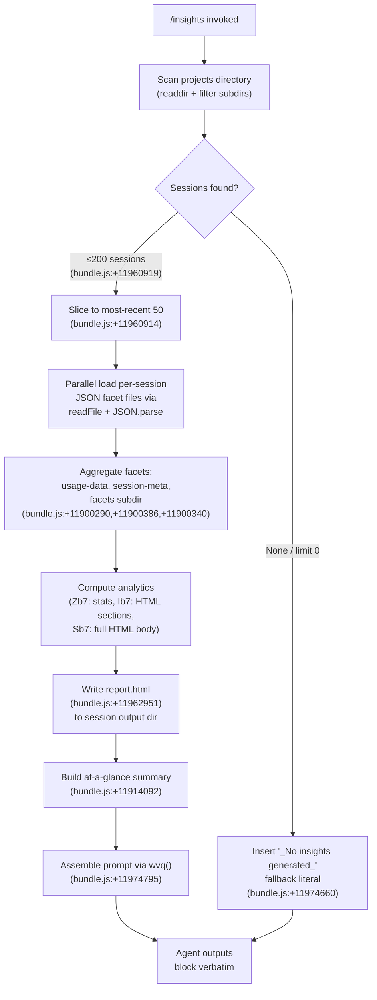

# `/insights`

> Analysis basis: CC v2.1.141 bundle.js (AST extraction + Claude interpretation)
> Minimum version: v2.1.141

---

## Overview

The `/insights` command generates a comprehensive HTML usage report from the user's accumulated Claude Code session data (stored as `.jsonl` facet files), writes the report to disk, and then instructs the agent to relay a fixed confirmation message — including the report URL and a follow-up offer — verbatim to the user. The command performs all data collection and HTML rendering inside `getPromptForCommand` before handing a pre-assembled context block to the agent.

---

## Registration

| Field | Value |
|---|---|
| type | `prompt` |
| name | `insights` |
| description | Generate a report analyzing your Claude Code sessions |
| loc_byte | `11973589` |
| loc_byte_end | `11974893` |
| loc_line | `8841` |
| handler_method | `getPromptForCommand` |
| handler_method_start | `11973763` |
| handler_method_end | `11974892` |
| prompt_body.length | `513` |
| prompt_body.trace | `call→wvq(...) (1 literals)` |
| arbor_handler.name | `getPromptForCommand` |
| arbor_handler.kind | `Method` |
| arbor_handler.resolution_path | `direct` |
| arbor_handler.fqn | `claude-2.1.141::getPromptForCommand` |
| arbor_handler.n_hits | `1` |

Analysis basis: CC v2.1.141 bundle.js:+11973589

---

## Input Branching

The command has 3+ distinct paths: session-directory scan → per-session facet loading → HTML report generation → fallback when no insights are produced. A Mermaid flowchart is used.



---

## Behavioral Spec

### Handler Entry — `getPromptForCommand`

Analysis basis: CC v2.1.141 bundle.js:+11973763

```
async function getPromptForCommand(context):
    sessionDirs = await scanSessionDirectories()   // Dvq → Cb7
    if sessionDirs is empty:
        prompt = buildPrompt(insightsData=null, fallbackText="_No insights generated_")
        return prompt  // bundle.js:+11974660

    recentSessions = sessionDirs.slice(0, 50)       // bundle.js:+11960914, 11960919
    sessionDataList = await Promise.all(
        recentSessions.map(dir => loadSessionFacets(dir))
    )

    analytics = computeAnalytics(sessionDataList)   // Zb7, Ib7, Mg_
    htmlBody   = buildHTMLReport(analytics)         // Sb7
    reportPath = path.join(outputDir, "report.html") // bundle.js:+11962951

    await writeFile(reportPath, htmlBody)

    atAGlance   = buildAtAGlanceSummary(analytics)  // bundle.js:+11914092
    promptText  = wvq(insightsData, reportURL,
                      htmlFilePath, facetsDir,
                      atAGlance)                    // bundle.js:+11974795
    return promptText
```

---

### Session Directory Scanner — `scanSessionDirectories` (maps to `Dvq` → `Cb7`)

Analysis basis: CC v2.1.141 bundle.js:+11960895

```
async function scanSessionDirectories(baseDir):
    // baseDir resolves through dQ → _$.join("projects") (bundle.js:+11986626)
    entries = await fs.readdir(baseDir)             // NS.readdir, bundle.js:+11960522
    dirs = entries.filter(e => fs.stat(e).isDirectory())  // bundle.js:+11960590

    // Throttle: batch size 10 / concurrency 9 (bundle.js:+11960772, +11960777)
    // Max sessions processed: 200 (bundle.js:+11960919)
    // Yield via setImmediate between batches (bundle.js:+11960802)
    dirs = dirs.sort(...)                           // bundle.js:+11960826
    return dirs
```

---

### Per-Session Facet Loader — `loadSessionFacets` (maps to `Gb7`)

Analysis basis: CC v2.1.141 bundle.js:+11906354

```
async function loadSessionFacets(sessionDir):
    usageDataPath   = buildUsageDataPath(sessionDir)
        // TX8 → path.join(..., "usage-data")   bundle.js:+11900290
    sessionMetaPath = buildSessionMetaPath(sessionDir)
        // Lg_ → path.join(..., "session-meta") bundle.js:+11900386

    rawJson = await fs.readFile(usageDataPath, "utf-8")  // bundle.js:+11906421
    parsed  = safeJsonParse(rawJson)                     // b6 → JSON.parse, bundle.js:+179723

    facetsDir = path.join(sessionDir, "facets")          // bundle.js:+11900340
    facetFiles = await scanFacetFiles(facetsDir)         // xsH

    return { usageData: parsed, sessionMetaPath, facetFiles }
```

---

### Facet File Scanner — `scanFacetFiles` (maps to `xsH`)

Analysis basis: CC v2.1.141 bundle.js:+12039266

```
async function scanFacetFiles(facetsDir):
    entries = await fs.readdir(facetsDir)           // GL.readdir
    files   = entries.filter(e =>
        fs.stat(e).isFile()                         // K.isFile, bundle.js:+12039343
        && matchesPattern(e)                        // mn → N$4.test, bundle.js:+5346206
        && e.endsWith(".jsonl")                     // bundle.js:+12039372
    )
    stats = await Promise.all(
        files.map(f => fs.stat(f))                  // GL.stat, bundle.js:+12039575
    )
    // Metadata stored via _.set (bundle.js:+12039586)
    return files.map((f, i) => ({
        name: path.basename(f),                     // _$.basename, bundle.js:+12039400
        stats: stats[i]
    }))
```

---

### Analytics Computation — `computeSessionStats` (maps to `Zb7`)

Analysis basis: CC v2.1.141 bundle.js:+11909683

```
function computeSessionStats(sessionDataList):
    // Aggregates per-session records into statistical summaries
    // Key operations observed in call graph:
    //   Object.entries iteration (bundle.js:+11910015)
    //   Median / percentile via q.sort + q.at + Math.floor (bundle.js:+11911511, +11911576, +11911685)
    //   Math.round for display rounding (bundle.js:+11911864)
    //   Time-bucket helpers: yvq — session duration buckets:
    //     1000ms, 3600s thresholds (bundle.js:+11901772, +11901787)
    //   Tool-outcome classification:
    //     "Command Failed", "User Rejected", "Edit Failed",
    //     "File Changed", "File Too Large", "File Not Found"
    //     (bundle.js:+11902001..+11902397)
    //   Activity buckets (zvq):
    //     "WebSearch", "WebFetch", "Edit", "Write",
    //     "git commit", "git push"
    //     (bundle.js:+11900983..+11901402)
    //   Time-of-day buckets (Sb7):
    //     Morning 6-12, Afternoon 12-18,
    //     Evening 18-24, Night 0-6
    //     (bundle.js:+11917913..+11918066)
    //   Response-time buckets:
    //     2-10s, 10-30s, 30s-1m, 1-2m, 2-5m, 5-15m, >15m
    //     (bundle.js:+11917065..+11917125)
    //   Idle timeout cap: 1,800,000 ms (bundle.js:+11908320)
    return aggregatedStats
```

---

### HTML Report Builder — `buildHTMLReport` (maps to `Sb7`)

Analysis basis: CC v2.1.141 bundle.js:+11918699

```
function buildHTMLReport(analytics):
    // Core chart/section renderers called from Sb7:
    //   H4H  — horizontal bar chart sections (bundle.js:+11916416)
    //          Colors: #2563eb, #0891b2, #10b981, #8b5cf6 (bundle.js:+11954730..+11955183)
    //          Error color: #dc2626 (bundle.js:+11958446)
    //          Success color: #16a34a (bundle.js:+11958695)
    //          Warning color: #eab308 (bundle.js:+11959188)
    //   kb7  — summary metric tables (bundle.js:+11917438)
    //   yb7  — sparkline / distribution tables (bundle.js:+11918145)
    //   GX8  — section wrappers (bundle.js:+11916325)
    //   hb7  — JSON.stringify serialisation for inline data (bundle.js:+11918641)
    //
    // HTML escaping via g5 (bundle.js:+4526098):
    //   &amp; &lt; &gt; &quot; &apos; (bundle.js:+4526115..+4526238)
    // Markdown-to-HTML fragments:
    //   Bold: <strong>$1</strong> (bundle.js:+11918771)
    //   Bullet: "• " (bundle.js:+11918814)
    //   Line break: <br> (bundle.js:+11918844)
    // Empty-state placeholders:
    //   "<p class=\"empty\">No data</p>"                    (bundle.js:+11916556)
    //   "<p class=\"empty\">No response time data</p>"     (bundle.js:+11917013)
    //   "<p class=\"empty\">No time data</p>"              (bundle.js:+11917863)
    //   "<p class=\"empty\">No tool errors</p>"            (bundle.js:+11958457)
    // Max HTML section size: 8192 chars (bundle.js:+11916234)
    // "Add to CLAUDE.md" suggestion link included (bundle.js:+11922409)
    return htmlString
```

---

### Facet HTML Renderer — `buildFacetSections` (maps to `Ib7`)

Analysis basis: CC v2.1.141 bundle.js:+11912546

```
async function buildFacetSections(facetDataMap):
    // Iterates Object.entries of facetDataMap (bundle.js:+11913078)
    // Rounds values via Math.round (bundle.js:+11913011)
    // Serialises sub-sections via SH → JSON.stringify (bundle.js:+11912893)
    // Falls back to "None captured" when section is empty (bundle.js:+11913426)
    // Limit: Promise.all over Vb7.map (bundle.js:+11913451..+11913463)
    // Per-facet rendering delegated to $vq (bundle.js:+11913476):
    //   $vq → XDH (transcript access) → Sz8 (hash/UUID generation)
    //   $vq → TK (filter pass) → b6 (JSON parse) → kH (error handler)
    return renderedSections
```

---

### Report Write & Path Assembly — `writeReportFile` (maps to `Dvq` write path)

Analysis basis: CC v2.1.141 bundle.js:+11962893, +11962937, +11962951, +11962979

```
async function writeReportFile(htmlBody, sessionOutputDir):
    await fs.mkdir(sessionOutputDir, { recursive: true })
    outputPath = path.join(sessionOutputDir, "report.html")  // bundle.js:+11962951
    await fs.writeFile(outputPath, htmlBody)
    return outputPath
```

---

### Prompt Assembler — `buildInsightsPrompt` (maps to `wvq`)

Analysis basis: CC v2.1.141 bundle.js:+11974795

```
function buildInsightsPrompt(insightsData, reportURL, htmlFilePath,
                              facetsDir, atAGlanceSummary):
    // Constructs the 513-character prompt body (bundle.js:+11974795)
    // Injects:
    //   • full insights data block
    //   • reportURL, htmlFilePath, facetsDir paths
    //   • atAGlanceSummary (context-only; user has not seen it)
    // Terminates with a <message>…</message> block the agent must
    // output verbatim, including the shareable report URL and the
    // follow-up offer "Want to dig into any section or try one of
    // the suggestions?" (prompt_body trace: bundle.js:+11974795)
    //
    // Separator literal " · " used in at-a-glance line (bundle.js:+11974221)
    // Math.round applied to numeric summary fields (bundle.js:+11974150)
    // Fallback when insightsData is null:
    //   "_No insights generated_" (bundle.js:+11974660)
    return promptString
```

---

### Session Meta Writer — `writeSessionMeta` (maps to `Tb7`)

Analysis basis: CC v2.1.141 bundle.js:+11906495

```
async function writeSessionMeta(sessionDir, metaObject):
    await fs.mkdir(sessionDir, { recursive: true })         // NS.mkdir
    metaPath = path.join(sessionDir, ...)                   // Md.join, bundle.js:+11906532
    serialised = JSON.stringify(metaObject)                 // SH → JSON.stringify, bundle.js:+178983
    await fs.writeFile(metaPath, serialised)                // NS.writeFile, bundle.js:+11906576
    // On error: kH error handler triggered (bundle.js:+11906642)
    // Max JSON size written: 384 bytes (bundle.js:+11906627)
```

---

### Insights Report Generator — `generateInsightsReport` (maps to `Eb7`)

Analysis basis: CC v2.1.141 bundle.js:+11906689

```
async function generateInsightsReport(sessionDataList):
    // Delegates to Pb7 for batch assembly (bundle.js:+11906689)
    //   Pb7 → wb7 → Mg_ (metric aggregation, bundle.js:+11904524)
    //   Batch: Promise.all over q.map (bundle.js:+11905705)
    //   Timeout: 30,000 ms outer / 25,000 ms inner (bundle.js:+11905610, +11905631)
    //   Max lines per section: 500 (bundle.js:+11904833)
    //   Max chars per line: 300 (bundle.js:+11905125)
    //   Concurrency: 8 parallel workers (bundle.js:+11904571)
    //
    // HTML generation delegated to XDH → Sz8:
    //   SHA-1 hash (bundle.js:+9494706), hex, 6-char prefix (bundle.js:+9494735, +9494750)
    //   randomUUID via bZ.randomUUID (bundle.js:+9817166)
    //
    // Type tag for the insights kind: "insights" (bundle.js:+11907687)
    // Max output tokens: 4096 (bundle.js:+11907796)
    // Warmup mode: "warmup_minimal" (bundle.js:+11962710)
    //
    // On facet JSON parse failure: kH + k_ error path (bundle.js:+11907873, +11907977)
    return reportData
```

---

## State & Side Effects

| Item | Detail |
|---|---|
| Telemetry | No `tengu_insights_*` event found in depth-2 traversal for this command specifically; the general telemetry events below are reachable via shared infrastructure. See note. |
| `tengu_transcript_phantom_parent` | Fired when a transcript entry references an unknown parent UUID (bundle.js:+12025041) |
| `tengu_relink_walk_broken` | Fired during transcript re-link when a walk step is broken (bundle.js:+12006555) |
| `tengu_transcript_parent_cycle` | Fired when a parent-UUID cycle is detected in transcript (bundle.js:+12028457) |
| `tengu_chain_parent_cycle` | Fired when chain walk hits a UUID cycle (bundle.js:+12008147) |
| `tengu_chain_timestamp_fallback` | Fired when timestamp sort falls back to insertion order (bundle.js:+12008296) |
| `tengu_chain_parallel_tr_recovered` | Fired when parallel transcript recovery succeeds (bundle.js:+12010162) |
| Filesystem writes | `report.html` written to session output directory (bundle.js:+11962951); session-meta JSON written (bundle.js:+11906576) |
| Filesystem reads | `readdir` on projects base dir; per-session `readFile` for usage-data and session-meta; `readdir` + `stat` on facets subdirectory |
| appState changes | None identified in depth-2 traversal for this command path |
| Hook registration | None identified for this command specifically |
| Sound | Not found in depth-2 traversal |
| Prompt output mode | Agent instructed to output `<message>…</message>` block **verbatim** with no omissions (prompt_body, bundle.js:+11974795) |
| Max sessions scanned | 200 (bundle.js:+11960919) |
| Sessions passed to renderer | 50 most-recent (bundle.js:+11960914) |
| Scan batch size | 10 entries / 9 concurrent (bundle.js:+11960772, +11960777) |
| Idle timeout cap | 1,800,000 ms (bundle.js:+11908320) |
| Outer generation timeout | 30,000 ms (bundle.js:+11905610) |
| Inner generation timeout | 25,000 ms (bundle.js:+11905631) |

---

## Version History

| Version | Change |
|---|---|
| v2.1.141 | Initial analysis |

---

## Common Mistakes

1. **Expecting interactive input**: `/insights` takes no arguments. It reads data that was already persisted to the facets directory; passing extra text after the command has no effect.
2. **Running in an environment without session history**: If no `projects` subdirectories exist, the command produces a `_No insights generated_` response rather than an error. This is expected behaviour, not a bug.
3. **Assuming the agent adds its own commentary**: The prompt explicitly instructs the agent to output the `<message>` block verbatim. Any deviation (e.g., the agent paraphrasing) indicates prompt-following failure, not a command defect.
4. **Expecting real-time data**: The report reflects data collected from `.jsonl` facet files written by previous sessions. Current in-flight session data may not be captured.
5. **Confusing the report URL with a live endpoint**: The `report.html` file is written locally; the "shareable" URL is a local file path or a pre-generated static URL, not a remote service endpoint.
6. **Ignoring the `facets` directory for debugging**: When the report is unexpectedly sparse, inspecting `<session_dir>/facets/*.jsonl` files directly is the correct first step, as that is the sole data source for the report.

---

## Appendix — Identifier Mapping

> For bundle debugging only. Identifiers change across versions.

| Identifier | Role |
|---|---|
| `__handler_insights` | Synthetic BFS entry point for the `/insights` command handler |
| `Dvq` | Main insights orchestrator; drives session scan, load, render, and write pipeline |
| `Cb7` | Session directory scanner (readdir + isDirectory filter + sort) |
| `dQ` | Base directory path builder (`path.join` → `"projects"`) |
| `xsH` | Facet file scanner (readdir + isFile + `.jsonl` filter + stat) |
| `mn` | Filename pattern matcher (`N$4.test`) |
| `Gb7` | Per-session facet loader (readFile + JSON.parse for usage-data / session-meta) |
| `Lg_` | Session-meta path builder |
| `TX8` | Usage-data path builder (`"usage-data"` subpath) |
| `b6` | Safe JSON parser wrapper (`JSON.parse`) |
| `Mg_` | Metric aggregator; computes per-session statistics including rounding |
| `zvq` | Activity/tool classifier; maps tool names and outcomes to display categories |
| `zb7` | File extension extractor (`Md.extname`) |
| `t$H` | Diff utility caller (`On9.diff`) |
| `H7` | String indexOf helper |
| `iM` | Internal metric helper used by `Mg_` |
| `Zb7` | Session statistics engine; medians, percentiles, time buckets, tool outcome counts |
| `Yvq` | Distribution aggregator; builds sorted frequency maps |
| `bsH` | Object.entries iteration helper for session stat maps |
| `B1` | String slice/indexOf utility |
| `Ib7` | Facet HTML section builder; iterates facet data, renders per-section HTML |
| `$vq` | Per-facet renderer; delegates to `XDH`, `TK`, `b6`, `kH` |
| `fb7` | Fallback facet handler (`bV` path) |
| `Sb7` | Full HTML report builder; assembles all chart/section HTML into final document |
| `B7` | HTML escape helper dispatcher |
| `g5` | Core HTML character escaper (`&amp;`, `&lt;`, `&gt;`, `&quot;`, `&apos;`) |
| `GX8` | HTML section wrapper generator |
| `hb7` | Inline JSON serialiser for embedded report data (`SH`) |
| `H4H` | Horizontal bar chart HTML renderer; uses colour palette and empty-state strings |
| `kb7` | Summary metric table renderer |
| `yb7` | Sparkline/distribution table renderer |
| `Eb7` | Insights report generator; orchestrates `Pb7`, `XDH`, timeout logic |
| `Pb7` | Batch report assembler; calls `wb7` per session with concurrency and timeout |
| `wb7` | Single-session report worker; calls `Mg_`, line-limits sections |
| `XDH` | Transcript accessor; calls `Sz8` for hashing, `gNH` for assistant message lookup |
| `Sz8` | Session hash/UUID generator (SHA-1 hex, `randomUUID`) |
| `Y8` | UUID + journal helper |
| `gNH` | Assistant message finder; throws `"No assistant message found"` on miss |
| `Ovq` | Report output path resolver (`bV` branch) |
| `bV` | Base output path helper (`pf`, `DM`) |
| `TK` | Content filter (`.filter` on `H`) |
| `Tb7` | Session-meta writer (`mkdir` + `writeFile` + `JSON.stringify`) |
| `Xb7` | Session data file reader/unlinker (`readFile` + `b6` + `NS.unlink`) |
| `EX8` | Output directory path builder |
| `Jvq` | JSON validation / post-parse helper |
| `Wb7` | Secondary file writer (facet output, `mkdir` + `writeFile`) |
| `bb7` | Object key enumerator helper |
| `fg_` | Insights state accessor (used with `h.get`/`h.set` map) |
| `Zb7` | (see above — session statistics engine) |
| `wvq` | Final prompt string assembler; injects all data fields into the 513-char template |
| `SH` | `JSON.stringify` wrapper |
| `kH` | Centralised error handler (logs via `Oc.logError`, pushes to `aRH`) |
| `k_` | Error/string coercion utility |
| `EHH` | Transcript index builder; populates many typed Maps from JSONL records |
| `dvq` | Transcript re-link walker |
| `sqH` | Chain ordering resolver (cycle detection, timestamp sort) |
| `Ox7` | Chain validity checker (`Number.isNaN` guard) |
| `zx7` | Chain sorter / parallel-transcript reconciler |
| `Mx7` | Chain shift/dequeue helper |
| `fNq` | Facet accumulator (pushes into per-UUID map) |
| `AnH` | JSONL array mapper |
| `Ig_` | Compact-summary text extractor |
| `A06` | Message content normaliser |
| `Ng_` | Media-type filter (image/document guard) |
| `Yx7` | Array/string trim helper |
| `Dx7` | `Array.some` predicate wrapper |
| `CX8` | Chain cache getter/setter |
| `bX8` | `Array.from(H.values())` utility |
| `Yb7` | NaN-guarded number converter |
| `Ex7` | JSONL binary file reader (open/read/close sync) |
| `Zx7` | Synchronous JSONL reader |
| `Tx7` | JSONL streaming parser |
| `ZXH` | Codec helpers (`kyK`, `yyK`, `SyK`, `hyK`) |
| `RH` | `String()` coercion wrapper |
| `TH` | `String()` coercion wrapper (second instance) |
| `ZX8` | Transcript/chain query dispatcher; fans out to all typed Maps |
| `ob7` | Transcript entry constructor |
| `_p` | Transcript entry post-processor |
| `w6A` | Recursive object walker (Array.isArray branch) |
| `VP` | Value presence / validation predicate |
| `rX6` | Random-jitter utility (used in retry logic) |
| `xL7` | Timestamp normaliser (`Date.now` based) |
| `$78` | Object-key stats aggregator |
| `M78` | `aK` metric helper |
| `_8` | MCP debug logger (`Oc.logMCPDebug`) |
| `_7` | MCP error logger (`Oc.logMCPError`) |
| `Nh_` | OAuth flow initiator (MCP auth) |
| `kh_` | OAuth callback handler (MCP auth) |
| `sHq` | Away-summary generator |
| `Ih_` | MCP tool invocation wrapper |
| `fG_` | Transport type includer check |
| `SvH` | MCP server connection manager |
| `$HH` | MCP tool dispatcher |
| `hI` | MCP hint handler |
| `Eeq` | MCP update applicator |
| `fY8` | MCP state helper (`SH`) |
| `sI` | MCP cleanup wrapper |
| `XA5` | MCP client reconciler |
| `z78` | MCP tool-set membership tester |
| `a8` | Abort-aware timeout helper |
| `irH` | MCP initialisation helper (`SH`) |
| `XTq` | Timestamp-stamped state record builder |

---

Note: index built via Arbor fallback; some signals (telemetry, literals) may be missing — see arbor-fallback.js.