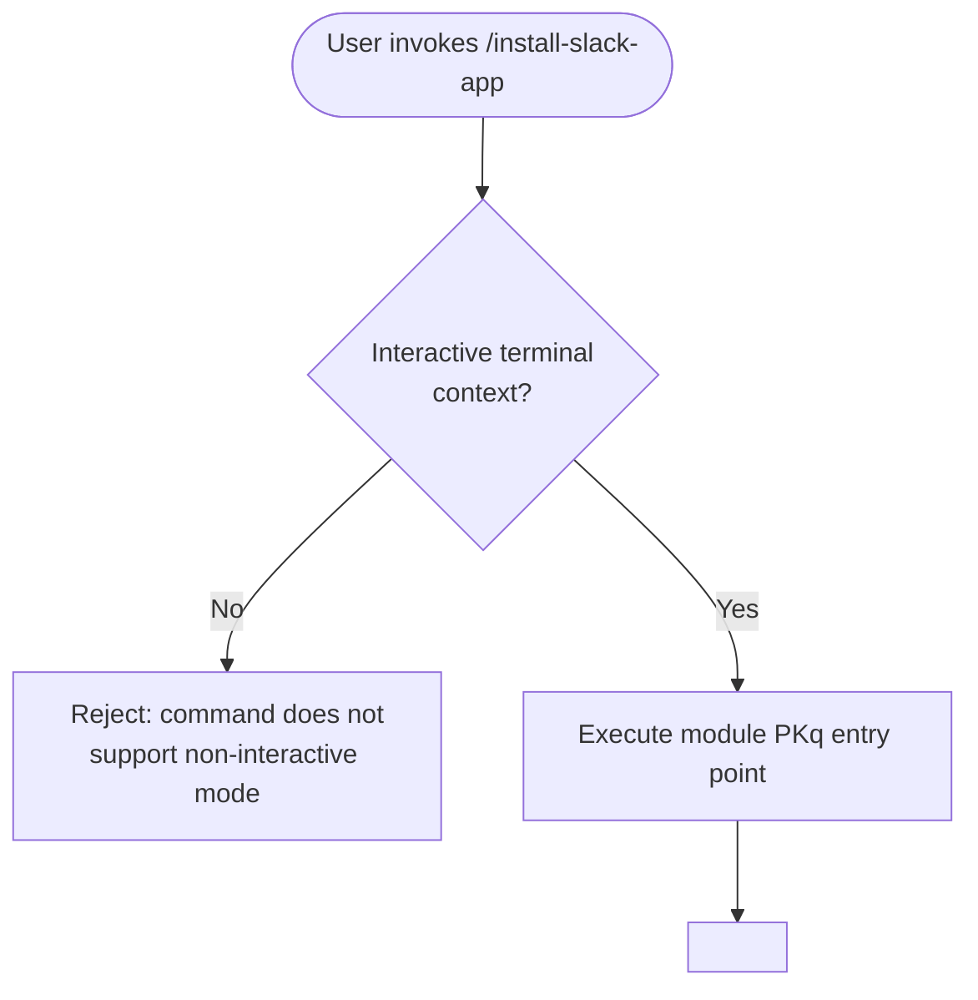

# `/install-slack-app`

> Analysis basis: CC v2.1.139 bundle.js (AST extraction + Claude interpretation)
> Minimum version: v2.1.139

---

## Overview

`/install-slack-app` is a local slash command that guides the user through installing the Claude Slack application. It is registered as a non-interactive command, meaning it does not support headless or piped execution contexts. Its implementation is encapsulated entirely within module `PKq`; however, no entry-point functions were resolved during depth-2 AST traversal.

---

## Registration

| Field | Value |
|---|---|
| type | `local` |
| name | `install-slack-app` |
| description | `Install the Claude Slack app` |
| supportsNonInteractive | `false` |
| module\_id | `PKq` |

Analysis basis: CC v2.1.139 bundle.js:+10550885

---

## Input Branching

No call graph edges, literal constants, or branching paths were recovered for this command at traversal depth ≤ 2. The diagram below represents the only structurally confirmed fact: the command is rejected when the runtime context is non-interactive, as indicated by `supportsNonInteractive: false`.



Analysis basis: CC v2.1.139 bundle.js:+10550885 (`supportsNonInteractive: false`)

---

## Behavioral Spec

### Non-Interactive Guard

Because `supportsNonInteractive` is `false`, the Claude Code CLI runtime rejects the command before module `PKq` is entered whenever the process is running in a non-interactive context (e.g., piped stdin, `--no-interactive` flag, or CI mode).

```
function installSlackAppGuard(context):
    if not context.isInteractive:
        raise CommandNotSupportedError(
            command = "install-slack-app",
            reason  = "non-interactive mode is not supported"
        )
    return invokeModuleEntryPoint("PKq", context)
```

Analysis basis: CC v2.1.139 bundle.js:+10550885

### Core Installation Flow

<!-- TODO: not found in depth-2 traversal; needs --depth 4 -->

The internal logic of module `PKq` — including any OAuth flow, URL generation, browser launch, token exchange, or configuration persistence — was not resolved during the depth-2 AST traversal. A deeper traversal is required to produce a verified behavioral spec for this sub-feature.

```
function installSlackApp(context):
    // Guard confirmed at registration layer (see above)
    // Remainder of flow: TODO (depth-4 traversal required)
    ...
```

---

## State & Side Effects

| Item | Detail |
|---|---|
| Telemetry | None detected at traversal depth ≤ 2 <!-- TODO: not found in depth-2 traversal; needs --depth 4 --> |
| Hook registration | <!-- TODO: not found in depth-2 traversal; needs --depth 4 --> |
| appState changes | <!-- TODO: not found in depth-2 traversal; needs --depth 4 --> |
| Sound | <!-- TODO: not found in depth-2 traversal; needs --depth 4 --> |
| Filesystem writes | <!-- TODO: not found in depth-2 traversal; needs --depth 4 --> |
| Network calls | <!-- TODO: not found in depth-2 traversal; needs --depth 4 --> |

---

## Version History

| Version | Change |
|---|---|
| v2.1.139 | Initial analysis; registration confirmed, internal logic requires deeper traversal |

---

## Common Mistakes

1. **Running in non-interactive mode.** Because `supportsNonInteractive` is `false`, invoking `/install-slack-app` inside a script, CI pipeline, or with a piped stdin will cause the command to be rejected before any installation logic executes. Always invoke this command from an interactive terminal session.
2. **Expecting silent or machine-readable output.** Given that the command is interactive-only, any output it produces is intended for human consumption. Do not attempt to parse its stdout programmatically.
3. **Assuming no network access is required.** Installing a Slack app integration almost certainly involves external OAuth or API calls. Ensure outbound network access is available before invoking the command. (Structural confirmation pending depth-4 traversal.)

---

## Appendix — Identifier Mapping

> For bundle debugging only. Identifiers change across versions.

| Identifier | Role |
|---|---|
| `PKq` | Module containing the `/install-slack-app` command implementation |

> No additional obfuscated identifiers were recovered at traversal depth ≤ 2. A depth-4 traversal of module `PKq` is required to populate this table fully.