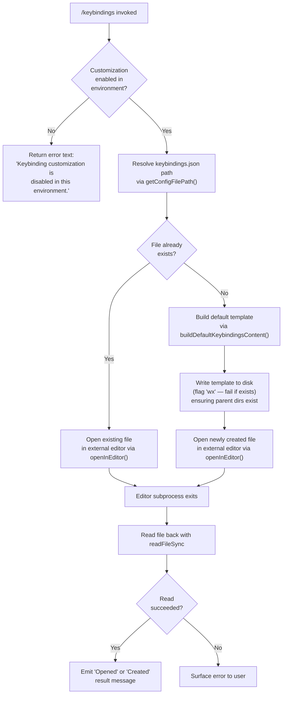

# `/keybindings`

> Analysis basis: CC v2.1.133 bundle.js (AST extraction + Claude interpretation)
> Minimum version: v2.1.133

---

## Overview

The `/keybindings` command opens or creates the user's `keybindings.json` configuration file in an external editor. When the file does not yet exist the command generates a default template (populated from currently registered keybindings and annotated with schema/documentation URLs) before launching the editor. After the editor session ends, the updated file is read back and applied to the running session.

---

## Registration

| Field | Value |
|---|---|
| `type` | `local` |
| `name` | `keybindings` |
| `description` | `Open or create your keybindings configuration file` |
| `loc_byte` | `10400044` |
| `loc_byte_end` | `10400238` |
| `loc_line` | `6233` |
| `supportsNonInteractive` | `false` |
| `module_id` | `N6q` |
| `load_inline` | `true` |
| `arbor_handler.name` | `dq7` |
| `arbor_handler.fqn` | `claude-2.1.133::dq7` |
| `arbor_handler.kind` | `AsyncFunction` |
| `arbor_handler.resolution_path` | `module_id` |
| `arbor_handler.n_hits` | `0` |

Analysis basis: CC v2.1.133 bundle.js:+10400044

---

## Input Branching

Four distinct paths exist depending on environment permissions and file existence state:



Analysis basis: CC v2.1.133 bundle.js:+10399438

---

## Behavioral Spec

### 1. Entry Point — `handleKeybindingsCommand` (`dq7`)

```
async function handleKeybindingsCommand(context):
    if not isKeybindingCustomizationEnabled(context):
        return { type: "text",
                 content: "Keybinding customization is disabled in this environment." }

    configPath = getKeybindingsFilePath()          // resolves keybindings.json
    parentDir  = path.dirname(configPath)

    if not fileExists(configPath):
        template = buildDefaultKeybindingsContent()
        await fs.mkdir(parentDir, { recursive: true })
        await fs.writeFile(configPath, template, { flag: "wx" })  // exclusive create

    result = await openInEditor(configPath)        // suspends TUI, launches editor

    content = fs.readFileSync(configPath, "utf-8")

    outcome = fileWasPreExisting ? "Opened" : "Created"
    return formatResult(outcome, content)
```

Analysis basis: CC v2.1.133 bundle.js:+10399438

---

### 2. Config File Path Resolution — `getKeybindingsFilePath` (`gAH`)

```
function getKeybindingsFilePath():
    baseConfigDir = getClaudeConfigDirectory()     // platform config root
    return path.join(baseConfigDir, "keybindings.json")
```

The filename constant `"keybindings.json"` is hardcoded.
Analysis basis: CC v2.1.133 bundle.js:+10399535 / bundle.js:+3609065

---

### 3. Default Template Generation — `buildDefaultKeybindingsContent` (`I6q` → `Qq7`)

```
function buildDefaultKeybindingsContent():
    registeredBindings = getAllRegisteredKeybindings()   // $K6 map

    lines = []
    for each [action, binding] in Object.entries(registeredBindings):
        if not isReservedAction(action):                 // A.has() check
            lines.push(formatBindingEntry(action, binding))

    // Adds $schema and $docs annotation fields pointing to:
    //   https://www.schemastore.org/claude-code-keybindings.json
    //   https://code.claude.com/docs/en/keybindings
    document = {
        "$schema": "https://www.schemastore.org/claude-code-keybindings.json",
        "$docs":   "https://code.claude.com/docs/en/keybindings",
        ...formattedBindings
    }

    return serializeToJson(document)   // JSON.stringify with formatting
```

The schema URL (`https://www.schemastore.org/claude-code-keybindings.json`) and documentation URL (`https://code.claude.com/docs/en/keybindings`) are hardcoded constants.
Analysis basis: CC v2.1.133 bundle.js:+10399191 / bundle.js:+10399256 / bundle.js:+10399311

---

### 4. External Editor Launch — `openInEditor` (`km`)

```
async function openInEditor(filePath):
    inkInstance = getInkRenderInstance()
    if inkInstance is null:
        throw Error("Ink instance not found - cannot pause rendering")

    editorCommand = resolveEditorCommand()          // $EDITOR / $VISUAL / fallback
    inkInstance.enterAlternateScreen()
    inkInstance.pause()
    inkInstance.suspendStdin()

    argv   = editorCommand.split(" ")
    binary = argv.slice(0, ...)                     // first token is binary
    args   = argv.slice(...)                        // remaining tokens

    result = child_process.spawnSync(binary, [...args, filePath],
                 { stdio: "inherit" })

    inkInstance.exitAlternateScreen()
    inkInstance.resumeStdin()
    inkInstance.resume()

    return result
```

The `spawnSync` call uses `stdio: "inherit"` so the editor receives the full terminal.
Analysis basis: CC v2.1.133 bundle.js:+10338422

---

### 5. Editor Resolution — `resolveEditorInfo` (`Mq7` → `cNA`)

```
function resolveEditorInfo(filePath):
    basename = path.basename(filePath)
    // Strips extension via indexOf / slice utilities
    name     = stripExtension(basename)

    // Searches a known-editors registry (_q7) for a match
    match    = knownEditors.find(entry => matches(entry, name))

    if match found and isIDEEditor(match):
        return { kind: "IDE", ... }

    return { kind: "terminal", command: resolveTerminalEditor() }
```

Analysis basis: CC v2.1.133 bundle.js:+10338385

---

### 6. File Watch / Config Reload — `watchConfigFile` (`u2K`) called via `R6`

```
function watchConfigFile(filePath, onChange):
    watcher = fs.watchFile(filePath, callback)

    callback = (curr, prev):
        if curr.mtime != prev.mtime:
            newContent = readConfigFile(filePath)
            He8(newContent)                         // apply to in-memory config
            kd(newContent)                          // notify subscribers
            if shouldUnwatch():
                fs.unwatchFile(filePath)
                y1()
```

Analysis basis: CC v2.1.133 bundle.js:+10338243 / bundle.js:+3109608

---

### 7. Config Read / Parse — `readAndParseConfig` (`m5H`)

```
function readAndParseConfig(configPath):
    if not accessAllowed():
        throw Error("Config accessed before allowed.")

    try:
        raw = fs.readFileSync(configPath, "utf-8")
    catch err:
        if err.code == "ENOENT":
            return defaultConfig()
        if err.code == "error":
            emit telemetry("tengu_config_parse_error")
            return defaultConfig()
        throw err

    // Backup logic: if backup dir exists and has matching prefix files,
    //   copies current file to backup with Date.now() timestamp suffix
    backupDir = path.join(path.dirname(configPath), "backups")
    if fs.statSync(backupDir) exists:
        existingBackups = fs.readdirStringSync(backupDir)
            .filter(f => f.startsWith(baseName))
        if existingBackups exist:
            fs.copyFileSync(configPath,
                path.join(backupDir, baseName + "." + Date.now()))

    parsed = JSON.parse(raw)
    return parsed
```

Error code `"ENOENT"` triggers silent default; parse failures emit `tengu_config_parse_error`.
Analysis basis: CC v2.1.133 bundle.js:+3113211

---

## State & Side Effects

| Item | Detail |
|---|---|
| Telemetry — `tengu_config_parse_error` | Fired when the config file cannot be parsed (bundle.js:+3113854) |
| Telemetry — `tengu_keybinding_customization_release` | Fired during keybinding customization feature gating / release check (bundle.js:+3608551) |
| File creation | `keybindings.json` written with `wx` flag (exclusive, no overwrite) when absent (bundle.js:+10399648) |
| Directory creation | Parent config directory created with `mkdir({ recursive: true })` if missing (bundle.js:+10399552) |
| Terminal state | TUI rendering paused (`pause`, `suspendStdin`, `enterAlternateScreen`) for editor; restored on exit (bundle.js:+10338623) |
| File watch | `fs.watchFile` registered on config path after open; auto-removed via `unwatchFile` when no longer needed (bundle.js:+3109613) |
| Config backup | On parse, if a backup directory exists and prior backups share the same basename, a timestamped copy is created (bundle.js:+3113814) |
| Growthbook experiment | `growthbook_experiment` / `GrowthbookExperimentEvent` signals emitted via `Xo.emit` during feature-flag evaluation (bundle.js:+3085590) |
| `appState` changes | In-memory keybindings config updated via `He8` subscriber after file-watch callback fires (bundle.js:+3109838) |
| Sound | None detected in depth-2 traversal |

---

## Version History

| Version | Change |
|---|---|
| v2.1.133 | Initial analysis |

---

## Common Mistakes

1. **Running in a non-interactive or restricted environment** — `supportsNonInteractive: false` means this command will return an error or be unavailable in CI/pipe contexts. The environment guard returns the message `"Keybinding customization is disabled in this environment."` before any file I/O occurs.

2. **Manually editing `keybindings.json` while Claude Code is running** — the file watcher (`watchConfigFile`) will reload the file automatically. Hand-editing after `/keybindings` exits but before the watcher fires may cause a race where your changes are reflected before the next command cycle; however editing while the editor subprocess is open risks the watcher applying a partially written file.

3. **Expecting the command to merge or diff changes** — the command performs a full overwrite of the template on first creation (exclusive `wx` flag), and a full read-back after the editor exits. There is no three-way merge; concurrent external edits made during the editor session will simply be read as-is.

4. **Assuming `$EDITOR` is always honoured** — the editor resolution logic (`resolveEditorInfo`) checks a known-editors registry first. An unrecognised `$EDITOR` value may fall through to a terminal-fallback branch rather than the IDE branch, changing how the editor is launched.

5. **Deleting the backup directory to suppress backups** — the backup logic in `readAndParseConfig` only fires when the backup directory already exists *and* prior backups with the same basename are present. Removing the directory entirely will suppress backups silently; re-creating an empty directory will also suppress them until at least one backup file is present.

---

## Appendix — Identifier Mapping

> For bundle debugging only. Identifiers change across versions.

| Identifier | Role |
|---|---|
| `dq7` | `handleKeybindingsCommand` — async top-level handler for `/keybindings` |
| `mx` | `checkKeybindingCustomizationEnabled` — environment/feature-gate guard |
| `J6` | `resolveOrCreateConfig` — config resolution and creation orchestrator |
| `Bq6` | `configPathResolver` — helper inside config resolution |
| `gq6` | `configDefaultFactory` — produces default config values |
| `Po` | `configStateAccessor` — reads/updates in-memory config state |
| `kH` | `configKeyNormalizer` — normalises config key strings |
| `jo` | `configEventEmitter` — emits config-change events |
| `_d6` | `deduplicatedConfigWriter` — writes config, deduplicating concurrent writes |
| `pt8` | `growthbookExperimentTracker` — records Growthbook experiment participation |
| `ct8` | `configSubscriberNotifier` — notifies subscribers of config updates |
| `R6` | `openAndWatchConfig` — opens config file and sets up file watcher |
| `F6` | `getConfigFilesystemPath` — returns filesystem path for a config type |
| `He8` | `applyConfigToState` — applies parsed config object to app state |
| `m5H` | `readAndParseConfig` — reads, parses, and optionally backs up config file |
| `u2K` | `watchConfigFile` — installs `fs.watchFile` watcher on config path |
| `gAH` | `getKeybindingsFilePath` — resolves full path to `keybindings.json` |
| `I6q` | `buildAndSerializeTemplate` — orchestrates template build and JSON serialisation |
| `Qq7` | `buildDefaultKeybindingsContent` — constructs default keybindings document from registry |
| `g2H` | `trimBindingToken` — trims whitespace from a binding token (uses `"space"` literal) |
| `H` | `utilityString` — generic string/array utility (also used for random/setTimeout scheduling) |
| `A` | `fileSystemOrSetUtil` — used for `A.has`, `A.includes`, `A.statSync`, `A.readFileSync` |
| `SH` | `jsonSerialize` — wraps `JSON.stringify` with formatting options |
| `w8` | `resultFormatter` — formats the final command result object |
| `km` | `openInEditor` — suspends TUI and launches external editor via `spawnSync` |
| `Mq7` | `resolveEditorEntry` — top-level editor resolution dispatcher |
| `cNA` | `resolveEditorInfo` — looks up editor metadata from known-editors registry |
| `s9` | `stripFileExtension` — strips extension from a filename via `indexOf`/`slice` |
| `_` | `inkRenderInstance` — reference to the active Ink TUI renderer |
| `f` | `inkInstanceHandle` — handle used for `close`, `finally`, and lifecycle management |
| `q` | `activeEditorSet` — Set tracking active editor subprocesses; also fs-adjacent calls |
| `K` | `editorLifecycleTracker` — adds/removes entries from active-editor tracking set |
| `jJ` | `classifyEditorKind` — determines if resolved editor is IDE or terminal type |

---

Note: index built via Arbor fallback; some signals (telemetry, literals) may be missing — see arbor-fallback.js.