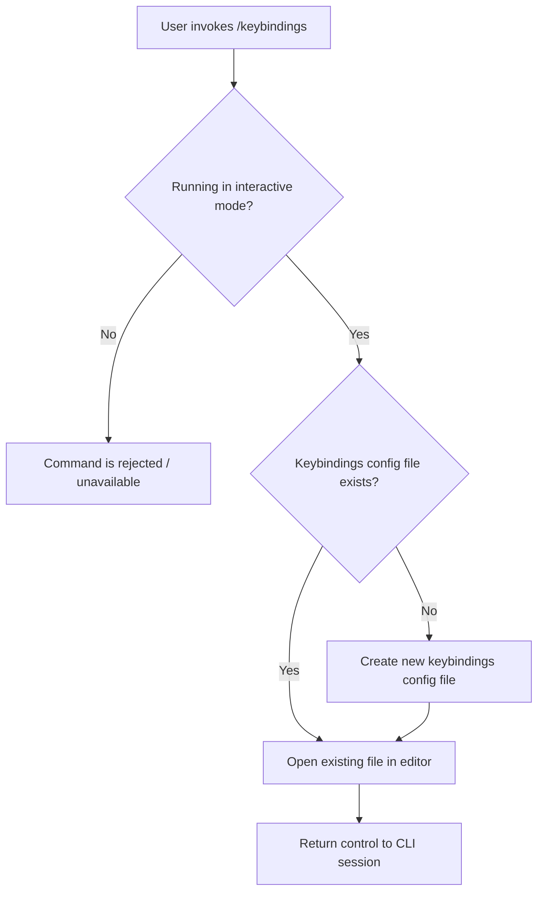

# `/keybindings`

> Analysis basis: CC v2.1.139 bundle.js (AST extraction + Claude interpretation)
> Minimum version: v2.1.139

---

## Overview

The `/keybindings` command opens the user's keybindings configuration file in their default editor, or creates the file if it does not yet exist. It is a local, interactive-only command that provides a direct entry point to customizing keyboard shortcuts for the Claude Code CLI. The command operates on a configuration file stored in the user's environment and produces no output to the chat session itself.

## Registration

| Field | Value |
|---|---|
| type | `local` |
| name | `keybindings` |
| description | `Open or create your keybindings configuration file` |
| supportsNonInteractive | `false` |
| module_id | `Jqq` |

Analysis basis: CC v2.1.139 bundle.js:+10498912

## Input Branching

Because the AST traversal for module `Jqq` resolved no entry-function call edges at depth ≤ 2, the internal branching logic cannot be fully traced from the available data.

<!-- TODO: not found in depth-2 traversal; needs --depth 4 -->

Based on the registration description and the `supportsNonInteractive: false` constraint, the following high-level flow can be stated:



> The Yes/No branching on file existence is inferred from the registration description ("Open **or create**"). Exact branch logic is <!-- TODO: not found in depth-2 traversal; needs --depth 4 -->.

## Behavioral Spec

### Guard: Interactive-Mode Requirement

The `supportsNonInteractive` field is `false`, meaning the command is only available when Claude Code is running in a standard interactive terminal session.

```
function guardInteractiveMode(context):
    if context.isNonInteractive:
        raise CommandUnavailableError("/keybindings requires an interactive session")
    return proceed
```

Analysis basis: CC v2.1.139 bundle.js:+10498912

### Core: Open or Create Keybindings File

The command's declared purpose is to open or create the keybindings configuration file. Based on the registration description, the expected behavior follows this pattern:

```
function openOrCreateKeybindingsFile():
    path = resolveKeybindingsConfigPath()   // platform-specific config directory
    if not fileExists(path):
        createDefaultKeybindingsFile(path)  // write initial/empty configuration
    openInEditor(path)                      // launch $EDITOR or system default
```

> Exact resolution logic for `resolveKeybindingsConfigPath()`, the default file contents written by `createDefaultKeybindingsFile()`, and the editor-launch mechanism are <!-- TODO: not found in depth-2 traversal; needs --depth 4 -->.

Analysis basis: CC v2.1.139 bundle.js:+10498912

## State & Side Effects

| Item | Detail |
|---|---|
| Telemetry | None detected in depth-2 traversal <!-- TODO: not found in depth-2 traversal; needs --depth 4 --> |
| Hook registration | <!-- TODO: not found in depth-2 traversal; needs --depth 4 --> |
| appState changes | <!-- TODO: not found in depth-2 traversal; needs --depth 4 --> |
| File system | Creates the keybindings configuration file if it does not exist (inferred from description) |
| Sound | <!-- TODO: not found in depth-2 traversal; needs --depth 4 --> |
| Non-interactive mode | Command is unavailable (`supportsNonInteractive: false`); Analysis basis: CC v2.1.139 bundle.js:+10498912 |

## Version History

| Version | Change |
|---|---|
| v2.1.139 | Initial analysis |

## Common Mistakes

1. **Running in non-interactive mode**: The command cannot be used in piped or scripted (non-interactive) invocations. Because `supportsNonInteractive` is `false`, attempting to call `/keybindings` from a non-interactive context will result in the command being unavailable or rejected. Analysis basis: CC v2.1.139 bundle.js:+10498912
2. **Expecting chat output**: `/keybindings` is a file-management command; it opens an editor rather than printing configuration content into the chat session. Users expecting the keybindings content to appear inline will not see it there.
3. **Assuming the file always exists**: The command handles the case where the configuration file has not yet been created. Users who have never customized keybindings should not manually pre-create the file; the command will scaffold it.

## Appendix — Identifier Mapping

> For bundle debugging only. Identifiers change across versions.

| Identifier | Role |
|---|---|
| `Jqq` | Module ID for the `/keybindings` command registration (not an obfuscated runtime identifier; no further obfuscated identifiers were resolved at depth ≤ 2) |

> No obfuscated runtime identifiers were returned by the depth-2 AST traversal for this command. Additional identifiers may be present at greater traversal depth. <!-- TODO: not found in depth-2 traversal; needs --depth 4 -->