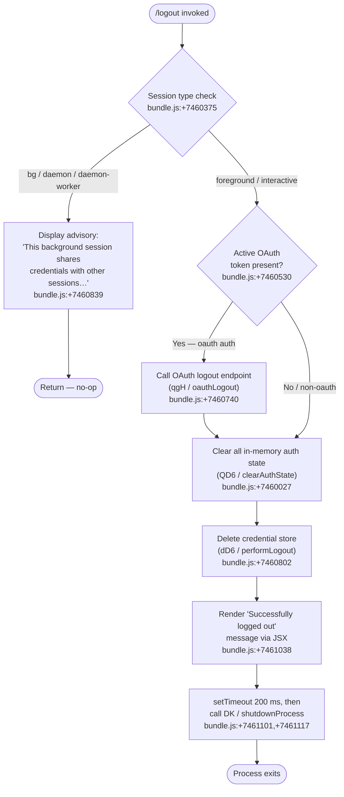

# `/logout`

> Analysis basis: CC v2.1.141 bundle.js (AST extraction + Claude interpretation)
> Minimum version: v2.1.141

---

## Overview

The `/logout` command signs the user out of their Anthropic account by revoking the active OAuth session, clearing all in-memory authentication state, deleting persistent credential storage (keychain entry and/or on-disk token files), and then exiting the CLI process. In background ("bg") or daemon-worker sessions the command is a no-op with an advisory message, since those sessions share credentials with the parent terminal.

---

## Registration

| Field | Value |
|---|---|
| type | `local-jsx` |
| name | `logout` |
| description | Sign out from your Anthropic account |
| loc_byte | `10545343` |
| loc_byte_end | `10545531` |
| loc_line | `6288` |
| module_id | `CE1` |
| load_inline | `true` |
| arbor_handler.name | `Jb4` |
| arbor_handler.fqn | `claude-2.1.141::Jb4` |
| arbor_handler.kind | `AsyncFunction` |
| arbor_handler.resolution_path | `module_id` |
| arbor_handler.n_hits | `0` |

Analysis basis: CC v2.1.141 bundle.js:+10545343

---

## Input Branching

Four distinct execution paths exist, determined by session type and the presence of an active OAuth token.



---

## Behavioral Spec

### 1. Session-type guard

Before any logout action the handler (`Jb4`) queries the process-context helper (`N1` / `getProcessContext`) to determine whether the current session is a background job, daemon, or daemon-worker (literal values `"bg"`, `"daemon"`, `"daemon-worker"`, bundle.js:+2154315–2154339).

If the session is classified as background, a JSX element is rendered with the advisory string whose prefix is `"This background session shares credentials…"` (bundle.js:+7460839). The function returns immediately without touching credentials.

```
async function logoutHandler(context):
    sessionType = getProcessContext()          // N1 → pc
    if sessionType in ["bg", "daemon", "daemon-worker"]:
        renderAdvisoryMessage(BACKGROUND_MSG)
        return                                 // no-op
    performLogout(context)
```

Analysis basis: CC v2.1.141 bundle.js:+7460729, +7460375

---

### 2. OAuth session revocation (`qgH` / `oauthLogout`)

When the session carries an OAuth credential (auth-type literal `"oauth"`, bundle.js:+7460783), the handler calls the OAuth logout helper (`qgH`). Internally this function:

1. Classifies the error category of any HTTP response via the error-classifier (`zE`), which maps HTTP 401/403 to `"auth"`, connection errors to `"network"`, and everything else to `"other"` (bundle.js:+170362–170641).
2. Builds a signed request using the session-identity helper (`$L` / `buildOAuthRequest`), which attaches OTEL attribute fields such as `"user.id"`, `"session.id"`, and `"app.version"` (bundle.js:+4775756–4776196).
3. Emits the revocation request and awaits the response; network failures are tolerated (logout proceeds regardless).

```
async function oauthLogout(authToken):
    try:
        request = buildOAuthRequest(authToken)   // $L
        await sendRevocationRequest(request)
    catch error:
        category = classifyError(error)          // zE
        // swallow — continue logout unconditionally
```

Analysis basis: CC v2.1.141 bundle.js:+7460740, +4778150, +4778167

---

### 3. In-memory auth state clearance (`QD6` / `clearAuthState`)

After (or instead of, for non-OAuth sessions) the network revocation, the handler calls `clearAuthState` (`QD6`), which fans out to several sub-routines:

| Sub-call | Internal ident | Effect |
|---|---|---|
| Clear oauth-state map | `iz6` | Empties the OAuth in-memory store |
| Clear global auth flag | `Gl6` | Resets the global authenticated flag |
| Clear cache map | `El6` → `yY9.clear` | Clears an in-memory credential cache (bundle.js:+2890758) |
| Clear metric attributes | `xMH` | Removes user-specific OTEL attributes |
| Shutdown event emitter | `E0H` | Emits process exit events, clears interval/listener sets, drains error queue (bundle.js:+3121227–3121544) |
| Delete auth config entries | `dY1` → `EZH.unlink` | Removes on-disk auth config file (bundle.js:+6669130) |
| Delete socket/lock files | `V0_` → `w26.unlink` | Removes Unix socket and associated lock file (bundle.js:+9904233) |

```
function clearAuthState():
    clearOAuthStore()            // iz6
    clearGlobalAuthFlag()        // Gl6
    clearCredentialCache()       // El6 → yY9.clear
    clearMetricAttributes()      // xMH
    shutdownEventEmitter()       // E0H
    deleteAuthConfigFile()       // dY1 → EZH.unlink
    deleteSocketFiles()          // V0_ → w26.unlink
```

Analysis basis: CC v2.1.141 bundle.js:+7460587–7460695

---

### 4. Keychain / credential-store deletion (`performLogout` / `dD6`)

The main logout body (`dD6`, the entry invoked by `Jb4` at bundle.js:+7460802) orchestrates credential removal at the storage layer. Key operations reached via the call graph:

1. **Keychain removal** (`FdA` / `deleteKeychainEntry`): derives the keychain service name by hashing the OS username with SHA-256 (`"sha256"`, bundle.js:+2024617) and truncating to 8 hex characters (bundle.js:+2024663). The target account label is `"claude-code-user"` (bundle.js:+2024797). Failure is logged with the message beginning `"Failed to delete keychain entry"` (bundle.js:+2025508).

2. **Config lock acquisition** (`M9_` / `saveConfigWithLock`): uses a file lock with a 60 000 ms timeout (bundle.js:+3141349). If contention is detected the telemetry event `tengu_config_lock_contention` is fired (bundle.js:+3140668). The guard string `"saveConfigWithLock: re-read config is missing auth…"` (bundle.js:+3140995) prevents accidental auth wipe consistent with GitHub issue #3117.

3. **Credential file write-back** (`e6` / `saveGlobalConfig`): after nulling the auth fields, writes the updated config. The analogous guard `"saveGlobalConfig fallback: re-read config is missing auth…"` (bundle.js:+3137877) applies the same #3117 protection.

4. **Secure storage cleanup** (`IeA` / `secureStorageManager`): clears both primary secure-store entries and plaintext fallback files; telemetry events `"secure_storage_credentials_write"`, `"plaintext_fallback_used"`, and `"primary_and_fallback_failed"` (bundle.js:+2182712–2182965) are emitted as appropriate.

5. **Lock-file backup rotation** (`$CH` / `atomicWriteFile`): config updates go through an atomic write (random-bytes temp file, `fchmodSync`, `fsyncSync`, then `renameSync`) with up to 5 backup copies retained in a `"backups"` subdirectory (bundle.js:+3142180, +3141598).

```
async function performLogout():
    keychainKey = deriveKeychainKey(os.userInfo().username)  // FdA → By → KN
    deleteKeychainEntry("claude-code-user", keychainKey)     // FdA
    if deleteFailed:
        log.error("Failed to delete keychain entry")

    withConfigLock(timeout=60000):                           // M9_
        config = readConfig()                                // cMH
        config.auth = null
        saveGlobalConfig(config)                             // e6

    clearSecureStorage()                                     // IeA
    logTelemetry("oauth_logout")                             // bundle.js:+7460530
```

Analysis basis: CC v2.1.141 bundle.js:+7460089–7460153, +7459960

---

### 5. Success rendering and process shutdown

On success, the handler (`Jb4`) creates a JSX element (via `E0_.createElement`, bundle.js:+7461013) displaying the string beginning `"Successfully logged out from your Anthropic account."` (bundle.js:+7461038) with role `"system"` (bundle.js:+7460991).

A `setTimeout` of **200 ms** (bundle.js:+7461101, literal value `200` at bundle.js:+7461133) is scheduled before calling the process shutdown helper (`DK` / `shutdownProcess`). The shutdown sequence (`R9`) performs terminal cleanup (unmounts Ink rendering, writes final output via `nOH.writeSync`), races a 5 000 ms / 3 500 ms deadline (bundle.js:+5133869, +5133876), then calls `process.exit` or `process.kill("SIGKILL")` if the graceful path stalls (bundle.js:+5132629, +5132679).

```
function renderSuccessAndExit():
    renderJSX(<SystemMessage>"Successfully logged out…"</SystemMessage>)
    setTimeout(200, async () => {
        shutdownProcess()    // DK → R9
    })
```

Analysis basis: CC v2.1.141 bundle.js:+7461013–7461133

---

## State & Side Effects

| Item | Detail |
|---|---|
| Telemetry — `tengu_config_lock_contention` | Fired when the config file lock cannot be acquired promptly (bundle.js:+3140668) |
| Telemetry — `tengu_config_stale_write` | Fired when a stale lock/write condition is detected during config save (bundle.js:+3140804) |
| Telemetry — `tengu_config_parse_error` | Fired when the re-read config cannot be parsed (bundle.js:+3143249) |
| Telemetry — `tengu_config_auth_loss_prevented` | Fired when the #3117 guard aborts a write that would wipe auth (bundle.js:+3141147) |
| Telemetry — `tengu_feature_ok` / `tengu_feature_sad` / `tengu_feature_bad` | General feature-result events emitted by the secure-storage layer (bundle.js:+945566, +945699, +945624) |
| Telemetry — `tengu_daemon_config_reload` | Emitted during downstream config propagation to daemon workers (bundle.js:+14478760) |
| Telemetry — `tengu_cache_eviction_hint` | Emitted during session-end cache housekeeping (bundle.js:+5134205) |
| Telemetry — `tengu_scroll_summary` | Emitted by the shutdown scroll-state helper (bundle.js:+5133417) |
| Telemetry — `tengu_startup_perf` | Emitted by the startup profiling path reachable during reinit (bundle.js:+208686) |
| Telemetry — `tengu_pewter_brook` | Emitted by the terminal-mode detection path (bundle.js:+3240787) |
| Auth credential deletion | Keychain entry for `"claude-code-user"` deleted; on-disk `~/.claude.json` auth fields nulled |
| Secure storage | Primary secure store and plaintext fallback both cleared via `IeA` |
| Socket / lock files | Unix socket and lock files removed by `V0_` |
| In-memory caches | `yY9`, `gMH`, `Ii6`, `R76`, `pA_`, `OF` all cleared (bundle.js:+3121496–3121544) |
| Process lifecycle | CLI process exits ~200 ms after success message render |
| Background-session guard | No state changes when session type is `"bg"`, `"daemon"`, or `"daemon-worker"` |
| OAuth literal event | Literal `"oauth_logout"` recorded at bundle.js:+7460530 |
| Subscription-switch guard | Literal `"subscription-switch"` present at bundle.js:+7460375; used to distinguish session context |

---

## Version History

| Version | Change |
|---|---|
| v2.1.141 | Initial analysis |

---

## Common Mistakes

1. **Running `/logout` in a background/daemon terminal** — the command silently does nothing in those contexts. Always run `/logout` from the primary interactive terminal as indicated by the advisory message.
2. **Expecting immediate session termination** — the process waits ~200 ms after rendering the success message before exiting. Automation scripts must account for this delay.
3. **Assuming only the keychain is cleared** — logout also wipes the on-disk `~/.claude.json` auth fields and any plaintext-fallback credential file. All three storage locations are targeted.
4. **Re-running `/logout` without re-authenticating** — after logout the CLI process exits; any subsequent invocation starts from an unauthenticated state and will prompt for login.
5. **Confusing network errors with logout failure** — if the OAuth revocation HTTP call fails (e.g. network unavailable), logout proceeds anyway; credentials are cleared locally regardless of the server response.

---

## Appendix — Identifier Mapping

> For bundle debugging only. Identifiers change across versions.

| Identifier | Role |
|---|---|
| `Jb4` | Main logout handler (AsyncFunction, resolved via module_id `CE1`) |
| `dD6` | Core logout orchestrator — credential deletion and state teardown |
| `QD6` | Auth state clearance — fans out to oauth store, cache, event emitter, file deletions |
| `qgH` | OAuth logout — sends token revocation request to Anthropic endpoint |
| `zE` | HTTP error classifier — maps status codes / error codes to categories |
| `$L` | OAuth request builder — attaches OTEL identity attributes |
| `AgH` | OTEL attribute assembler — builds metric dimension set |
| `N1` | Process-context reader — returns session type (`bg`, `daemon`, etc.) |
| `pc` | Process-context constants / enum |
| `iz6` | OAuth in-memory store clear |
| `Gl6` | Global authenticated-flag reset |
| `El6` | Credential cache clear (targets `yY9`) |
| `xMH` | OTEL metric attribute clear |
| `E0H` | Event-emitter shutdown — clears intervals, listeners, multiple cache maps |
| `YpH` | Listener/interval teardown sub-helper |
| `nA_` | Interval + process-listener removal |
| `dY1` | Auth config file deletion orchestrator |
| `lY1` | Auth config path resolver |
| `fP_` | Config directory helper |
| `SDA` | Storage directory accessor |
| `P96` | Config file path builder |
| `V0_` | Socket / lock-file removal |
| `TR_` | Timeout/lock-file cleanup sub-helper |
| `IR_` | Lock-file path resolver |
| `bY8` | Socket-file path builder |
| `U8H` | Credential storage initialiser |
| `U8_` | Secure-storage manager bootstrap |
| `UY9` | Keychain service-name derivation |
| `FdA` | Keychain entry deletion |
| `By` | OS username + hash helper |
| `KN` | OS user-info reader |
| `cj` | Keychain backend selector |
| `v` | Telemetry / HTTP request sender |
| `J7K` | HTTP client factory |
| `SH` | JSON serialiser utility |
| `t7` | URL path builder |
| `MSH` | Metric event formatter |
| `X7K` | HTTP request executor with retry |
| `TH` | String-coercion utility |
| `e6` | Global config save (saveGlobalConfig) |
| `M9_` | Config save with file lock (saveConfigWithLock) |
| `XeA` | Config object merger |
| `cMH` | Config file reader |
| `F76` | Config field accessor |
| `$9_` | Backup path builder |
| `$CH` | Atomic file write (temp → rename) |
| `f9_` | Config write sub-helper |
| `X` | SDK / MCP connection manager |
| `IeA` | Secure storage manager — primary + fallback clear |
| `_uH` | Secure storage read-and-update helper |
| `CML` | Storage async-context / directory initialiser |
| `hH` | Feature-ok telemetry emitter |
| `D8` | Feature-sad telemetry emitter |
| `xH` | Feature-bad telemetry emitter |
| `aK` | Credential read/write accessor |
| `djH` | Daemon config reload notifier |
| `DK` | Process shutdown coordinator |
| `R9` | Terminal teardown and process exit |
| `mEH` | Ink/terminal unmount helper |
| `Qo6` | Terminal cursor restore helper |
| `ZY_` | Final output writer (prints last line to stdout) |
| `VY_` | Forced exit (process.exit / SIGKILL) |
| `Y` | Supervisor / renderer loop manager |
| `YJH` | Renderer heartbeat writer |
| `iZq` | Column-width formatter |
| `G8K` | Heartbeat pulse helper |
| `h66` | Startup profiling emitter |
| `LN8` | Performance mark collector |
| `d6A` | Profiling report formatter |
| `w_8` | Scroll summary emitter |
| `RA1` | Scroll metrics calculator |
| `lA` | Terminal mode detector (fullscreen / flicker checks) |
| `eeH` | Session-end event emitter |
| `$` | Session finaliser |
| `XTq` | Session-end telemetry builder |
| `O` | Background-session context checker |
| `b8` | Background-session state accessor |
| `a8` | Abort/timeout race helper |
| `kH` | Error logging dispatcher |
| `k_` | Error formatter |
| `Vq` | Essential-traffic queue |
| `GvK` | Error queue shift/push manager |
| `MV8` | OTEL meter initialiser |
| `V6` | OTEL attribute setter |
| `E$_` | OTEL resource builder |
| `q5` | Metric instrument factory |
| `xr9` | Metric dimension resolver |
| `O68` | Identity attribute assembler |
| `GH6` | Event sequence tracker |
| `hu` | Random-bytes session-ID generator |
| `K` | Column-padding formatter |
| `Ah` | Ink render-instance registry |
| `KV` | Terminal column-width reader |
| `oS` | OS/tty capability probe |
| `kO6` | Working-directory stat helper |
| `n$` | Locale / colour-support probe |
| `bA1` | ANSI escape builder |