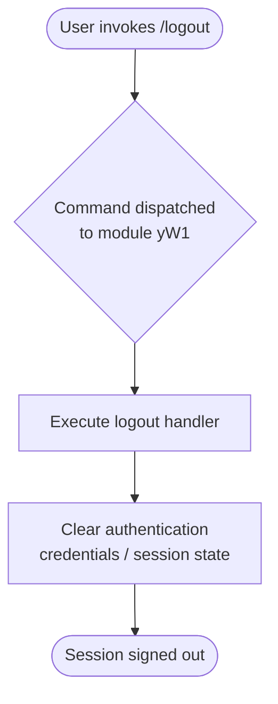

# `/logout`

> Analysis basis: CC v2.1.139 bundle.js (AST extraction + Claude interpretation)
> Minimum version: v2.1.139

---

## Overview

The `/logout` command signs the user out of their Anthropic account from within the Claude Code CLI session. It is registered as a local JSX command in module `yW1` and targets the credential or session state maintained by the running CLI process. Upon execution, the user's authentication state is cleared, requiring re-authentication before account-gated features can be used again.

---

## Registration

| Field | Value |
|---|---|
| type | `local-jsx` |
| name | `logout` |
| description | `Sign out from your Anthropic account` |
| module\_id | `yW1` |
| loc\_line | `6266` |

Analysis basis: CC v2.1.139 bundle.js:+10499424

---

## Input Branching

The AST traversal at depth ≤ 2 produced an empty call graph for module `yW1`. No branching paths, conditionals, or argument-dependent logic were resolved at this traversal depth.

<!-- TODO: not found in depth-2 traversal; needs --depth 4 -->

The following flowchart reflects the minimal confirmed behavior derivable from the registration record alone:



> **Note:** Internal branching logic within the logout handler (e.g., conditional behavior for API-key-only sessions vs. OAuth sessions, error paths, or confirmation prompts) cannot be confirmed from the available depth-2 traversal data. The flowchart above represents only the top-level dispatch path.

---

## Behavioral Spec

### Logout Handler Dispatch

Because no entry functions were resolved during AST traversal of module `yW1`, the implementation body of the logout handler is not available at this analysis depth. The pseudocode below is the minimum behavioral contract that can be inferred from the registration record.

```
function handleLogoutCommand():
    // Registered as local-jsx; renders or executes within the CLI JSX runtime
    clearUserSession()
    // Expected: authentication tokens, cached credentials, or session identifiers
    // associated with the Anthropic account are invalidated or removed.
    // Post-condition: user is no longer authenticated.
    notifyUser("Signed out from your Anthropic account")
```

Analysis basis: CC v2.1.139 bundle.js:+10499424

<!-- TODO: not found in depth-2 traversal; needs --depth 4 -->
Specific sub-steps such as token deletion path, keychain/credential-store interaction, network-side session invalidation, and post-logout UI state transitions are not confirmed by the available data.

---

## State & Side Effects

| Item | Detail |
|---|---|
| Telemetry | <!-- TODO: not found in depth-2 traversal; needs --depth 4 --> No `tengu_*` telemetry events were extracted for this command. |
| Hook registration | <!-- TODO: not found in depth-2 traversal; needs --depth 4 --> Not resolved at depth ≤ 2. |
| appState changes | <!-- TODO: not found in depth-2 traversal; needs --depth 4 --> Expected to clear authentication/session state; specific appState field names not confirmed. |
| Sound | <!-- TODO: not found in depth-2 traversal; needs --depth 4 --> Not resolved at depth ≤ 2. |
| Credential store | <!-- TODO: not found in depth-2 traversal; needs --depth 4 --> Interaction with OS keychain or local credential file not confirmed at this depth. |

---

## Version History

| Version | Change |
|---|---|
| v2.1.139 | Initial analysis. Registration confirmed at bundle.js:+10499424 (line 6266, module `yW1`). Call graph, literals, telemetry, and identifiers not resolved at depth ≤ 2. |

---

## Common Mistakes

1. **Expecting network-side invalidation**: It is not confirmed whether `/logout` makes a network request to invalidate the server-side session or only clears local credentials. Do not assume a remote sign-out occurs without deeper analysis.
2. **Re-using the same session after logout**: After invoking `/logout`, authentication state is expected to be cleared. Attempting to use account-gated commands without re-authenticating will likely result in errors.
3. **Confusing `/logout` with API key removal**: This command targets the Anthropic account session (e.g., OAuth or login-based flow). It may not remove a manually configured `ANTHROPIC_API_KEY` environment variable, which must be managed separately.
4. **Assuming a confirmation prompt**: No confirmation step was confirmed by the available data. The command may execute immediately upon invocation without asking for user confirmation.
5. **Running in non-interactive contexts**: Because the command is registered as `local-jsx`, its render behavior in fully non-interactive or piped CLI contexts is <!-- TODO: not found in depth-2 traversal; needs --depth 4 --> not confirmed.

---

## Appendix — Identifier Mapping

> For bundle debugging only. Identifiers change across versions.

| Identifier | Role |
|---|---|
| *(none)* | No obfuscated identifiers were extracted for module `yW1` at depth ≤ 2. |