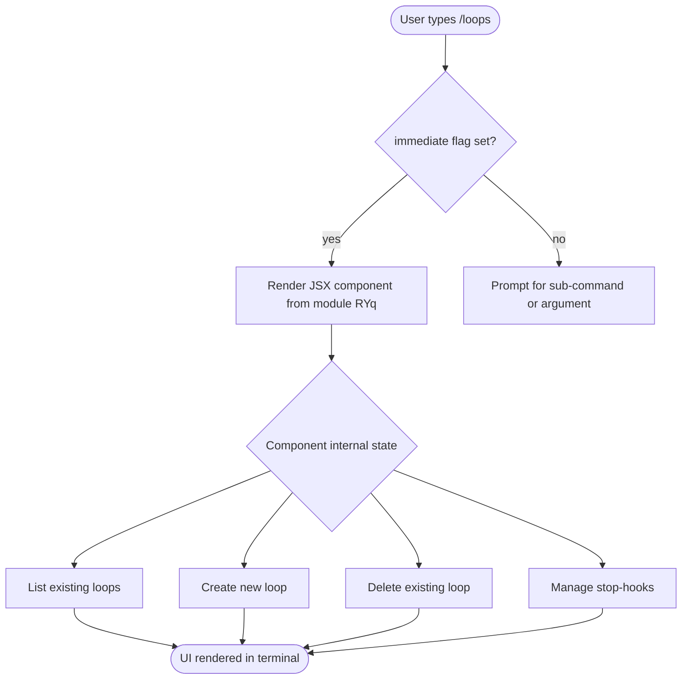

# `/loops`

> Analysis basis: CC v2.1.139 bundle.js (AST extraction + Claude interpretation)
> Minimum version: v2.1.139

---

## Overview

The `/loops` command provides a management interface for recurring loops and stop-hooks within Claude Code. It allows users to list existing loops, create new ones, and delete them, functioning as a lifecycle controller for persistent automation constructs. The command renders via a JSX component and executes immediately upon invocation without requiring additional input parsing.

---

## Registration

| Field | Value |
|---|---|
| type | `local-jsx` |
| name | `loops` |
| description | `List, create, and delete recurring loops and stop-hooks` |
| immediate | `true` |
| module_id | `RYq` |

Analysis basis: CC v2.1.139 bundle.js:+11296436

---

## Input Branching

Because the AST traversal recovered no entry functions for module `RYq`, the internal branching logic of the command implementation cannot be reconstructed from depth-2 call-graph data.

<!-- TODO: not found in depth-2 traversal; needs --depth 4 -->

What can be stated from registration data alone:

- `immediate: true` means the command does **not** prompt for further user input before executing. The JSX component is rendered as soon as the slash command is recognised.
- `type: local-jsx` means the command's output is a React/JSX component rendered inside the CLI's terminal UI layer, rather than plain text streamed to stdout.



> **Note:** Paths E → F/G/H/I are inferred from the registration description field ("List, create, and delete recurring loops and stop-hooks"). Internal routing within the JSX component is <!-- TODO: not found in depth-2 traversal; needs --depth 4 -->.

---

## Behavioral Spec

### Immediate Rendering

Because `immediate` is `true`, the CLI framework skips any interactive argument-collection step and directly mounts the JSX component exported by module `RYq`.

```
function handleLoopsCommand(context):
    // No argument parsing required
    component = loadJSXComponent(moduleId = "RYq")
    mount(component, terminalUILayer, context)
    return RENDERED
```

Analysis basis: CC v2.1.139 bundle.js:+11296436 (registration `immediate: true`, `type: local-jsx`)

### Loop Listing

Based on the description, the component must be capable of enumerating currently registered loops. The precise data source (appState key, filesystem path, or API call) is:

<!-- TODO: not found in depth-2 traversal; needs --depth 4 -->

```
function listLoops(appState):
    loops = appState.getLoops()         // source unconfirmed
    if loops is empty:
        renderEmptyState("No loops configured.")
    else:
        for each loop in loops:
            renderLoopRow(loop.id, loop.description, loop.status)
```

### Loop Creation

```
function createLoop(params):
    validate(params)                    // validation rules unconfirmed
    newLoop = buildLoopDefinition(params)
    persist(newLoop)                    // persistence mechanism unconfirmed
    refreshUI()
```

### Loop Deletion

```
function deleteLoop(loopId):
    confirm = promptUserConfirmation(loopId)   // confirmation step unconfirmed
    if confirm:
        remove(loopId)
        refreshUI()
    else:
        cancel()
```

### Stop-Hook Management

The description explicitly references "stop-hooks" as a managed entity alongside loops. A stop-hook is inferred to be a condition or callback registered to terminate a loop under specified circumstances.

```
function manageStopHook(loopId, hookDefinition):
    loop = getLoopById(loopId)
    if hookDefinition is null:
        renderCurrentStopHook(loop.stopHook)
    else:
        loop.stopHook = hookDefinition
        persist(loop)
        refreshUI()
```

<!-- TODO: stop-hook schema, validation rules, and persistence path not found in depth-2 traversal; needs --depth 4 -->

---

## State & Side Effects

| Item | Detail |
|---|---|
| Telemetry | <!-- TODO: not found in depth-2 traversal; needs --depth 4 --> |
| Hook registration | Stop-hooks are referenced in the registration description; registration mechanism is <!-- TODO: not found in depth-2 traversal; needs --depth 4 --> |
| appState changes | Loop create/delete operations are expected to mutate loop-related appState; exact keys are <!-- TODO: not found in depth-2 traversal; needs --depth 4 --> |
| Sound | <!-- TODO: not found in depth-2 traversal; needs --depth 4 --> |
| Rendering | JSX component mounted in terminal UI layer via `local-jsx` type; renders immediately on invocation |

---

## Version History

| Version | Change |
|---|---|
| v2.1.139 | Initial analysis. Command registered at bundle.js:+11296436 (line 6999). Module `RYq`. Entry functions not recovered at depth-2 traversal. |

---

## Common Mistakes

1. **Expecting a text prompt after `/loops`** — Because `immediate: true`, the command renders its JSX interface instantly. There is no secondary prompt waiting for a sub-command like `create` or `delete` to be typed separately; all interaction happens inside the rendered component.
2. **Confusing loops with stop-hooks** — Loops and stop-hooks are distinct managed entities. A stop-hook is attached to a loop to control termination; deleting a loop may or may not automatically remove its associated stop-hooks (behaviour is <!-- TODO: not found in depth-2 traversal; needs --depth 4 -->).
3. **Assuming plain-text output** — The `local-jsx` type means output is a React component rendered in the terminal UI layer, not streamed text. Tooling that scrapes stdout may not capture the rendered state correctly.
4. **Running against versions earlier than v2.1.139** — This command's registration was confirmed only at v2.1.139. Availability in earlier versions is unverified.

---

## Appendix — Identifier Mapping

> For bundle debugging only. Identifiers change across versions.

| Identifier | Role |
|---|---|
| `RYq` | Module identifier for the `/loops` JSX command implementation |

> No obfuscated function or variable identifiers were recovered in the depth-2 AST traversal for this command. A deeper traversal (`--depth 4` or greater) is required to populate this table fully.