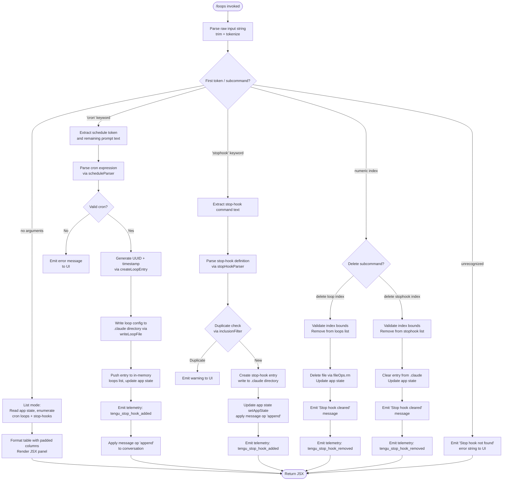

# `/loops`

> Analysis basis: CC v2.1.141 bundle.js (AST extraction + Claude interpretation)
> Minimum version: v2.1.141

---

## Overview

The `/loops` command provides a management interface for recurring loops (cron-scheduled tasks) and stop-hooks (commands that run when a session ends). It allows users to list existing loops and stop-hooks, create new ones with schedule and prompt specifications, and delete them by index. The command renders an interactive JSX panel and delegates to an async handler (`SV7`) that reads application state, parses cron expressions, validates arguments, and persists configuration changes to the `.claude` directory.

---

## Registration

| Field | Value |
|---|---|
| type | `local-jsx` |
| name | `loops` |
| description | `List, create, and delete recurring loops and stop-hooks` |
| immediate | `true` |
| module_id | `WXq` |
| load_inline | `true` |
| loc_byte | `11356723` |
| loc_byte_end | `11356905` |
| loc_line | `7041` |
| arbor_handler.name | `SV7` |
| arbor_handler.fqn | `claude-2.1.141::SV7` |
| arbor_handler.kind | `AsyncFunction` |
| arbor_handler.resolution_path | `module_id` |
| arbor_handler.n_hits | `0` |

Analysis basis: CC v2.1.141 bundle.js:+11356723

---

## Input Branching

The command parses user-supplied arguments and branches across five or more distinct execution paths (list, create-loop, create-stophook, delete-loop, delete-stophook), requiring a flowchart.



Analysis basis: CC v2.1.141 bundle.js:+11355680 (handler entry), +11355863 (stophook branch), +11355777 (cron branch), +11356122 (not-found literal), +11356144 (cleared literal)

---

## Behavioral Spec

### Handler Entry — `loopsCommandHandler` (SV7)

```
async function loopsCommandHandler(context):
    emit telemetry("tengu_loops_command")        // +11355682
    rawInput = context.inputText
    appState = context.getAppState()

    loopsList   = buildLoopsList(appState)       // Zj8 -> tYH
    stophookMap = appState.stophooks ?? {}

    parsedArgs  = parseScheduleArguments(rawInput)  // tE

    if parsedArgs.subcommand == "cron":
        return handleCreateLoop(parsedArgs, appState, context)
    elif parsedArgs.subcommand == "stophook":
        return handleCreateStophook(parsedArgs, appState, context)
    elif parsedArgs.subcommand is numeric index:
        return handleDeleteEntry(parsedArgs, appState, context)
    elif rawInput is empty:
        return renderListPanel(loopsList, stophookMap)
    else:
        return renderErrorMessage("Stop hook not found")   // +11356122
```

Analysis basis: CC v2.1.141 bundle.js:+11355680

---

### Schedule Argument Parser — `parseScheduleArguments` (tE)

```
function parseScheduleArguments(rawInput):
    trimmed = rawInput.trim()                 // +4605919
    if trimmed matches cron pattern:          // K.match +4606060
        parts = extractCronParts(trimmed)
        minute  = parseInt(parts.minute)      // +4606095
        hour    = parseInt(parts.hour)
        // Validate ranges: minutes 0-59 (+11355447),
        //                  hours   0-23 (+11355518),
        //                  dom     1-31 (+11355571)
        humanLabel = buildHumanLabel(minute, hour)
        // "Every minute" (+4606039), "Every hour" (+4606256)
        return { subcommand: "cron", schedule: parts, label: humanLabel }
    elif trimmed matches stophook pattern:
        return { subcommand: "stophook", body: trimmed }
    elif trimmed matches numeric index "1-5" pattern:   // +4606963
        return { subcommand: "delete", index: parseInt(trimmed) }
    else:
        return { subcommand: "unknown" }
```

Analysis basis: CC v2.1.141 bundle.js:+4605919, +4606060, +4606095, +4606963

---

### Next-Fire Time Calculator — `computeNextFireTime` (hV7)

```
function computeNextFireTime(cronSpec):
    // Parses schedule expression
    match = cronSpec.match(cronRegex)          // H.match +11355268
    minute = parseInt(match.minute)            // parseInt +11355305
    // Clamp to valid range using Math.max     // +11355390
    // Ceiling arithmetic via Math.ceil        // +11355401
    // Round result via Math.round             // +11355474
    // Constraints: max 60 min (+11355413), max 59 sec (+11355447)
    //              max 23 hrs (+11355518),  max 31 days (+11355571)
    nextTime = resolveWeekdayOffset(cronSpec)  // zI +11355638
    return nextTime
```

Analysis basis: CC v2.1.141 bundle.js:+11355268, +11355390, +11355413, +11355447, +11355518, +11355571

---

### Cron Expression Tokenizer — `cronExpressionTokenizer` (zI / I64)

```
function cronExpressionTokenizer(expr):
    trimmed = expr.trim()                      // H.trim +4604748
    tokens  = tokenizeCronFields(trimmed)      // I64 +4604834

function tokenizeCronFields(field):
    parts = field.split(delimiter)             // H.split +4604168
    match = parts.match(fieldPattern)          // L.match +4604188
    value = parseInt(match, 10)                // parseInt +4604233
    // Max field width: 10 characters          // +4604247
    rangeSet = new Set()
    rangeSet.add(value)                        // K.add +4604294
    // Step limit: 3 (+4604409), 6 (+4604445), 7 (+4604451)
    //             subdivisions per field
    result = Array.from(rangeSet)              // Array.from +4604696
    // Max items per range: 5                  // +4604784
    // Max ranges per field: 4                 // +4604947
    return result
```

Analysis basis: CC v2.1.141 bundle.js:+4604748, +4604168, +4604247, +4604784, +4604947

---

### Loop File Writer — `writeLoopFile` (uFH)

```
async function writeLoopFile(loopEntry, existingLoops):
    claudeDir = path.join(workingDir, ".claude")   // IH8.join +4609305, literal ".claude" +4609316
    await fs.mkdir(claudeDir, { recursive: true }) // VH8.mkdir +4609295
    serialized = loopEntry.toEntries().map(encode) // H.map +4609356
    await fs.writeFile(targetPath, serialized)     // VH8.writeFile +4609392
    configPath = buildConfigPath(claudeDir)        // I1H +4609406
    payload    = serialize(configPath)             // SH +4609413
    return payload
```

Analysis basis: CC v2.1.141 bundle.js:+4609284, +4609295, +4609305, +4609316, +4609406

---

### Create Loop Entry — `createLoopEntry` (mFH)

```
async function createLoopEntry(parsedArgs, appState, context):
    id        = crypto.randomUUID()            // Sl9.randomUUID +4609475
    // UUID entropy: 8 bytes                   // +4609500
    createdAt = Date.now()                     // +4609537
    goalText  = buildGoalAttachment(parsedArgs)// cjH +4609583
    loopDef   = readAndValidateLoopDef(parsedArgs) // vTH +4609627
    loopsList.push(newEntry)                   // M.push +4609640
    v6Result  = resolveVersion(appState)       // V6 +4609672
    rendered  = renderAttachment(goalText)     // Ia +4609721
    await writeLoopFile(loopDef, loopsList)    // uFH +4609734
    return rendered
```

Analysis basis: CC v2.1.141 bundle.js:+4609475, +4609537, +4609583, +4609627, +4609640

---

### Create Stophook — `handleCreateStophook` (iaH)

```
async function handleCreateStophook(parsedArgs, appState, context):
    v6      = resolveVersion(appState)         // V6 +11353901
    loops   = buildLoopsList(appState)         // Zj8 +11353908
    current = context.getAppState()            // H.getAppState +11353912
    // Validate: check trust_gate             // literal +11353363
    //           check hooks_gate             // literal +11353309
    newState = { ...current, stophooks: updatedMap }
    context.setAppState(newState)              // H.setAppState +11354041
    context.applyMessageOp({                   // H.applyMessageOp +11354110
        op:      "append",                     // literal "append" +11354133
        type:    "attachment",                 // literal +11354239
        goal:    parsedArgs.body,              // literal "goal" +11354198
        goal_status: "active"                  // literal +11354326 (via goal_status)
    })
    msgId   = generateUUID()                   // XXq -> JXq.randomUUID +11354257
    emit telemetry("tengu_stop_hook_added")    // +11353799
    return renderConfirmation("Stop hook set") // literal +11356440
```

Analysis basis: CC v2.1.141 bundle.js:+11353901, +11354041, +11354110, +11353799, +11356440

---

### Delete Entry — `handleDeleteEntry` (naH)

```
async function handleDeleteEntry(parsedArgs, appState, context):
    gate = checkPolicyGate(appState)           // AU_ -> Rm -> I8 +11353413
    // trust_gate check                        // +11353363
    // goal_set gate                           // literal +11353441
    loopRecord = buildLoopsList(appState)      // Zj8 +11353494
    current    = context.getAppState()         // _.getAppState +11353498
    timestamp  = Date.now()                    // +11353662
    // Compute affected sessions               // Uj +11353687
    context.setAppState(updatedState)          // _.setAppState +11353700
    context.applyMessageOp({                   // _.applyMessageOp +11353742
        op: "append"
    })
    msgId = generateUUID()                     // XXq +11353784
    emit("tengu_stop_hook_removed")            // +11354167 (via Q +11353797)
    wait(shortDelay)                           // hH +11353859
    return "Stop hook cleared"                 // literal +11356144
```

Analysis basis: CC v2.1.141 bundle.js:+11353413, +11353498, +11353700, +11354167, +11356144

---

### Loop Definition Reader — `readLoopDefinition` (vTH)

```
async function readLoopDefinition(loopId):
    configPath = buildConfigPath()             // x6 +4608128
    raw        = await fs.readFile(configPath, "utf-8")  // _.readFile +4608147, literal +4608175
    configObj  = parseConfigPath(configPath)   // I1H +4608158
    tokenized  = tokenizeLoopSpec(raw)         // x9 -> M8 +4608197
    validated  = validateLoopFields(tokenized) // kH +4608219
    // Error codes handled: ENOENT, EACCES, EPERM, ENOTDIR, ELOOP
    //                      (+170010–170066)
    nextFire   = computeSchedule(validated)    // Y1 +4608234
    if Array.isArray(nextFire):                // +4608291
        entries = processEntries(nextFire)     // v +4608470
    serialized = serialize(entries)            // SH +4608517
    normalized = normalizeOutput(serialized)   // zI +4608539
    resultList.push(normalized)                // L.push +4608634
    return resultList
```

Analysis basis: CC v2.1.141 bundle.js:+4608128, +4608147, +4608175, +4608219, +4608291

---

### List Builder — `buildLoopsList` (Zj8 / tYH)

```
function buildLoopsList(appState):
    columnMap = new Map()
    columnMap.set(key, value)                  // K.set +8302095
    // Format rows with padEnd for alignment   // f.padEnd +14487611
    // Separator: "  " (two spaces)            // literal +14487632
    rows = header.map(formatRow)               // Hm1 -> H.map +8301864
    resultList.push(rows)                      // A.push +11353237
    return resultList
```

Analysis basis: CC v2.1.141 bundle.js:+11353113, +8302095, +14487611, +14487632, +8301864

---

### Stop-Hook Type Labels

The literal `"Stop"` (bundle.js:+11353121) and `"prompt"` (+11353228) are used as type discriminators when displaying list entries. Loop entries carry a `"cron"` label (+11355777) and stop-hooks carry a `"stophook"` label (+11355863).

---

## State & Side Effects

| Item | Detail |
|---|---|
| Telemetry — primary | `tengu_loops_command` (emitted on every invocation, +11355682) |
| Telemetry — hook added | `tengu_stop_hook_added` (+11353799) |
| Telemetry — hook removed | `tengu_stop_hook_removed` (+11354167) |
| Telemetry — bg (indirect) | `tengu_bg_dispatch_sigkill_escalate`, `tengu_bg_low_mem_mb`, `tengu_bg_dispatch_low_mem`, `tengu_bg_spare_enable`, `tengu_bg_sendclaim_failed`, `tengu_bg_spare_claim`, `tengu_bg_spare_spawn`, `tengu_bg_spare_claim_fail`, `tengu_daemon_yield` (reachable via background-session machinery in deep call graph) |
| Telemetry — feature flags | `tengu_feature_ok`, `tengu_feature_bad`, `tengu_feature_sad` (via gate checks) |
| appState changes | `setAppState` called on create and delete paths; stophooks map and loops list are updated (+11353700, +11354041) |
| File I/O — write | New loop/stophook configs written to `.claude/` directory via `VH8.writeFile` (+4609392) |
| File I/O — read | Existing loop definitions read from `.claude/` via `_.readFile` with encoding `"utf-8"` (+4608147) |
| File I/O — delete | Stale entries removed via `TD.rm` / `TD.unlink` (+14469599, +14470567) |
| Message ops | `applyMessageOp` with `op: "append"`, `type: "attachment"`, `goal_status` field (+11354110, +11353742) |
| Hook registration | Stop-hooks registered under `"stophook"` key; trust_gate and hooks_gate policy checks enforced before write (+11353309, +11353363) |
| UUID generation | `crypto.randomUUID()` used for loop IDs (Sl9.randomUUID +4609475) and message IDs (JXq.randomUUID +11354257) |
| Rendering | JSX element constructed via `qU_.createElement` (+11356483); rendered as `local-jsx` type with `immediate: true` |
| Sound | <!-- TODO: not found in depth-2 traversal; needs --depth 4 --> |

---

## Version History

| Version | Change |
|---|---|
| v2.1.141 | Initial analysis |

---

## Common Mistakes

1. **Omitting the schedule expression for `/loops cron`**: The cron subcommand requires a valid schedule string followed by the prompt body. Providing only the keyword produces a parse failure (falls into the `unknown` branch and emits "Stop hook not found").
2. **Using an out-of-range index for deletion**: Indices must be within the range of existing entries (see `"1-5"` pattern literal at bundle.js:+4606963). An index outside this range will fail validation silently or emit an error string.
3. **Attempting to create a duplicate stop-hook**: The inclusion filter (`Do` / `_.has`) deduplicates stophooks before writing. Submitting an identical hook body a second time is a no-op and may emit a warning.
4. **Expecting synchronous availability after creation**: `createLoopEntry` is async and writes to disk; the loop does not become active until the write and app-state update have both completed.
5. **Running without sufficient permissions on `.claude/`**: File errors `ENOENT`, `EACCES`, `EPERM`, `ENOTDIR`, and `ELOOP` are all handled but will prevent persistence of new entries (bundle.js:+170010–+170066).

---

## Appendix — Identifier Mapping

> For bundle debugging only. Identifiers change across versions.

| Identifier | Role |
|---|---|
| `SV7` | Main async handler for `/loops` command (`loopsCommandHandler`) |
| `Q` | Shared utility — queue/signal primitive |
| `xt` | Intermediate dispatch helper called by handler |
| `vTH` | Loop definition file reader (`readLoopDefinition`) |
| `x6` | Config path builder |
| `I1H` | Config path parser / resolver |
| `QK` | Config key lookup utility |
| `x9` | Loop spec tokenizer dispatcher |
| `M8` | Token normalization helper |
| `kH` | Loop field validator |
| `k_` | Error constructor wrapper |
| `RH` | String coercion helper |
| `Vq` | Traffic-classification helper (`"essential-traffic"`) |
| `GvK` | Queue shift/push manager |
| `v` | Entry processor / value extractor |
| `J7K` | Sub-entry resolver |
| `H` | Misc utility (random, setTimeout, string ops) |
| `SH` | JSON serializer (`JSON.stringify` wrapper) |
| `t7` | Text transformer / path slicer |
| `MSH` | Message struct helper |
| `X7K` | File byte-length / write pipeline |
| `zI` | Output normalizer / weekday resolver |
| `I64` | Cron field tokenizer (`cronExpressionTokenizer`) |
| `A` | Generic array/collection accumulator |
| `L` | Lifecycle manager (add/delete/finally) |
| `q` | Cleanup set (unlinkSync on dispose) |
| `f` | Stream/process handle |
| `fV` | Fallback value helper |
| `Zj8` | Loops list builder (top level) |
| `tYH` | Column map formatter |
| `K` | Column key-value map |
| `Hm1` | Row header mapper |
| `V6` | Version resolver |
| `tE` | Schedule argument parser (`parseScheduleArguments`) |
| `w` | Background worker / session manager |
| `S` | Session kill/restart controller |
| `XF` | Session state flag reader |
| `N` | Away-summary generator |
| `Z` | State machine transition helper |
| `Icq` | Rate-limit checker |
| `xH` | Feature-ok telemetry emitter |
| `hH` | Feature-sad / delay helper |
| `YG6` | Memory-check dispatcher |
| `j6` | macOS-specific spawn helper |
| `u` | Timeout-clear / stream writer |
| `$` | Stream write handle |
| `Ao_` | Claim sender / IPC connector |
| `X15` | Claim timeout handler |
| `P15` | Claim frame builder |
| `TH` | String coercion (type-safe) |
| `up` | Binary frame encoder (Buffer operations) |
| `Mo_` | Loop execution manager (run/retire lifecycle) |
| `NK` | Path join + normalizer |
| `r1` | Filesystem stat + read cache |
| `cw` | Active-state checker |
| `df` | Config serializer (SH + path.join) |
| `CoH` | Deferred promise runner |
| `jLH` | Path join + DNS helper |
| `hk` | Config split/join helper |
| `Fp` | OAuth/auth path helper |
| `D` | Daemon lifecycle / spare-spawn controller |
| `_o_` | Spare background process spawner |
| `p` | Disposable process reference |
| `J` | Running-process kill iterator |
| `j` | Date wrapper for UTC schedule math |
| `bt` | Stop-hook read + filter pipeline |
| `Do` | Inclusion/duplication checker |
| `uFH` | Loop file writer (`writeLoopFile`) |
| `iaH` | Create-stophook handler (`handleCreateStophook`) |
| `XXq` | UUID generator (crypto.randomUUID wrapper) |
| `hV7` | Next-fire-time calculator (`computeNextFireTime`) |
| `mFH` | Create-loop entry builder (`createLoopEntry`) |
| `cjH` | Goal attachment builder |
| `M` | MCP server manager |
| `SvH` | MCP server connection handler |
| `$HH` | MCP config entry builder |
| `hI` | MCP client initializer |
| `__` | Internal utility wrapper |
| `rX6` | MCP filter helper |
| `xL7` | MCP timestamp tracker |
| `$78` | MCP key enumerator |
| `M78` | MCP auth-key resolver |
| `_8` | MCP debug log emitter |
| `Nh_` | MCP OAuth flow handler |
| `kh_` | MCP callback URL handler |
| `sHq` | MCP reconnect scheduler |
| `Ih_` | MCP tool list fetcher |
| `fG_` | MCP include-filter checker |
| `y` | Supervisor write handle |
| `_7` | MCP error log emitter |
| `iHq` | MCP client state reader |
| `oX6` | MCP integer parser (tool index) |
| `oh_` | MCP integer parser (server index) |
| `Eeq` | MCP update applicator |
| `fY8` | MCP state serializer |
| `sI` | MCP cleanup sequencer |
| `XA5` | MCP server reconciler |
| `z78` | MCP capability filter |
| `a8` | Timeout-with-abort helper |
| `irH` | MCP state serializer (inner) |
| `Ia` | Attachment renderer |
| `mfH` | Attachment inner renderer |
| `R_H` | Content slicer / pipe builder |
| `naH` | Delete-entry handler (`handleDeleteEntry`) |
| `AU_` | Policy gate resolver |
| `Rm` | Policy settings reader |
| `I8` | Policy settings accessor |
| `tY` | Policy tag resolver |
| `Z_` | Gate flag extractor |
| `L7` | Path resolver for policy |
| `XhL` | Cross-platform path resolver |
| `D8` | Feature-sad emitter (delete path) |
| `Uj` | Session enumerator (Object.values wrapper) |

---

Note: index built via Arbor fallback; some signals (telemetry, literals) may be missing — see arbor-fallback.js.