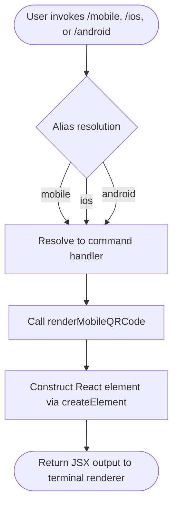

# `/mobile`

> Analysis basis: CC v2.1.133 bundle.js (AST extraction + Claude interpretation)
> Minimum version: v2.1.133

---

## Overview

The `/mobile` command renders a QR code directly in the Claude Code CLI terminal output, allowing users to quickly scan and navigate to the Claude mobile app download page. It is a purely presentational, read-only command that produces JSX output via a React element and has no side effects on session state. It is also reachable via the aliases `/ios` and `/android`.

---

## Registration

| Field | Value |
|---|---|
| type | `local-jsx` |
| name | `mobile` |
| description | Show QR code to download the Claude mobile app |
| aliases | `ios`, `android` |
| module_id | `G9q` |

Analysis basis: CC v2.1.133 bundle.js:+10746903

---

## Input Branching

Because the `literals` array is empty and the call graph contains a single edge leading directly to a JSX element constructor, the command accepts no structured arguments and follows a single unconditional execution path.



Analysis basis: CC v2.1.133 bundle.js:+10746547

---

## Behavioral Spec

### QR Code Rendering

The entire implementation consists of a single React functional component that unconditionally returns a JSX tree. There is no argument parsing, no conditional branching on user input, and no asynchronous work.

```
function renderMobileQRCode():
    element = createElement(
        QRCodeDisplayComponent,
        props derived from static configuration
    )
    return element
```

Because no `literals` were extracted, the exact URL encoded in the QR code and the precise visual dimensions of the rendered element are not determinable from the depth-2 traversal.

<!-- TODO: not found in depth-2 traversal; needs --depth 4 -->

Analysis basis: CC v2.1.133 bundle.js:+10746547

### Alias Handling

The command registration declares two aliases, `ios` and `android`, both of which resolve to the identical handler. No alias-specific logic is present in the call graph; all three invocation forms produce the same output.

```
function resolveAlias(invokedName):
    if invokedName in ["mobile", "ios", "android"]:
        return renderMobileQRCode()
```

Analysis basis: CC v2.1.133 bundle.js:+10746903

---

## State & Side Effects

| Item | Detail |
|---|---|
| Telemetry | None — no `tengu_*` events found in the implementation |
| Hook registration | None detected in depth-2 traversal |
| appState changes | None — command is purely presentational |
| Sound | None detected |
| Network I/O | None — QR code content is statically embedded |
| File I/O | None |

---

## Version History

| Version | Change |
|---|---|
| v2.1.133 | Initial analysis |

---

## Common Mistakes

1. **Expecting argument support** — `/mobile` accepts no arguments. Passing any text after the command name has no defined effect; the QR code is rendered unconditionally regardless of trailing input.
2. **Assuming alias-specific output** — `/ios` and `/android` are pure aliases; they do not filter or customize the QR code output for a specific platform. Both display the same element as `/mobile`.
3. **Assuming telemetry is emitted** — Unlike many other slash commands, `/mobile` fires no telemetry events. Absence of a telemetry event upon invocation is expected behavior, not a bug.
4. **Expecting interactive or animated output** — The command type is `local-jsx`, meaning output is rendered once as a static JSX tree. There is no polling, refresh, or interactive element.

---

## Appendix — Identifier Mapping

> For bundle debugging only. Identifiers change across versions.

| Identifier | Role |
|---|---|
| `D57` | Top-level render function / React functional component for the `/mobile` command |