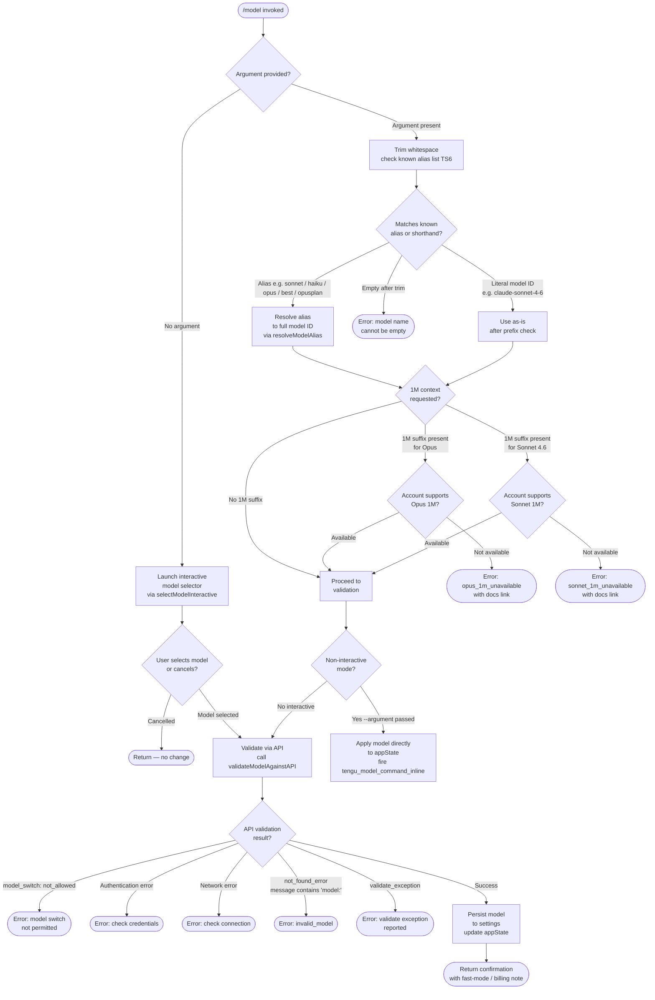

# `/model`

> Analysis basis: CC v2.1.141 bundle.js (AST extraction + Claude interpretation)
> Minimum version: v2.1.141

---

## Overview

The `/model` command allows users to set or switch the AI model used by Claude Code during an active session. It accepts an optional model identifier string as its argument, validates it against a known list of supported model aliases and full model names, and then either applies the change immediately (non-interactive inline path) or launches an interactive selection flow with live validation against the API.

---

## Registration

| Field | Value |
|---|---|
| type | `local` |
| name | `model` |
| description | Set the AI model for Claude Code |
| argumentHint | `<model>` |
| supportsNonInteractive | `true` |
| module_id | `KGq` |
| load_inline | `true` |
| loc_byte | `11541312` |
| loc_byte_end | `11541486` |
| loc_line | `7194` |
| arbor_handler.name | `bN7` |
| arbor_handler.fqn | `claude-2.1.141::bN7` |
| arbor_handler.kind | `AsyncFunction` |
| arbor_handler.resolution_path | `module_id` |
| arbor_handler.n_hits | `0` |

Analysis basis: CC v2.1.141 bundle.js:+11541312

---

## Input Branching

Four distinct top-level branches exist depending on whether an argument is provided and what the argument resolves to, making a Mermaid flowchart the appropriate representation.



---

## Behavioral Spec

### Main Handler — `modelCommandHandler` (`bN7`)

Analysis basis: CC v2.1.141 bundle.js:+11534031

```
async function modelCommandHandler(argument, context):
    trimmedArg = argument.trim()                          // +11534031

    if trimmedArg is in knownModelList(TS6):              // +11534047
        appState = context.getAppState()                  // +11534070
        applyModelToState(appState, trimmedArg)           // +11534114
        emitTelemetry("tengu_model_command_inline")       // +11534189
        return textResult("text")                         // +11534098

    if trimmedArg is in disallowedModels(o7H):            // +11534134
        // model explicitly blocked for this context
        return errorResult(...)

    result = await runInteractiveModelSelection(          // +11534254
                argument, context)
    return result
```

### Argument Validation and Alias Resolution — `validateAndResolveModel` (`Qj8`)

Analysis basis: CC v2.1.141 bundle.js:+11496971

```
function validateAndResolveModel(rawInput, availableModels, appState):
    input = rawInput.trim()                               // +11496971

    if input is empty:
        raise Error("Model name cannot be empty")         // +11497008

    models = buildAvailableModelList(availableModels)     // +11497042
    lowerInput = input.toLowerCase()                      // +11497131

    if lowerInput is in gatekeeperList(GAH):              // +11497150
        // server-side restrictions apply
        ...

    if modelCache(j0q).has(lowerInput):                   // +11497252
        // return cached validation result

    apiResult = callModelValidationAPI(                   // +11497297
                    input, appState)                      // event "model_validation" +11497347
    // Sends minimal probe message "Hi" +11497416
    // with cache_control "ephemeral" +11497441

    modelCache.set(lowerInput, apiResult)                 // +11497460

    return interpretValidationResult(apiResult)
```

### API Validation Error Interpretation — `interpretValidationResult` (sub-path in `Qj8`)

Analysis basis: CC v2.1.141 bundle.js:+11497707

```
function interpretValidationResult(apiResult):
    if apiResult is AuthError:
        return "Authentication failed. Please check your API credentials."
                                                          // +11497707
    if apiResult is NetworkError:
        return "Network error. Please check your internet connection."
                                                          // +11497809

    if apiResult.type == "not_found_error"                // +11497928
       and apiResult.message contains "model:":           // +11498010
        return errorCode("invalid_model")                 // +11499446

    if apiResult indicates validate_exception:
        return errorCode("validate_exception")            // +11499554

    return success
```

### Model Alias Resolution — `resolveModelAlias` (`zq`)

Analysis basis: CC v2.1.141 bundle.js:+2147275

```
function resolveModelAlias(alias):
    normalized = alias.trim().toLowerCase()               // +2147275, +2147286

    switch normalized:
        case "sonnet":  return currentSonnetModel         // +2147412
        case "haiku":   return currentHaikuModel          // +2147451
        case "opus":    return currentOpusModel           // +2147490
        case "best":    return bestAvailableModel         // +2147527
        case "opusplan":
            return "Opus Plan" (opus in plan mode,        // +2145929
                                else Sonnet)              // +2145946
        case matches "[1m]" suffix pattern:               // +2147397
            return extendedContextVariant

    // Apply string replacements / normalizations
    result = alias.replace(pattern, ...)                  // +2147314
    result = applyProviderPrefixNormalization(result)

    return result
```

### 1M Context Availability Checks

Analysis basis: CC v2.1.141 bundle.js:+11498935, +11499152

```
function checkOpus1MAvailability(accountFeatures):
    if "opus[1m]" requested and account lacks entitlement:
        return ErrorResult(
            code    = "opus_1m_unavailable",              // +11498935
            message = "Opus with 1M context is not available for your account. Learn more: https://code.claude.com/docs/en/model-config#extended-context-with-1m"
                                                          // +11498973
        )

function checkSonnet1MAvailability(accountFeatures):
    variant = "sonnet[1m]" or "sonnet-4-6[1m]"          // +11500755, +11500781
    if requested and account lacks entitlement:
        return ErrorResult(
            code    = "sonnet_1m_unavailable",            // +11499152
            message = "Sonnet 4.6 with 1M context is not available for your account. Learn more: https://code.claude.com/docs/en/model-config#extended-context-with-1m"
                                                          // +11499192
        )
```

### Interactive Selection Display — `buildInteractiveModelUI` (`P0q`)

Analysis basis: CC v2.1.141 bundle.js:+11499374

```
function buildInteractiveModelUI(availableModels, appState):
    modelList = renderAvailableModels(availableModels)    // +11499656
    currentModel = appState.getModel()

    for each model in modelList:
        label = model.name.bold()                         // +11499811
        if hasFastMode(model):
            label += " · Fast mode ON"                    // +11499919
        elif billedAsExtra(model):
            label += " · Billed as extra usage"           // +11499970
        else:
            label += " · Fast mode OFF"                   // +11500013

    settingsPath = [".claude", "settings.json"]           // +1182881, +1182891
                   or [".claude", "settings.local.json"]  // +1182953

    return renderSelectionWidget(modelList, settingsPath)
```

### Subscription-Tier Model Gating — `resolveAvailableModels` (`DX` / `qP`)

Analysis basis: CC v2.1.141 bundle.js:+2144218

```
function resolveAvailableModels(accountInfo):
    tier = accountInfo.plan                               // "max" +2912254,
                                                         // "team" +2912325,
                                                         // "default_claude_max_5x" +2912340,
                                                         // "enterprise" +2912435,
                                                         // "enterprise_usage_based" +2912457

    provider = accountInfo.provider                      // "firstParty" +2146137,
                                                         // "anthropicAws" +2007170,
                                                         // "gateway" +2007190,
                                                         // "bedrock" +2006501,
                                                         // "foundry" +2006551,
                                                         // "mantle" +2006661,
                                                         // "vertex" +2006709

    models = baseModelSet()
    if tier == "max" or tier == "enterprise":
        models += extendedModels()

    // Compute per-model availability flags
    for each model in models:
        model.available = checkAccountEntitlement(
                              model, tier, provider)

    return models
```

### Model Switch Rate-Limit / Disable Reason Codes

Analysis basis: CC v2.1.141 bundle.js:+8083349

The following reason codes may be returned when a model switch is blocked:

| Reason Code | Meaning |
|---|---|
| `out_of_credits` | Account has no credits remaining |
| `overage_not_provisioned` | Overage not enabled for plan |
| `org_level_disabled` | Organisation admin disabled usage |
| `org_level_disabled_until` | Temporarily disabled at org level |
| `seat_tier_level_disabled` | Seat tier does not permit this model |
| `member_level_disabled` | Individual member is restricted |
| `seat_tier_zero_credit_limit` | Seat tier has zero credit limit |
| `group_zero_credit_limit` | Group has zero credit limit |
| `member_zero_credit_limit` | Member has zero credit limit |
| `org_service_level_disabled` | Service-level policy blocks model |
| `no_limits_configured` | No entitlement data found |
| `fetch_error` | Could not retrieve entitlement info |
| `unknown` | Unrecognised reason |

Analysis basis: CC v2.1.141 bundle.js:+8083349–8083697

---

## State & Side Effects

| Item | Detail |
|---|---|
| Telemetry — `tengu_model_command_inline` | Fired when an inline (non-interactive) model argument is accepted and applied directly; loc +11534189 |
| Telemetry — `tengu_feature_bad` | Fired on failed feature probe during validation; loc +945624 |
| Telemetry — `tengu_feature_ok` | Fired on successful feature probe during validation; loc +945566 |
| Telemetry — `tengu_prompt_cache_1h_config` | Fired when 1-hour prompt-cache configuration is active; loc +12235618 |
| Telemetry — `tengu_api_success` | Fired on a successful API round-trip during model validation; loc +12274655 |
| appState changes | Active model identifier is updated in `appState` when validation passes; affects all subsequent API calls in the session |
| Settings persistence | Confirmed model is written to `.claude/settings.json` or `.claude/settings.local.json` (project or local scope) |
| Model validation cache | Per-session in-memory Map (`j0q`) caches lowercased model IDs to avoid redundant API probes |
| MCP state | If model change triggers a provider switch, MCP client connections may be restarted via `applyMcpUpdate` |
| Side query probe | A minimal "Hi" message with `ephemeral` cache control is sent as a validation probe; tagged `side_query` |

---

## Version History

| Version | Change |
|---|---|
| v2.1.141 | Initial analysis |

---

## Common Mistakes

1. **Using a bare model number** (e.g. `/model 4`) without a family prefix — the command requires either a recognised alias (`sonnet`, `haiku`, `opus`, `best`, `opusplan`) or a full model ID beginning with `claude-` or `anthropic.`.
2. **Requesting a 1M-context variant on an ineligible account** — both `opus[1m]` and `sonnet-4-6[1m]` require explicit account entitlements; the command will surface a specific error with a documentation link rather than silently falling back.
3. **Expecting instant persistence without interactive confirmation** — the non-interactive (inline argument) path applies the model immediately, but the interactive path requires the user to confirm via the selection widget before the setting is saved.
4. **Assuming all models are available on all providers** — the gating logic (`resolveAvailableModels`) consults both the billing tier and the API provider (bedrock, vertex, foundry, mantle, gateway, firstParty); a model valid for `firstParty` may not appear for `bedrock` accounts.
5. **Reusing a cached validation result after plan change** — the in-memory validation cache (`j0q`) is per-session and does not invalidate when account entitlements change; start a new session after a plan upgrade to see updated model availability.

---

## Appendix — Identifier Mapping

> For bundle debugging only. Identifiers change across versions.

| Identifier | Role |
|---|---|
| `bN7` | Main async handler for `/model` command (`modelCommandHandler`) |
| `H` | Generic utility / string helper with randomised delay helper |
| `cj8` | Inline model application helper (applies resolved model to appState) |
| `vS` | Model resolution orchestrator (calls alias resolver + availability resolver) |
| `uq6` | Model alias lookup dispatcher |
| `uJ` | Alias sub-resolver (branch A) |
| `zq` | Alias-to-full-model-ID resolver (`resolveModelAlias`) |
| `DX` | Available-models builder (`resolveAvailableModels`) |
| `KA` | Subscription tier capability checker |
| `pB` | "max" plan model set builder |
| `ufH` | "team / default_claude_max_5x" plan model set builder |
| `rxH` | "enterprise / enterprise_usage_based" plan model set builder |
| `bV` | Base model set constructor |
| `qP` | Provider-aware model filter (`firstParty` path) |
| `pf` | Provider metadata accessor |
| `WA` | Provider type resolver (bedrock / foundry / mantle / vertex / gateway) |
| `DM` | Extended model descriptor builder |
| `xV` | Alternate base model set constructor |
| `Q` | Feature probe runner |
| `dj8` | Interactive model selection orchestrator |
| `uB` | Available-model list builder (string normalisation + prefix checks) |
| `A` | Generic array/string utility |
| `f` | Stream / connection handle utility |
| `M` | MCP client manager |
| `SvH` | MCP server connection handler |
| `Eeq` | MCP update applier |
| `L` | Promise-queuing / lock utility |
| `v` | Model-ID formatter / display-name builder |
| `$` | Cross-tab query helper |
| `XA5` | MCP tool-discovery + server refresh orchestrator |
| `K` | Column-aligned list renderer |
| `q` | Filesystem / cache cleanup helper |
| `bU6` | Settings-entry enumerator |
| `p_` | Settings file path resolver |
| `lxH` | Model-prefix inclusion checker (`lfL` list) |
| `ItA` | Model index-of locator |
| `nfL` | Model-name inclusion validator |
| `TAH` | Gatekeeper list (`GAH`) membership checker |
| `ifL` | Fallback model alias resolver |
| `VtA` | Model ID prefix predicate (startsWith check) |
| `xH` | Feature probe dispatcher |
| `lv7` | `sonnet[1m]` availability checker |
| `yHH` | Availability sub-check helper (Sonnet 1M path A) |
| `VAH` | Rate-limit / disable-reason code resolver |
| `hR1` | Entitlement detail fetcher |
| `nv7` | `sonnet-4-6[1m]` availability checker |
| `OKH` | Availability sub-check helper (Sonnet 1M path B) |
| `cv7` | Gatekeeper-list availability guard |
| `P0q` | Interactive model selection UI builder (`buildInteractiveModelUI`) |
| `SXH` | Settings-path constructor |
| `WE` | Flag/policy settings writer |
| `I8` | Settings-change applicator |
| `hH` | Feature probe side-query runner |
| `qK` | Confirmation message formatter |
| `RH` | String coercion utility |
| `CfH` | Fast-mode indicator renderer |
| `gY` | Model display-line composer |
| `uc` | Billing-note formatter |
| `KwH` | Fast-mode label resolver (sonnet-4-6 path) |
| `mJ` | Provider-qualified model descriptor |
| `oG` | Rate-limit reason code resolver |
| `dv7` | Model-list item renderer (dim/bold labels) |
| `ky` | Settings-file path joiner |
| `mB` | Model metadata block builder |
| `Qj8` | Argument validation and alias resolution entry point (`validateAndResolveModel`) |
| `gC` | API model validation caller (sends probe, interprets result) |
| `vu` | Core HTTP API request executor |
| `P` | SSE / streaming response parser |
| `iWH` | Model compatibility checker (claude-3 / claude-opus-4-0 / claude-sonnet-4-0 exclusions) |
| `G` | Request header / auth context builder |
| `im7` | Model-entry finder (find by ID in available list) |
| `WQ_` | Request hash generator (sha256) |
| `Qi6` | Prompt-cache configuration builder |
| `gi6` | Provider WA-based config resolver |
| `sVH` | Main-thread repl session context builder |
| `hE` | Error wrapper for API failures |
| `N` | Away-summary / session-context manager |
| `Xyq` | Request metadata annotator |
| `KP` | Model-ID display sanitiser |
| `Xl6` | Temperature / API-parameter resolver |
| `h2` | Message history mapper |
| `v$H` | Response content-block parser |
| `t4H` | Cache-control header injector |
| `lTH` | Cache-age annotator |
| `Dg` | Cache-strategy selector |
| `HH6` | Cache-control value builder |
| `gv7` | Model-validation result formatter |
| `Qv7` | Per-model capability flag evaluator |
| `TH` | String coercion / conversion utility |

---

Note: index built via Arbor fallback; some signals (telemetry, literals) may be missing — see arbor-fallback.js.