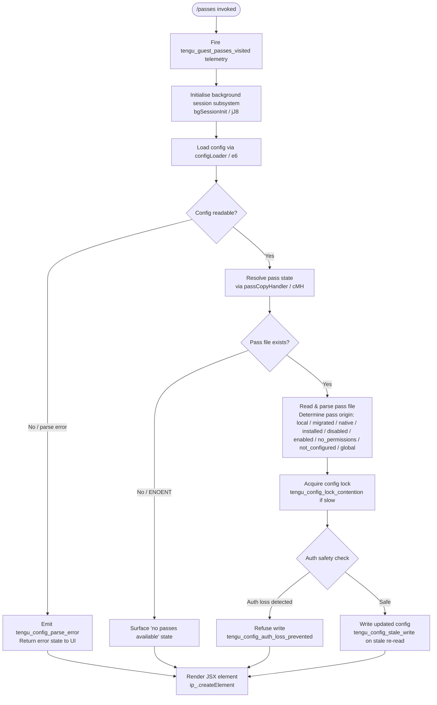

# `/passes`

> Analysis basis: CC v2.1.141 bundle.js (AST extraction + Claude interpretation)
> Minimum version: v2.1.141

---

## Overview

The `/passes` command allows users to share a free week of Claude Code with friends by presenting a guest-pass sharing UI. It is implemented as a `local-jsx` command that renders a React element for the pass-sharing interface. Upon invocation, it fires a dedicated telemetry event (`tengu_guest_passes_visited`) and initialises the background session and configuration subsystems needed to retrieve and manage pass state.

---

## Registration

| Field | Value |
|---|---|
| type | `local-jsx` |
| name | `passes` |
| description | `Share a free week of Claude Code with friends` |
| loc_byte | `11303231` |
| loc_byte_end | `11303551` |
| loc_line | `6947` |
| isHidden | `null` (not hidden) |
| module_id | `yPq` |
| load_inline | `true` |
| arbor_handler.name | `LV7` |
| arbor_handler.fqn | `claude-2.1.141::LV7` |
| arbor_handler.kind | `AsyncFunction` |
| arbor_handler.resolution_path | `module_id` |
| arbor_handler.n_hits | `2` |

Analysis basis: CC v2.1.141 bundle.js:+11303231

---

## Input Branching

The handler has three distinct top-level paths: (1) session initialisation via the background session subsystem, (2) configuration loading and pass-state resolution, and (3) JSX element rendering.



---

## Behavioral Spec

### Top-Level Handler — `guestPassesHandler` (arbor: `LV7`)

```
async function guestPassesHandler(context):
    emit telemetry("tengu_guest_passes_visited")     // bundle.js:+11303054
    bgSessions = await bgSessionInit(context)         // jJ8, bundle.js:+11302948
    config     = await configLoader(context)          // e6,  bundle.js:+11302954
    passState  = await passCopyHandler(config)        // cMH, called via configLoader chain
    element    = createElement(passState)             // ip_.createElement, bundle.js:+11303103
    return element
```

Analysis basis: CC v2.1.141 bundle.js:+11302914

---

### Background Session Initialisation — `bgSessionInit` (identifier: `jJ8`)

```
async function bgSessionInit(context):
    sessionPipeline = buildSessionPipeline()   // q5
    fileWatcher     = attachFileWatcher()      // h6 → EhL
    return { sessionPipeline, fileWatcher }
```

The session pipeline (`q5`) in turn calls the authentication resolver (`mw`) which validates the Anthropic API key or OAuth token. If neither is present, an error is thrown:
- Error message references: `"ANTHROPIC_API_KEY or CLAUDE_CODE_OAUTH_TOKEN env var is required"` (bundle.js:+2896406)

Analysis basis: CC v2.1.141 bundle.js:+10962445

---

### File Watcher — `fileWatcherSetup` (identifier: `EhL`)

```
function fileWatcherSetup(path, callbacks):
    register watchFile listener via mi6.watchFile     // bundle.js:+3139008
    on change:
        recheck path via pathResolver                 // x6
        if changed: invoke changeCallback             // _9_, Jl
        emit to sink                                  // b9
    on teardown: call mi6.unwatchFile                 // bundle.js:+3139335
```

Analysis basis: CC v2.1.141 bundle.js:+3139003

---

### Config Loader — `configLoader` (identifier: `e6`)

```
async function configLoader(context):
    baseDir  = resolveBaseDir()               // Y0
    envelope = buildConfigEnvelope()          // XpH
    entries  = listConfigEntries()            // iE9 → Object.entries
    timestamp = Date.now()                    // WpH, bundle.js:+3139398

    try:
        config = await saveConfigWithLock()   // M9_
    catch saveConfigWithLock errors:
        if auth-loss: log warning and abort   // bundle.js:+3140995
        else: pass through

    passState = await passCopyHandler(config) // cMH, bundle.js:+3137851
    extras    = resolveExtras()               // F76
    return { config, passState, extras }
```

Analysis basis: CC v2.1.141 bundle.js:+3137670

---

### Config Lock & Save — `saveConfigWithLock` (identifier: `M9_`)

```
async function saveConfigWithLock(configPath, newData):
    ensure directory exists  // L.mkdirSync, bundle.js:+3140395
    timestamp = Date.now()   // bundle.js:+3140440

    acquire lock:
        if lock contention detected:
            emit telemetry("tengu_config_lock_contention")  // bundle.js:+3140668
            log warning: "Lock acquisition took longer than expected..."
                         // bundle.js:+3140579

    reRead = readCurrentConfig()  // L.statSync, bundle.js:+3140744

    if reRead is missing auth that in-memory cache has:
        emit telemetry("tengu_config_auth_loss_prevented")  // bundle.js:+3141147
        log: "saveConfigWithLock: re-read config is missing auth..."
             // bundle.js:+3140995
        return  // refuse write

    if reRead differs from expected baseline:
        emit telemetry("tengu_config_stale_write")  // bundle.js:+3140804

    write newData:
        up to 5 backup copies retained  // literal: 5, bundle.js:+3141598
        backup filenames contain ".backup."  // bundle.js:+3141465
        new file mode: 0o600 (decimal 384)  // bundle.js:+3141880
        write via atomic rename (writeAtomicFile / $CH)

    prune excess backups:
        keep newest 5, unlink older  // L.unlinkSync, bundle.js:+3141716
```

Analysis basis: CC v2.1.141 bundle.js:+3140368

---

### Atomic File Write — `writeAtomicFile` (identifier: `$CH`)

```
function writeAtomicFile(targetPath, content):
    tmpPath = targetPath + "." + randomHex(6) + ".tmp"
                // g3A.randomBytes(6).toString("hex"), bundle.js:+990797,990825
    fd = openSync(tmpPath, flags)              // vY.openSync, bundle.js:+990331
    writeFileSync(fd, content)                 // vY.writeFileSync, bundle.js:+991233
    fchmodSync(fd, originalPerms)              // vY.fchmodSync, bundle.js:+991291
        // logs: "Applied original permissions to temp file"
    fsyncSync(fd)                              // vY.fsyncSync, bundle.js:+991357
    closeSync(fd)                              // vY.closeSync, bundle.js:+990318
    renameSync(tmpPath, targetPath)            // q.renameSync, bundle.js:+991485
    on ELOOP / ENOTDIR:
        throw wrapped error                    // bundle.js:+990458, 990471
    on any other error:
        unlinkSync(tmpPath)                    // q.unlinkSync, bundle.js:+991642
        rethrow
```

Analysis basis: CC v2.1.141 bundle.js:+990085

---

### Pass Copy Handler — `passCopyHandler` (identifier: `cMH`)

```
async function passCopyHandler(config):
    if config not yet initialised:
        throw Error("Config accessed before allowed.")  // bundle.js:+3142612

    try:
        rawBytes = q.readFileSync(passFilePath, "utf-8")  // bundle.js:+3142668,3142695
    catch ENOENT:
        return { status: "ENOENT" }   // bundle.js:+3142842

    parsed = JSON.parse(rawBytes)     // b6 → JSON.parse, bundle.js:+179723

    origin = resolvePassOrigin(parsed)
    // origin one of: "unknown" | "local" | "migrated" | "native" |
    //   "installed" | "disabled" | "enabled" | "no_permissions" |
    //   "not_configured" | "global"
    // bundle.js:+3138330 through +3138536

    backupsDir = resolveBackupsDir()  // $9_, "backups", bundle.js:+3142180
    files = q.readdirStringSync(backupsDir)  // bundle.js:+3143486

    for each file in files:
        if file.startsWith(prefix):
            makeHttpRequest(...)      // v → X7K, bundle.js:+3143093

    logEntry = buildLogEntry(origin)  // kH, bundle.js:+3143190
    q.statSync(passFilePath)          // bundle.js:+3143209
    if parse error encountered:
        emit telemetry("tengu_config_parse_error")  // bundle.js:+3143249
        log error

    destDir = dz.basename(...)        // bundle.js:+3143401
    ensure destDir exists:            // q.mkdirSync, bundle.js:+3143428
        handle EEXIST silently        // bundle.js:+3143463

    copyFile:
        q.copyFileSync(src, dst, timestamp)  // bundle.js:+3143757

    return resolvedPassState
```

Analysis basis: CC v2.1.141 bundle.js:+3139496

---

### HTTP Request Subsystem — `httpRequestDispatcher` (identifier: `v` / `X7K`)

```
function buildHttpRequest(options):
    computeByteLength via Buffer.byteLength  // bundle.js:+198580
    attach headers including "debug" marker  // literal "debug", bundle.js:+198860
    redact sensitive fields: "[REDACTED]"    // bundle.js:+190985
    send with 1000ms base timeout            // bundle.js:+198691
    retry up to 100 times                    // bundle.js:+198710
    return promise chained on result         // Dv6.then, bundle.js:+198630
```

Analysis basis: CC v2.1.141 bundle.js:+198884

---

### Background Session / Daemon Subsystem — `bgSessionDispatcher` (identifier: `w`)

This subsystem is reachable transitively from `LV7` through `jJ8` → `j6` → `w`. Its relevant behaviours:

- Monitors system free memory; emits `tengu_bg_dispatch_low_mem` when memory is low (bundle.js:+14465682).
- Memory thresholds: 30 MB and 15 MB (bundle.js:+14465058, +14465069); macOS low-memory check at 1 024 MB (bundle.js:+11848174).
- Emits `tengu_bg_low_mem_mb` on macOS low-memory events (bundle.js:+11848152).
- Escalates to SIGKILL after SIGTERM timeout; emits `tengu_bg_dispatch_sigkill_escalate` (bundle.js:+14465103).
- Manages spare session pool:
  - `tengu_bg_spare_enable` — spare pool enabled (bundle.js:+14466297).
  - `tengu_bg_spare_claim` — spare session claimed (bundle.js:+14466418).
  - `tengu_bg_spare_spawn` — spare session spawned (bundle.js:+14464880).
  - `tengu_bg_spare_claim_fail` — claim failed (bundle.js:+14466681).
- If socket claim fails: emits `tengu_bg_sendclaim_failed` (bundle.js:+14447085).
- Issue report URL: `https://github.com/anthropics/claude-code/issues` (bundle.js:+14466148).
- Retry loop delay: 2 000 ms (bundle.js:+14464813).
- Session lifecycle states: `"spare"` | `"active"` | `"working"` | `"blocked"` | `"bg"` | `"idle"` | `"daemon"` | `"done"` | `"killed"` | `"stopped"` | `"failed"` | `"crashed"` | `"resuming"` | `"windows"` (bundle.js:+14465817 through +14471001).

Analysis basis: CC v2.1.141 bundle.js:+14464517

---

### Pass Origin Classification

The pass origin string is derived from the parsed pass file content. Known values and their byte offsets:

| Origin String | loc_byte |
|---|---|
| `"unknown"` | 3138330 |
| `"local"` | 3138405 |
| `"migrated"` | 3138392 |
| `"native"` | 3138437 |
| `"installed"` | 3138423 |
| `"disabled"` | 3138456 |
| `"enabled"` | 3138482 |
| `"no_permissions"` | 3138496 |
| `"not_configured"` | 3138517 |
| `"global"` | 3138536 |

Analysis basis: CC v2.1.141 bundle.js:+3138309

---

## State & Side Effects

| Item | Detail |
|---|---|
| Telemetry — `tengu_guest_passes_visited` | Fired immediately on `/passes` invocation (bundle.js:+11303054) |
| Telemetry — `tengu_config_parse_error` | Fired when pass file JSON cannot be parsed (bundle.js:+3143249) |
| Telemetry — `tengu_config_lock_contention` | Fired when config-file lock acquisition is slower than expected (bundle.js:+3140668) |
| Telemetry — `tengu_config_stale_write` | Fired when re-read config differs from in-memory baseline before write (bundle.js:+3140804) |
| Telemetry — `tengu_config_auth_loss_prevented` | Fired when a write is aborted to protect auth credentials (bundle.js:+3141147) |
| Telemetry — `tengu_bg_dispatch_sigkill_escalate` | Fired when a background session requires SIGKILL escalation (bundle.js:+14465103) |
| Telemetry — `tengu_feature_bad` / `tengu_feature_ok` | Fired by feature-flag checks within the background session path (bundle.js:+945624, +945566) |
| Telemetry — `tengu_bg_low_mem_mb` | Fired on macOS when free memory is below threshold (bundle.js:+11848152) |
| Telemetry — `tengu_bg_dispatch_low_mem` | Fired when dispatcher detects low memory (bundle.js:+14465682) |
| Telemetry — `tengu_bg_spare_enable` | Fired when spare session pool is activated (bundle.js:+14466297) |
| Telemetry — `tengu_bg_spare_claim` | Fired when a spare session is claimed (bundle.js:+14466418) |
| Telemetry — `tengu_bg_spare_spawn` | Fired when a new spare session is spawned (bundle.js:+14464880) |
| Telemetry — `tengu_bg_spare_claim_fail` | Fired when spare claim fails (bundle.js:+14466681) |
| Telemetry — `tengu_bg_sendclaim_failed` | Fired when socket claim message fails (bundle.js:+14447085) |
| Config file write | Writes updated config via atomic rename with mode 0o600; retains up to 5 backup copies |
| File system | Creates backup directory if absent; copies pass file to destination |
| React element | Renders a JSX element via `ip_.createElement` (bundle.js:+11303103) |
| appState changes | Config lock state and session roster state updated in memory |
| Sound | <!-- TODO: not found in depth-2 traversal; needs --depth 4 --> |

---

## Version History

| Version | Change |
|---|---|
| v2.1.141 | Initial analysis |

---

## Common Mistakes

1. **Invoking `/passes` without authentication** — if neither `ANTHROPIC_API_KEY` nor `CLAUDE_CODE_OAUTH_TOKEN` is set, the background session initialiser throws immediately before the UI renders (bundle.js:+2896406).
2. **Corrupt or non-JSON pass file** — if the pass file exists but cannot be parsed, a `tengu_config_parse_error` event is emitted and the UI receives an error state instead of pass data (bundle.js:+3143249).
3. **Concurrent Claude Code instances** — simultaneous writes trigger `tengu_config_lock_contention`. The lock warning "another Claude instance may be running" is logged but execution continues (bundle.js:+3140579).
4. **Auth-loss safety guard** — if an in-flight config write would overwrite credentials that exist in the memory cache but are absent in the re-read file, the write is silently aborted. Users may not realise their intended config change was not persisted (bundle.js:+3140995).
5. **Backup accumulation** — only 5 backup copies of the config file are retained; older ones are deleted automatically. Do not rely on older backups being present (bundle.js:+3141598).

---

## Appendix — Identifier Mapping

> For bundle debugging only. Identifiers change across versions.

| Identifier | Role |
|---|---|
| `LV7` | Top-level handler for `/passes` (`guestPassesHandler`), AsyncFunction |
| `h6` | File watcher core / project-loader helper |
| `x6` | Path resolver utility |
| `_9_` | Change callback invoked by file watcher |
| `cMH` | Pass copy / pass state handler (`passCopyHandler`) |
| `q` | File-system synchronous operations wrapper (readFileSync, statSync, etc.) |
| `b6` | JSON parse wrapper |
| `DR` | String prefix/slice utility |
| `H` | General-purpose utility / random / timer helper |
| `_` | File-system async operations (readdirStringSync, statSync) |
| `M8` | Shared utility / formatter |
| `rE9` | Backup directory resolver |
| `$9_` | Path join helper (resolves backup subdirectory) |
| `M` | In-memory registry / map wrapper |
| `$` | Alternative registry / config-value accessor |
| `v` | HTTP request builder |
| `J7K` | HTTP transport layer helper |
| `SH` | JSON serialiser wrapper |
| `t7` | String sanitiser / redaction helper |
| `MSH` | Metrics/logging helper |
| `X7K` | HTTP request dispatcher (sends the actual request) |
| `kH` | Log-entry / error-logging helper |
| `k_` | Error wrapper with String coercion |
| `RH` | String coercion / normalisation helper |
| `Vq` | Network traffic classifier (`"essential-traffic"`) |
| `GvK` | Request queue manager (shift / push) |
| `Q` | Shared async queue / promise pool |
| `w` | Background session dispatcher / process manager |
| `A` | Process / session registry map |
| `S` | Session lifecycle controller |
| `xH` | Feature-bad reporter |
| `hH` | Feature-ok reporter |
| `YG6` | macOS memory monitor |
| `u` | Connection/socket writer with clearTimeout |
| `j6` | Session spawner (creates new background session) |
| `Ao_` | Socket claim & connect handler |
| `Mo_` | Session teardown / cleanup handler |
| `L` | Config file writer (also session cleanup alias) |
| `D` | Spare session pool maintainer (recursive self-scheduling) |
| `p` | Disposable resource wrapper |
| `EhL` | File watcher lifecycle (watchFile / unwatchFile) |
| `Jl` | Watcher change-notification callback |
| `b9` | Subscription / listener set manager |
| `JKK` | Undefined-guard check |
| `jJ8` | Background session initialiser (entry from `LV7`) |
| `q5` | Session pipeline builder |
| `mw` | Auth-and-session orchestrator |
| `JL` | Auth resolver / token loader |
| `FR` | Auth flow router |
| `tj` | First-party auth handler |
| `j$` | OAuth / API-key validator |
| `Q46` | Auth result normaliser |
| `e6` | Config loader (entry from `LV7`) |
| `M9_` | Config lock & save (`saveConfigWithLock`) |
| `XeA` | Config object merger |
| `Dr8` | Config object constructor |
| `F76` | Config extras resolver |
| `Z` | Config key iterator |
| `X` | MCP connection manager |
| `gT8` | MCP transport factory |
| `V` | Backup list / slice helper |
| `$CH` | Atomic file write helper (`writeAtomicFile`) |
| `O` | Stat result wrapper (isSymbolicLink check) |
| `$8` | Permission mode helper |
| `f` | File descriptor / connection object |
| `XpH` | Config envelope builder |
| `iE9` | Config entry iterator (Object.entries wrapper) |
| `WpH` | Timestamp helper (Date.now wrapper) |
| `f9_` | Global config save fallback |

---

Note: index built via Arbor fallback; some signals (telemetry, literals) may be missing — see arbor-fallback.js.