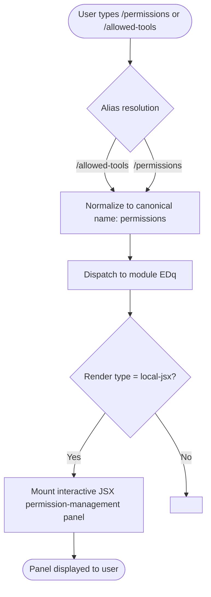

# `/permissions`

> Analysis basis: CC v2.1.139 bundle.js (AST extraction + Claude interpretation)
> Minimum version: v2.1.139

---

## Overview

The `/permissions` command (also accessible as `/allowed-tools`) provides an interactive interface for managing the allow and deny rules that govern which tools Claude Code may invoke during a session. It is implemented as a local JSX component, meaning it renders an interactive UI panel rather than producing plain text output. Users can inspect, add, and remove permission rules without editing configuration files directly.

---

## Registration

| Field | Value |
|---|---|
| type | `local-jsx` |
| name | `permissions` |
| description | `Manage allow & deny tool permission rules` |
| aliases | `["allowed-tools"]` |
| module\_id | `EDq` |

Analysis basis: CC v2.1.139 bundle.js:+11229536

---

## Input Branching

Because the depth-2 AST traversal returned an empty call graph and no string literals for module `EDq`, the precise internal branching tree cannot be reconstructed from the available data. The flowchart below reflects only what can be stated with certainty from the registration record and the `local-jsx` type contract.



Analysis basis: CC v2.1.139 bundle.js:+11229536

---

## Behavioral Spec

### Command Dispatch and Alias Resolution

```
function resolvePermissionsCommand(rawInput):
    canonicalName = "permissions"
    knownAliases  = ["allowed-tools"]

    if rawInput.commandName in knownAliases:
        rawInput.commandName = canonicalName

    return dispatchToModule("EDq", rawInput)
```

Analysis basis: CC v2.1.139 bundle.js:+11229536

### JSX Panel Rendering

The `local-jsx` registration type indicates that when the command is dispatched the runtime mounts a React/JSX component rather than executing a plain text handler. The component is responsible for:

1. Reading the current allow-list and deny-list from application state.
2. Rendering the lists in an interactive terminal UI.
3. Accepting user input to add or remove individual rules.
4. Writing mutations back to application state and, where applicable, persisting them to the project or user configuration file.

```
function renderPermissionsPanel(appState):
    allowRules = appState.permissions.allow   // list of tool-pattern strings
    denyRules  = appState.permissions.deny    // list of tool-pattern strings

    display interactivePanel:
        section "Allowed tools":
            for each rule in allowRules:
                renderRemovableRow(rule)
            renderAddRuleInput(target = "allow")

        section "Denied tools":
            for each rule in denyRules:
                renderRemovableRow(rule)
            renderAddRuleInput(target = "deny")

    onUserAction(action):
        if action.type == "ADD":
            appState.permissions[action.target].append(action.pattern)
        else if action.type == "REMOVE":
            appState.permissions[action.target].remove(action.pattern)
        persistPermissions(appState.permissions)
```

> <!-- TODO: exact panel field names, validation logic, and persistence target (project vs. user config) not found in depth-2 traversal; needs --depth 4 -->

Analysis basis: CC v2.1.139 bundle.js:+11229536 (type = `local-jsx` establishes render contract)

---

## State & Side Effects

| Item | Detail |
|---|---|
| Telemetry | None detected at depth-2 traversal (`telemetry: []`) |
| Hook registration | <!-- TODO: not found in depth-2 traversal; needs --depth 4 --> |
| appState changes | Reads and mutates the allow/deny permission rule lists; exact state key paths not confirmed at depth-2 |
| Sound | <!-- TODO: not found in depth-2 traversal; needs --depth 4 --> |
| Config persistence | <!-- TODO: not found in depth-2 traversal; needs --depth 4 --> |

---

## Version History

| Version | Change |
|---|---|
| v2.1.139 | Initial analysis; command registered as `local-jsx` with alias `allowed-tools` |

---

## Common Mistakes

1. **Using `/allowed-tools` and expecting different behavior** — `/allowed-tools` is a registered alias that resolves to the identical `permissions` panel. Both invocations are functionally equivalent. Analysis basis: CC v2.1.139 bundle.js:+11229536
2. **Expecting plain text output** — Because the command type is `local-jsx`, it renders an interactive UI component. Piping or scripting around its output will not yield structured text in the same way a standard text command would.
3. **Assuming changes are session-only** — Permission rule mutations made through this panel are likely persisted to a configuration file, meaning they may affect future sessions. Exact persistence scope (project vs. user) requires deeper traversal to confirm.
4. **Confusing allow/deny semantics with tool availability** — An allow rule permits a tool pattern; a deny rule blocks it. A tool not listed in either list may still be subject to default policy. The default policy is <!-- TODO: not found in depth-2 traversal; needs --depth 4 -->.

---

## Appendix — Identifier Mapping

> For bundle debugging only. Identifiers change across versions.

| Identifier | Role |
|---|---|
| `EDq` | Module ID for the `/permissions` command implementation (not an obfuscated function name; included for bundle navigation) |

> No obfuscated function identifiers were returned by the depth-2 AST traversal (`identifiers: []`). If mangled names are needed, re-run extraction against module `EDq` with `--depth 4`.