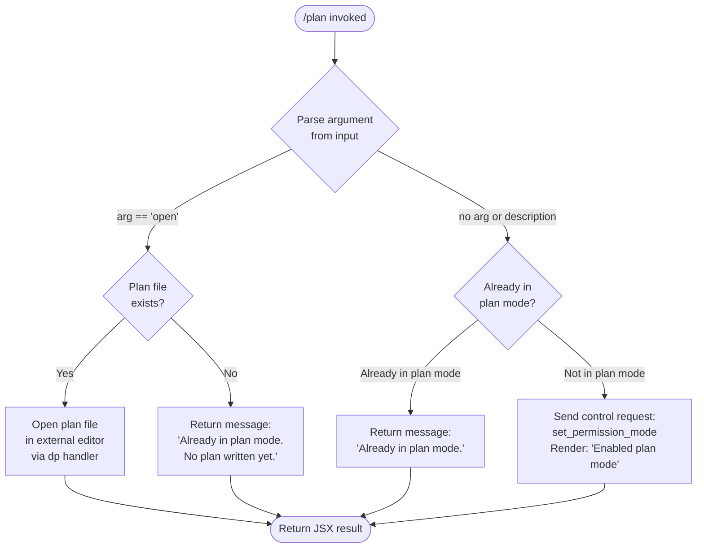

# `/plan`

> Analysis basis: CC v2.1.141 bundle.js (AST extraction + Claude interpretation)
> Minimum version: v2.1.141

---

## Overview

The `/plan` command enables "plan mode" for the current Claude Code session or displays the existing plan if one is already in progress. When invoked without arguments or with a description, it activates a read-only permission mode (`planMode`) that restricts the agent to reasoning and planning actions; when invoked with `open`, it displays the current session plan document in an external editor. The command issues a `set_permission_mode` control request and renders JSX feedback directly in the terminal UI.

---

## Registration

| Field | Value |
|---|---|
| type | `local-jsx` |
| name | `plan` |
| description | Enable plan mode or view the current session plan |
| argumentHint | `[open\|<description>]` |
| module_id | `wPq` |
| load_inline | `true` |
| loc_byte | `11291684` |
| loc_byte_end | `11291883` |
| loc_line | `6947` |
| arbor_handler.name | `oZ7` |
| arbor_handler.fqn | `claude-2.1.141::oZ7` |
| arbor_handler.kind | `AsyncFunction` |
| arbor_handler.resolution_path | `module_id` |
| arbor_handler.n_hits | `0` |

Analysis basis: CC v2.1.141 bundle.js:+11291684

---

## Input Branching

Four distinct execution branches exist depending on argument value and current session state, requiring a flowchart.



Analysis basis: CC v2.1.141 bundle.js:+11290558, +11290832, +11291083, +11291242, +11290834, +11290862

---

## Behavioral Spec

### Main Handler (`oZ7`)

The async handler `oZ7` is the Arbor-resolved entry point for the `/plan` command (resolution path: `module_id` → `wPq`).

```
async function planCommandHandler(context):
    permissionMode  = getPermissionModeState(context)       // cf @ +11290679
    inputText       = getCommandArgument(context)            // H @ +11290832
    trimmedInput    = inputText.trim()                       // A.trim @ +11291064

    // Branch 1: open argument — display existing plan
    if trimmedInput == "open":                               // literal @ +11291083
        planFilePath = resolveProjectPlanFile(context)       // m0, a2 @ +11291193, +11291200
        if planFilePath exists and is readable:
            launchExternalEditor(planFilePath)               // dp @ +11291343
        else:
            return renderJSX("Already in plan mode. No plan written yet.")
                                                             // literal @ +11291242
        return renderJSX(editorResult)

    // Branch 2: already in plan mode
    if permissionMode == "plan":
        return renderJSX("Already in plan mode.")            // literal @ +11290862

    // Branch 3: activate plan mode
    sendControlRequest("set_permission_mode", {             // M.sendControlRequest @ +11290766
        mode: "plan"                                        // literal @ +11290796
    })
    renderStatus("Enabled plan mode")                       // literal @ +11290834
    return renderJSX(statusComponent)
```

Analysis basis: CC v2.1.141 bundle.js:+11290558

---

### Permission Mode State Read (`cf`)

Before branching, the handler reads the current session permission mode via `cf`, which accesses the app state map and filters allowed/denied rule sets.

```
function readPermissionMode(appState):
    modeEntry = appState.get("mode")                       // cf:A.set @ +3940837
    if modeEntry == "bypassPermissions":
        if bypassModeDisabled:
            log("Ignoring permission update: setMode 'bypassPermissions' rejected...")
                                                           // literal @ +3939643
            return currentMode
    filterRules(modeEntry, {
        allow: appState.alwaysAllowRules,                  // literal @ +3940112
        deny:  appState.alwaysDenyRules,                   // literal @ +3940151
        ask:   appState.alwaysAskRules                     // literal @ +3940169
    })
    return modeEntry
```

Analysis basis: CC v2.1.141 bundle.js:+11290679, +3939641, +3939555

---

### Plan File Resolution (`m0`, `a2`, `cOH`)

When the `open` sub-command is used, the handler resolves the on-disk plan file path for the current project.

```
function resolvePlanFile(projectRoot, context):
    // cOH looks up file from a cached map; if absent, computes path
    cached = planFileCache.get(projectRoot)                // cOH:q.get @ +5099944
    if cached:
        return cached
    segments = buildPathSegments(projectRoot)              // rA_ (H.split) @ +3124056
    filePath = joinPath(segments)                          // cOH:vm.join @ +5100040
    planFileCache.set(projectRoot, filePath)               // cOH:q.set @ +5100090
    return filePath
```

```
function openOrReportPlanFile(resolvedPath):
    if resolvedPath is absent or unreadable:
        return "Already in plan mode. No plan written yet."  // literal @ +11291242
    fileContents = readFileSync(resolvedPath, "utf-8")     // literal @ +5100392; dp:_.readFileSync @ +10483777
    launchEditorWithContents(fileContents)                 // dp @ +11291343
```

Analysis basis: CC v2.1.141 bundle.js:+11291193, +11291200, +5100345, +5099929

---

### External Editor Launch (`dp`)

The editor-launch function `dp` suspends the Ink rendering loop, spawns the editor synchronously, then resumes rendering.

```
function launchExternalEditor(filePath):
    editorBinary = resolveEditorBinary(context)            // Mj @ +11291436; nb_ @ +10483115
    if inkInstance is null:
        throw Error("Ink instance not found - cannot pause rendering")
                                                           // literal @ +10483200
    inkInstance.enterAlternateScreen()                     // dp:A.enterAlternateScreen @ +10483353
    inkInstance.pause()                                    // dp:A.pause @ +10483383
    inkInstance.suspendStdin()                             // dp:A.suspendStdin @ +10483393

    args = buildEditorArgs(filePath)                       // dp:L.split @ +10483432
    result = spawnSync(editorBinary, args, {stdio: "inherit"})
                                                           // literal @ +10483507; s4q.spawnSync @ +10483475

    inkInstance.exitAlternateScreen()                      // dp:A.exitAlternateScreen @ +10483855
    inkInstance.resumeStdin()                              // dp:A.resumeStdin @ +10483884
    inkInstance.resume()                                   // dp:A.resume @ +10483900
    return result
```

Analysis basis: CC v2.1.141 bundle.js:+11291343, +10483152

---

### Control Request Dispatch (`M.sendControlRequest`)

When activating plan mode, the handler sends a structured control request through the session controller.

```
function sendPlanModeControlRequest(session):
    request = {
        type: "set_permission_mode",                       // literal @ +11290796
        payload: { mode: "plan" }
    }
    session.sendControlRequest(request)                    // M.sendControlRequest @ +11290766
    // The control layer (SvH / XA5) then propagates the mode change
    // to all connected MCP servers and updates app state
```

Analysis basis: CC v2.1.141 bundle.js:+11290766, +11290796

---

### JSX Render Output (`cE1`, `MlH`)

The command is registered as `local-jsx`, so it returns a React element tree rendered by Ink.

```
function renderPlanFeedback(message):
    // MlH listens for data events on an output stream
    // and wraps content in an HHH.createElement call
    element = createElement(StatusComponent, { message })  // MlH:HHH.createElement @ +7468487
    // B5 strips ANSI codes for clean display
    cleanText = Bun.stripANSI(rawOutput)                   // B5:Bun.stripANSI @ +3626370
    return element
```

Analysis basis: CC v2.1.141 bundle.js:+11291457, +11291461, +7468634

---

### MCP Connection Control (`iIH`, `SvH`, `XA5`)

Activating plan mode triggers a broader MCP server update cycle. The handler calls `iIH`, which coordinates reconnecting or refreshing tool availability across all registered MCP servers.

```
function refreshMCPAfterModeChange(appState):
    serverMap = Object.entries(appState.mcpServers)        // xQ:Object.entries @ +9788594
    for each [name, serverConfig] in serverMap:
        toolList = buildToolList(serverConfig)             // xQ → cS_ @ +9788732
        if serverConfig.status == "disabled":              // literal @ +9587468
            skip
        reconnectOrRefresh(serverConfig)                   // SvH @ +14200092
    updateToolPermissions(appState)                        // cf @ +9788480
```

Analysis basis: CC v2.1.141 bundle.js:+11290682, +9798044, +9798135

---

## State & Side Effects

| Item | Detail |
|---|---|
| Telemetry | `tengu_mcp_oauth_flow_start` (bundle.js:+9522861); `tengu_mcp_oauth_flow_success` (bundle.js:+9527329); `tengu_mcp_oauth_flow_error` (bundle.js:+9528725); `tengu_bg_spare_enable` (bundle.js:+14464520); `tengu_bg_spare_spawn` (bundle.js:+14464880); `tengu_daemon_config_reload` (bundle.js:+14478760); `tengu_config_auth_loss_prevented` (bundle.js:+3138005); `tengu_daemon_control` (bundle.js:+14499703); `tengu_daemon_yield` (bundle.js:+14482794) |
| Permission mode change | Sets session permission mode to `"plan"` via `set_permission_mode` control request (bundle.js:+11290796) |
| appState changes | Updates `permissionMode` state; may filter `alwaysAllowRules`, `alwaysDenyRules`, `alwaysAskRules` entries (bundle.js:+3940104–+3940169) |
| File I/O | When `open` sub-command used: reads plan file with `readFileSync` encoding `utf-8` (bundle.js:+5100392, +10483777); plan file cache updated via `q.get`/`q.set` (bundle.js:+5099944, +5100090) |
| External process | `spawnSync` with `stdio: "inherit"` for editor launch (bundle.js:+10483475, +10483507) |
| Ink rendering | Pauses/resumes Ink render loop around editor spawn (bundle.js:+10483353–+10483900) |
| MCP side effects | Re-evaluates all MCP server states; may trigger OAuth flow or reconnect cycle (bundle.js:+11290682, +9798044) |
| Error logging | Errors pushed to `aRH` ring-buffer; `Oc.logError` called on failures (bundle.js:+951013, +951053) |
| Hook registration | `K.on` event listener registered for output stream in JSX render path (bundle.js:+7468420) |

---

## Version History

| Version | Change |
|---|---|
| v2.1.141 | Initial analysis |

---

## Common Mistakes

1. **Passing a description as the argument does not set a plan title.** The handler trims the argument and checks specifically for `"open"` (literal at bundle.js:+11291083); any other text currently follows the "activate plan mode" branch, not a "name the plan" branch. Providing a description string is listed in the `argumentHint` but its distinct handling is not surfaced at this traversal depth.

2. **Running `/plan open` when no plan has been written yet** returns the message "Already in plan mode. No plan written yet." (literal at bundle.js:+11291242) rather than opening an editor — the editor is only launched when a plan file is found on disk.

3. **Running `/plan` repeatedly in plan mode** is a no-op; the command returns "Already in plan mode." (literal at bundle.js:+11290862) and does not re-send the control request or re-render.

4. **Assuming `/plan` exits plan mode.** The command only enters plan mode; there is no `/plan off` or toggle logic visible in the depth-2 call graph. Exiting plan mode requires a different mechanism (e.g., `/model` or session reset).

5. **Expecting `/plan` to work inside a non-interactive (piped) session.** The `dp` editor-launch path requires an active Ink instance; if none is found, an error "Ink instance not found - cannot pause rendering" is thrown (literal at bundle.js:+10483200).

---

## Appendix — Identifier Mapping

> For bundle debugging only. Identifiers change across versions.

| Identifier | Role |
|---|---|
| `oZ7` | Main async handler for `/plan` command (Arbor-resolved, fqn: `claude-2.1.141::oZ7`) |
| `q` | File-unlink helper / set utility used in MCP connection management |
| `V3` | Helper called early in handler initialisation |
| `njH` | Sub-function reached from `V3` |
| `CU` | Context/state accessor called before permission check |
| `K` | Map/list utility (`.map`, `.filter` operations) |
| `L` | Connection set manager (`q.add`, `q.delete`, `f.finally`) |
| `f` | Connection object with `close`, `toLowerCase` methods |
| `A` | Generic state map with `set`, `delete`, `trim` operations |
| `cf` | Permission mode read/write coordinator |
| `v` | Telemetry/logging dispatcher |
| `J7K` | Telemetry sub-handler |
| `Qt_` | Telemetry event formatter |
| `H` | Argument string or config object (context-dependent) |
| `SH` | JSON serialiser wrapper |
| `_` | Utility/polyfill base |
| `t7` | String manipulation helper (redaction, path slicing) |
| `T6A` | Path segment mapper |
| `MSH` | Config write orchestrator |
| `M6A` | File write helper |
| `X7K` | Conversation/history persistence manager |
| `bhH` | Debounced write scheduler |
| `A_H` | File append helper |
| `x6` | Path existence checker |
| `Cv8` | Checksum/hash helper |
| `y6A` | Path join helper for history files |
| `k6A` | File rotation/rename helper |
| `P7K` | Directory-create + append-file handler |
| `b9` | State subscription manager |
| `A7` | String escape/replaceAll utility |
| `XhK` | Regex-escape helper using `replaceAll` |
| `iIH` | MCP server refresh coordinator after mode change |
| `tS_` | Session state bootstrap |
| `wB` | Policy settings loader |
| `I8` | Policy config accessor |
| `YS` | MCP disable-state handler |
| `iS_` | Disable-state sub-handler |
| `SmH` | Model availability filter |
| `m1` | Message queue helper |
| `rm8` | Policy re-check helper |
| `Ky` | Tool-list builder helper |
| `qLH` | Permission rule mapper |
| `xQ` | MCP server tool-list assembler |
| `PO` | Tool definition formatter |
| `GhK` | Tool name cleaner |
| `GE` | `Object.hasOwn` guard wrapper |
| `ThK` | Tool description trimmer |
| `WhK` | Tool description replaceAll helper |
| `cS_` | File-context tool assembler |
| `$_q` | File descriptor builder (D/w/J branches) |
| `dS_` | File path relativiser |
| `X_q` | Allowed-tool inclusion checker |
| `W_q` | Tool deduplication accumulator |
| `M` | Session controller (holds `sendControlRequest`) |
| `SvH` | MCP connection orchestrator |
| `$HH` | MCP config normaliser |
| `cqH` | Single MCP server connection handler |
| `MHH` | SDK-type MCP server builder |
| `Dw6` | SSE/HTTP MCP server builder |
| `hI` | Session context builder |
| `G3` | Context sub-builder |
| `YG_` | Context variant helper |
| `__` | String utility wrapper |
| `rX6` | Server filter helper |
| `xL7` | Connection timestamp tracker |
| `rh_` | Connection metadata assembler |
| `$78` | Tool-hash builder |
| `wi` | Raw hash helper |
| `Yj` | SHA-256 hash builder |
| `M78` | Tool metadata key builder |
| `aK` | Tool metadata accessor |
| `_8` | MCP debug logger |
| `Nh_` | MCP reconnect / OAuth flow orchestrator |
| `nK7` | OAuth capability checker |
| `DB` | Transport/serialiser selector |
| `q6H` | Full OAuth flow implementation (state machine) |
| `FrH` | Auth-pending cache manager |
| `D` | Background spare process manager |
| `nz8` | Reconnect path builder |
| `SQ` | MCP reconnect executor |
| `tx` | Transport layer builder |
| `Y` | Daemon supervisor config updater |
| `_7` | MCP error logger |
| `TH` | String coercion wrapper |
| `iK7` | OAuth interrupt handler |
| `lK7` | SSH-aware URL builder |
| `kh_` | Auth-cache connection handler |
| `BrH` | Auth-pending lookup |
| `grH` | Auth-pending get helper |
| `sHq` | Reconnect path assembler |
| `p7` | AsyncLocalStorage store getter |
| `LY8` | Cache path builder |
| `Ih_` | Tool-call hash + log helper |
| `fG_` | Tool filter / capability checker |
| `e6` | Config persistence helper |
| `J` | Process kill manager |
| `N` | Child-process wrapper |
| `y` | Daemon write channel |
| `z` | Daemon stop controller |
| `Q` | Promise/deferred utility |
| `iHq` | Batch-request mapper |
| `U$H` | Async-iterator / event-target adapter |
| `oX6` | Port parser (radix 10) |
| `oh_` | Secondary port parser |
| `Eeq` | MCP update applicator |
| `fY8` | MCP update serialiser |
| `sI` | MCP server cleanup dispatcher |
| `irH` | MCP server status serialiser |
| `$` | Session write helper |
| `XTq` | Daemon status file writer |
| `Ia` | Daemon metadata formatter |
| `b06` | Daemon status path builder |
| `XA5` | Full MCP send-control-request implementation |
| `z78` | Tool-capability set checker |
| `a8` | Promise-with-timeout helper |
| `O` | Abort-signal wrapper |
| `AQH` | Plan mode UI component builder |
| `H7H` | UI component sub-builder |
| `V6` | React/Ink style helper |
| `m0` | Plan file open orchestrator |
| `a2` | Plan path resolver |
| `cOH` | Plan file cache manager |
| `rA_` | Path split helper |
| `DpH` | Path normaliser |
| `yi6` | Alternative path normaliser |
| `$8` | Error-code handler (ENOENT/EISDIR) |
| `M8` | Low-level error formatter |
| `kH` | Error logger with ring-buffer |
| `k_` | Error stringifier |
| `RH` | String coercion helper |
| `Vq` | Log entry formatter |
| `cMA` | Log ring-buffer entry builder |
| `GvK` | Log ring-buffer shift/push manager |
| `dp` | External editor launcher (Ink suspend + spawnSync) |
| `Zw7` | Editor resolution dispatcher |
| `nb_` | Editor binary resolver |
| `B1` | String index/slice helper |
| `Mj` | Editor name normaliser |
| `cE1` | JSX output component factory |
| `MlH` | Ink stream listener + element builder |
| `du` | Ink element composer |
| `$L_` | React createElement wrapper |
| `Q9H` | Ink text component |
| `B5` | ANSI-strip wrapper (`Bun.stripANSI`) |

---

Note: index built via Arbor fallback; some signals (telemetry, literals) may be missing — see arbor-fallback.js.