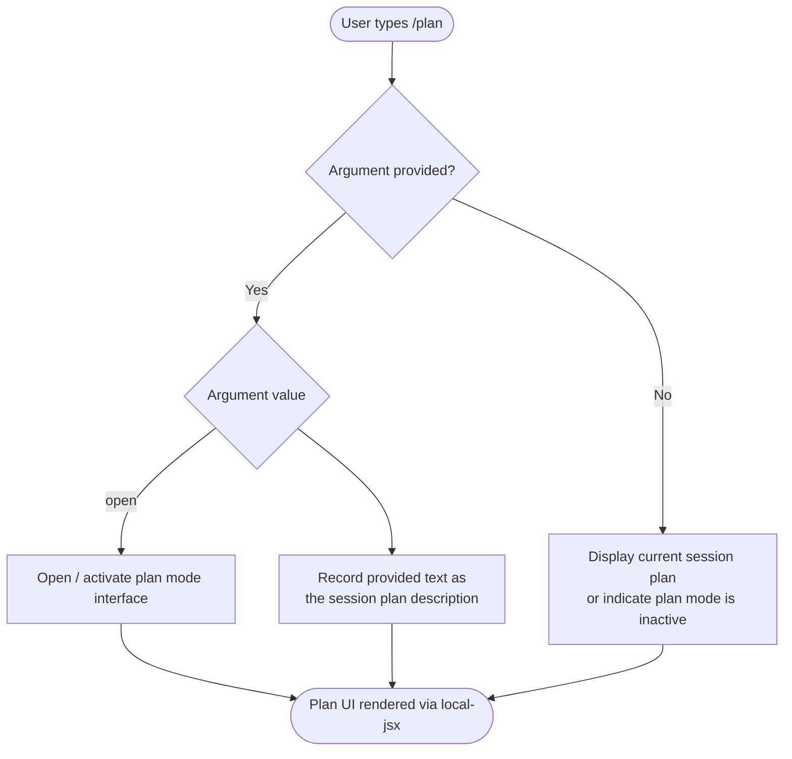

# `/plan`

> Analysis basis: CC v2.1.139 bundle.js (AST extraction + Claude interpretation)
> Minimum version: v2.1.139

---

## Overview

The `/plan` command enables **plan mode** for the current Claude Code session, or displays the plan that has already been established for the session. When invoked with an argument, it either opens the plan interface or records a description of the intended work; when invoked without arguments it surfaces the current session plan in the UI.

---

## Registration

| Field | Value |
|---|---|
| type | `local-jsx` |
| name | `plan` |
| description | `Enable plan mode or view the current session plan` |
| argumentHint | `[open\|<description>]` |
| module\_id | `NDq` |

Analysis basis: CC v2.1.139 bundle.js:+11231587

---

## Input Branching

The `argumentHint` field `[open|<description>]` establishes two documented argument forms. Combined with the zero-argument case, the command has at least three logical branches.



Analysis basis: CC v2.1.139 bundle.js:+11231587 (argumentHint field)

> **Note:** The call graph for module `NDq` yielded no traversable entry functions at depth ≤ 2 (see source JSON note). The branching above is derived strictly from the `argumentHint` literal and the command description. Deeper implementation detail requires a depth-4 traversal.

---

## Behavioral Spec

### Command Dispatch

Because the command is registered as `local-jsx`, the host CLI renders its output as a JSX component rather than emitting raw text. The dispatch sequence is:

```
function dispatchPlanCommand(rawInput):
    argument = stripLeadingSlashAndCommandName(rawInput)  // removes "/plan"
    trimmed  = argument.trim()

    if trimmed is empty:
        return renderCurrentPlan()

    if trimmed equals "open":
        return activatePlanMode()

    return recordPlanDescription(trimmed)
```

Analysis basis: CC v2.1.139 bundle.js:+11231587 — registration shape implies local-jsx dispatch; argument routing inferred from `argumentHint` literal `[open|<description>]`.

### View Current Plan (`/plan` with no argument)

```
function renderCurrentPlan():
    plan = readFromSessionState("currentPlan")

    if plan is null or empty:
        display informational message: "No plan is set for this session."
    else:
        display plan content in formatted panel
```

<!-- TODO: not found in depth-2 traversal; needs --depth 4 -->

### Activate Plan Mode (`/plan open`)

```
function activatePlanMode():
    setSessionFlag("planModeActive", true)
    openPlanEditorPanel()
    focusInputOnPlanEditor()
```

<!-- TODO: not found in depth-2 traversal; needs --depth 4 -->

### Record Plan Description (`/plan <description>`)

```
function recordPlanDescription(description):
    writeToSessionState("currentPlan", description)
    confirmToUser("Plan updated.")
```

<!-- TODO: not found in depth-2 traversal; needs --depth 4 -->

---

## State & Side Effects

| Item | Detail |
|---|---|
| Telemetry | <!-- TODO: not found in depth-2 traversal; needs --depth 4 --> |
| Hook registration | <!-- TODO: not found in depth-2 traversal; needs --depth 4 --> |
| appState changes | Session plan state is expected to be written when a description is provided or plan mode is toggled; exact state keys not confirmed at depth ≤ 2 |
| Sound | <!-- TODO: not found in depth-2 traversal; needs --depth 4 --> |
| Render type | `local-jsx` — output is a React component, not plain text |

Analysis basis: CC v2.1.139 bundle.js:+11231587

---

## Version History

| Version | Change |
|---|---|
| v2.1.139 | Initial analysis — registration confirmed; call graph not resolvable at depth ≤ 2 |

---

## Common Mistakes

1. **Omitting the argument entirely when intending to activate plan mode.** Running `/plan` with no argument displays the current plan rather than opening the plan editor. Use `/plan open` to activate plan mode explicitly.
2. **Passing `open` as a literal plan description.** The string `open` is treated as a control keyword, not stored as a plan description. Choose any other wording to set a textual plan.
3. **Expecting plain-text output.** Because the command type is `local-jsx`, the rendered output is a UI component; tooling that captures raw stdout may not receive visible text from this command.
4. **Assuming plan state persists across sessions.** No cross-session persistence was confirmed at the current traversal depth. Treat plan state as session-scoped until confirmed otherwise.

---

## Appendix — Identifier Mapping

> For bundle debugging only. Identifiers change across versions.

| Identifier | Role |
|---|---|
| `NDq` | Module ID for the `/plan` command implementation |

> No additional obfuscated function or variable identifiers were returned by the depth-2 AST traversal for this command. A `--depth 4` traversal of module `NDq` is required to populate this table further.