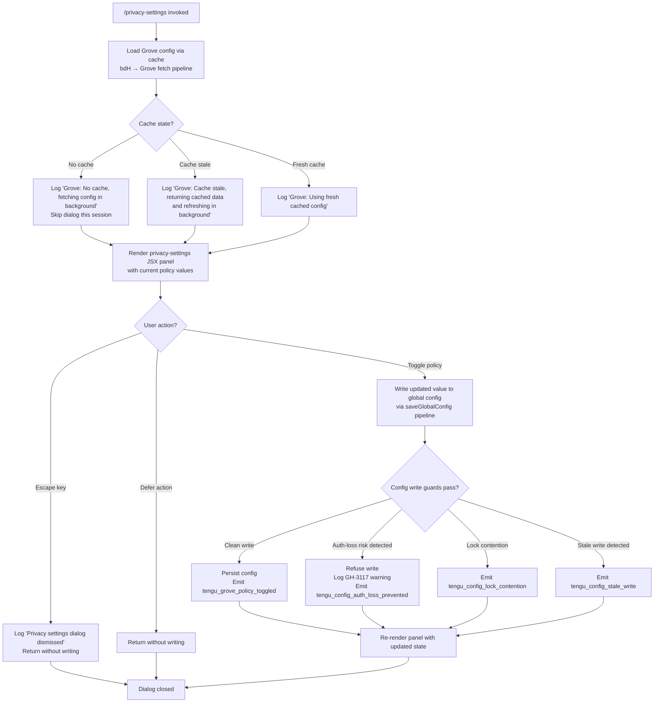

# `/privacy-settings`

> Analysis basis: CC v2.1.141 bundle.js (AST extraction + Claude interpretation)
> Minimum version: v2.1.141

---

## Overview

`/privacy-settings` is a local JSX command that presents an interactive dialog for viewing and updating the user's privacy-related configuration. It loads the current privacy state from the Grove config cache, renders a JSX settings panel, and persists any changes back to the global config — emitting a `tengu_grove_policy_toggled` telemetry event when a policy value changes.

---

## Registration

| Field | Value |
|---|---|
| type | `local-jsx` |
| name | `privacy-settings` |
| description | `View and update your privacy settings` |
| loc_byte | `11314612` |
| loc_byte_end | `11314804` |
| loc_line | `6957` |
| module_id | `bPq` |
| load_inline | `true` |
| arbor_handler.name | `zV7` |
| arbor_handler.fqn | `claude-2.1.141::zV7` |
| arbor_handler.kind | `AsyncFunction` |
| arbor_handler.resolution_path | `module_id` |
| arbor_handler.n_hits | `0` |

Analysis basis: CC v2.1.141 bundle.js:+11314612

---

## Input Branching

The handler has four or more distinct branches (keyboard escape, defer action, Grove cache states, and policy toggle outcome), so a Mermaid flowchart is used.



Analysis basis: CC v2.1.141 bundle.js:+11313629 (escape/defer literals), +11313804 (dismiss message), +11314152 (grove_policy_toggled), +6552949/+6553069/+6553175 (Grove cache log messages), +3140804/+3141147/+3140668 (config write guards)

---

## Behavioral Spec

### 1. Handler Entry (`privacySettingsHandler` / `zV7`)

The async handler is the Arbor-resolved entry point for the command.

```
async function privacySettingsHandler(commandContext):
    load current privacy state via groveConfigLoader(commandContext)
    await Promise.all([
        fetchMcpServerState(commandContext),    // via nn / WzH
        loadGroveConfig(commandContext)          // via bdH
    ])

    register keyboard listener:
        on "escape" key → dismiss dialog, log "Privacy settings dialog dismissed"
        on "defer"       → dismiss without change

    render JSX privacy panel (P06.createElement) with:
        current policy values from fetched config
        toggle callbacks → call policyUpdateWriter(newValue)

    if fetch raised error:
        display "Unable to retrieve updated privacy settings"
        // literal at bundle.js:+11313930

    await user interaction (blocking JSX dialog)
```

Analysis basis: CC v2.1.141 bundle.js:+11313616, +11313629, +11313656, +11313779, +11313793, +11313804, +11313873, +11313930, +11314259

---

### 2. Grove Config Loader (`groveConfigFetcher` / `bdH`)

Loads the privacy configuration from the Grove cache layer, applying stale-while-revalidate semantics.

```
async function groveConfigFetcher(context):
    cacheEntry = await groveFileWatcher(context)   // h6 — sets up fs.watchFile listener

    timestamp = Date.now()

    if cacheEntry is absent:
        log "Grove: No cache, fetching config in background (dialog skipped this session)"
        // bundle.js:+6552949
        triggerBackgroundRefresh()
        return null

    if (timestamp - cacheEntry.timestamp) > STALE_THRESHOLD:
        log "Grove: Cache stale, returning cached data and refreshing in background"
        // bundle.js:+6553069
        triggerBackgroundRefresh()
        return cacheEntry.data

    log "Grove: Using fresh cached config"
    // bundle.js:+6553175
    return cacheEntry.data
```

Analysis basis: CC v2.1.141 bundle.js:+6552855, +6552894, +6552923, +6553029

---

### 3. Config File Watcher (`groveFileWatcher` / `h6`)

Sets up a filesystem watch on the config file and maintains a local timestamp for freshness.

```
function groveFileWatcher(configPath):
    snapshotTime = Date.now()
    initialData  = configReader(configPath)       // cMH — readFileSync with utf-8 encoding

    watcher = fileSystemWatcher(configPath)       // EhL — mi6.watchFile

    watcher.on("change", () →
        newData = configReader(configPath)
        update in-memory cache with newData + Date.now()
    )

    watcher.on("error", () →
        unwatchFile(configPath)
    )

    return { data: initialData, timestamp: snapshotTime }
```

Analysis basis: CC v2.1.141 bundle.js:+3139496, +3139529, +3139533, +3139585, +3139638

---

### 4. Config Reader (`configFileReader` / `cMH`)

Reads the config file from disk with safety guards.

```
function configFileReader(filePath):
    if config access not yet permitted:
        throw Error("Config accessed before allowed.")
        // literal at bundle.js:+3142612

    try:
        raw = fs.readFileSync(filePath, "utf-8")   // bundle.js:+3142668/+3142695
    catch err:
        if err.code == "ENOENT":                   // bundle.js:+3142842
            return defaultConfig()
        raise

    parsed = JSON.parse(raw)                        // via DR

    if parse fails:
        emit tengu_config_parse_error               // bundle.js:+3143249
        attempt restore from backup (dz.basename / q.copyFileSync)

    return parsed
```

Analysis basis: CC v2.1.141 bundle.js:+3142606, +3142612, +3142668, +3142715, +3142842, +3143190, +3143249

---

### 5. Policy Toggle Writer (`globalConfigSaver` / `e6` / `M9_`)

Persists updated privacy policy values back to the global config file with lock and safety guards.

```
async function globalConfigSaver(updatedSettings):
    // Acquire file lock
    lockResult = acquireConfigLock()
    if lock takes too long:
        emit tengu_config_lock_contention        // bundle.js:+3140668
        log "Lock acquisition took longer than expected..."
                                                 // bundle.js:+3140579

    // Re-read on-disk config before writing (stale-write guard)
    reReadConfig = configFileReader(configFilePath)

    if reReadConfig is missing auth fields that in-memory cache has:
        log "saveGlobalConfig fallback: re-read config is missing auth..."
            // bundle.js:+3137877
        emit tengu_config_auth_loss_prevented    // bundle.js:+3141147
        release lock
        return  // Refuse write — GH #3117 safety

    if reReadConfig differs from expected baseline:
        emit tengu_config_stale_write            // bundle.js:+3140804
        log "saveConfigWithLock: re-read config is missing auth..."
            // bundle.js:+3140995

    // Apply update
    merged = Object.assign(reReadConfig, updatedSettings)

    // Backup rotation: keep up to 5 backups, max age 60000 ms
    // bundle.js:+3141349 (60000), +3141598 (5 backups)
    rotateBackups(configFilePath, maxBackups=5, maxAgeMs=60000)

    // Atomic write via rename
    writeTempFile(merged)                        // bv.appendFile path
    bv.rename(tempPath, configFilePath)          // bundle.js:+3141572

    emit tengu_grove_policy_toggled              // bundle.js:+11314152

    release lock
```

Analysis basis: CC v2.1.141 bundle.js:+3137670, +3137786, +3140368, +3140440, +3140495, +3140579, +3140668, +3140804, +3140926, +3140957, +3140979, +3141147, +3141349, +3141533, +3141572, +3141598, +3141716

---

### 6. Privacy-Setting State Computation (`privacyModeResolver` / `aWH`, `qq`, `mw`)

Resolves the effective privacy mode from configuration fields before rendering.

```
function privacyModeResolver(config):
    // Possible mode values detected from literals:
    //   "max", "pro", "unknown", "local", "migrated",
    //   "native", "installed", "disabled", "enabled",
    //   "no_permissions", "global", "not_configured"
    //   bundle.js:+2914103, +2914114, +3138330–+3138536

    apiKeySource = resolveApiKeySource(config)
    // Checks config["ANTHROPIC_API_KEY"] and config["apiKeyHelper"]
    // bundle.js:+2894530, +2894555

    effectiveMode = deriveMode(apiKeySource, config)

    return effectiveMode
```

Analysis basis: CC v2.1.141 bundle.js:+2912125, +2912138, +2912148, +2912171, +2894233, +2894331, +2894352, +2894360, +2894481, +2894530, +2894555, +2894585, +2914103, +2914114, +3138330–+3138536

---

### 7. MCP Server State Loader (`mcpServerStateInitializer` / `M` → `SvH`)

Loaded in parallel with the Grove config to provide MCP server status context to the privacy panel.

```
async function mcpServerStateInitializer(context):
    // Iterates registered MCP servers via Object.entries
    // Filters by transport types: stdio, sse-ide, ws-ide, claudeai-proxy
    // bundle.js:+9587570, +9587669, +9587705, +9587977

    for each server:
        if server.status == "needs-auth":           // bundle.js:+9588175
            log "Skipping connection (cached needs-auth)"
            // bundle.js:+9588109
            continue

        connect → result stored in server state map

    return aggregated server state
```

Analysis basis: CC v2.1.141 bundle.js:+14200092, +14200102, +14200111, +14200151, +9587369, +9588081, +9588104, +9588175

---

## State & Side Effects

| Item | Detail |
|---|---|
| Telemetry | `tengu_grove_policy_toggled` (policy change written, +11314152); `tengu_config_parse_error` (config JSON parse failure, +3143249); `tengu_config_lock_contention` (lock slow to acquire, +3140668); `tengu_config_stale_write` (on-disk config diverged, +3140804); `tengu_config_auth_loss_prevented` (refused write to prevent auth wipe, +3141147); `tengu_mcp_oauth_flow_start`, `tengu_mcp_oauth_flow_success`, `tengu_mcp_oauth_flow_error` (MCP OAuth sub-flow if triggered); `tengu_bg_spare_enable`, `tengu_bg_spare_spawn`, `tengu_daemon_config_reload`, `tengu_daemon_control`, `tengu_daemon_yield` (daemon-layer side effects from parallel MCP load) |
| File system | Reads `~/.claude.json` (utf-8, +3142668); writes atomic replacement via temp-file + rename (+3141572); creates backup files with `.backup.` prefix (+3141465); rotates to max 5 backups (+3141598) with 60 000 ms max age (+3141349); uses `fs.watchFile` / `fs.unwatchFile` for Grove cache freshness (+3139008, +3139335) |
| Config lock | Acquires and releases a write lock around config persistence; contention logged and telemetered (+3140579, +3140668) |
| appState changes | Updates Grove config cache in memory after successful write; MCP server state map updated in parallel load |
| Keyboard hooks | Registers listeners for `"escape"` (+11313779) and `"defer"` (+11313793) keys for dialog dismissal |
| Sound | <!-- TODO: not found in depth-2 traversal; needs --depth 4 --> |
| Render | Renders a JSX panel via `P06.createElement` (+11314259); re-renders after policy toggle |
| Log messages | `"Privacy settings dialog dismissed"` (+11313804); `"Unable to retrieve updated privacy settings"` (+11313930); Grove cache state messages (+6552949, +6553069, +6553175); `"[REDACTED]"` used to mask sensitive config values in logs (+190985) |

---

## Version History

| Version | Change |
|---|---|
| v2.1.141 | Initial analysis |

---

## Common Mistakes

1. **Dismissing without saving**: Pressing `Escape` or choosing the defer action closes the dialog without writing any changes. Users expecting auto-save should explicitly confirm each toggle before dismissing.
2. **Stale dialog data**: If the Grove cache is absent or stale when the command is invoked, the dialog may open with cached or default values rather than the latest on-disk state. The background refresh will not update an already-open dialog.
3. **Concurrent Claude instances**: The config lock prevents two simultaneous writes, but another Claude process holding the lock can cause the save to be delayed or skipped with a warning ("Lock acquisition took longer than expected"). The `tengu_config_lock_contention` event signals this condition.
4. **Auth-field wipe protection (GH #3117)**: If an on-disk config re-read is missing authentication fields that the in-memory cache holds, the write is silently refused to prevent wiping credentials. Users may see no visible error but changes will not persist.
5. **MCP OAuth state entanglement**: The command loads MCP server state in parallel. If an MCP OAuth flow is in progress (`needs-auth` servers), those servers are skipped but their incomplete state may appear in the privacy panel's server list.

---

## Appendix — Identifier Mapping

> For bundle debugging only. Identifiers change across versions.

| Identifier | Role |
|---|---|
| `zV7` | Main async handler for `/privacy-settings` (Arbor-resolved, `AsyncFunction`) |
| `bdH` | Grove config fetcher — loads config from cache with stale-while-revalidate |
| `aWH` | Privacy mode resolver — aggregates mode from config sub-resolvers |
| `qq` | Config field sub-resolver — reads individual privacy fields |
| `SdA` | Privacy sub-field accessor A |
| `hdA` | Privacy sub-field accessor B |
| `mw` | API key / auth source resolver — checks `ANTHROPIC_API_KEY` and `apiKeyHelper` |
| `KA` | Supplementary config resolver, calls `mw` and boolean coercion helper |
| `RB` | Boolean coercion wrapper (delegates to `Boolean`) |
| `TVL` | Tertiary privacy config accessor |
| `q5` | Grove cache file state reader |
| `h6` | Grove file watcher — sets up `fs.watchFile`, returns snapshot |
| `x6` | Config path resolver utility |
| `_9_` | Config schema validator / default filler |
| `cMH` | Low-level config file reader (`fs.readFileSync`, backup restore) |
| `EhL` | File system watcher lifecycle manager (`mi6.watchFile` / `mi6.unwatchFile`) |
| `v` | General log/write utility (debug-level logging, `"debug"` literal) |
| `J7K` | Log transport initializer |
| `Qt_` | Log queue / sink setup |
| `H` | Output stream / writer handle |
| `SH` | JSON serializer wrapper (`JSON.stringify`) |
| `_` | General utility / base library reference |
| `t7` | Log-line formatter (redacts sensitive values with `"[REDACTED]"`) |
| `T6A` | Log field mapper |
| `q` | File system operations namespace |
| `A` | String utility / path component |
| `MSH` | Output write dispatcher |
| `M6A` | Stream writer (`H.write`) |
| `X7K` | Atomic file writer — temp file, rename, rotation |
| `bhH` | Write debouncer / buffer flusher |
| `A_H` | File write path resolver |
| `Cv8` | EISDIR / write-error handler |
| `y6A` | Path join utility for config writes |
| `k6A` | File stat and rename helper (`.txt` extension, max 4 rename attempts) |
| `P7K` | Directory-create + append-file writer (bound to `X7K`) |
| `b9` | Pending-write tracker (add/delete from `jI8` set) |
| `Gz1` | Background config refresh scheduler |
| `e6` | Global config save orchestrator (top-level `saveGlobalConfig`) |
| `M9_` | Config save with lock (`saveConfigWithLock`) |
| `XpH` | Config path provider |
| `iE9` | Config entry iterator (`Object.entries`) |
| `WpH` | Timestamp helper for write operations |
| `F76` | Config merge utility |
| `Q` | Promise / async utility |
| `f9_` | Config write sub-helper (path + serialization) |
| `M` | MCP server state manager (top-level) |
| `SvH` | MCP server connection aggregator |
| `$HH` | MCP config loader |
| `cqH` | MCP config parser (enterprise/mcp/user/project scopes) |
| `MHH` | MCP SDK server collector |
| `Dw6` | MCP server deduplication map builder (sse/http transports) |
| `hI` | MCP tool/resource inventory loader |
| `G3` | MCP tool list fetcher |
| `YG_` | MCP resource list fetcher |
| `K` | Collection map/filter utility |
| `L` | Async task queue |
| `f` | Stream / connection handle |
| `__` | Double-underscore utility wrapper |
| `rX6` | MCP server filter utility |
| `xL7` | MCP server connection initiator |
| `rh_` | MCP transport connector |
| `$78` | MCP server hash/fingerprint builder (`sha256`/`hex`) |
| `wi` | MCP connection state reader |
| `Yj` | MCP server identity hasher (`WV1.createHash`) |
| `M78` | MCP server map lookup (`aK`) |
| `aK` | MCP internal registry accessor |
| `_8` | MCP debug logger (`Oc.logMCPDebug`, `"mcpDebug"` key) |
| `Nh_` | MCP server lifecycle manager (connect/reconnect/OAuth) |
| `nK7` | MCP transport factory |
| `DB` | MCP connection dispatcher |
| `q6H` | MCP OAuth flow handler (full OAuth PKCE + callback server) |
| `FrH` | OAuth pending-request store (`Bz8`) |
| `D` | Background spare session manager |
| `nz8` | MCP needs-auth cache reader |
| `SQ` | MCP reconnect orchestrator |
| `tx` | Transport send utility |
| `Y` | Daemon config watcher |
| `_7` | MCP error logger (`Oc.logMCPError`, `"mcpError"` key) |
| `TH` | String coercion wrapper |
| `iK7` | MCP connection timeout racer |
| `lK7` | MCP transport type selector (SSH / URL / local) |
| `kh_` | MCP server state poller |
| `BrH` | MCP connection cache reader (`Uz8`) |
| `grH` | MCP pending-auth cache reader (`Bz8`) |
| `sHq` | MCP needs-auth cache writer |
| `p7` | AsyncLocalStorage store getter |
| `LY8` | MCP needs-auth cache path builder |
| `Ih_` | MCP tool invocation handler |
| `fG_` | MCP file-system config locator |
| `J` | Process signal / kill utility |
| `N` | Away-summary background worker |
| `y` | Transient write channel |
| `z` | Daemon stop/control handler |
| `iHq` | MCP batch request dispatcher |
| `U$H` | Async iterator / stream mapper |
| `oX6` | Port parser (radix 10) |
| `oh_` | Port fallback parser (radix 20) |
| `Eeq` | MCP update applier (`H.applyMcpUpdate`) |
| `fY8` | MCP update serializer |
| `sI` | MCP cleanup orchestrator |
| `irH` | MCP client cleanup helper |
| `$` | Session/token store |
| `XTq` | Session status file writer (`daemon.status.json`) |
| `Ia` | Session initializer |
| `b06` | Daemon status path builder |
| `XA5` | MCP full-refresh orchestrator |
| `z78` | MCP server allow-list checker (`tx4`/`ex4`) |
| `a8` | Retry-with-timeout utility |
| `O` | Background session pool |

---

Note: index built via Arbor fallback; some signals (telemetry, literals) may be missing — see arbor-fallback.js.