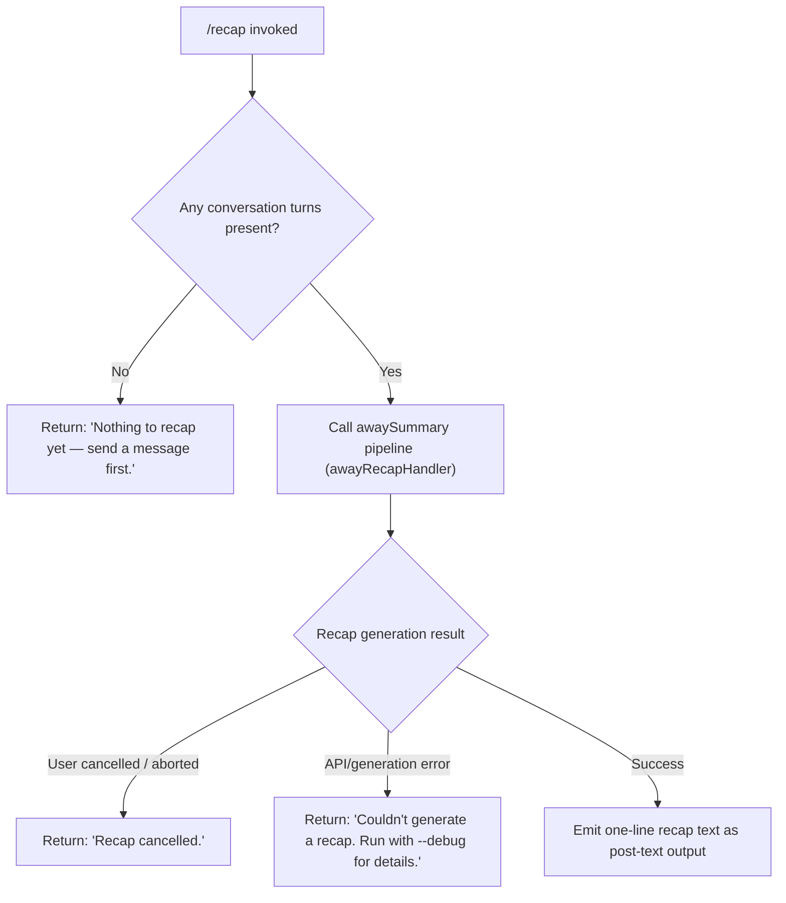

# `/recap`

> Analysis basis: CC v2.1.141 bundle.js (AST extraction + Claude interpretation)
> Minimum version: v2.1.141

---

## Overview

`/recap` is a local slash command that immediately triggers generation of a one-line session summary (the "away summary") for the current conversation. It delegates to the same `awaySummary` pipeline used for automatic background recaps, producing a compact textual description of what has happened so far in the session. If no conversation turns exist yet, it returns an early "nothing to recap" message instead of invoking the model.

---

## Registration

| Field | Value |
|---|---|
| type | `local` |
| name | `recap` |
| description | `Generate a one-line session recap now` |
| supportsNonInteractive | `false` |
| thinClientDispatch | `post-text` |
| load_inline | `true` |
| load_ident | `JR7` |
| loc_byte | `11809452` |
| loc_byte_end | `11809668` |
| loc_line | `7726` |
| arbor_handler.name | `JR7` |
| arbor_handler.fqn | `claude-2.1.141::JR7` |
| arbor_handler.kind | `AsyncFunction` |
| arbor_handler.resolution_path | `load_ident` |
| arbor_handler.n_hits | `0` |

Analysis basis: CC v2.1.141 bundle.js:+11809452

---

## Input Branching

The command exhibits four distinct outcome paths based on session and model-call state, so a Mermaid flowchart is used.



Analysis basis: CC v2.1.141 bundle.js:+11809202 (early-exit literal), +11809294 (cancel literal), +11809352 (error literal)

---

## Behavioral Spec

### Top-level handler (`JR7`)

The handler is an `AsyncFunction` inlined via `load_ident` resolution. It receives the command invocation context and proceeds as follows.

```
async function recapCommandHandler(context):
    // Early exit if no turns have been exchanged
    turns = getTurnsFromContext(context)
    if turns is empty or undefined:
        return earlyExitMessage("Nothing to recap yet — send a message first.")

    // Delegate to the away-summary generation pipeline
    result = await awayRecapOrchestrator(context)

    if result.status == "aborted" or result.status == "cancelled":
        return statusMessage("Recap cancelled.")

    if result.status == "api-error" or result.status == "failed":
        return statusMessage("Couldn't generate a recap. Run with --debug for details.")

    // Happy path: surface the one-line recap as post-text
    return postText(result.summaryLine)
```

Analysis basis: CC v2.1.141 bundle.js:+11809060 (`JR7` → `_18` call edge), +11809202, +11809294, +11809352

---

### Away-summary orchestrator (`_18` / `awayRecapOrchestrator`)

`_18` is the internal away-summary orchestrator reached from `JR7`. It checks whether cached `CacheSafeParams` are available before attempting model invocation.

```
async function awayRecapOrchestrator(context):
    params = loadCacheSafeParams(context)

    if params is null or missing:
        log("[awaySummary] no CacheSafeParams saved, skipping")
        return { status: "no-turn" }

    // Register abort listener so user cancellation propagates
    context.signal.addEventListener("abort", onAbort)

    // Run the actual query pipeline
    queryResult = await runQueryPipeline(params, context)

    // Collect and return final summary text
    return buildSummaryResult(queryResult)
```

Analysis basis: CC v2.1.141 bundle.js:+6574721 (`_18` → `_ZH`), +6574742 (log literal `"[awaySummary] no CacheSafeParams saved, skipping"`), +6574800 (`"no-turn"`), +6574837 (addEventListener), +6574856 (`"abort"`), +6574915 (`wZ` call)

---

### Away-summary guard / skip logic (`awaySkipGuard` / `N`)

Before issuing a model call for a background or on-demand recap, a guard function (`N`) evaluates several skip conditions. These same conditions apply when `/recap` is triggered manually via `wZ`.

```
function awaySkipGuard(context):
    if cacheAge is unknown:
        log("[awaySummary] skipped: cache age unknown")
        return { skip: true }

    if cacheAge / totalAge >= 0.9:   // cache considered stale
        log("[awaySummary] skipped: cache stale")
        return { skip: true }

    if rateLimitStatus != "allowed":
        log("[awaySummary] skipped: at or near rate limit")
        return { skip: true }

    if draftInputPresent:
        log("[awaySummary] skipped: draft input present")
        return { skip: true }

    return { skip: false }
```

Analysis basis: CC v2.1.141 bundle.js:+13304243 (cache age unknown literal), +13304312 (0.9 threshold), +13304319 (stale literal), +13304394 (`"allowed"`), +13304407 (rate-limit literal), +13304490 (draft input literal)

---

### Tool permission enforcement in away-summary context

The away-summary pipeline explicitly sets tool permissions to `"deny"` with a reason of `"Away summary cannot use tools"`, ensuring that the recap model call cannot invoke any tools.

```
function buildAwayPermissionContext():
    return {
        toolPermission: "deny",
        reason: "Away summary cannot use tools"
    }
```

Analysis basis: CC v2.1.141 bundle.js:+6575033 (`"deny"`), +6575048 (`"Away summary cannot use tools"`)

---

### Away-summary result classification

After the model call, the result is classified into terminal statuses that map back to the user-visible strings in `JR7`.

```
function classifyAwayResult(rawResult):
    switch rawResult.termination:
        case "aborted":      return { status: "aborted" }
        case "api-error":    return { status: "api-error" }
        case "failed":       return { status: "failed" }
        case "ok":
            emit telemetry("away_summary_generate")
            return { status: "ok", summaryLine: rawResult.text }
        default:
            return { status: "other" }
```

Analysis basis: CC v2.1.141 bundle.js:+6575101 (`"other"`), +6575116 (`"away_summary"`), +6575260 (`"aborted"`), +6575349 (`"api-error"`), +6575429 (`"failed"`), +13304712 (`"ok"`), +13304721 (`"away_summary_generate"`)

---

### Recap-result persistence (`recapWriter` / `MSH` → `M6A`)

Once a summary string is produced, it is written to the session record via an internal writer utility.

```
async function recapWriter(sessionPath, summaryText):
    serialized = JSON.stringify({ summary: summaryText })
    await sessionFileHandle.write(serialized)
```

Analysis basis: CC v2.1.141 bundle.js:+199031 (`MSH` call), +187042 (`M6A`), +186978 (`H.write`), +178983 (`JSON.stringify` in `SH`)

---

### Debug-level logging

When the `--debug` flag is active, the recap flow logs at `"debug"` severity at key decision points. This is the source of the "Run with --debug for details" hint in the error message.

Analysis basis: CC v2.1.141 bundle.js:+198860 (`"debug"` string literal in `v`)

---

## State & Side Effects

| Item | Detail |
|---|---|
| Telemetry — `away_summary_generate` | Fired on a successful recap generation (bundle.js:+13304721) |
| Telemetry — `generate_failed` | Fired when recap model call fails (bundle.js:+13304745) |
| Telemetry — `tengu_fork_agent_query` | Fired when a forked sub-agent query is dispatched within the pipeline (bundle.js:+5352951) |
| Telemetry — `tengu_forked_agent_default_turns_exceeded` | Fired if the sub-agent turn budget is exceeded (bundle.js:+5352508) |
| Telemetry — `tengu_query_error` | Fired on query-level errors within the underlying pipeline (bundle.js:+9144734) |
| Abort signal | `_18` registers an `"abort"` event listener on the AbortController signal; cancellation propagates to the model call (bundle.js:+6574837) |
| Tool permission override | Permission context is set to `"deny"` for the duration of the recap call, preventing any tool invocations (bundle.js:+6575033) |
| Session file write | Recap summary text is persisted to the session file via `M6A` / `H.write` (bundle.js:+186978) |
| appState changes | `setAppState` is called inside `Yw_` during the query pipeline; specific keys include `post_turn_summary`, `active_goal`, `set_in_progress_tool_use_ids` (bundle.js:+5348831, +5351789, +5351819, +5351843) |
| Output dispatch | `thinClientDispatch: "post-text"` — the recap result is emitted as a post-text message to the UI layer |
| Non-interactive support | `supportsNonInteractive: false` — `/recap` is only available in interactive sessions |

---

## Version History

| Version | Change |
|---|---|
| v2.1.141 | Initial analysis |

---

## Common Mistakes

1. **Running `/recap` before any messages**: The command will return `"Nothing to recap yet — send a message first."` immediately. At least one completed conversation turn is required before a recap can be generated.
2. **Expecting tool calls in the recap**: The away-summary pipeline explicitly denies all tool permissions. Any expectation that the recap will re-run tools or gather live data will not be met.
3. **Expecting output in non-interactive mode**: `supportsNonInteractive` is `false`, so `/recap` cannot be used in `--print` / pipe mode; it must be run in an interactive REPL session.
4. **Ignoring rate-limit skips**: If the session is near its rate limit (guard threshold evaluated against `"allowed"` status), the recap will be silently skipped rather than queued. Users who see no output should check whether a rate-limit condition is active.
5. **Stale-cache silent skips**: If the conversation cache is considered stale (age ratio ≥ 0.9), the orchestrator skips generation. Running `/recap` shortly after a very long idle period may therefore produce no output without a visible error.

---

## Appendix — Identifier Mapping

> For bundle debugging only. Identifiers change across versions.

| Identifier | Role |
|---|---|
| `JR7` | Top-level `/recap` command handler (AsyncFunction, resolved via `load_ident`) |
| `_18` | Away-summary orchestrator; validates CacheSafeParams, registers abort listener, drives the recap query |
| `_ZH` | CacheSafeParams loader / validator called by the orchestrator |
| `v` | Core query-dispatch function; handles debug logging, recap text formatting, and writer invocation |
| `J7K` | Query formatting / pre-processing helper |
| `Qt_` | Inner query helper called by `J7K` |
| `SH` | JSON serialisation utility (wraps `JSON.stringify`) |
| `t7` | Text post-processing / path manipulation helper |
| `T6A` | Mapping helper used within text post-processing |
| `MSH` | Recap-result writer dispatcher |
| `M6A` | Low-level session-file writer (calls `H.write`) |
| `X7K` | Session-log / append-file manager |
| `bhH` | Buffered output / debounce helper (uses `clearTimeout`, `setTimeout`, `setImmediate`) |
| `A_H` | Path-join and output assembly helper |
| `Cv8` | EISDIR-aware file-write helper |
| `y6A` | Path construction helper for log files |
| `k6A` | Log file rotation helper (stat, rename, unlink) |
| `P7K` | Append-and-rotate writer (mkdir, appendFile, rotate) |
| `b9` | In-progress tool-use ID tracker (uses `jI8` Set) |
| `wZ` | Main recap execution flow; coordinates skip-guard, sub-agent dispatch, and result assembly |
| `Yw_` | Agent query executor; calls `getAppState`, `getToolPermissionContext`, `setAppState` |
| `QN` | Abort-aware query runner |
| `S1H` | Conversation-state loader/dumper |
| `KOH` | Permission context builder for away-summary |
| `Mr9` | Model parameter assembler |
| `L` | Active-task tracking Set wrapper (add/delete/finally) |
| `uA8` | Token / usage accumulator |
| `um` | Random hex-byte generator (8 bytes → hex string) |
| `G` | Global session/config accessor |
| `rX6` | Session record getter |
| `gT8` | Session config getter |
| `We` | Sub-agent dispatch coordinator |
| `cL` | Sub-agent lifecycle manager |
| `NvH` | Message filter / classifier for sub-agent output |
| `lC` | Sub-agent turn runner (calls `B87`) |
| `B87` | Core agent query loop (model streaming, tool execution, compaction) |
| `lA8` | Sub-agent cache/state manager |
| `hH` | Feature-flag OK reporter (fires `tengu_feature_ok`) |
| `xH` | Feature-flag bad reporter (fires `tengu_feature_bad`) |
| `bA8` | Feature-flag presence checker |
| `$zH` | Progress/notification emitter |
| `UA8` | Tool-use summary builder |
| `D` | Background daemon / subprocess manager |
| `j6` | Daemon session registration helper |
| `$` | Disposable resource manager |
| `YG6` | macOS-specific memory-check helper |
| `_o_` | Background spare-process spawner (Bun.spawn) |
| `Q` | Base logger / error reporter |
| `kH` | Error classification and structured-log helper |
| `h$4` | Fork-agent telemetry reporter |
| `Y8` | Background session lifecycle manager |
| `j` | Worker/process pool manager |
| `w` | Individual worker lifecycle controller |
| `J` | Worker-set kill coordinator |
| `N` | Away-summary skip-guard evaluator |
| `nz1` | Recap result flat-mapper / post-processor |

---

Note: index built via Arbor fallback; some signals (telemetry, literals) may be missing — see arbor-fallback.js.