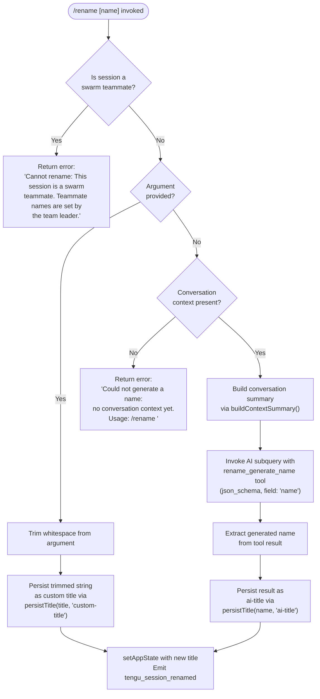

# `/rename`

> Analysis basis: CC v2.1.141 bundle.js (AST extraction + Claude interpretation)
> Minimum version: v2.1.141

---

## Overview

`/rename` (alias: `/name`) sets or regenerates the title of the current conversation. When called with an explicit name argument, it assigns that string immediately as a custom title. When called with no argument and conversation context already exists, it invokes an AI-powered name-generation subquery that produces a title via structured JSON output from the model, then persists the result. If no conversation context is available, it emits a descriptive error message.

---

## Registration

| Field | Value |
|---|---|
| type | `local-jsx` |
| name | `rename` |
| description | `Rename the current conversation` |
| argumentHint | `[name]` |
| immediate | `true` |
| aliases | `["name"]` |
| module_id | `bOq` |
| load_inline | `true` |
| loc_byte | `10933422` |
| loc_byte_end | `10933621` |
| loc_line | `6595` |
| arbor_handler.name | `OW7` |
| arbor_handler.fqn | `claude-2.1.141::OW7` |
| arbor_handler.kind | `AsyncFunction` |
| arbor_handler.resolution_path | `module_id` |
| arbor_handler.n_hits | `0` |

Analysis basis: CC v2.1.141 bundle.js:+10933422

---

## Input Branching

The command has four distinct execution paths depending on argument presence, swarm membership, and conversation state, so a flowchart is used.



---

## Behavioral Spec

### Top-Level Handler: `renameCommandHandler` (bundle ident: `OW7`)

Arbor resolves `OW7` as the `AsyncFunction` handler for the `rename` command via `module_id` resolution path.

```
async function renameCommandHandler(input, context):
    if context.isSwarmTeammate():
        return errorResult(
            "Cannot rename: This session is a swarm teammate. " +
            "Teammate names are set by the team leader."
        )

    trimmedArg = input.trim()

    if trimmedArg is not empty:
        persistTitle(trimmedArg, "custom-title")
        setAppState({ title: trimmedArg })
        emit tengu_session_renamed
        return success

    // No argument — attempt AI-generated name
    conversationMessages = getConversationContext()

    if conversationMessages is empty:
        return errorResult(
            "Could not generate a name: no conversation context yet. " +
            "Usage: /rename <name>"
        )

    summary = buildContextSummary(conversationMessages)
    generatedName = await invokeNameGenerationSubquery(summary)

    persistTitle(generatedName, "ai-title")
    setAppState({ title: generatedName })
    emit tengu_session_renamed
    return success
```

Analysis basis: CC v2.1.141 bundle.js:+10933113

---

### Swarm Guard: `swarmGuard` (bundle ident: `KJ8`)

Called immediately by `renameCommandHandler`. Checks whether the current session is operating as a swarm teammate node. If so, the rename operation is blocked entirely.

```
function swarmGuard(context):
    if context.isSwarmTeammate():
        return { blocked: true,
                 reason: "Cannot rename: This session is a swarm teammate..." }
    return { blocked: false }
```

Analysis basis: CC v2.1.141 bundle.js:+10932563

Error literal confirmed: `"Cannot rename: This session is a swarm teammate. Teammate names are set by the team leader."` (bundle.js:+10932583)

---

### Argument Trimming

When a name argument is present, whitespace is stripped via `H.trim` before any persistence step.

```
function normalizeArgument(raw):
    return raw.trim()
```

Analysis basis: CC v2.1.141 bundle.js:+10932688

---

### Context Summary Builder: `buildContextSummary` (bundle ident: `_J8`)

Filters and serializes the existing conversation turns into a compact representation suitable for the name-generation prompt. Uses only `"user"` and `"assistant"` role messages (bundle.js:+10929471, +10929488), strips meta messages (field `"isMeta"`, bundle.js:+10929512), excludes messages of origin `"human"` (bundle.js:+10929587), and concatenates the text content of `"text"` type blocks (bundle.js:+10929726).

```
function buildContextSummary(messages):
    filtered = []
    for message in messages:
        if message.role not in ["user", "assistant"]: continue
        if message.isMeta: continue
        if message.origin == "human": continue
        textBlocks = message.content
            .filter(block => block.type == "text")
            .map(block => block.text)
        filtered.push(textBlocks.join(""))
    return filtered.slice(0, MAX_CONTEXT_SLICE).join("\n")
```

Analysis basis: CC v2.1.141 bundle.js:+10929651 through +10929799

---

### AI Name Generation Subquery: `invokeNameGenerationSubquery` (bundle ident: `PaH`)

Dispatches a structured API call to the model. The tool name used in the subquery is `"rename_generate_name"` (bundle.js:+10931987), with output schema type `"json_schema"` (bundle.js:+10931843) and a field named `"name"` (bundle.js:+10931923). The subquery is handled by the main agent pipeline (`BN`) and returns an assistant message containing the tool result. The generated name is extracted and returned as a plain string.

```
async function invokeNameGenerationSubquery(contextSummary):
    toolSpec = {
        name: "rename_generate_name",
        schema_type: "json_schema",
        output_field: "name"
    }

    response = await runSubquery(
        messages = [contextSummary],
        tool = toolSpec,
        context = currentSessionContext()
    )

    assistantMessage = extractAssistantMessage(response)
    if assistantMessage is null:
        throw Error("No assistant message found")

    return assistantMessage.toolResult["name"]
```

Analysis basis: CC v2.1.141 bundle.js:+10931481, +10932089

No-context error literal confirmed: `"Could not generate a name: no conversation context yet. Usage: /rename <name>"` (bundle.js:+10932784)

---

### Title Persistence: `persistTitle` (bundle ident: `fvH` / `mKH`)

Writes the title string to the session store with a type tag of either `"custom-title"` or `"ai-title"`. Uses the logging pipeline (`_kH`) and emits `tengu_session_renamed` after a successful write. Both title-type values are literals found in the bundle:

- `"custom-title"` — bundle.js:+12015045
- `"ai-title"` — bundle.js:+12015210

```
function persistTitle(name, titleType):
    // titleType ∈ {"custom-title", "ai-title"}
    writeSessionLog(name, titleType)   // via logWriter (_kH)
    emitEvent(SG6, "tengu_session_renamed")
    updateInternalState(name)
```

Analysis basis: CC v2.1.141 bundle.js:+12015024, +12015194

---

### App State Update

After successful title persistence, `setAppState` is called to propagate the new name into the live UI/app layer.

```
function applyTitleToAppState(name):
    _.setAppState({ conversationTitle: name })
```

Analysis basis: CC v2.1.141 bundle.js:+10932923

---

### Agent Name Propagation (Swarm Context): `agentNameSet` (bundle ident: `mKH`)

In non-teammate swarm or named-agent contexts, after writing the title a separate event `tengu_agent_name_set` is fired and an `"agent-name"` label (bundle.js:+12017255) is also written via `kg_.emit`.

```
function propagateAgentName(name):
    writeToLog(name, "agent-name")
    kg_.emit("agent-name", name)
    emit tengu_agent_name_set
```

Analysis basis: CC v2.1.141 bundle.js:+12017334, +12017340, +12017353

---

## State & Side Effects

| Item | Detail |
|---|---|
| Telemetry: `tengu_session_renamed` | Fired on every successful rename (custom or AI-generated). bundle.js:+12015137 |
| Telemetry: `tengu_agent_name_set` | Fired when the agent's name label is updated in a swarm/named-agent context. bundle.js:+12017353 |
| Telemetry: `tengu_chair_sermon` | Fired within the context-summary / message-normalization pipeline. bundle.js:+9832602 |
| Telemetry: `tengu_off_switch_query` | Fired inside the AI subquery pipeline. bundle.js:+12242404 |
| Telemetry: `tengu_api_before_normalize` | API normalization start, during AI subquery. bundle.js:+12243930 |
| Telemetry: `tengu_api_after_normalize` | API normalization end, during AI subquery. bundle.js:+12244611 |
| Telemetry: `tengu_streaming_idle_timeout` | May fire if AI subquery stream stalls. bundle.js:+12249857 |
| Telemetry: `tengu_api_slow_first_byte` | May fire if AI subquery is slow. bundle.js:+12250640 |
| Telemetry: `tengu_streaming_stall` | Stream stall detection during subquery. bundle.js:+12254039 |
| Telemetry: `tengu_streaming_error` | Any streaming error in subquery. bundle.js:+12255290 |
| Telemetry: `tengu_max_tokens_reached` | If the name-generation subquery hits token limit. bundle.js:+12257755 |
| Telemetry: `tengu_stream_loop_exited_after_watchdog` | Watchdog exit in subquery. bundle.js:+12258667 |
| appState changes | `setAppState` is called with the new conversation title. bundle.js:+10932923 |
| Session log write | Title written to session log file with type tag `"custom-title"` or `"ai-title"`. bundle.js:+12015045, +12015210 |
| Event emission (`SG6.emit`) | Internal event bus updated on title change. bundle.js:+12015124 |
| Agent-name label (`kg_.emit`) | In named-agent/swarm contexts, the `"agent-name"` label is also propagated. bundle.js:+12017340 |
| Hook registration | <!-- TODO: not found in depth-2 traversal; needs --depth 4 --> |
| Sound | <!-- TODO: not found in depth-2 traversal; needs --depth 4 --> |

---

## Version History

| Version | Change |
|---|---|
| v2.1.141 | Initial analysis |

---

## Common Mistakes

1. **Invoking `/rename` before any messages exist** — If the conversation has no turns yet and no argument is provided, the command returns the error `"Could not generate a name: no conversation context yet. Usage: /rename <name>"`. Always supply an explicit name for brand-new sessions.
2. **Attempting to rename a swarm teammate session** — Swarm teammate nodes block all rename operations with a hard error. Only the team leader may set teammate names; attempting this from a teammate session will always fail.
3. **Trailing whitespace in the name argument** — The argument is trimmed before use, so leading/trailing whitespace is silently discarded. This is intentional but may cause confusion if a user believes spaces are part of the name.
4. **Expecting instant AI-generated names in long sessions** — The no-argument path triggers a full AI subquery that traverses the conversation history. In very long sessions this can be slow or trigger streaming-timeout telemetry events.
5. **Confusing `/rename` with `/name`** — Both are equivalent; `name` is a registered alias. Either form is accepted.

---

## Appendix — Identifier Mapping

> For bundle debugging only. Identifiers change across versions.

| Identifier | Role |
|---|---|
| `OW7` | Top-level async handler for `/rename` command (`renameCommandHandler`) |
| `KJ8` | Swarm-guard + main dispatch function after guard |
| `qJ8` | Input accessor / argument extraction helper |
| `_5` | Context/store accessor helper |
| `C2` | Store getter (calls `ci8.getStore`) |
| `PaH` | AI name-generation subquery orchestrator |
| `_J8` | Conversation context summary builder |
| `BN` | Agent subquery runner (main query pipeline entry) |
| `Sz8` | Conversation persistence / file I/O layer |
| `hz8` | Session hash/ID utility |
| `U0` | Message normalization pipeline |
| `_K7` | Token/content-block map helper |
| `N6` | Schema/type builder utility |
| `SH` | JSON serializer wrapper |
| `b6` | JSON parser wrapper |
| `me1` | Metadata enrichment helper |
| `M8` | Error code accessor |
| `RH` | String coercion utility |
| `Y8` | UUID + session-init helper |
| `gNH` | Assistant message extractor from subquery response |
| `Yh_` | Conversation push/accumulator helper |
| `Pyq` | Main API streaming query function |
| `LP` | API client builder |
| `WA` | Auth/credentials resolver |
| `UM` | User-model configuration accessor |
| `m1` | Model parameter builder |
| `nxH` | Network/transport helper |
| `w0` | Fallback/retry handler |
| `TK` | Message filter (filters by role) |
| `v` | Render / display helper |
| `J7K` | Display format dispatcher |
| `Qt_` | Terminal key handler |
| `t7` | Path/text transform helper |
| `T6A` | Map-over-display helper |
| `MSH` | Terminal write helper |
| `M6A` | Raw terminal writer |
| `X7K` | Output manager / stream coordinator |
| `bhH` | Buffered output flush helper |
| `A_H` | Path join / output path helper |
| `Cv8` | Error-code lookup |
| `y6A` | Path join helper |
| `k6A` | File stat / rename / unlink helper |
| `P7K` | File append / write with rotation |
| `b9` | State delta applier |
| `TH` | String coercion (String constructor wrapper) |
| `V6` | Void / no-op return helper |
| `fvH` | Title persistence facade (routes to `mKH`/`rHH`) |
| `vp` | Session-type discriminator |
| `Vf` | Path join with session-dir helper |
| `Rd` | Session directory resolver |
| `e8` | Environment variable accessor |
| `Rb` | Custom-title write path |
| `kk` | Session path builder |
| `_kH` | Low-level session log file writer |
| `cL` | Log-write coordinator |
| `Q` | Promise-queue / async serializer |
| `rHH` | AI-title write path |
| `yZ` | Timestamp/date helper |
| `xi` | Encoding helper |
| `M` | MCP/session-state manager |
| `SvH` | MCP client orchestrator |
| `$HH` | MCP tool-schema builder |
| `hI` | MCP server capability reader |
| `K` | Transport channel map |
| `__` | Identity / pass-through helper |
| `rX6` | Filter predicate builder |
| `xL7` | Date-based cache-key helper |
| `$78` | Object-key enumerator |
| `M78` | Auth-key accessor |
| `_8` | MCP debug logger |
| `Nh_` | MCP OAuth flow handler |
| `kh_` | MCP callback handler |
| `sHq` | MCP retry scheduler |
| `Ih_` | MCP tool-list accessor |
| `fG_` | Allowlist checker |
| `y` | Writable stream wrapper |
| `_7` | MCP error logger |
| `iHq` | MCP update-state helper |
| `oX6` | Integer parser (parseInt wrapper) |
| `oh_` | Integer parser variant |
| `Eeq` | MCP update applicator |
| `fY8` | MCP serialize helper |
| `sI` | MCP cleanup orchestrator |
| `$` | Connection-state getter |
| `XTq` | Connection-state timestamp helper |
| `XA5` | MCP filter/rebuild helper |
| `z78` | Tool-permission set checker |
| `a8` | Process/timeout manager |
| `irH` | Session hash verifier |
| `QHH` | Quiet-mode / headless helper |
| `mKH` | Agent-name label writer (fires `tengu_agent_name_set`) |
| `FB` | Session file batch writer |
| `Fq6` | File read/write with JSON parse helper |
| `V3` | CCR (remote job) helper |
| `njH` | Job-queue helper |
| `iY8` | Object-key iterator |
| `a3H` | File-system job orchestrator |
| `NK` | Job path builder |
| `G0` | Base job-directory path builder |
| `T0` | Basename extractor |
| `r1` | File read with cache helper |
| `$8` | Internal error wrapper |
| `d2` | Cache-entry delete helper |
| `df` | Atomic file-write helper |
| `QY` | Atomic write with random bytes |
| `kH` | Error logging with queue |
| `k_` | Error normalizer |
| `Vq` | Error formatter |
| `cMA` | Error string builder |
| `GvK` | Rolling error queue manager |

---

Note: index built via Arbor fallback; some signals (telemetry, literals) may be missing — see arbor-fallback.js.