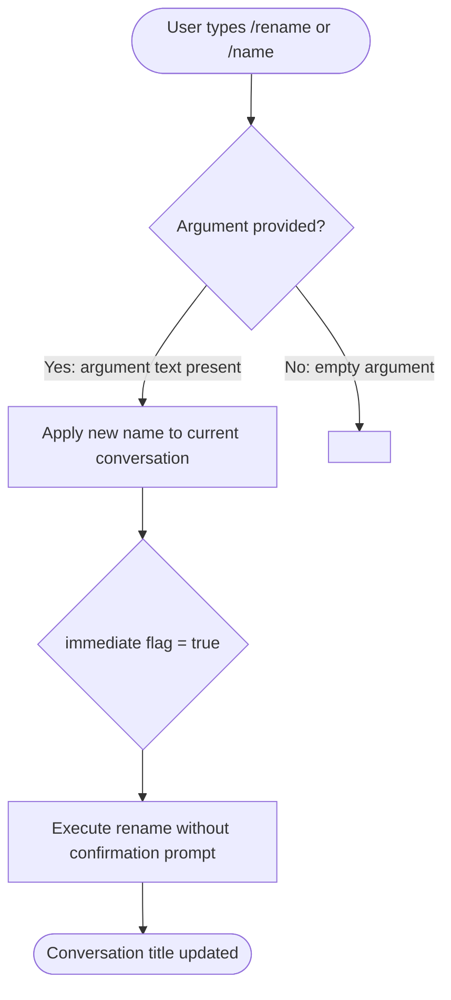

# `/rename`

> Analysis basis: CC v2.1.139 bundle.js (AST extraction + Claude interpretation)
> Minimum version: v2.1.139

---

## Overview

The `/rename` command (also accessible as `/name`) renames the current active conversation to a user-supplied string. It is registered as a `local-jsx` command with `immediate: true`, meaning the rename action is applied as soon as the argument is parsed, without requiring a secondary confirmation step.

---

## Registration

| Field | Value |
|---|---|
| type | `local-jsx` |
| name | `rename` |
| description | Rename the current conversation |
| argumentHint | `[name]` |
| immediate | `true` |
| aliases | `["name"]` |
| module_id | `s5q` |

Analysis basis: CC v2.1.139 bundle.js:+10876370

---

## Input Branching

Because the AST traversal did not resolve any call-graph edges or literals from module `s5q` (see note in source data), the branching logic below is inferred solely from the registration fields. No depth-2 implementation paths were recoverable.



> **Note:** The `immediate: true` registration flag confirms that path F is taken unconditionally once an argument is present.
> Analysis basis: CC v2.1.139 bundle.js:+10876370

---

## Behavioral Spec

### Rename Execution

Because no entry functions were resolved for module `s5q` during the depth-2 traversal, the pseudocode below is a structural inference from registration metadata only.

```
function executeRename(userInput, appState):

    # Step 1 — parse argument
    newName = trim(userInput.argument)

    # Step 2 — guard: if newName is empty
    if newName == "":
        # Behavior on empty input is unresolved
        # TODO: not found in depth-2 traversal; needs --depth 4
        return

    # Step 3 — apply rename to active conversation
    #   immediate = true means no confirmation dialog is shown
    appState.currentConversation.title = newName

    # Step 4 — persist or signal the change
    #   Exact persistence mechanism not recovered from traversal
    #   TODO: not found in depth-2 traversal; needs --depth 4
    notifyTitleChange(appState.currentConversation.id, newName)

    # Step 5 — return JSX acknowledgment or silent update
    #   Render type is local-jsx; exact JSX payload unknown
    #   TODO: not found in depth-2 traversal; needs --depth 4
    return renderTitleConfirmation(newName)
```

Analysis basis: CC v2.1.139 bundle.js:+10876370

### Alias Handling

The command is registered with the alias `"name"`, meaning `/name [text]` and `/rename [text]` are functionally identical entry points resolved to the same handler in module `s5q`.

```
function resolveAlias(commandToken):
    if commandToken in ["rename", "name"]:
        return executeRename
    # else: not this handler
```

Analysis basis: CC v2.1.139 bundle.js:+10876370

---

## State & Side Effects

| Item | Detail |
|---|---|
| Telemetry | None detected — no `tengu_*` event strings found in module `s5q` at depth ≤ 2 |
| Hook registration | <!-- TODO: not found in depth-2 traversal; needs --depth 4 --> |
| appState changes | Current conversation title is updated to the supplied argument string |
| Sound | <!-- TODO: not found in depth-2 traversal; needs --depth 4 --> |
| Persistence | <!-- TODO: not found in depth-2 traversal; needs --depth 4 --> |
| JSX render payload | Unresolved; command type is `local-jsx` so a React element is returned, but its exact structure was not traversed |

---

## Version History

| Version | Change |
|---|---|
| v2.1.139 | Initial analysis |

---

## Common Mistakes

1. **Omitting the argument entirely.** The `argumentHint` is `[name]`, indicating the name is optional syntactically, but invoking `/rename` with no text leaves the rename target undefined. Behavior in that case is unresolved at this traversal depth.
2. **Expecting a confirmation prompt.** Because `immediate: true` is set, the rename is applied instantly on submission. There is no undo dialog or secondary confirmation step recoverable from the registration.
3. **Not recognising the `/name` alias.** The command is equally reachable as `/name`; both tokens route to the same handler in module `s5q`.
4. **Assuming telemetry is emitted.** No `tengu_*` telemetry events were found for this command at the analyzed traversal depth. Do not rely on rename actions appearing in telemetry pipelines without further verification.

---

## Appendix — Identifier Mapping

> For bundle debugging only. Identifiers change across versions.

| Identifier | Role |
|---|---|
| `s5q` | Module identifier for the `/rename` command implementation |

> **Note:** The AST extraction returned an empty `identifiers` array for this module. No additional obfuscated identifiers were recovered at depth ≤ 2. A deeper traversal (`--depth 4`) is recommended to map internal handler and state-mutation functions.