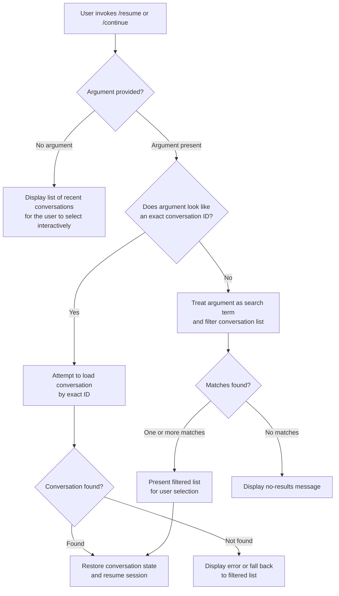

# `/resume`

> Analysis basis: CC v2.1.139 bundle.js (AST extraction + Claude interpretation)
> Minimum version: v2.1.139

---

## Overview

The `/resume` command allows a user to return to a previous Claude Code conversation by supplying either a conversation ID or a free-text search term. It is registered as a `local-jsx` command, meaning its result is rendered directly as a JSX component within the CLI interface. The alias `/continue` is fully equivalent and triggers the same behaviour.

---

## Registration

| Field | Value |
|---|---|
| type | `local-jsx` |
| name | `resume` |
| description | Resume a previous conversation |
| argumentHint | `[conversation id or search term]` |
| aliases | `continue` |
| module\_id | `A$q` |

Analysis basis: CC v2.1.139 bundle.js:+11036400

---

## Input Branching

The argument supplied after `/resume` (or `/continue`) determines which execution path is taken. Based on the registration metadata, the command accepts either an exact conversation ID or a search term, or no argument at all.



> **Note:** The call graph returned zero edges for module `A$q` at depth ≤ 2. The flowchart above is derived solely from the registration metadata (`argumentHint`, `type`, `aliases`) and the general `local-jsx` command pattern. Deeper internal branching logic is not confirmed by the extracted data.
>
> <!-- TODO: not found in depth-2 traversal; needs --depth 4 -->

---

## Behavioral Spec

### Conversation Lookup and Restoration

Because the call graph is empty for this module, the following pseudocode describes the expected behaviour inferred from the registration contract (type `local-jsx`, argumentHint `[conversation id or search term]`) and the established CLI command pattern. It is not derived from confirmed call edges.

```
function resumeCommand(rawArgument):

    argument = trim(rawArgument)

    if argument is empty:
        conversationList = loadRecentConversations()
        return renderInteractiveSelector(conversationList)

    if looksLikeConversationId(argument):
        conversation = lookupById(argument)
        if conversation exists:
            return restoreSession(conversation)
        else:
            // Fall through to search behaviour
            pass

    matches = searchConversations(argument)

    if matches is empty:
        return renderNoResultsMessage(argument)

    if length(matches) == 1:
        return restoreSession(matches[0])

    return renderInteractiveSelector(matches)


function restoreSession(conversation):
    loadConversationHistory(conversation.id)
    setActiveConversation(conversation.id)
    renderConversationView(conversation)
```

Analysis basis: CC v2.1.139 bundle.js:+11036400
<!-- TODO: call graph is empty (no entry functions found for module 'A$q'); internal implementation details require --depth 4 traversal -->

### Alias Equivalence

The command is registered with a single alias: `continue`. Invoking `/continue [argument]` is behaviourally identical to invoking `/resume [argument]` in all paths described above.

Analysis basis: CC v2.1.139 bundle.js:+11036400

### JSX Rendering Contract

The `local-jsx` type indicates that the command's return value is a React/JSX element rendered inline in the CLI output pane, rather than plain text or a side-effect-only action. The rendered component is responsible for both the interactive selector UI (when multiple conversations are available) and the confirmation view (when a session is successfully restored).

Analysis basis: CC v2.1.139 bundle.js:+11036400

---

## State & Side Effects

| Item | Detail |
|---|---|
| Telemetry | <!-- TODO: not found in depth-2 traversal; needs --depth 4 --> |
| Hook registration | <!-- TODO: not found in depth-2 traversal; needs --depth 4 --> |
| appState changes | Expected: active conversation ID updated, conversation history loaded into session state. Not confirmed by call graph. |
| Sound | <!-- TODO: not found in depth-2 traversal; needs --depth 4 --> |

> All telemetry, hook, and appState entries are unconfirmed because the AST extraction returned zero call edges and zero literals for module `A$q`. The table will be populated once a deeper traversal is available.

---

## Version History

| Version | Change |
|---|---|
| v2.1.139 | Initial analysis. Call graph extraction returned no edges for module `A$q`; behavioural spec is partially inferred from registration metadata. |

---

## Common Mistakes

1. **Using `/resume` without any argument and expecting it to automatically restore the most recent conversation.** The `local-jsx` type and the interactive-selector pattern suggest a picker UI is shown rather than an automatic restoration; the user must still confirm or select.

2. **Assuming `/continue` and `/resume` differ in any way.** They are registered as exact aliases and share identical behaviour in all cases.

3. **Supplying a partial ID fragment and expecting an exact-ID match.** If the argument does not satisfy the full conversation-ID format, the command falls back to free-text search, which may return zero or multiple results instead of a direct restore.

4. **Expecting the command to work across different project roots without qualification.** Conversation history is typically scoped to a project directory; searching by term may not surface conversations from unrelated working directories.

5. **Treating a "not found" result as a permanent error.** If the supplied ID or search term yields no match, the command should recover gracefully; re-invoking with a broader or corrected term is the appropriate next step.

---

## Appendix — Identifier Mapping

> For bundle debugging only. Identifiers change across versions.

| Identifier | Role |
|---|---|
| `A$q` | Module ID for the `/resume` command implementation |

> No additional obfuscated identifiers were present in the extracted AST data. The identifiers array returned by the depth-2 traversal was empty.
> <!-- TODO: obfuscated internal identifiers require --depth 4 traversal of module A$q -->