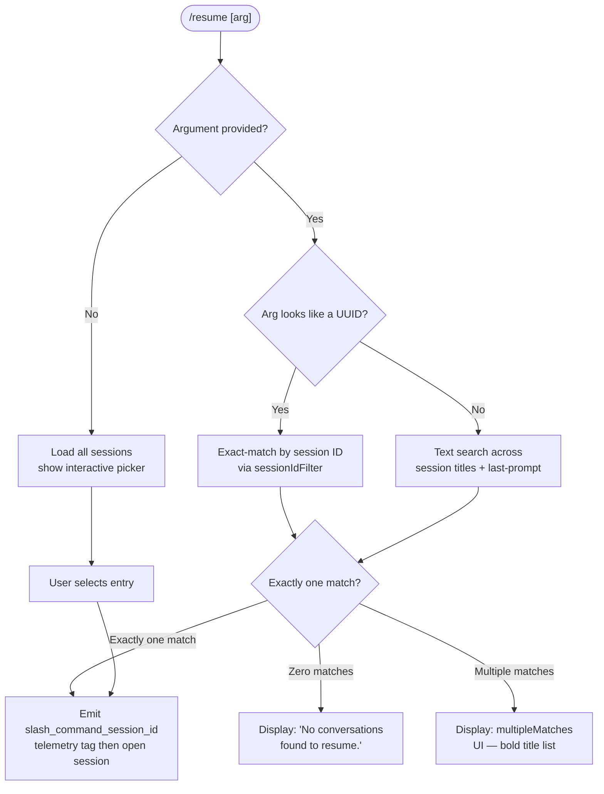

# `/resume`

> Analysis basis: CC v2.1.141 bundle.js (AST extraction + Claude interpretation)
> Minimum version: v2.1.141

---

## Overview

The `/resume` command (also accessible as `/continue`) allows the user to re-enter a previous conversation session by supplying a conversation ID or a free-text search term. It scans stored session transcripts, filters and ranks candidates, then opens the matched session as a resumed conversation context. If no argument is provided the command presents a list of recent sessions for the user to select from.

---

## Registration

| Field | Value |
|---|---|
| type | `local-jsx` |
| name | `resume` |
| description | `Resume a previous conversation` |
| aliases | `["continue"]` |
| argumentHint | `[conversation id or search term]` |
| module_id | `FDq` |
| load_inline | `true` |
| loc_byte | `11094802` |
| loc_byte_end | `11094999` |
| loc_line | `6634` |
| arbor_handler.name | `GT7` |
| arbor_handler.fqn | `claude-2.1.141::GT7` |
| arbor_handler.kind | `AsyncFunction` |
| arbor_handler.resolution_path | `module_id` |
| arbor_handler.n_hits | `0` |

Analysis basis: CC v2.1.141 bundle.js:+11094802

---

## Input Branching

Four distinct paths exist based on the argument string and the set of matching sessions found, warranting a Mermaid flowchart.



Analysis basis: CC v2.1.141 bundle.js:+11093613 (skip literal), +11093845 (no-match message), +11091039 (sessionNotFound literal), +11091110 (multipleMatches literal), +11094106 (slash_command_session_id literal)

---

## Behavioral Spec

### Top-level handler — `resumeCommandHandler` (GT7)

`GT7` is an `AsyncFunction` resolved by Arbor via the `module_id` path (`FDq → GT7`).

```
async function resumeCommandHandler(commandInput, appContext):
    sessions = loadAllSessions()           // calls sessionLoader (pNH)
    filteredSessions = sessions.filter(    // BDq filter step
        s => sessionIsVisible(s)           // iM predicate
    )

    arg = commandInput.trim()

    if arg is empty:
        return renderSessionPicker(filteredSessions, appContext)

    isUuid = uuidPattern.test(arg)         // mn / N$4.test

    if isUuid:
        candidates = filteredSessions.filter(s => s.id === arg)
    else:
        candidates = searchSessions(filteredSessions, arg)  // UQ

    if candidates.length === 0:
        return renderErrorMessage("No conversations found to resume.")
        // literal @ bundle.js:+11093845

    if candidates.length > 1:
        return renderMultipleMatchesUI(candidates)
        // multipleMatches literal @ bundle.js:+11091110

    // Exactly one match
    session = candidates[0]
    emitTag("slash_command_session_id", session.id)
    // literal @ bundle.js:+11094106
    emitTag("slash_command_title", session.title)
    // literal @ bundle.js:+11094330

    jsxElement = createElement(ResumeView, {
        session: session,
        timestamp: Date.now(),
    })
    // $D.createElement call @ bundle.js:+11093696, Date.now @ +11093722

    return jsxElement
```

Analysis basis: CC v2.1.141 bundle.js:+11093595 (GT7→H), +11093631 (GT7→kH), +11093660 (GT7→TH), +11093696, +11093722, +11093946 (GT7→mn), +11093964, +11093978, +11094072, +11094084

---

### Session loading — `sessionLoader` (pNH)

```
async function sessionLoader(appState):
    timestamp = Date.now()
    // @ bundle.js:+11090351

    worktreeList = runGit(["worktree", "list", "--porcelain"])
    // literals @ bundle.js:+11090395, +11090406, +11090413
    // telemetry: tengu_worktree_detection @ +11090495

    worktreePaths = parseWorktreeOutput(worktreeList)
    // strips "worktree " prefix (9 chars) @ +11090614, +11090645
    // normalises using NFC @ +11090658

    allSessions = loadSessionIndex()        // M_ → jXH chain

    if arg.startsWith("worktree "):         // +11090601
        arg = arg.slice(9)                  // +11090637

    match = allSessions.find(s =>
        s.path.startsWith(worktreePath)     // +11090772
    )

    candidates = allSessions
        .filter(s => matchesTerm(s, arg))   // +11090799
        .sort((a, b) =>
            a.title.localeCompare(b.title)  // +11090832
        )

    return candidates
```

Analysis basis: CC v2.1.141 bundle.js:+11090351–11090832

---

### Session index / transcript store — `sessionIndexLoader` (M_)

`M_` orchestrates loading the on-disk transcript store via the `jXH` sub-system (a child-process / IPC layer) and then delegates to the session daemon dispatcher `D`.

```
function sessionIndexLoader(options):
    handle = openTranscriptSession(jXH, options)
    // jXH call @ bundle.js:+1026419

    result = daemonDispatcher(handle)
    // D call @ bundle.js:+1026556

    if result is error:
        logError(kH)                         // +1026735

    return formatSessionList(lkK, result)
    // lkK coerces entries to String @ +1026612, +1026187
    // max queue depth: 10 @ +1026238
    // max token budget: 1 000 000 @ +1026380
```

Analysis basis: CC v2.1.141 bundle.js:+1026419, +1026556, +1026612, +1026735, +1026238, +1026380

---

### Candidate search — `searchSessions` (UQ)

```
function searchSessions(sessions, term):
    lowerTerm = term.toLowerCase()           // +12020422

    scored = sessions
        .filter(s => s.title.includes(lowerTerm)
                  || s.lastPrompt.includes(lowerTerm))
        // D.includes check @ +12020547

    // Deduplicate by session identity
    seen = new Map()                         // O.get/set @ +12020613, +12020651
    unique = Array.from(seen.values())       // +12020669, +12020680

    sorted = unique
        .sort(byTimestampDescending)         // z.sort @ +12020695
        .slice(0, MAX_RESULTS)              // z.slice @ +12020761

    return sorted
```

Analysis basis: CC v2.1.141 bundle.js:+12020362–12020761

---

### JSX rendering — `ResumeResultComponent` (tqH / QJ8 / bG6 chain)

`GT7` calls `QJ8` (bundle.js:+11093785), which calls `bG6` (bundle.js:+12032308), which builds the conversational file tree view and calls `YNq` (the project listing helper). The component assembles JSX via `$D.createElement`.

```
function renderResumeResult(session, fileContext):
    projectPaths = buildProjectList(YNq, session)
    // YNq: reads dir with GL.readdir @ +12033282
    //      performs realpath resolution @ +12033997
    //      flattens nested groups @ +12034079, +12034095

    conversationLabel = formatLabel(session.title, session.id)
    // joins with ", " @ +12032421
    // adds "(session)" suffix for background sessions @ literal +12044840

    return createElement(ConversationRow, {
        label: conversationLabel,
        paths: projectPaths,
        boldTitle: M6.bold(session.title),  // pDq → M6.bold @ +11091074
    })
```

Analysis basis: CC v2.1.141 bundle.js:+11093785, +12032308, +12032414, +12032421, +12033282, +12033997, +11091074

---

### UUID detection — `uuidValidator` (mn)

```
function isUuid(str):
    return N$4.test(str)   // regex test @ bundle.js:+5346206
```

Analysis basis: CC v2.1.141 bundle.js:+11093946, +5346206

---

### Error / no-match path (kH / sqH)

When zero candidates are found the handler returns a styled error component. The string `"No conversations found to resume."` is rendered directly (bundle.js:+11093845). The `kH` helper provides logging (`Oc.logError` @ +951053). For the `sessionNotFound` case the literal key `"sessionNotFound"` is emitted (bundle.js:+11091039).

Analysis basis: CC v2.1.141 bundle.js:+11093845, +11091039, +951053

---

## State & Side Effects

| Item | Detail |
|---|---|
| Telemetry — `tengu_worktree_detection` | Fired during session loading when git worktree list is parsed (bundle.js:+11090495) |
| Telemetry — `tengu_bg_spare_*` | Background-spare lifecycle events fired by the daemon dispatcher reached via `M_→D` (bundle.js:+14464520, +14464880) |
| Telemetry — `tengu_transcript_phantom_parent` | Fired when a transcript entry references a non-existent parent UUID during chain reconstruction (bundle.js:+12025041) |
| Telemetry — `tengu_chain_parent_cycle` | Fired when a circular parent reference is detected in the message chain (bundle.js:+12008147) |
| Telemetry — `tengu_chain_timestamp_fallback` | Fired when timestamp ordering must fall back to insertion order (bundle.js:+12008296) |
| Telemetry — `tengu_relink_walk_broken` | Fired when the walk phase of transcript relinking encounters a broken link (bundle.js:+12007657) |
| Tag emission — `slash_command_session_id` | String tag written to app state identifying the resumed session (bundle.js:+11094106) |
| Tag emission — `slash_command_title` | String tag written to app state with the session's display title (bundle.js:+11094330) |
| JSX element creation | `$D.createElement` called to produce the resume UI component (bundle.js:+11093696) |
| Git subprocess | `git worktree list --porcelain` invoked to enumerate worktrees (bundle.js:+11090395–11090413) |
| File I/O | `GL.readdir` / `GL.realpath` / `GL.stat` called during project-path resolution within the result renderer (bundle.js:+12033282, +12033997, +12027768) |
| Hook registration | <!-- TODO: not found in depth-2 traversal; needs --depth 4 --> |
| appState changes | Session context updated when a single match is confirmed; picker state updated in multi-match or zero-match cases |
| Sound | <!-- TODO: not found in depth-2 traversal; needs --depth 4 --> |

---

## Version History

| Version | Change |
|---|---|
| v2.1.141 | Initial analysis |

---

## Common Mistakes

1. **Providing a partial UUID** — the UUID validator (`mn` / `N$4.test`) uses a strict regex. A truncated ID will be treated as a plain text search term, potentially producing unexpected multiple-match results rather than an exact lookup.
2. **Expecting cross-worktree results without a prefix** — the session loader strips the `"worktree "` prefix (9 characters) only when the argument explicitly starts with that string; bare path segments will fall through to text search, which may miss worktree-scoped sessions.
3. **Using `/resume` with no argument in a non-interactive pipe** — the interactive session picker rendered in the zero-argument branch requires a TTY; scripted invocations should always supply an explicit session ID.
4. **Relying on alphabetical ordering** — the default sort for multiple matches is by `localeCompare` on the title (bundle.js:+11090832), not by recency. Pass a specific ID to guarantee the correct session is opened.
5. **Confusing `/continue` alias behaviour** — `/continue` is a registered alias that resolves to the same handler (`GT7`); it carries identical semantics and limitations, not a "continue current session" shortcut.

---

## Appendix — Identifier Mapping

> For bundle debugging only. Identifiers change across versions.

| Identifier | Role |
|---|---|
| `GT7` | Main async handler for `/resume` (`resumeCommandHandler`) |
| `BDq` | Top-level session filter wrapper called from handler entry |
| `iM` | Session visibility predicate (filters hidden/invalid sessions) |
| `pNH` | Session loader — runs git worktree detection and parses session list |
| `M_` | Session index loader — orchestrates transcript store access |
| `jXH` | Child-process / IPC transport layer for transcript store access |
| `kH` | Error logging helper with `Oc.logError` |
| `k_` | Low-level error constructor utility |
| `RH` | String coercion helper used in error/ID formatting |
| `Vq` | Sub-helper called from `kH` during error handling |
| `cMA` | Calls `RH` as part of error formatting chain |
| `GvK` | Queue manager (shift/push on `kS6`) used inside `kH` |
| `TH` | String normalisation helper (used in handler and session renderer) |
| `lkK` | Session list string formatter; coerces entries to String |
| `D` | Daemon dispatcher — routes requests to background session daemon |
| `j6` | Module-cache / registry lookup used by daemon dispatcher |
| `YG6` | Platform memory / resource reporter (`macos` branch, 1 024 MB threshold) |
| `_o_` | Background spare PTY host spawner (`Bun.spawn`, `--bg-pty-host`) |
| `Q` | Shared async-queue / promise utility |
| `UQ` | Candidate search function — filters and ranks sessions by text term |
| `QJ8` | JSX component entry for resume result view |
| `bG6` | Conversation row builder; calls `YNq` and `AkH` |
| `YNq` | Project-path listing helper (readdir, realpath, stat) |
| `AkH` | Buffer/row assembler for conversation display |
| `Rx7` | Sub-renderer used inside `AkH` |
| `mn` | UUID validator — wraps `N$4.test` regex |
| `tqH` | Transcript chain accessor — retrieves messages from indexed store |
| `EHH` | Transcript indexer — reads, parses, and writes session file entries |
| `sqH` | Session chain builder — orders messages, detects cycles |
| `zx7` | Message tree sorter / parallel-branch resolver |
| `Mx7` | Message queue orderer (shift/push/sort) |
| `fNq` | Forward-index helper for message lookup |
| `Ox7` | NaN-guard / value validator for chain ordering |
| `wJ6` | Session workspace resolver — maps sessions to on-disk workspaces |
| `zNq` | Workspace entry constructor calling `EHH` and `Vx7` |
| `Vx7` | File-stat based session validator |
| `UG` | Directory walker for slash-command context resolution |
| `Dg_` | Compound message formatter (calls `Ig_`, `AnH`, `Ng_`) |
| `Ig_` | Text content normaliser / replaceAll helper |
| `AnH` | Message-array mapper |
| `Ng_` | Message filter — checks image/document attachment types |
| `Yx7` | Array/scalar normaliser with `.trim()` and `.some()` |
| `Dx7` | Array-type guard helper |
| `CX8` | Cache-get/set helper for conversation entries |
| `bX8` | `Array.from` + values extractor for session maps |
| `RX8` | Date.parse wrapper for session timestamp parsing |
| `dvq` | Delta-view accumulator for incremental transcript updates |
| `fx7` | Walk-phase helper for transcript relinking |
| `Ex7` | Binary transcript file reader (openSync / readSync / closeSync) |
| `Zx7` | Lightweight synchronous file reader used during init |
| `Tx7` | Buffer-based transcript parser (indexOf / compare / concat) |
| `ZXH` | Transcript encoding handler (BOM detection, JSON parsing) |
| `yyK` | BOM-strip and line-split helper |
| `SyK` | JSON-line parser with indexOf boundary detection |
| `hyK` | Alternate JSON-line parser (toString / JSON.parse) |
| `kyK` | Encoding selector called by `ZXH` |
| `ob7` | Map entry initialiser inside transcript indexer |
| `VP` | Value propagator / setter used across transcript maps |
| `SvH` | MCP server configuration enumerator |
| `Eeq` | MCP update applicator (`applyMcpUpdate`) |
| `XA5` | MCP client registry builder |
| `SLH` | UI layout helper called from handler |
| `pDq` | Bold-title renderer (`M6.bold`) |
| `w6A` | Markdown/text token walker (Array.isArray, pop, push, Object.keys) |
| `z6A` | Token sub-classifier (`L7K.test` regex) |
| `Y6A` | Token replacement helper (`O6A`, H.replace) |
| `MSH` | Message structure helper (`M6A`) |
| `X7K` | File-context resolver (dirname, stat, Buffer.byteLength) |
| `tO` | Path normaliser (replace, slice, `HNK`) |
| `v` | Core message formatter / role-to-string converter |
| `J7K` | Message type dispatcher |
| `SH` | JSON.stringify wrapper |
| `t7` | Text truncation / redaction helper (`[REDACTED]` literal) |
| `xv` | Extended value formatter |
| `dQ` | Projects-dir path joiner (`_$.join`, `"projects"` literal) |
| `W` | Debounced skills emitter (`"skills"` literal, clearTimeout/setTimeout) |
| `K` | Column padder (`f.padEnd`, `"  "` literal) |
| `PJH` | Conversation-row list builder (slice, push, forEach) |
| `Jg_` | Recursive directory walker for file context (readdir, isDirectory) |
| `IG6` | Nested-map get/set/values helper |
| `__` | Identity / passthrough wrapper |
| `eOA` | Sub-transport opener (QkK, s$A, unshift) |
| `sx8` | Transport variant A (`dOA`) |
| `tx8` | Transport variant B (`dOA`, `pkK`) |
| `Hu8` | Transport variant C (`FkK`) |
| `MOA` | Finite-number validator |
| `CA6` | Session creation validator (`AkK`, Boolean) |
| `ax8` | Reflect.apply / defineProperty wrapper |
| `pOA` | Event-listener registration (`H.on`, exit) |
| `fOA` | Timeout race helper (Promise.race, clearTimeout) |
| `$OA` | Process kill wrapper (`H.kill`, Dc) |
| `KOA` | Stdio data handler (`MkK`) |
| `LOA` | SIGTERM kill handler |
| `uOA` | Promise.all fanout helper |
| `mA6` | Result aggregator (`Sx8`) |
| `bOA` | Pipe setup helper (`CkK`, `eS6`, `A.pipe`) |
| `xOA` | Stream add helper (`SOA.default`, `A.add`) |
| `DOA` | Stream bind helper (`Fx8.bind`) |
| `Mo_` | Session teardown / cleanup orchestrator |
| `Ao_` | PTY connection initiator (`sT8.connect`, `f.on`, `f.write`) |
| `w` | Background session manager (get/set/kill, `kH`) |
| `S` | Focus/blur timer manager (`blurred`/`focused`, 3 600 000 ms threshold) |
| `xH` | Focus-state telemetry emitter (`tengu_feature_ok`) |
| `hH` | Blur-state telemetry emitter (`tengu_feature_bad`) |
| `u` | Write-stream with clearTimeout |
| `oR` | WebSocket connection factory (`ws`, `firstParty`) |
| `Kx` | Graceful-shutdown race (Promise.race/all, process.exit) |
| `z` | Daemon stop/yield coordinator |
| `O` | Background-session state holder (`b8`) |
| `F` | Tool-use filter (`B6.filter`, `gH.has`) |
| `B6` | Key-event handler (`CH.preventDefault`) |
| `gH` | Orphaned-permission checker |
| `M` | MCP composite manager (`SvH`, `Eeq`, `L.get`) |
| `c` | Permission-layer resolver (`w`, `l`) |
| `d` | Checkpoint / file-history manager (`l26`, `cLq`) |
| `l26` | File-read helper (`mb.readFile`, `DwH`) |
| `cLq` | File-unlink helper (`mb.unlink`, `DwH`) |
| `h` | Unknown sub-helper reached from `EHH` |
| `x9` | `M8` wrapper (small utility) |
| `p` | UI event object / prevent-default helper |
| `r` | Voice recording session manager (recording, WebSocket, Buffer) |
| `qH` | Focus-silence timeout ref holder |
| `t` | Recording toggle ref holder |
| `e` | Max-duration cap ref holder |
| `a` | Voice-stream set manager |
| `OH` | Voice-stream compositor |
| `N` | Away-summary generator |
| `y` | Transient write stream |
| `fH` | Chunked read-stream / enqueue helper |
| `Gx7` | Buffer compare utility |
| `ONq` | Buffer `.at()` accessor |
| `b6` | JSON.parse wrapper |
| `l` | Filtered-results holder |

---

Note: index built via Arbor fallback; some signals (telemetry, literals) may be missing — see arbor-fallback.js.