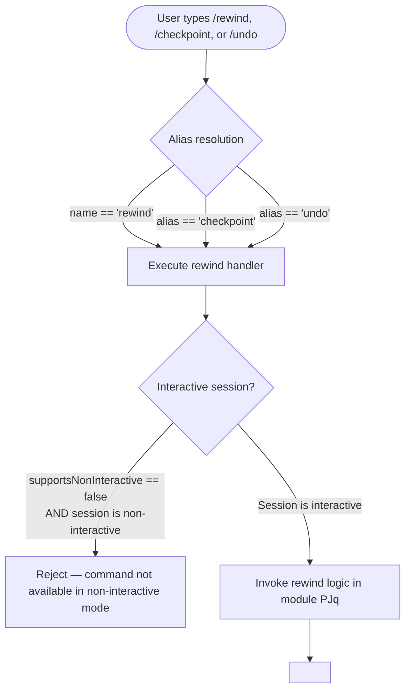

# `/rewind`

> Analysis basis: CC v2.1.139 bundle.js (AST extraction + Claude interpretation)
> Minimum version: v2.1.139

---

## Overview

`/rewind` allows the user to restore the conversation state and/or working code to a previous checkpoint. It is registered as a `local` slash command and is also accessible via the aliases `/checkpoint` and `/undo`. The command's internal implementation module (`PJq`) yielded no traversable entry functions at depth ≤ 2, so all behavioral details below are derived exclusively from the registration record.

---

## Registration

| Field | Value |
|---|---|
| type | `local` |
| name | `rewind` |
| description | `Restore the code and/or conversation to a previous point` |
| argumentHint | *(empty string — no argument hint displayed)* |
| supportsNonInteractive | `false` |
| aliases | `checkpoint`, `undo` |
| module\_id | `PJq` |

Analysis basis: CC v2.1.139 bundle.js:+11387092

---

## Input Branching

Because no entry functions were recovered at depth ≤ 2 from module `PJq`, a complete control-flow graph cannot be constructed from verified data. The registration record alone establishes the following top-level dispatch shape:



Analysis basis: CC v2.1.139 bundle.js:+11387092

---

## Behavioral Spec

### Alias Resolution

All three surface names (`rewind`, `checkpoint`, `undo`) map to the same handler in module `PJq`. No argument hint is defined, which means the CLI does not prompt or validate any positional argument text supplied by the user.

```
function resolveRewindCommand(userInput):
    canonicalName = "rewind"
    acceptedNames = [canonicalName, "checkpoint", "undo"]

    if userInput.commandName not in acceptedNames:
        return NO_MATCH

    return dispatchToModule("PJq", userInput.args)
```

Analysis basis: CC v2.1.139 bundle.js:+11387092

### Non-Interactive Guard

`supportsNonInteractive` is `false`. The CLI's command dispatcher uses this flag to gate execution when Claude Code is invoked in a headless or piped context.

```
function guardInteractivity(sessionContext, command):
    if command.supportsNonInteractive == false
       AND sessionContext.isNonInteractive == true:
        raise CommandUnavailableError(
            command = "rewind",
            reason  = "requires an interactive session"
        )
    // otherwise continue to handler
```

Analysis basis: CC v2.1.139 bundle.js:+11387092

### Core Rewind Logic

<!-- TODO: not found in depth-2 traversal; needs --depth 4 -->

The implementation module `PJq` exported no traversable entry functions within the extraction depth limit. The description string ("Restore the code and/or conversation to a previous point") implies a checkpoint-restore mechanism that may operate on conversation message history, in-memory file state, or both, but these sub-behaviors cannot be stated as verified facts from the current dataset.

---

## State & Side Effects

| Item | Detail |
|---|---|
| Telemetry | None found at depth ≤ 2 (`telemetry: []`) |
| Hook registration | <!-- TODO: not found in depth-2 traversal; needs --depth 4 --> |
| appState changes | <!-- TODO: not found in depth-2 traversal; needs --depth 4 --> |
| Sound | <!-- TODO: not found in depth-2 traversal; needs --depth 4 --> |
| Non-interactive support | `false` — command is silently or explicitly rejected outside interactive sessions |
| Argument validation | No `argumentHint` defined; argument handling behavior unknown at current traversal depth |

Analysis basis: CC v2.1.139 bundle.js:+11387092

---

## Version History

| Version | Change |
|---|---|
| v2.1.139 | Initial analysis — registration confirmed; implementation internals require deeper traversal |

---

## Common Mistakes

1. **Using `/rewind` in a non-interactive script** — `supportsNonInteractive` is `false`, so any headless or piped invocation will not execute the command. Use only within an active interactive Claude Code session.
2. **Assuming `/checkpoint` and `/undo` behave differently from `/rewind`** — all three names are aliases that resolve to the identical handler in module `PJq`; there is no behavioral distinction between them.
3. **Supplying positional arguments and expecting them to be validated** — no `argumentHint` is registered, so the CLI does not define or document an argument schema. Whether the handler consumes, ignores, or errors on extra arguments is <!-- TODO: not found in depth-2 traversal; needs --depth 4 -->.
4. **Expecting telemetry confirmation of the rewind action** — no `tengu_*` telemetry events were found at depth ≤ 2; do not rely on telemetry signals to confirm that a rewind was applied.

---

## Appendix — Identifier Mapping

> For bundle debugging only. Identifiers change across versions.

| Identifier | Role |
|---|---|
| `PJq` | Module ID for the `/rewind` command implementation (not an obfuscated function name, but included for debugging reference) |

*No obfuscated function identifiers were returned in the `identifiers` array for this extraction run. The note field confirms: "no entry functions found for module 'PJq'".*

Analysis basis: CC v2.1.139 bundle.js:+11387092