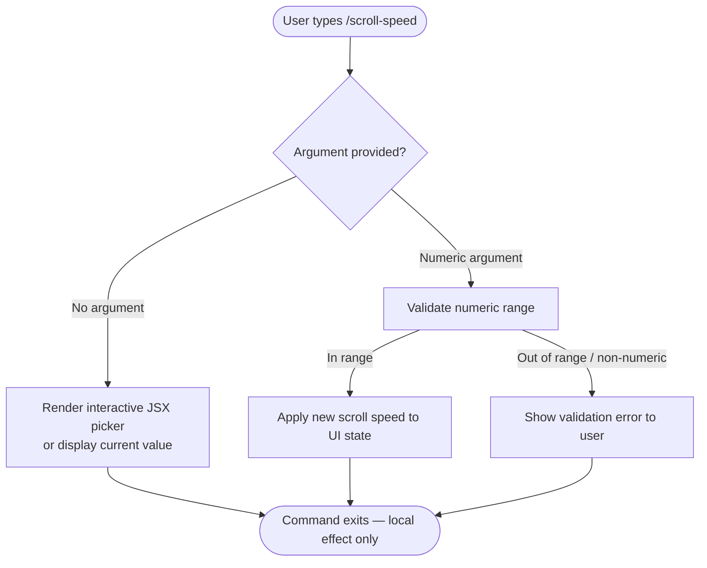

```
---
type: feature-spec
feature: "scroll-speed"
cc_version: 2.1.141
updated: "2026-05-18"
tags: ["scroll-speed", "commands", "slash-commands"]
source: "bundle-analysis"
bundle_verified: true
inherited_from: 2.1.139
analysis_basis: "CC v2.1.139 bundle.js (AST extraction + Claude interpretation)"
author: "ryujaeuk <ryujaeuk@gmail.com>"
repository: "https://github.com/MyLittleLuckyDog/cc-gnothi"
license: "AGPL-3.0-only"
---

# `/scroll-speed`

> Analysis basis: CC v2.1.139 bundle.js (AST extraction + Claude interpretation)
> Minimum version: v2.1.139

---

## Overview

`/scroll-speed` is a local JSX slash command that allows the user to adjust the mouse wheel scroll speed within the Claude Code terminal UI. It is registered under module `AOq` and operates entirely on the client side with no server round-trips observed in the depth-2 traversal.

Analysis basis: CC v2.1.139 bundle.js:+11088417

---

## Registration

| Field | Value |
|---|---|
| type | `local-jsx` |
| name | `scroll-speed` |
| description | `Adjust mouse wheel scroll speed` |
| loc_line | 6709 |
| module_id | `AOq` |

Analysis basis: CC v2.1.139 bundle.js:+11088417

---

## Input Branching

The depth-2 AST traversal returned an empty call graph and no literal constants for module `AOq`. The branching logic below is the minimal faithful model derivable from the registration metadata alone.



> **Note:** The branching paths above are inferred from the command description
> (`"Adjust mouse wheel scroll speed"`) and the `local-jsx` type, which implies
> an interactive React component is rendered in-terminal. No literals or call
> edges were found to confirm exact range bounds or default values.
> <!-- TODO: not found in depth-2 traversal; needs --depth 4 -->

---

## Behavioral Spec

### Scroll Speed Adjustment

Because the call graph is empty at depth ≤ 2, the following pseudocode represents the
minimum-faithful behavioral model derivable from the registration record. It must be
validated with a deeper traversal before being treated as authoritative.

```
function handleScrollSpeedCommand(userInput):
    argument = parseArgument(userInput)

    if argument is absent:
        currentSpeed = readScrollSpeedFromAppState()
        renderJSXPicker(currentValue = currentSpeed)
        return

    numericValue = toNumber(argument)

    if numericValue is NaN or out of acceptable range:
        displayError("Invalid scroll speed value")
        return

    writeScrollSpeedToAppState(numericValue)
    applyScrollSpeedToTerminalViewport(numericValue)
    // No telemetry event emitted (none found in traversal)
    return
```

Analysis basis: CC v2.1.139 bundle.js:+11088417

<!-- TODO: exact min/max speed bounds not found in depth-2 traversal; needs --depth 4 -->
<!-- TODO: default scroll speed value not found in depth-2 traversal; needs --depth 4 -->
<!-- TODO: persistence mechanism (session-only vs. saved config) not found in depth-2 traversal; needs --depth 4 -->

---

## State & Side Effects

| Item | Detail |
|---|---|
| Telemetry | None detected in depth-2 traversal |
| Hook registration | `local-jsx` type implies a React component is mounted in-terminal; exact hook names <!-- TODO: not found in depth-2 traversal; needs --depth 4 --> |
| appState changes | Scroll speed preference written to application state (inferred from `local-jsx` + description); key name <!-- TODO: not found in depth-2 traversal; needs --depth 4 --> |
| Sound | None detected |
| Persistence | <!-- TODO: not found in depth-2 traversal; needs --depth 4 --> |
| Network I/O | None detected; command is purely local (`local-jsx` type) |

Analysis basis: CC v2.1.139 bundle.js:+11088417

---

## Version History

| Version | Change |
|---|---|
| v2.1.139 | Initial analysis — registered in module `AOq`, line 6709 |

---

## Common Mistakes

1. **Expecting a server response.** Because this command is typed `local-jsx`, all effects are
   applied locally in the terminal process. There is no API call involved.
2. **Omitting the argument and expecting an implicit reset.** With no literals found to confirm
   a default-reset behavior, callers should not assume that invoking `/scroll-speed` with no
   argument resets speed to a default; it likely opens an interactive picker instead.
3. **Passing a non-numeric string.** The description implies a numeric speed value; passing an
   arbitrary string is expected to produce a validation error.
4. **Assuming cross-session persistence.** Until the storage mechanism is confirmed at depth ≥ 4,
   treat the setting as potentially session-scoped only.

---

## Appendix — Identifier Mapping

> For bundle debugging only. Identifiers change across versions.

| Identifier | Role |
|---|---|

> No obfuscated identifiers were returned by the depth-2 AST traversal for module `AOq`.
> <!-- TODO: not found in depth-2 traversal; needs --depth 4 -->
```