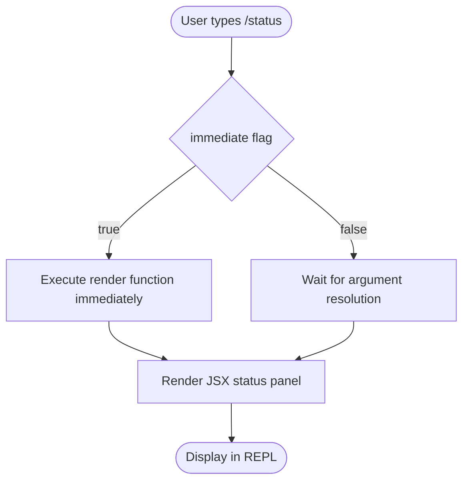

# `/status`

> Analysis basis: CC v2.1.139 bundle.js (AST extraction + Claude interpretation)
> Minimum version: v2.1.139

---

## Overview

The `/status` command is a local, immediately-executed slash command that renders a JSX panel displaying the current state of the Claude Code session. It surfaces version metadata, the active model, account identity, API reachability, and the availability of registered tools — giving the user a single-glance diagnostic snapshot without leaving the REPL.

---

## Registration

| Field | Value |
|---|---|
| type | `local-jsx` |
| name | `status` |
| description | `Show Claude Code status including version, model, account, API connectivity, and tool statuses` |
| immediate | `true` |
| module\_id | `VOq` |

Analysis basis: CC v2.1.139 bundle.js:+11098580

---

## Input Branching

Because the AST traversal reported an empty call graph and no string literals for module `VOq`, no branching logic was recoverable at depth ≤ 2.

<!-- TODO: not found in depth-2 traversal; needs --depth 4 -->

The only structurally confirmed branching is the `immediate: true` flag, which means the runtime executes the command's render function as soon as the user submits `/status`, without waiting for any additional argument parsing or confirmation step.



Analysis basis: CC v2.1.139 bundle.js:+11098580 (`immediate: true`)

---

## Behavioral Spec

### Command Dispatch

Because `immediate` is `true`, the host command loop does not queue the command for deferred evaluation. Pseudocode for the dispatch path:

```
function dispatchSlashCommand(command, userInput):
    if command.immediate is true:
        result = command.renderFunction(currentAppState)
        displayJSX(result)
    else:
        enqueue(command, userInput)
```

Analysis basis: CC v2.1.139 bundle.js:+11098580

### Status Panel Rendering

The command type is `local-jsx`, meaning the output is a React (JSX) component tree rendered inline in the terminal UI rather than plain text streamed from the model. The panel is expected to read from live application state at the moment of invocation and display the following categories of information as described in the registration description:

```
function renderStatusPanel(appState):
    sections = []

    sections.append(renderVersionRow(appState.cliVersion))
    sections.append(renderModelRow(appState.activeModel))
    sections.append(renderAccountRow(appState.accountIdentity))
    sections.append(renderApiConnectivityRow(appState.apiReachable))
    sections.append(renderToolStatusRows(appState.registeredTools))

    return JSXPanel(sections)
```

> **Note:** The specific field names above are inferred from the natural-language description in the registration object. The exact internal state field names were not recoverable from the depth-2 traversal.
> <!-- TODO: not found in depth-2 traversal; needs --depth 4 -->

Analysis basis: CC v2.1.139 bundle.js:+11098580 (description field)

### Reported Information Categories

Based solely on the registration description, the status panel covers five categories:

| Category | Description |
|---|---|
| Version | The installed CC CLI version string |
| Model | The currently configured Anthropic model identifier |
| Account | The authenticated user or API account identity |
| API Connectivity | Whether the Anthropic API endpoint is reachable |
| Tool Statuses | Availability / health of each registered tool |

Analysis basis: CC v2.1.139 bundle.js:+11098580

---

## State & Side Effects

| Item | Detail |
|---|---|
| Telemetry | None detected at depth ≤ 2 <!-- TODO: not found in depth-2 traversal; needs --depth 4 --> |
| Hook registration | None detected at depth ≤ 2 <!-- TODO: not found in depth-2 traversal; needs --depth 4 --> |
| appState changes | Read-only; no mutations inferred from available data |
| Sound | None detected at depth ≤ 2 <!-- TODO: not found in depth-2 traversal; needs --depth 4 --> |

---

## Version History

| Version | Change |
|---|---|
| v2.1.139 | Initial analysis — registration confirmed at bundle.js:+11098580 |

---

## Common Mistakes

1. **Expecting model output** — Because the command type is `local-jsx`, the status panel is rendered locally from application state. It does not invoke the model or consume API tokens.
2. **Assuming arguments are accepted** — The registration object contains no argument schema. Passing extra tokens after `/status` is likely ignored or may cause an unknown-argument warning; no argument handling was found in the traversal.
3. **Treating the panel as a live feed** — The panel reflects state at the instant of invocation. It does not auto-refresh; re-run `/status` to get updated connectivity or tool information.
4. **Expecting telemetry confirmation** — No `tengu_*` telemetry events were found for this command, so analytics pipelines will not record a `/status` invocation event (at the depth analyzed).
5. **Confusing `immediate` with "asynchronous"** — `immediate: true` means the command fires without waiting for further input, not that it resolves asynchronously. The render is synchronous with respect to the command loop.

---

## Appendix — Identifier Mapping

> For bundle debugging only. Identifiers change across versions.

| Identifier | Role |
|---|---|
| `VOq` | Module identifier for the `/status` command implementation |

> No obfuscated function or variable identifiers were returned by the depth-2 AST traversal for this module. A deeper traversal (`--depth 4`) is required to populate this table further.
> <!-- TODO: not found in depth-2 traversal; needs --depth 4 -->